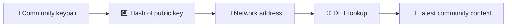
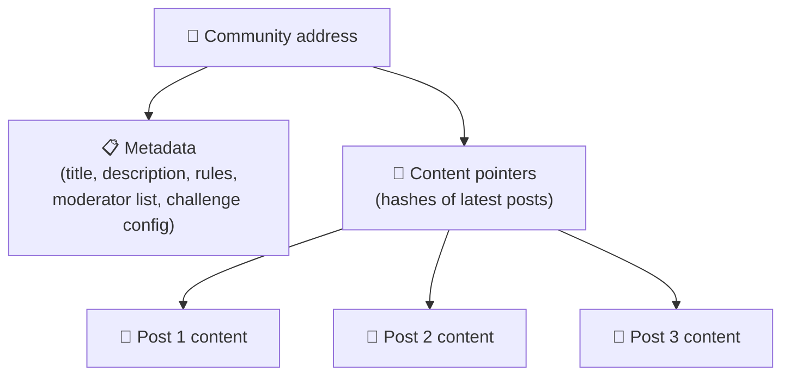
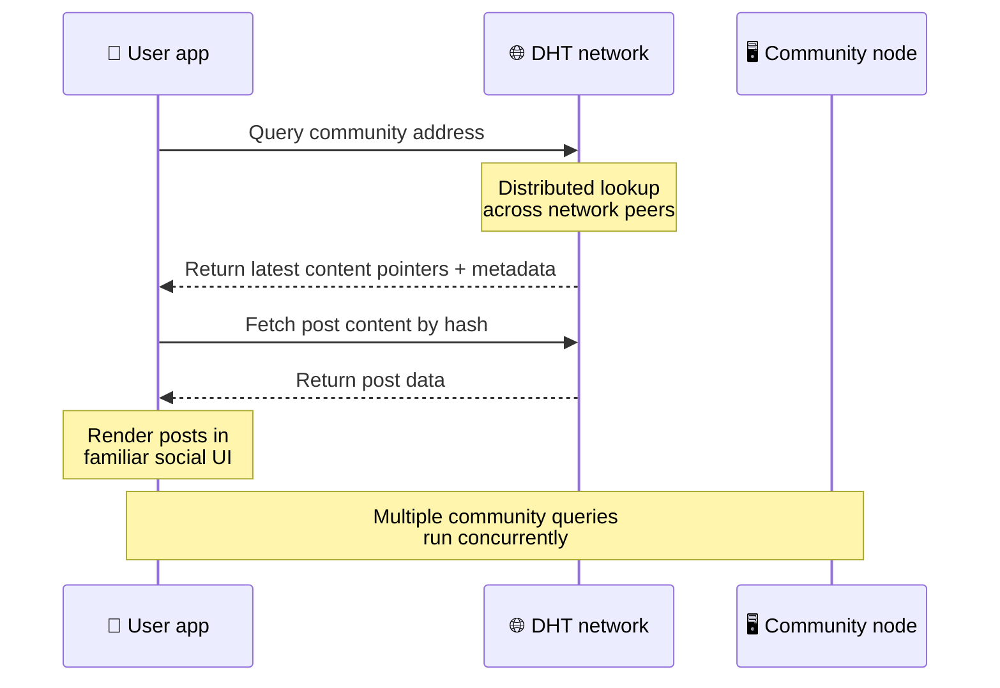
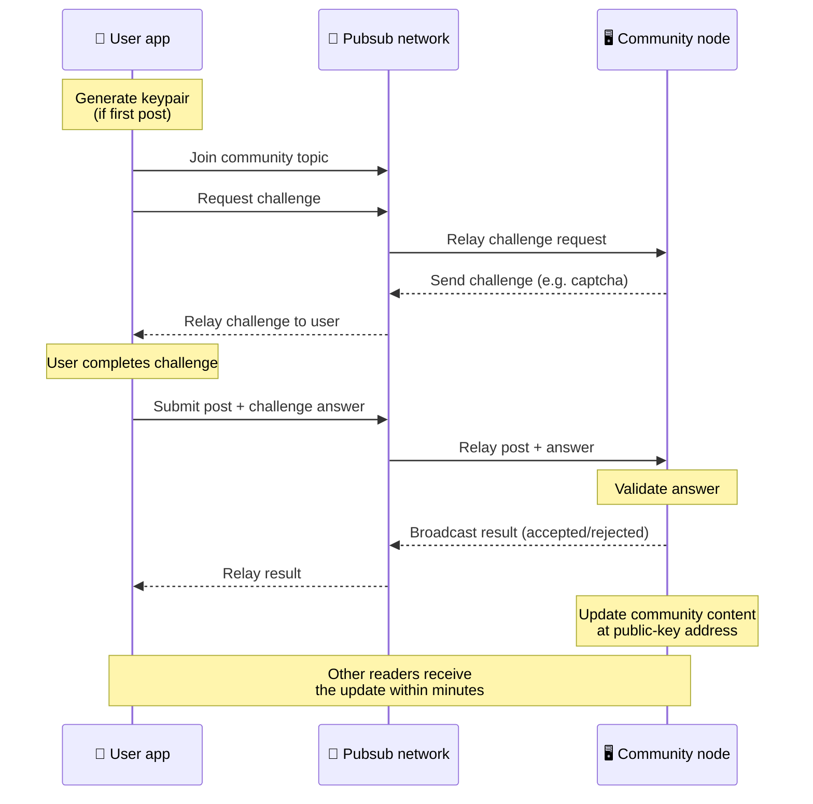
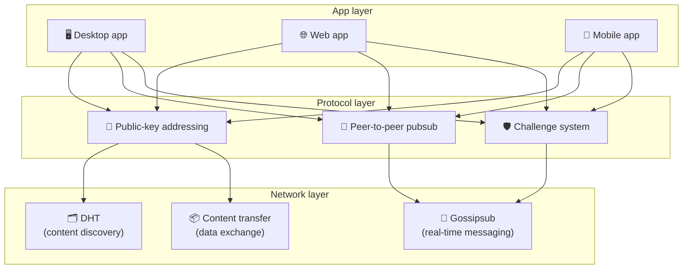

# بروتوكول نظير إلى نظير

لا تستخدم Bitsocial blockchain أو خادم اتحادي أو واجهة خلفية مركزية. وبدلاً من ذلك، فهو يجمع بين فكرتين — **العناوين المستندة إلى المفتاح العام** و**pubsub من نظير إلى نظير** — للسماح لأي شخص باستضافة مجتمع من أجهزة المستهلك بينما يقرأ المستخدمون وينشرون بدون حسابات على أي خدمة تتحكم فيها الشركة.

للحصول على إرشادات أقل تقنية، اقرأ [شرح كامل للشخص العادي لبروتوكول Bitsocial](./layman-protocol-explanation.md).

## المشكلتين

يجب أن تجيب الشبكة الاجتماعية اللامركزية على سؤالين:

1. **البيانات** — كيف يمكنك تخزين المحتوى الاجتماعي العالمي وتقديمه بدون قاعدة بيانات مركزية؟
2. **البريد العشوائي** — كيف يمكنك منع إساءة الاستخدام مع الحفاظ على حرية استخدام الشبكة؟

تعمل Bitsocial على حل مشكلة البيانات عن طريق تخطي blockchain بالكامل: لا تحتاج وسائل التواصل الاجتماعي إلى طلب المعاملات العالمية أو التوفر الدائم لكل منشور قديم. إنه يحل مشكلة البريد العشوائي من خلال السماح لكل مجتمع بتشغيل تحدي مكافحة البريد العشوائي الخاص به عبر شبكة نظير إلى نظير.

للاطلاع على نموذج الاكتشاف فوق طبقة الشبكة هذه، راجع [اكتشاف المحتوى](./content-discovery.md).

---

## العنونة القائمة على المفتاح العام

في BitTorrent، تصبح تجزئة الملف هي عنوانه (_العناوين المستندة إلى المحتوى_). يستخدم Bitsocial فكرة مماثلة مع المفاتيح العامة: تجزئة المفتاح العام للمجتمع تصبح عنوان شبكته.

يمكن لأي نظير على الشبكة إجراء استعلام DHT (جدول التجزئة الموزع) لهذا العنوان واسترداد أحدث حالة للمجتمع. في كل مرة يتم فيها تحديث المحتوى، يزداد رقم الإصدار الخاص به. تحتفظ الشبكة فقط بأحدث إصدار - ليست هناك حاجة للحفاظ على كل حالة تاريخية، وهو ما يجعل هذا النهج خفيف الوزن مقارنة بـ blockchain.

### ما يتم تخزينه في العنوان

لا يحتوي عنوان المجتمع على محتوى المشاركة الكامل مباشرة. وبدلاً من ذلك، يقوم بتخزين قائمة بمعرفات المحتوى، وهي التجزئات التي تشير إلى البيانات الفعلية. يقوم العميل بعد ذلك بجلب كل جزء من المحتوى من خلال DHT أو عمليات البحث على نمط المتعقب.

يمتلك نظير واحد على الأقل البيانات دائمًا: عقدة مشغل المجتمع. إذا كان المجتمع مشهورًا، فسيحصل عليه العديد من أقرانه الآخرين أيضًا وسيوزع التحميل نفسه، بنفس الطريقة التي تكون بها ملفات التورنت الشائعة أسرع في التنزيل.

---

## نظير إلى نظير pubsub

Pubsub (النشر والاشتراك) هو نمط مراسلة حيث يشترك الزملاء في موضوع ما ويتلقون كل رسالة منشورة حول هذا الموضوع. يستخدم Bitsocial شبكة pubsub من نظير إلى نظير — يمكن لأي شخص النشر، ويمكن لأي شخص الاشتراك، ولا يوجد وسيط رسائل مركزي.

لنشر منشور في مجتمع ما، ينشر المستخدم رسالة يكون موضوعها مساويًا للمفتاح العام للمجتمع. تلتقطه عقدة مشغل المجتمع، وتتحقق من صحته، و- إذا اجتازت تحدي مكافحة البريد العشوائي - تقوم بإدراجه في تحديث المحتوى التالي.

---

## مكافحة البريد العشوائي: التحديات عبر pubsub

شبكة pubsub المفتوحة معرضة لفيضانات البريد العشوائي. تحل Bitsocial هذه المشكلة من خلال مطالبة الناشرين بإكمال **التحدي** قبل قبول المحتوى الخاص بهم.

نظام التحدي مرن: يقوم كل مشغل مجتمعي بتكوين سياسته الخاصة. تشمل الخيارات ما يلي:

| نوع التحدي              | كيف يعمل                                   |
| ----------------------- | ------------------------------------------ |
| ** كلمة التحقق **       | لغز مرئي أو تفاعلي معروض في التطبيق        |
| ** تحديد المعدل **      | الحد من المشاركات لكل نافذة زمنية لكل هوية |
| **بوابة الرمز**         | طلب إثبات رصيد رمز معين                    |
| **الدفع**               | تتطلب دفعة صغيرة لكل مشاركة                |
| **القائمة المسموح بها** | فقط الهويات المعتمدة مسبقًا يمكنها النشر   |
| **رمز مخصص**            | أي سياسة يمكن التعبير عنها بالكود          |

يتم حظر النظراء الذين يقومون بترحيل عدد كبير جدًا من محاولات التحدي الفاشلة من موضوع pubsub، مما يمنع هجمات رفض الخدمة على طبقة الشبكة.

---

## دورة الحياة: قراءة المجتمع

هذا ما يحدث عندما يفتح المستخدم التطبيق ويعرض أحدث منشورات المجتمع.

** خطوة بخطوة: **

1. يفتح المستخدم التطبيق ويرى واجهة اجتماعية.
2. ينضم العميل إلى شبكة نظير إلى نظير ويقوم بإجراء استعلام DHT لكل مجتمع مستخدم
   يتبع. تستغرق الاستعلامات بضع ثوانٍ ولكن يتم تشغيلها بشكل متزامن.
3. يقوم كل استعلام بإرجاع أحدث مؤشرات المحتوى وبيانات التعريف الخاصة بالمجتمع (العنوان، الوصف،
   قائمة المشرفين، تكوين التحدي).
4. يقوم العميل بإحضار محتوى المنشور الفعلي باستخدام تلك المؤشرات، ثم يعرض كل شيء في ملف
   واجهة اجتماعية مألوفة.

---

## دورة الحياة: نشر منشور

يتضمن النشر مصافحة التحدي والرد على pubsub قبل قبول المشاركة.

** خطوة بخطوة: **

1. يقوم التطبيق بإنشاء زوج مفاتيح للمستخدم إذا لم يكن لديه واحد حتى الآن.
2. يكتب المستخدم منشورًا للمجتمع.
3. ينضم العميل إلى موضوع pubsub لهذا المجتمع (مرتبطًا بالمفتاح العام للمجتمع).
4. يطلب العميل تحديًا على pubsub.
5. ترسل عقدة مشغل المجتمع تحديًا (على سبيل المثال، كلمة التحقق).
6. يكمل المستخدم التحدي.
7. يرسل العميل المنشور مع إجابة التحدي عبر pubsub.
8. تتحقق عقدة مشغل المجتمع من صحة الإجابة. إذا كان صحيحا، يتم قبول هذا المنصب.
9. تبث العقدة النتيجة عبر pubsub حتى يتمكن أقران الشبكة من مواصلة الترحيل
   رسائل من هذا المستخدم.
10. تقوم العقدة بتحديث محتوى المجتمع على عنوان المفتاح العام الخاص بها.
11. وفي غضون دقائق قليلة، يتلقى كل قارئ في المجتمع التحديث.

---

## نظرة عامة على الهندسة المعمارية

يتكون النظام الكامل من ثلاث طبقات تعمل معًا:

| طبقة           | الدور                                                                                                                      |
| -------------- | -------------------------------------------------------------------------------------------------------------------------- |
| **التطبيق**    | واجهة المستخدم. يمكن أن توجد تطبيقات متعددة، لكل منها تصميمه الخاص، وتشترك جميعها في نفس المجتمعات والهويات.               |
| **البروتوكول** | يحدد كيفية التعامل مع المجتمعات، وكيفية نشر المشاركات، وكيفية منع البريد العشوائي.                                         |
| **الشبكة**     | البنية التحتية الأساسية من نظير إلى نظير: DHT للاكتشاف، وgossipsub للمراسلة في الوقت الفعلي، ونقل المحتوى لتبادل البيانات. |

---

## الخصوصية: فصل المؤلفين عن عناوين IP

عندما ينشر مستخدم منشورًا، يتم تشفير المحتوى **بالمفتاح العام لمشغل المجتمع** قبل أن يدخل إلى شبكة pubsub. وهذا يعني أنه بينما يمكن لمراقبي الشبكة رؤية أن أحد الأقران قد نشر _شيئًا_ ما\_، إلا أنهم لا يستطيعون تحديد:

- ماذا يقول المحتوى
- هوية المؤلف التي نشرتها

يشبه هذا الطريقة التي يتيح بها BitTorrent اكتشاف عناوين IP التي تنشئ ملف تورنت ولكن ليس من قام بإنشائه في الأصل. تضيف طبقة التشفير ضمانًا إضافيًا للخصوصية فوق خط الأساس هذا.

---

## متصفح نظير إلى نظير

أصبح متصفح P2P ممكنًا الآن في عملاء Bitsocial. يمكن لتطبيق المتصفح تشغيل عقدة [هيليا](https://helia.io/)، واستخدام نفس حزمة عميل بروتوكول Bitsocial مثل التطبيقات الأخرى، وجلب المحتوى من النظراء بدلاً من مطالبة بوابة IPFS مركزية بخدمته. يمكن للمتصفح أيضًا المشاركة في pubsub مباشرة، لذا لا يحتاج النشر إلى موفر pubsub مملوك للنظام الأساسي في المسار السعيد.

يعد هذا معلمًا مهمًا للتوزيع على الويب: يمكن فتح موقع ويب HTTPS عادي في عميل اجتماعي مباشر P2P. لا يحتاج المستخدمون إلى تثبيت تطبيق سطح المكتب قبل أن يتمكنوا من القراءة من الشبكة، ولا يحتاج مشغل التطبيق إلى تشغيل بوابة مركزية تصبح نقطة رقابة أو إشراف لكل مستخدم متصفح.

مسار المتصفح له حدود مختلفة عن عقدة سطح المكتب أو الخادم:

- عادةً لا تستطيع عقدة المتصفح قبول الاتصالات الواردة التعسفية من الإنترنت العام
- يمكنه تحميل البيانات والتحقق من صحتها وتخزينها مؤقتًا ونشرها أثناء فتح التطبيق
- ولا ينبغي معاملته على أنه المضيف طويل الأمد لبيانات المجتمع
- لا يزال من الأفضل التعامل مع استضافة المجتمع الكامل من خلال تطبيق سطح المكتب، `bitsocial-cli`، أو أي تطبيق آخر
  عقدة التشغيل دائمًا

لا تزال أجهزة توجيه HTTP مهمة لاكتشاف المحتوى: فهي تُرجع عناوين الموفر لتجزئة المجتمع. وهي ليست بوابات IPFS، لأنها لا تخدم المحتوى نفسه. بعد الاكتشاف، يتصل عميل المتصفح بأقرانه ويجلب البيانات من خلال مكدس P2P.

يعرض 5chan هذا باعتباره مفتاح إعدادات متقدمة للاشتراك في تطبيق الويب 5chan.app العادي. أصبح أحدث مكدس متصفح `pkc-js` مستقرًا بدرجة كافية للاختبار العام بعد أن تناول العمل المتداخل libp2p/gossipsub تسليم الرسائل بين أقران Helia وKubo. يحافظ هذا الإعداد على التحكم في متصفح P2P بينما يخضع لمزيد من الاختبارات الواقعية؛ بمجرد حصوله على ثقة كافية في الإنتاج، يمكن أن يصبح مسار الويب الافتراضي.

## بوابة العودة

لا يزال الوصول إلى المتصفح المدعوم بالبوابة مفيدًا كبديل للتوافق والبدء. يمكن للبوابة ترحيل البيانات بين شبكة P2P وعميل المتصفح عندما يتعذر على المتصفح الانضمام إلى الشبكة مباشرة أو عندما يختار التطبيق المسار الأقدم عن قصد. هذه البوابات:

- يمكن تشغيلها من قبل أي شخص
- لا تتطلب حسابات المستخدمين أو المدفوعات
- لا تحصل على الوصاية على هويات المستخدمين أو المجتمعات
- يمكن تبديلها دون فقدان البيانات

البنية المستهدفة هي متصفح P2P أولاً، مع وجود بوابات كبديل اختياري بدلاً من عنق الزجاجة الافتراضي.

---

## لماذا لا يتم استخدام blockchain؟

تحل Blockchain مشكلة الإنفاق المزدوج: فهي تحتاج إلى معرفة الترتيب الدقيق لكل معاملة لمنع شخص ما من إنفاق نفس العملة مرتين.

لا تعاني وسائل التواصل الاجتماعي من مشكلة الإنفاق المزدوج. لا يهم إذا تم نشر المنشور أ قبل ميلي ثانية واحدة من المنشور ب، ولا يلزم أن تكون المنشورات القديمة متاحة بشكل دائم على كل عقدة.

من خلال تخطي blockchain، تتجنب Bitsocial ما يلي:

- **رسوم الغاز** — النشر مجاني
- **حدود الإنتاجية** — لا يوجد حجم كتلة أو اختناق في وقت الكتلة
- **تضخم مساحة التخزين** — تحتفظ العقد بما تحتاجه فقط
- **إجماع عام** — لا حاجة إلى القائمين بالتعدين أو المدققين أو التوقيع المساحي

والمقايضة هي أن Bitsocial لا يضمن التوفر الدائم للمحتوى القديم. لكن بالنسبة لوسائل التواصل الاجتماعي، يعد هذا مقايضة مقبولة: عقدة مشغل المجتمع تحتفظ بالبيانات، وينتشر المحتوى الشائع عبر العديد من أقرانه، وتتلاشى المشاركات القديمة جدًا بشكل طبيعي - بنفس الطريقة التي يحدث بها على كل منصة اجتماعية.

## لماذا لا الاتحاد؟

تعمل الشبكات الموحدة (مثل البريد الإلكتروني أو الأنظمة الأساسية المستندة إلى ActivityPub) على تحسين المركزية ولكن لا تزال تعاني من قيود هيكلية:

- **تبعية الخادم** — يحتاج كل مجتمع إلى خادم له نطاق، وTLS، ومستمر
  صيانة
- **ثقة المسؤول** — يتمتع مسؤول الخادم بالتحكم الكامل في حسابات المستخدمين والمحتوى
- **التجزئة** — غالبًا ما يعني التنقل بين الخوادم فقدان المتابعين أو التاريخ أو الهوية
- **التكلفة** — يجب على شخص ما أن يدفع مقابل الاستضافة، مما يخلق ضغطًا نحو الدمج

يؤدي نهج Bitsocial من نظير إلى نظير إلى إزالة الخادم من المعادلة تمامًا. يمكن تشغيل عقدة المجتمع على كمبيوتر محمول أو Raspberry Pi أو VPS رخيص. يتحكم المشغل في سياسة الإشراف ولكن لا يمكنه الاستيلاء على هويات المستخدم، لأن الهويات يتم التحكم فيها بواسطة زوج المفاتيح، وليست ممنوحة من قبل الخادم.

---

## ملخص

تم بناء Bitsocial على عنصرين أساسيين: العنونة القائمة على المفتاح العام لاكتشاف المحتوى، وPubsub من نظير إلى نظير للاتصال في الوقت الفعلي. معًا ينتجون شبكة اجتماعية حيث:

- يتم تحديد المجتمعات من خلال مفاتيح التشفير، وليس أسماء النطاقات
- ينتشر المحتوى عبر أقرانه مثل التورنت، ولا يتم تقديمه من قاعدة بيانات واحدة
- تعتبر مقاومة البريد العشوائي محلية لكل مجتمع، ولا تفرضها المنصة
- يمتلك المستخدمون هوياتهم من خلال أزواج المفاتيح، وليس من خلال الحسابات القابلة للإلغاء
- يعمل النظام بأكمله بدون خوادم أو بلوكتشين أو رسوم النظام الأساسي
