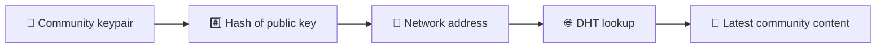
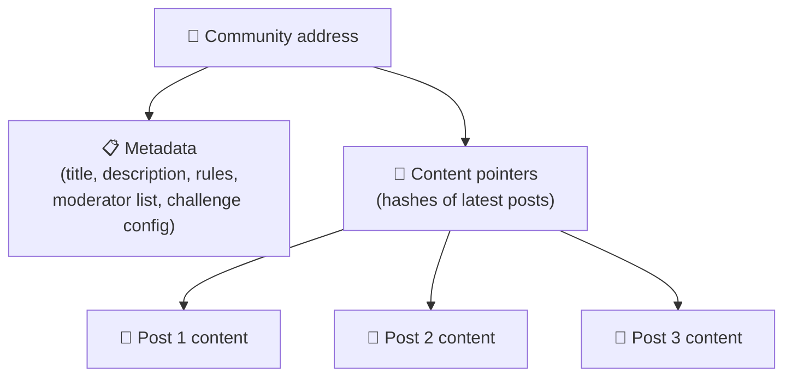
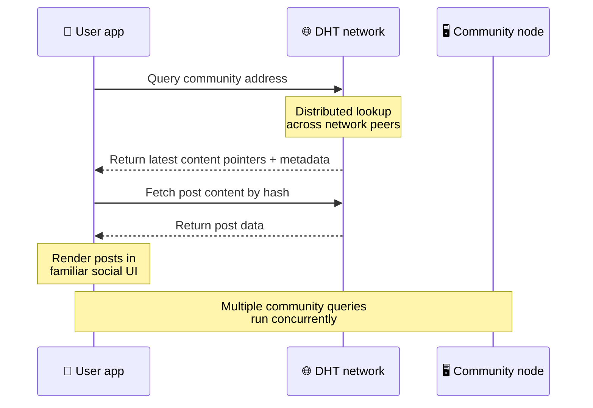
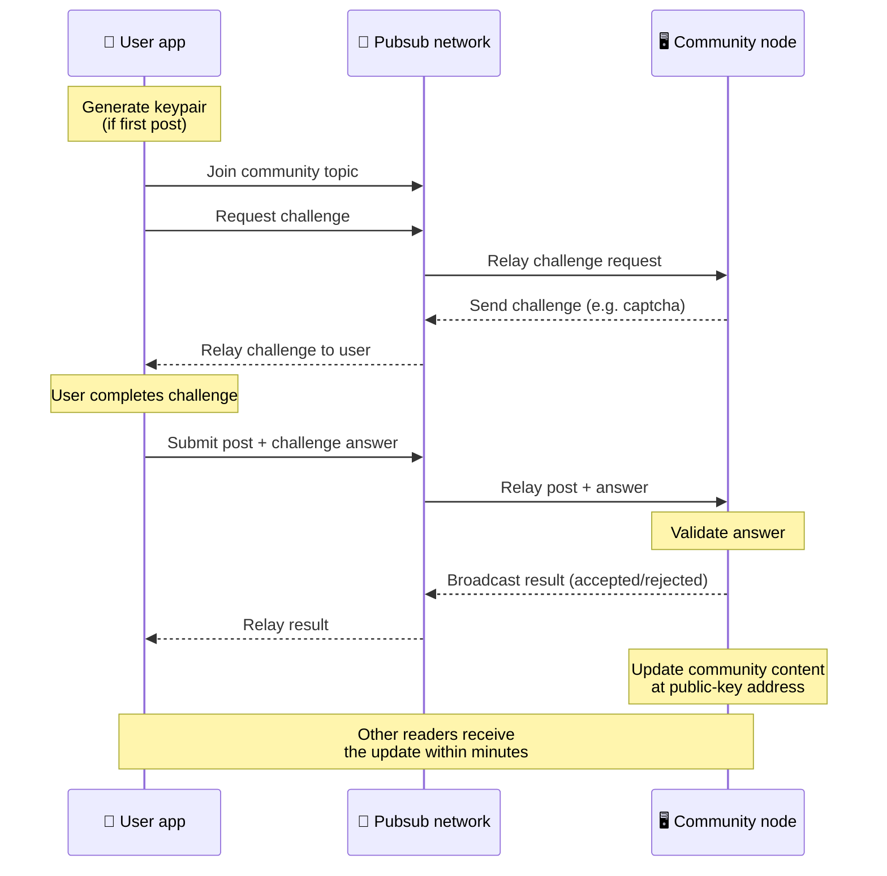
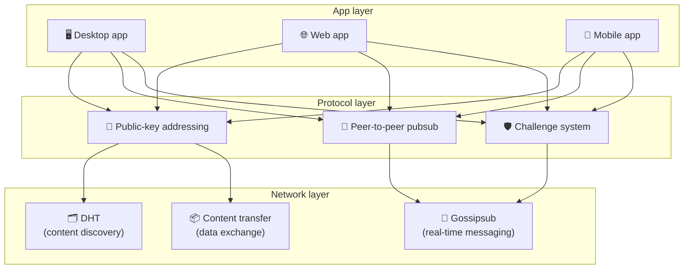

# পিয়ার-টু-পিয়ার প্রোটোকল

Bitsocial একটি ব্লকচেইন, একটি ফেডারেশন সার্ভার, বা একটি কেন্দ্রীয় ব্যাকএন্ড ব্যবহার করে না। পরিবর্তে এটি দুটি ধারণাকে একত্রিত করে — **পাবলিক-কি-ভিত্তিক অ্যাড্রেসিং** এবং **পিয়ার-টু-পিয়ার পাবসাব** — যাতে ব্যবহারকারীরা কোনো কোম্পানি-নিয়ন্ত্রিত পরিষেবায় অ্যাকাউন্ট ছাড়াই পড়তে এবং পোস্ট করার সময় গ্রাহক হার্ডওয়্যার থেকে একটি সম্প্রদায়কে হোস্ট করতে দেয়।

একটি কম প্রযুক্তিগত ওয়াকথ্রু জন্য, পড়ুন [বিটসোশ্যাল প্রোটোকলের একটি সম্পূর্ণ সাধারণ ব্যাখ্যা](./layman-protocol-explanation.md).

## সমস্যা দুটি

একটি বিকেন্দ্রীভূত সামাজিক নেটওয়ার্ক দুটি প্রশ্নের উত্তর দিতে হবে:

1. **ডেটা** — আপনি কিভাবে একটি কেন্দ্রীয় ডাটাবেস ছাড়া বিশ্বের সামাজিক বিষয়বস্তু সঞ্চয় ও পরিবেশন করবেন?
2. **স্প্যাম** — নেটওয়ার্কটিকে ব্যবহারের জন্য বিনামূল্যে রেখে আপনি কীভাবে অপব্যবহার রোধ করবেন?

Bitsocial সম্পূর্ণরূপে ব্লকচেইন এড়িয়ে ডাটা সমস্যা সমাধান করে: সোশ্যাল মিডিয়ার বিশ্বব্যাপী লেনদেন অর্ডার বা প্রতিটি পুরানো পোস্টের স্থায়ী উপলব্ধতার প্রয়োজন নেই। এটি প্রতিটি সম্প্রদায়কে পিয়ার-টু-পিয়ার নেটওয়ার্কে নিজস্ব স্প্যাম-বিরোধী চ্যালেঞ্জ চালানোর অনুমতি দিয়ে স্প্যাম সমস্যার সমাধান করে।

এই নেটওয়ার্ক স্তরের উপরে আবিষ্কার মডেলের জন্য, [বিষয়বস্তু আবিষ্কার](./content-discovery.md) দেখুন।

---

## পাবলিক-কী-ভিত্তিক ঠিকানা

বিটটরেন্টে, একটি ফাইলের হ্যাশ তার ঠিকানা হয়ে যায় (_ বিষয়বস্তু-ভিত্তিক ঠিকানা_)। Bitsocial পাবলিক কীগুলির সাথে একই ধারণা ব্যবহার করে: একটি সম্প্রদায়ের সর্বজনীন কী এর হ্যাশ তার নেটওয়ার্ক ঠিকানা হয়ে যায়।

নেটওয়ার্কে থাকা যেকোনো পিয়ার সেই ঠিকানার জন্য একটি DHT (ডিস্ট্রিবিউটেড হ্যাশ টেবিল) কোয়েরি করতে পারে এবং সম্প্রদায়ের সর্বশেষ অবস্থা পুনরুদ্ধার করতে পারে। প্রতিবার বিষয়বস্তু আপডেট করা হলে, এর সংস্করণ সংখ্যা বৃদ্ধি পায়। নেটওয়ার্ক শুধুমাত্র সর্বশেষ সংস্করণ রাখে — প্রতিটি ঐতিহাসিক অবস্থা সংরক্ষণ করার প্রয়োজন নেই, যা ব্লকচেইনের তুলনায় এই পদ্ধতিটিকে হালকা করে তোলে।

### ঠিকানায় কি জমা হয়

সম্প্রদায়ের ঠিকানায় সরাসরি সম্পূর্ণ পোস্ট সামগ্রী থাকে না। পরিবর্তে এটি বিষয়বস্তু শনাক্তকারীর একটি তালিকা সঞ্চয় করে — হ্যাশ যা প্রকৃত ডেটা নির্দেশ করে। ক্লায়েন্ট তারপর DHT বা ট্র্যাকার-স্টাইল লুকআপের মাধ্যমে সামগ্রীর প্রতিটি অংশ নিয়ে আসে।

অন্তত একজন পিয়ারের কাছে সবসময় ডেটা থাকে: কমিউনিটি অপারেটরের নোড। যদি সম্প্রদায়টি জনপ্রিয় হয়, তবে অন্যান্য অনেক সহকর্মীরও এটি থাকবে এবং লোডটি নিজেই বিতরণ করবে, একইভাবে জনপ্রিয় টরেন্টগুলি দ্রুত ডাউনলোড করা যায়।

---

## পিয়ার-টু-পিয়ার পাবসাব

পাবসাব (প্রকাশ-সাবস্ক্রাইব) হল একটি মেসেজিং প্যাটার্ন যেখানে সহকর্মীরা একটি বিষয়ের সদস্যতা নেয় এবং সেই বিষয়ে প্রকাশিত প্রতিটি বার্তা গ্রহণ করে। বিটসোশ্যাল একটি পিয়ার-টু-পিয়ার পাবসাব নেটওয়ার্ক ব্যবহার করে — যে কেউ প্রকাশ করতে পারে, যে কেউ সাবস্ক্রাইব করতে পারে এবং কোনো কেন্দ্রীয় বার্তা ব্রোকার নেই।

একটি সম্প্রদায়ে একটি পোস্ট প্রকাশ করতে, একজন ব্যবহারকারী একটি বার্তা প্রকাশ করেন যার বিষয় সম্প্রদায়ের সর্বজনীন কী-এর সমান৷ সম্প্রদায় অপারেটরের নোড এটিকে তুলে নেয়, এটিকে যাচাই করে এবং — যদি এটি স্প্যাম-বিরোধী চ্যালেঞ্জে উত্তীর্ণ হয় — পরবর্তী সামগ্রী আপডেটে এটি অন্তর্ভুক্ত করে।

---

## অ্যান্টি-স্প্যাম: পাবসাবের উপর চ্যালেঞ্জ

একটি খোলা পাবসাব নেটওয়ার্ক স্প্যাম বন্যার জন্য ঝুঁকিপূর্ণ। Bitsocial প্রকাশকদের তাদের বিষয়বস্তু গৃহীত হওয়ার আগে একটি **চ্যালেঞ্জ** সম্পূর্ণ করার প্রয়োজন করে এটি সমাধান করে।

চ্যালেঞ্জ সিস্টেম নমনীয়: প্রতিটি সম্প্রদায় অপারেটর তাদের নিজস্ব নীতি কনফিগার করে। বিকল্প অন্তর্ভুক্ত:

| চ্যালেঞ্জ টাইপ      | এটা কিভাবে কাজ করে                                 |
| ------------------- | -------------------------------------------------- |
| **ক্যাপচা**         | অ্যাপে উপস্থাপিত ভিজ্যুয়াল বা ইন্টারেক্টিভ ধাঁধা  |
| **দর সীমিত**        | পরিচয় প্রতি টাইম উইন্ডোতে পোস্ট সীমিত করুন        |
| **টোকেন গেট**       | একটি নির্দিষ্ট টোকেনের ব্যালেন্স প্রমাণের প্রয়োজন |
| **পেমেন্ট**         | পোস্ট প্রতি একটি ছোট পেমেন্ট প্রয়োজন              |
| **অনুমোদিত তালিকা** | শুধুমাত্র পূর্ব-অনুমোদিত পরিচয় পোস্ট করতে পারেন   |
| **কাস্টম কোড**      | কোডে প্রকাশযোগ্য কোনো নীতি                         |

যে সহকর্মীরা অনেকগুলি ব্যর্থ চ্যালেঞ্জ প্রয়াস রিলে করে তারা পাবসাব বিষয় থেকে অবরুদ্ধ হয়ে যায়, যা নেটওয়ার্ক স্তরে পরিষেবা-অস্বীকার আক্রমণ প্রতিরোধ করে৷

---

## জীবনচক্র: একটি সম্প্রদায় পড়া

যখন একজন ব্যবহারকারী অ্যাপটি খোলে এবং একটি সম্প্রদায়ের সাম্প্রতিক পোস্টগুলি দেখে তখন এটি ঘটে।

**ধাপে ধাপে:**

1. ব্যবহারকারী অ্যাপটি খোলে এবং একটি সামাজিক ইন্টারফেস দেখে।
2. ক্লায়েন্ট পিয়ার-টু-পিয়ার নেটওয়ার্কে যোগদান করে এবং প্রতিটি সম্প্রদায়ের ব্যবহারকারীর জন্য একটি DHT ক্যোয়ারী করে
   অনুসরণ করে ক্যোয়ারীগুলো কয়েক সেকেন্ড সময় নেয় কিন্তু একই সাথে চলে।
3. প্রতিটি প্রশ্ন সম্প্রদায়ের সাম্প্রতিক বিষয়বস্তু পয়েন্টার এবং মেটাডেটা (শিরোনাম, বিবরণ,
   মডারেটর তালিকা, চ্যালেঞ্জ কনফিগারেশন)।
4. ক্লায়েন্ট সেই পয়েন্টারগুলি ব্যবহার করে প্রকৃত পোস্টের বিষয়বস্তু নিয়ে আসে, তারপরে সবকিছু রেন্ডার করে
   পরিচিত সামাজিক ইন্টারফেস।

---

## জীবনচক্র: একটি পোস্ট প্রকাশ করা

পোস্টটি গৃহীত হওয়ার আগে প্রকাশনার সাথে পাবসাবের উপর একটি চ্যালেঞ্জ-প্রতিক্রিয়া হ্যান্ডশেক জড়িত।

**ধাপে ধাপে:**

1. অ্যাপটি ব্যবহারকারীর জন্য একটি কী-পেয়ার তৈরি করে যদি তাদের কাছে এখনও একটি না থাকে।
2. ব্যবহারকারী একটি সম্প্রদায়ের জন্য একটি পোস্ট লেখেন।
3. ক্লায়েন্ট সেই সম্প্রদায়ের জন্য পাবসাব বিষয়ে যোগদান করে (সম্প্রদায়ের সর্বজনীন কী-এর সাথে যুক্ত)।
4. ক্লায়েন্ট পাবসাবের উপর একটি চ্যালেঞ্জের অনুরোধ করে।
5. কমিউনিটি অপারেটরের নোড একটি চ্যালেঞ্জ ফেরত পাঠায় (উদাহরণস্বরূপ, একটি ক্যাপচা)।
6. ব্যবহারকারী চ্যালেঞ্জটি সম্পূর্ণ করে।
7. ক্লায়েন্ট পাবসাবের চ্যালেঞ্জ উত্তর সহ পোস্টটি জমা দেয়।
8. কমিউনিটি অপারেটরের নোড উত্তরটি যাচাই করে। সঠিক হলে পোস্ট গৃহীত হয়।
9. নোড পাবসাবের মাধ্যমে ফলাফল সম্প্রচার করে যাতে নেটওয়ার্ক সহকর্মীরা রিলে করা চালিয়ে যেতে জানে
   এই ব্যবহারকারীর বার্তা।
10. নোড সম্প্রদায়ের বিষয়বস্তু তার পাবলিক-কী ঠিকানায় আপডেট করে।
11. কয়েক মিনিটের মধ্যে, সম্প্রদায়ের প্রতিটি পাঠক আপডেটটি গ্রহণ করে।

---

## স্থাপত্য ওভারভিউ

সম্পূর্ণ সিস্টেমে তিনটি স্তর রয়েছে যা একসাথে কাজ করে:

| স্তর           | ভূমিকা                                                                                                                                         |
| -------------- | ---------------------------------------------------------------------------------------------------------------------------------------------- |
| **অ্যাপ**      | ইউজার ইন্টারফেস। একাধিক অ্যাপ্লিকেশান বিদ্যমান থাকতে পারে, যার প্রত্যেকটির নিজস্ব ডিজাইন রয়েছে, সমস্ত একই সম্প্রদায় এবং পরিচয় ভাগ করে নেয়৷ |
| **প্রটোকল**    | সম্প্রদায়গুলিকে কীভাবে সম্বোধন করা হয়, কীভাবে পোস্টগুলি প্রকাশ করা হয় এবং কীভাবে স্প্যাম প্রতিরোধ করা হয় তা সংজ্ঞায়িত করে৷                |
| **নেটওয়ার্ক** | অন্তর্নিহিত পিয়ার-টু-পিয়ার অবকাঠামো: আবিষ্কারের জন্য DHT, রিয়েল-টাইম মেসেজিংয়ের জন্য গসিপসাব এবং ডেটা বিনিময়ের জন্য সামগ্রী স্থানান্তর।   |

---

## গোপনীয়তা: IP ঠিকানা থেকে লেখকদের লিঙ্কমুক্ত করা

যখন একজন ব্যবহারকারী একটি পোস্ট প্রকাশ করেন, তখন বিষয়বস্তুটি পাবসাব নেটওয়ার্কে প্রবেশের আগে **কমিউনিটি অপারেটরের পাবলিক কী দিয়ে এনক্রিপ্ট করা হয়**। এর মানে হল যে যখন নেটওয়ার্ক পর্যবেক্ষকরা দেখতে পাচ্ছেন যে একটি পিয়ার _something_ প্রকাশ করেছে, তারা নির্ধারণ করতে পারে না:

- বিষয়বস্তু কি বলে
- কোন লেখকের পরিচয় এটি প্রকাশ করেছে

এটি যেভাবে বিটটরেন্ট এটিকে আবিষ্কার করা সম্ভব করে যে কোন আইপিগুলি টরেন্টের বীজ বপন করে কিন্তু কে এটি তৈরি করে তা নয়। এনক্রিপশন স্তরটি সেই বেসলাইনের উপরে একটি অতিরিক্ত গোপনীয়তার গ্যারান্টি যুক্ত করে।

---

## ব্রাউজার পিয়ার-টু-পিয়ার

ব্রাউজার P2P এখন Bitsocial ক্লায়েন্টদের মধ্যে সম্ভব। একটি ব্রাউজার অ্যাপ একটি [হেলিয়া](https://helia.io/) নোড চালাতে পারে, অন্যান্য অ্যাপের মতো একই Bitsocial প্রোটোকল ক্লায়েন্ট স্ট্যাক ব্যবহার করতে পারে, এবং এটি পরিবেশন করার জন্য একটি কেন্দ্রীভূত IPFS গেটওয়ে বলার পরিবর্তে সমবয়সীদের থেকে সামগ্রী আনতে পারে৷ ব্রাউজারটি সরাসরি pubsub-এ অংশগ্রহণ করতে পারে, তাই পোস্ট করার জন্য প্ল্যাটফর্ম-মালিকানাধীন পাবসাব প্রদানকারীর খুশির পথের প্রয়োজন নেই৷

এটি ওয়েব বিতরণের জন্য গুরুত্বপূর্ণ মাইলফলক: একটি সাধারণ HTTPS ওয়েবসাইট একটি লাইভ P2P সামাজিক ক্লায়েন্টে খুলতে পারে। ব্যবহারকারীরা নেটওয়ার্ক থেকে পড়ার আগে একটি ডেস্কটপ অ্যাপ ইনস্টল করার প্রয়োজন নেই, এবং অ্যাপ অপারেটরকে একটি কেন্দ্রীয় গেটওয়ে চালানোর প্রয়োজন নেই যা প্রতিটি ব্রাউজার ব্যবহারকারীর জন্য সেন্সরশিপ বা মডারেশন চোকপয়েন্ট হয়ে ওঠে।

ডেস্কটপ বা সার্ভার নোড থেকে ব্রাউজার পাথের বিভিন্ন সীমা রয়েছে:

- একটি ব্রাউজার নোড সাধারণত পাবলিক ইন্টারনেট থেকে নির্বিচারে অন্তর্মুখী সংযোগ গ্রহণ করতে পারে না
- অ্যাপটি খোলা থাকা অবস্থায় এটি লোড, যাচাই, ক্যাশে এবং ডেটা প্রকাশ করতে পারে
- এটিকে একটি সম্প্রদায়ের ডেটার জন্য দীর্ঘস্থায়ী হোস্ট হিসাবে বিবেচনা করা উচিত নয়৷
- সম্পূর্ণ কমিউনিটি হোস্টিং এখনও একটি ডেস্কটপ অ্যাপ, `bitsocial-cli`, বা অন্য দ্বারা সবচেয়ে ভালোভাবে পরিচালনা করা হয়
  সর্বদা চালু নোড

HTTP রাউটারগুলি এখনও বিষয়বস্তু আবিষ্কারের জন্য গুরুত্বপূর্ণ: তারা একটি কমিউনিটি হ্যাশের জন্য প্রদানকারীর ঠিকানা ফেরত দেয়। তারা আইপিএফএস গেটওয়ে নয়, কারণ তারা নিজেই সামগ্রী পরিবেশন করে না। আবিষ্কারের পর, ব্রাউজার ক্লায়েন্ট পিয়ারদের সাথে সংযোগ স্থাপন করে এবং P2P স্ট্যাকের মাধ্যমে ডেটা নিয়ে আসে।

5chan সাধারণ 5chan.app ওয়েব অ্যাপে এটিকে একটি অপ্ট-ইন অ্যাডভান্সড সেটিংস সুইচ হিসাবে প্রকাশ করে৷ সর্বশেষ `pkc-js` ব্রাউজার স্ট্যাক আপস্ট্রিম libp2p/gossipsub ইন্টারপ ওয়ার্ক অ্যাড্রেসড মেসেজ ডেলিভারির পর হেলিয়া এবং কুবো সহকর্মীদের মধ্যে সর্বজনীন পরীক্ষার জন্য যথেষ্ট স্থিতিশীল হয়ে উঠেছে। সেটিং ব্রাউজার P2P নিয়ন্ত্রিত রাখে যখন এটি আরও বাস্তব-বিশ্বের পরীক্ষা পায়; একবার এটি যথেষ্ট উত্পাদন আত্মবিশ্বাস আছে, এটি ডিফল্ট ওয়েব পাথ হতে পারে.

## গেটওয়ে ফলব্যাক

গেটওয়ে-সমর্থিত ব্রাউজার অ্যাক্সেস এখনও একটি সামঞ্জস্যতা এবং রোলআউট ফলব্যাক হিসাবে দরকারী। একটি গেটওয়ে P2P নেটওয়ার্ক এবং একটি ব্রাউজার ক্লায়েন্টের মধ্যে ডেটা রিলে করতে পারে যখন একটি ব্রাউজার সরাসরি নেটওয়ার্কে যোগ দিতে পারে না বা যখন অ্যাপ ইচ্ছাকৃতভাবে পুরানো পথ বেছে নেয়। এই গেটওয়ে:

- যে কেউ চালাতে পারে
- ব্যবহারকারীর অ্যাকাউন্ট বা অর্থপ্রদানের প্রয়োজন নেই
- ব্যবহারকারীর পরিচয় বা সম্প্রদায়ের উপর হেফাজত করবেন না
- তথ্য হারানো ছাড়া অদলবদল করা যাবে

লক্ষ্য আর্কিটেকচার হল ব্রাউজার P2P প্রথমে, গেটওয়েগুলি ডিফল্ট বটলনেকের পরিবর্তে একটি ঐচ্ছিক ফলব্যাক হিসাবে।

---

## ব্লকচেইন নয় কেন?

ব্লকচেইন দ্বিগুণ-ব্যয় সমস্যার সমাধান করে: একই মুদ্রা দুবার ব্যয় করতে কাউকে আটকাতে তাদের প্রতিটি লেনদেনের সঠিক ক্রম জানতে হবে।

সোশ্যাল মিডিয়ার দ্বিগুণ খরচের সমস্যা নেই। পোস্ট A পোস্ট B এর আগে এক মিলিসেকেন্ড প্রকাশিত হয়েছিল কিনা তা কোন ব্যাপার না, এবং পুরানো পোস্টগুলি প্রতিটি নোডে স্থায়ীভাবে উপলব্ধ হওয়ার প্রয়োজন নেই।

ব্লকচেইন বাদ দিয়ে, বিটসোশ্যাল এড়িয়ে যায়:

- **গ্যাস ফি** — পোস্টিং বিনামূল্যে
- **থ্রুপুট সীমা** — কোন ব্লক সাইজ বা ব্লক টাইম বটলনেক নেই
- **স্টোরেজ ব্লোট** — নোড শুধুমাত্র তাদের যা প্রয়োজন তা রাখে
- **ঐক্যমত্য ওভারহেড** — কোন খনি শ্রমিক, যাচাইকারী, বা স্টেকিং প্রয়োজন নেই

ট্রেডঅফ হল যে Bitsocial পুরানো বিষয়বস্তুর স্থায়ী প্রাপ্যতার গ্যারান্টি দেয় না। কিন্তু সোশ্যাল মিডিয়ার জন্য, এটি একটি গ্রহণযোগ্য ট্রেডঅফ: কমিউনিটি অপারেটরের নোড ডেটা ধারণ করে, জনপ্রিয় বিষয়বস্তু অনেক সহকর্মী জুড়ে ছড়িয়ে পড়ে এবং খুব পুরানো পোস্টগুলি স্বাভাবিকভাবেই বিবর্ণ হয় — একইভাবে তারা প্রতিটি সামাজিক প্ল্যাটফর্মে করে।

## ফেডারেশন নয় কেন?

ফেডারেটেড নেটওয়ার্কগুলি (যেমন ইমেল বা ActivityPub-ভিত্তিক প্ল্যাটফর্মগুলি) কেন্দ্রীকরণে উন্নতি করে কিন্তু এখনও কাঠামোগত সীমাবদ্ধতা রয়েছে:

- **সার্ভার নির্ভরতা** — প্রতিটি সম্প্রদায়ের একটি ডোমেন, TLS এবং চলমান একটি সার্ভার প্রয়োজন৷
  রক্ষণাবেক্ষণ
- **প্রশাসক বিশ্বাস** — সার্ভার প্রশাসকের ব্যবহারকারীর অ্যাকাউন্ট এবং বিষয়বস্তুর উপর সম্পূর্ণ নিয়ন্ত্রণ রয়েছে
- **ফ্র্যাগমেন্টেশন** — সার্ভারের মধ্যে চলাফেরার অর্থ প্রায়ই অনুসারী, ইতিহাস বা পরিচয় হারানো
- **খরচ** — কাউকে হোস্টিংয়ের জন্য অর্থ প্রদান করতে হবে, যা একত্রীকরণের দিকে চাপ সৃষ্টি করে

বিটসোসিয়ালের পিয়ার-টু-পিয়ার অ্যাপ্রোচ সার্ভারকে সমীকরণ থেকে সম্পূর্ণভাবে সরিয়ে দেয়। একটি কমিউনিটি নোড একটি ল্যাপটপ, একটি রাস্পবেরি পাই বা একটি সস্তা ভিপিএসে চলতে পারে। অপারেটর সংযম নীতি নিয়ন্ত্রণ করে কিন্তু ব্যবহারকারীর পরিচয় বাজেয়াপ্ত করতে পারে না, কারণ পরিচয়গুলি কী-পেয়ার-নিয়ন্ত্রিত, সার্ভার-প্রদত্ত নয়।

---

## সারাংশ

Bitsocial দুটি আদিম বিষয়ের উপর নির্মিত: বিষয়বস্তু আবিষ্কারের জন্য পাবলিক-কি-ভিত্তিক ঠিকানা এবং রিয়েল-টাইম যোগাযোগের জন্য পিয়ার-টু-পিয়ার পাবসাব। একসাথে তারা একটি সামাজিক নেটওয়ার্ক তৈরি করে যেখানে:

- সম্প্রদায়গুলিকে ক্রিপ্টোগ্রাফিক কী দ্বারা চিহ্নিত করা হয়, ডোমেন নাম নয়
- বিষয়বস্তু একটি টরেন্টের মতো সহকর্মীদের মধ্যে ছড়িয়ে পড়ে, একটি একক ডাটাবেস থেকে পরিবেশিত হয় না
- স্প্যাম প্রতিরোধ প্রতিটি সম্প্রদায়ের জন্য স্থানীয়, একটি প্ল্যাটফর্ম দ্বারা আরোপিত নয়
- ব্যবহারকারীরা কী-পেয়ারের মাধ্যমে তাদের পরিচয়ের মালিক, প্রত্যাহারযোগ্য অ্যাকাউন্টের মাধ্যমে নয়
- সার্ভার, ব্লকচেইন বা প্ল্যাটফর্ম ফি ছাড়াই পুরো সিস্টেম চলে
