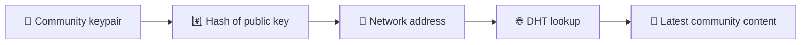
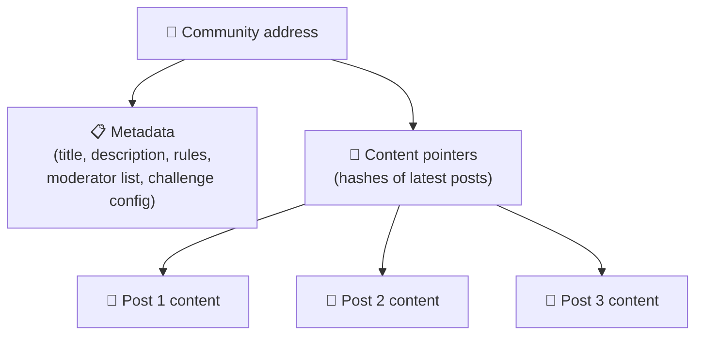
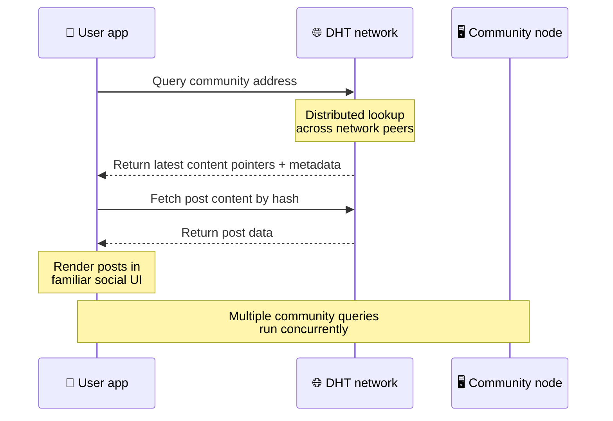
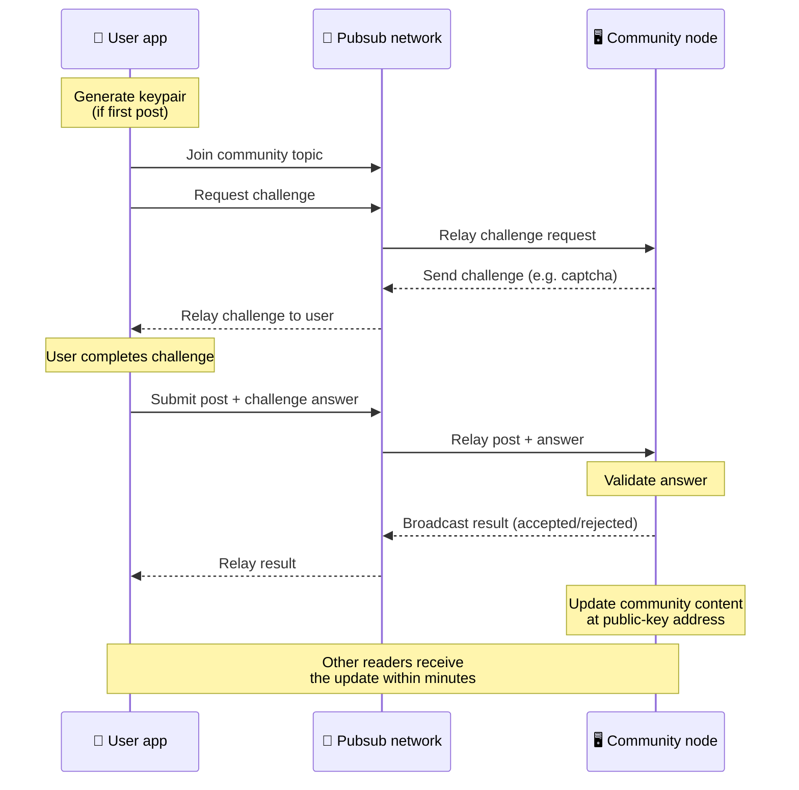
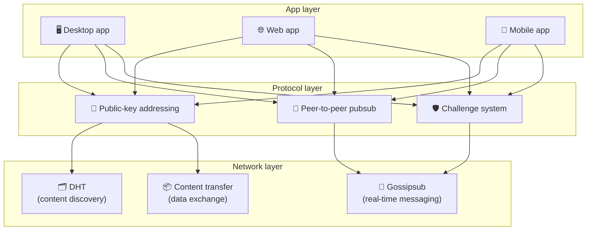

# Protocol peer-to-peer

Bitsocial no utilitza una cadena de blocs, un servidor de federació o un backend centralitzat. En comptes d'això, combina dues idees: **adreçament basat en clau pública** i **pubsub peer-to-peer**, per permetre que qualsevol persona allotgi una comunitat de maquinari de consum mentre els usuaris llegeixen i publiquen sense comptes en cap servei controlat per l'empresa.

Per a una guia menys tècnica, llegiu [Una explicació completa del protocol Bitsocial](./layman-protocol-explanation.md).

## Els dos problemes

Una xarxa social descentralitzada ha de respondre a dues preguntes:

1. **Dades**: com emmagatzemar i servir el contingut social del món sense una base de dades central?
2. **Correu brossa**: com s'evita l'abús mentre es manté la xarxa d'ús lliure?

Bitsocial soluciona el problema de les dades saltant completament la cadena de blocs: les xarxes socials no necessiten ordenar transaccions globals ni disponibilitat permanent de cada publicació antiga. Soluciona el problema del correu brossa deixant que cada comunitat executi el seu propi repte anti-spam a través de la xarxa peer-to-peer.

Per al model de descoberta per sobre d'aquesta capa de xarxa, vegeu [Descobriment de continguts](./content-discovery.md).

---

## Adreçament basat en clau pública

A BitTorrent, el hash d'un fitxer es converteix en la seva adreça (_adreçament basat en contingut_). Bitsocial utilitza una idea similar amb les claus públiques: el hash de la clau pública d'una comunitat es converteix en la seva adreça de xarxa.

Qualsevol parell de la xarxa pot realitzar una consulta DHT (taula hash distribuïda) per a aquesta adreça i recuperar l'estat més recent de la comunitat. Cada vegada que s'actualitza el contingut, el seu número de versió augmenta. La xarxa només conserva la versió més recent: no cal preservar tots els estats històrics, cosa que fa que aquest enfocament sigui lleuger en comparació amb una cadena de blocs.

### Què s'emmagatzema a l'adreça

L'adreça de la comunitat no conté el contingut complet de la publicació directament. En lloc d'això, emmagatzema una llista d'identificadors de contingut: hashes que apunten a les dades reals. Aleshores, el client obté cada contingut mitjançant les cerques DHT o a l'estil de seguiment.

Almenys un parell sempre té les dades: el node de l'operador de la comunitat. Si la comunitat és popular, molts altres companys també la tindran i la càrrega es distribueix per si mateixa, de la mateixa manera que els torrents populars són més ràpids de descarregar.

---

## Pubsub peer-to-peer

Pubsub (publicar-subscriure) és un patró de missatgeria on els companys es subscriuen a un tema i reben tots els missatges publicats sobre aquest tema. Bitsocial utilitza una xarxa de pubsub peer-to-peer: qualsevol pot publicar, qualsevol es pot subscriure i no hi ha cap agent central de missatges.

Per publicar una publicació a una comunitat, un usuari publica un missatge el tema del qual és igual a la clau pública de la comunitat. El node de l'operador de la comunitat el recull, el valida i, si supera el repte anti-spam, l'inclou a la propera actualització de contingut.

---

## Anti-spam: reptes sobre pubsub

Una xarxa de pubsub oberta és vulnerable a les inundacions de correu brossa. Bitsocial soluciona això exigint als editors que completin un **repte** abans que el seu contingut sigui acceptat.

El sistema de reptes és flexible: cada operador comunitari configura la seva pròpia política. Les opcions inclouen:

| Tipus de repte           | Com funciona                                             |
| ------------------------ | -------------------------------------------------------- |
| **Captcha**              | Puzle visual o interactiu presentat a l'aplicació        |
| **Limitació de tarifes** | Limitar publicacions per finestra de temps per identitat |
| **Porta de fitxes**      | Requereix la prova del saldo d'un testimoni específic    |
| **Pagament**             | Requereix un petit pagament per missatge                 |
| **Llista permesa**       | Només les identitats aprovades prèviament poden publicar |
| **Codi personalitzat**   | Qualsevol política expressable en codi                   |

Els companys que transmeten massa intents de desafiament fallits es bloquegen del tema pubsub, la qual cosa evita els atacs de denegació de servei a la capa de xarxa.

---

## Cicle de vida: lectura d'una comunitat

Això és el que passa quan un usuari obre l'aplicació i visualitza les darreres publicacions d'una comunitat.

**Pas a pas:**

1. L'usuari obre l'aplicació i veu una interfície social.
2. El client s'uneix a la xarxa peer-to-peer i fa una consulta DHT per a cada comunitat de l'usuari
   segueix. Les consultes triguen uns quants segons cadascuna, però s'executen simultàniament.
3. Cada consulta retorna els darrers punters de contingut i metadades de la comunitat (títol, descripció,
   llista de moderadors, configuració de reptes).
4. El client obté el contingut real de la publicació utilitzant aquests punters i, a continuació, representa tot en a
   interfície social familiar.

---

## Cicle de vida: publicar una publicació

La publicació implica una encaixada de mans de resposta de desafiament sobre pubsub abans que s'accepti la publicació.

**Pas a pas:**

1. L'aplicació genera un parell de tecles per a l'usuari si encara no en té.
2. L'usuari escriu una publicació per a una comunitat.
3. El client s'uneix al tema pubsub d'aquesta comunitat (amb la clau pública de la comunitat).
4. El client sol·licita un desafiament a través de pubsub.
5. El node de l'operador de la comunitat envia un repte (per exemple, un captcha).
6. L'usuari completa el repte.
7. El client envia la publicació juntament amb la resposta del repte a través de pubsub.
8. El node de l'operador de la comunitat valida la resposta. Si és correcte, s'accepta la publicació.
9. El node transmet el resultat a pubsub perquè els companys de la xarxa sàpiguen continuar transmetent
   missatges d'aquest usuari.
10. El node actualitza el contingut de la comunitat a la seva adreça de clau pública.
11. En pocs minuts, tots els lectors de la comunitat reben l'actualització.

---

## Visió general de l'arquitectura

El sistema complet té tres capes que funcionen conjuntament:

| Capa          | Rol                                                                                                                                                                     |
| ------------- | ----------------------------------------------------------------------------------------------------------------------------------------------------------------------- |
| **Aplicació** | Interfície d'usuari. Poden existir diverses aplicacions, cadascuna amb el seu propi disseny, totes compartint les mateixes comunitats i identitats.                     |
| **Protocol**  | Defineix com s'aborden les comunitats, com es publiquen les publicacions i com es prevé el correu brossa.                                                               |
| **Xarxa**     | La infraestructura peer-to-peer subjacent: DHT per al descobriment, gossipsub per a missatgeria en temps real i transferència de contingut per a l'intercanvi de dades. |

---

## Privadesa: desenllaçar autors de les adreces IP

Quan un usuari publica una publicació, el contingut es **encripta amb la clau pública de l'operador de la comunitat** abans que entri a la xarxa pubsub. Això vol dir que, tot i que els observadors de la xarxa poden veure que un parell ha publicat _alguna cosa_, no poden determinar:

- el que diu el contingut
- quina identitat de l'autor el va publicar

Això és semblant a com BitTorrent fa possible descobrir quines IP generen un torrent però no qui el va crear originalment. La capa de xifratge afegeix una garantia de privadesa addicional a la línia de base.

---

## Navegador peer-to-peer

El navegador P2P ara és possible als clients de Bitsocial. Una aplicació de navegador pot executar un node [Hèlia](https://helia.io/), utilitzar la mateixa pila de client de protocol Bitsocial que altres aplicacions i obtenir contingut dels companys en lloc de demanar-lo a una passarel·la IPFS centralitzada que el serveixi. El navegador també pot participar directament en pubsub, de manera que la publicació no necessita un proveïdor de pubsub propietat de la plataforma al camí feliç.

Aquesta és la fita important per a la distribució web: un lloc web HTTPS normal es pot obrir en un client social P2P en directe. Els usuaris no necessiten instal·lar una aplicació d'escriptori abans de poder llegir des de la xarxa, i l'operador de l'aplicació no necessita executar una passarel·la central que es converteixi en el punt d'interrogació de censura o moderació per a cada usuari del navegador.

La ruta del navegador té límits diferents d'un node d'escriptori o servidor:

- un node del navegador normalment no pot acceptar connexions entrants arbitràries d'Internet pública
- pot carregar, validar, emmagatzemar a la memòria cau i publicar dades mentre l'aplicació està oberta
- no s'ha de tractar com l'amfitrió de llarga vida de les dades d'una comunitat
- L'allotjament de la comunitat completa encara es gestiona millor amb una aplicació d'escriptori, `bitsocial-cli` o una altra
  node sempre activat

Els encaminadors HTTP encara són importants per al descobriment de contingut: tornen adreces de proveïdors per a un hash de comunitat. No són passarel·les IPFS, perquè no serveixen el contingut en si. Després del descobriment, el client del navegador es connecta als companys i obté les dades a través de la pila P2P.

5chan exposa això com un interruptor de configuració avançada activat a l'aplicació web normal de 5chan.app. La darrera pila de navegadors `pkc-js` s'ha tornat prou estable per a les proves públiques després que el treball d'interoperabilitat libp2p/gossipsub abordés el lliurament de missatges entre Helia i Kubo. La configuració manté controlat el P2P del navegador mentre fa més proves del món real; un cop tingui prou confiança en la producció, es pot convertir en la ruta web predeterminada.

## Fallback de la passarel·la

L'accés al navegador recolzat per passarel·la segueix sent útil com a alternativa de compatibilitat i llançament. Una passarel·la pot transmetre dades entre la xarxa P2P i un client del navegador quan un navegador no pot unir-se a la xarxa directament o quan l'aplicació tria intencionadament el camí anterior. Aquestes passarel·les:

- pot ser dirigit per qualsevol
- no requereixen comptes d'usuari ni pagaments
- no guanyin la custòdia de les identitats o comunitats dels usuaris
- es pot canviar sense perdre dades

L'arquitectura objectiu és el navegador P2P primer, amb passarel·les com a alternativa opcional en lloc de coll d'ampolla predeterminat.

---

## Per què no una cadena de blocs?

Les cadenes de blocs resolen el problema de la doble despesa: necessiten saber l'ordre exacte de cada transacció per evitar que algú gasti la mateixa moneda dues vegades.

Les xarxes socials no tenen un problema de doble despesa. No importa si la publicació A es va publicar un mil·lisegon abans de la publicació B, i les publicacions antigues no necessiten estar permanentment disponibles a tots els nodes.

En saltar-se la cadena de blocs, Bitsocial evita:

- **Comissions de gas**: la publicació és gratuïta
- **Límits de rendiment**: sense mida de bloc ni coll d'ampolla de temps de bloc
- **inflació d'emmagatzematge**: els nodes només conserven el que necessiten
- **coberta de consens**: no calen miners, validadors ni apostes

La compensació és que Bitsocial no garanteix la disponibilitat permanent del contingut antic. Però per a les xarxes socials, aquesta és una compensació acceptable: el node de l'operador de la comunitat conté les dades, el contingut popular s'estén entre molts companys i les publicacions molt antigues s'esvaeixen de manera natural, de la mateixa manera que ho fan a totes les plataformes socials.

## Per què no federació?

Les xarxes federades (com el correu electrònic o les plataformes basades en ActivityPub) milloren la centralització, però encara tenen limitacions estructurals:

- **Dependència del servidor**: cada comunitat necessita un servidor amb un domini, TLS i en curs
  manteniment
- **Confiança de l'administrador**: l'administrador del servidor té control total sobre els comptes d'usuari i el contingut
- **Fragmentació**: moure's entre servidors sovint significa perdre seguidors, historial o identitat
- **Cost**: algú ha de pagar per l'allotjament, la qual cosa crea pressió cap a la consolidació

L'enfocament peer-to-peer de Bitsocial elimina completament el servidor de l'equació. Un node de comunitat es pot executar en un ordinador portàtil, un Raspberry Pi o un VPS barat. L'operador controla la política de moderació, però no pot apoderar-se de les identitats d'usuari, perquè les identitats es controlen per parells de claus, no es concedeixen pel servidor.

---

## Resum

Bitsocial es basa en dues primitives: l'adreçament basat en clau pública per al descobriment de contingut i el pubsub peer-to-peer per a la comunicació en temps real. Junts creen una xarxa social on:

- Les comunitats s'identifiquen per claus criptogràfiques, no per noms de domini
- el contingut es distribueix entre iguals com un torrent, no es serveix des d'una sola base de dades
- La resistència al correu brossa és local de cada comunitat, no imposada per una plataforma
- els usuaris posseeixen les seves identitats mitjançant parells de claus, no mitjançant comptes revocables
- tot el sistema funciona sense servidors, blockchains o tarifes de plataforma
