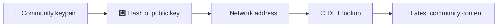
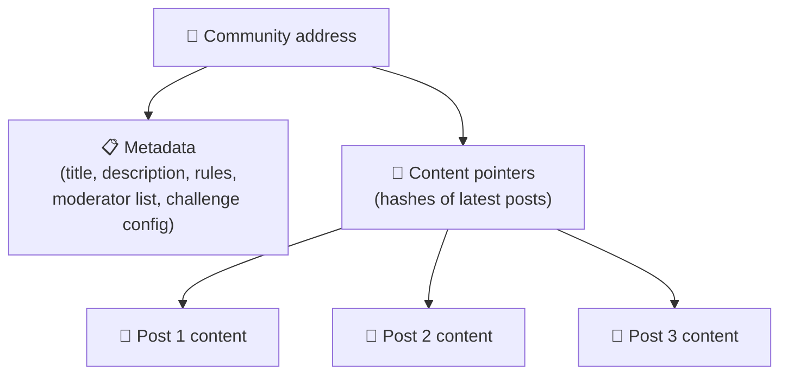
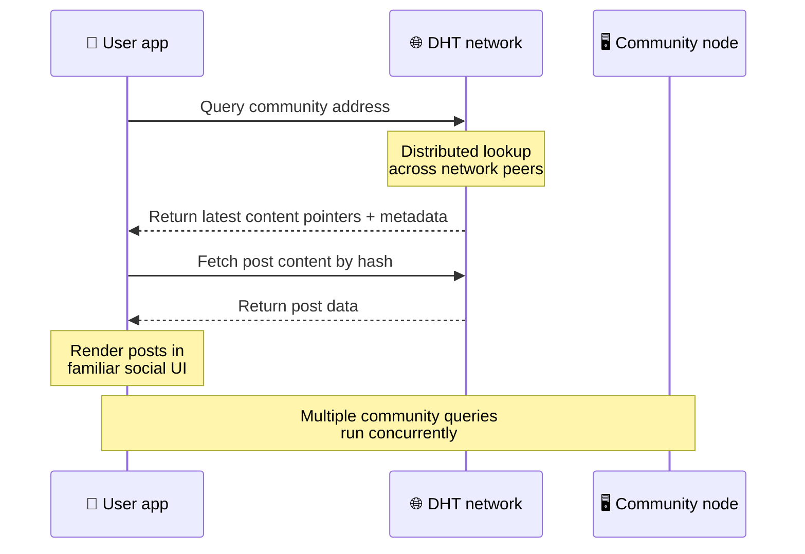
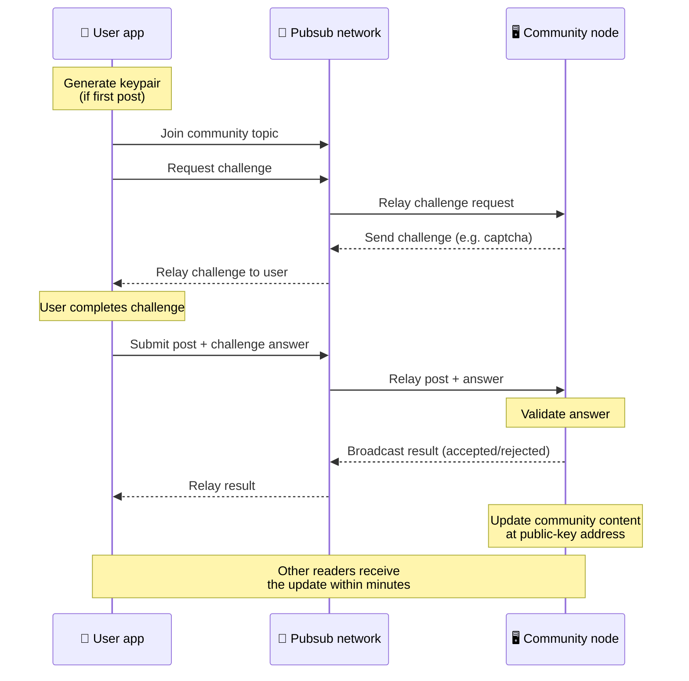
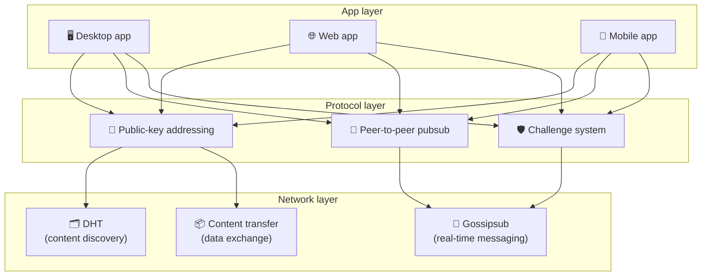

# Protokol Peer-to-Peer

Bitsocial nepoužívá blockchain, federační server ani centralizovaný backend. Místo toho kombinuje dva nápady – **adresování založené na veřejném klíči** a **peer-to-peer pubsub** – umožňující komukoli hostit komunitu ze spotřebitelského hardwaru, zatímco uživatelé mohou číst a přispívat bez účtů v jakékoli společnosti kontrolované službě.

Pro méně technický návod si přečtěte [Kompletní laické vysvětlení protokolu Bitsocial](./layman-protocol-explanation.md).

## Dva problémy

Decentralizovaná sociální síť musí odpovědět na dvě otázky:

1. **Data** — jak ukládáte a obsluhujete sociální obsah z celého světa bez centrální databáze?
2. **Spam** – jak zabráníte zneužití a zároveň ponecháte síť volně k použití?

Bitsocial řeší problém s daty úplným vynecháním blockchainu: sociální média nepotřebují globální objednávání transakcí ani trvalou dostupnost každého starého příspěvku. Řeší problém se spamem tím, že každé komunitě umožňuje spustit vlastní antispamovou výzvu přes síť peer-to-peer.

Pro model zjišťování nad touto síťovou vrstvou viz [Objevování obsahu](./content-discovery.md).

---

## Adresování na základě veřejného klíče

V BitTorrentu se hash souboru stane jeho adresou (_content-based addressing_). Bitsocial používá podobný nápad s veřejnými klíči: hash veřejného klíče komunity se stává její síťovou adresou.

Jakýkoli peer v síti může provést dotaz DHT (distribuovaná hashovací tabulka) pro tuto adresu a získat nejnovější stav komunity. Při každé aktualizaci obsahu se zvyšuje číslo jeho verze. Síť uchovává pouze nejnovější verzi – není třeba uchovávat každý historický stav, což je to, co činí tento přístup ve srovnání s blockchainem lehkým.

### Co se uloží na adresu

Adresa komunity přímo neobsahuje celý obsah příspěvku. Místo toho ukládá seznam identifikátorů obsahu – hashů, které ukazují na skutečná data. Klient pak načte každý kus obsahu prostřednictvím vyhledávání ve stylu DHT nebo trackeru.

Data má vždy alespoň jeden peer: uzel komunitního operátora. Pokud je komunita populární, bude ji mít i mnoho dalších vrstevníků a zátěž se rozloží sama, stejně tak se oblíbené torrenty stahují rychleji.

---

## Peer-to-peer pubsub

Pubsub (publish-subscribe) je způsob zasílání zpráv, kde se uživatelé přihlásí k odběru tématu a obdrží každou zprávu publikovanou k tomuto tématu. Bitsocial používá síť pubsub typu peer-to-peer – kdokoli může publikovat, kdokoli se může přihlásit k odběru a neexistuje žádný centrální zprostředkovatel zpráv.

Chcete-li publikovat příspěvek do komunity, uživatel publikuje zprávu, jejíž téma se rovná veřejnému klíči komunity. Uzel komunitního operátora jej vyzvedne, ověří a – pokud projde antispamovou výzvou – zahrne jej do příští aktualizace obsahu.

---

## Anti-spam: výzvy přes pubsub

Otevřená síť pubsub je zranitelná vůči záplavám spamu. Bitsocial to řeší tím, že vydavatelům vyžaduje, aby dokončili **výzvu**, než bude jejich obsah přijat.

Systém výzev je flexibilní: každý provozovatel komunity si konfiguruje vlastní politiku. Možnosti zahrnují:

| Typ výzvy             | Jak to funguje                                            |
| --------------------- | --------------------------------------------------------- |
| **Captcha**           | Vizuální nebo interaktivní puzzle prezentované v aplikaci |
| **Omezení sazby**     | Omezit příspěvky za časové okno na identitu               |
| **Token gate**        | Vyžadovat doklad o zůstatku konkrétního tokenu            |
| **Platba**            | Vyžadovat malou platbu za příspěvek                       |
| **Seznam povolených** | Pouze předem schválené identity mohou zveřejňovat         |
| **Vlastní kód**       | Jakákoli politika vyjádřitelná v kódu                     |

Protějšky, které předávají příliš mnoho neúspěšných pokusů o výzvu, jsou v tématu pubsub zablokovány, což zabraňuje útokům typu denial-of-service na síťovou vrstvu.

---

## Životní cyklus: čtení komunity

To se stane, když uživatel otevře aplikaci a zobrazí nejnovější příspěvky komunity.

**Krok za krokem:**

1. Uživatel otevře aplikaci a uvidí sociální rozhraní.
2. Klient se připojí k síti peer-to-peer a vytvoří dotaz DHT pro každou komunitu uživatele
   následuje. Každý dotaz trvá několik sekund, ale probíhá souběžně.
3. Každý dotaz vrací nejnovější ukazatele obsahu komunity a metadata (název, popis,
   seznam moderátorů, konfigurace výzvy).
4. Klient načte skutečný obsah příspěvku pomocí těchto ukazatelů a poté vykreslí vše v a
   známé sociální rozhraní.

---

## Životní cyklus: publikování příspěvku

Publikování zahrnuje handshake výzva-odpověď přes pubsub před přijetím příspěvku.

**Krok za krokem:**

1. Aplikace vygeneruje pro uživatele pár klíčů, pokud jej ještě nemají.
2. Uživatel napíše příspěvek pro komunitu.
3. Klient se připojí k tématu pubsub pro tuto komunitu (zaklíčované veřejným klíčem komunity).
4. Klient požaduje výzvu přes pubsub.
5. Uzel komunitního operátora odešle zpět výzvu (například captcha).
6. Uživatel dokončí výzvu.
7. Klient odešle příspěvek spolu s odpovědí na výzvu přes pubsub.
8. Uzel komunitního operátora ověří odpověď. Pokud je správná, příspěvek je přijat.
9. Uzel vysílá výsledek přes pubsub, takže síťoví kolegové vědí, že mají pokračovat v přenosu
   zprávy od tohoto uživatele.
10. Uzel aktualizuje obsah komunity na své adrese veřejného klíče.
11. Během několika minut obdrží každý čtenář komunity aktualizaci.

---

## Přehled architektury

Celý systém má tři vrstvy, které spolupracují:

| Vrstva       | Role                                                                                                                                  |
| ------------ | ------------------------------------------------------------------------------------------------------------------------------------- |
| **Aplikace** | Uživatelské rozhraní. Může existovat více aplikací, z nichž každá má svůj vlastní design, všechny sdílejí stejné komunity a identity. |
| **Protokol** | Definuje, jak jsou komunity oslovovány, jak jsou publikovány příspěvky a jak je zabráněno spamu.                                      |
| **Síť**      | Základní infrastruktura peer-to-peer: DHT pro zjišťování, gossipsub pro zasílání zpráv v reálném čase a přenos obsahu pro výměnu dat. |

---

## Soukromí: odpojení autorů od IP adres

Když uživatel publikuje příspěvek, obsah je **zašifrován veřejným klíčem provozovatele komunity**, než vstoupí do sítě pubsub. To znamená, že zatímco síťoví pozorovatelé vidí, že partner _něco_ zveřejnil, nemohou určit:

- co říká obsah
- identita autora jej zveřejnila

Je to podobné tomu, jak BitTorrent umožňuje odhalit, které IP adresy přivádějí torrent, ale ne kdo jej původně vytvořil. Šifrovací vrstva přidává k základní linii další záruku soukromí.

---

## Prohlížeč peer-to-peer

Prohlížeč P2P je nyní možný v klientech Bitsocial. Aplikace prohlížeče může spouštět [Helia](uzel https://helia.io/), používat stejnou sadu klientů protokolu Bitsocial jako jiné aplikace a načítat obsah od kolegů, aniž by žádal o jeho obsluhu centralizovanou bránu IPFS. Prohlížeč se také může přímo podílet na pubsub, takže odesílání nepotřebuje poskytovatele pubsub vlastněného platformou na šťastné cestě.

Toto je důležitý milník pro webovou distribuci: běžný web HTTPS se může otevřít v živém P2P sociálním klientovi. Uživatelé nemusí instalovat aplikaci pro stolní počítače, než budou moci číst ze sítě, a operátor aplikace nemusí spouštět centrální bránu, která se pro každého uživatele prohlížeče stane centrálním bodem cenzury nebo moderování.

Cesta prohlížeče má jiné limity než uzel desktopu nebo serveru:

- uzel prohlížeče obvykle nemůže přijímat libovolná příchozí připojení z veřejného internetu
- může načítat, ověřovat, ukládat do mezipaměti a publikovat data, když je aplikace otevřená
- nemělo by se s ním zacházet jako s dlouhodobým hostitelem pro data komunity
- Úplný komunitní hosting stále nejlépe zvládne desktopová aplikace, `bitsocial-cli` nebo jiná
  vždy zapnutý uzel

Směrovače HTTP jsou pro zjišťování obsahu stále důležité: vracejí adresy poskytovatelů pro hash komunity. Nejsou to brány IPFS, protože neslouží samotný obsah. Po zjištění se klient prohlížeče připojí k peerům a načte data prostřednictvím P2P zásobníku.

5chan to odhaluje jako volitelný přepínač pokročilých nastavení v normální webové aplikaci 5chan.app. Nejnovější zásobník prohlížeče `pkc-js` se stal dostatečně stabilním pro veřejné testování poté, co upstreamová interopová práce libp2p/gossipsub řešila doručování zpráv mezi Helia a Kubo. Toto nastavení udržuje prohlížeč P2P pod kontrolou, zatímco se více testuje v reálném světě; jakmile má dostatečnou produkční jistotu, může se stát výchozí webovou cestou.

## Záložní brána

Přístup z prohlížeče podporovaný bránou je stále užitečný jako záložní zdroj pro kompatibilitu a zavedení. Brána může přenášet data mezi sítí P2P a klientem prohlížeče, když se prohlížeč nemůže připojit k síti přímo nebo když aplikace záměrně zvolí starší cestu. Tyto brány:

- může provozovat kdokoli
- nevyžadují uživatelské účty ani platby
- nezískávejte kontrolu nad identitami uživatelů nebo komunitami
- lze vyměnit bez ztráty dat

Cílovou architekturou je nejprve P2P prohlížeče, s bránami jako volitelným záložním řešením, nikoli výchozím úzkým hrdlem.

---

## Proč ne blockchain?

Blockchainy řeší problém dvojí útraty: potřebují znát přesné pořadí každé transakce, aby někdo nemohl utratit stejnou minci dvakrát.

Sociální média nemají problém s dvojím utrácením. Nezáleží na tom, zda byl příspěvek A publikován jednu milisekundu před příspěvkem B, a staré příspěvky nemusí být trvale dostupné na každém uzlu.

Vynecháním blockchainu se Bitsocial vyhne:

- **poplatky za plyn** — odeslání je zdarma
- **limity propustnosti** — žádná velikost bloku ani časové omezení blokování
- **nadýmání úložiště** – uzly si uchovávají pouze to, co potřebují
- **režie konsensu** — nejsou potřeba těžaři, validátoři ani staking

Kompromisem je, že Bitsocial nezaručuje trvalou dostupnost starého obsahu. Ale pro sociální média je to přijatelný kompromis: uzel komunitního operátora uchovává data, oblíbený obsah se šíří mezi mnoha vrstevníky a velmi staré příspěvky přirozeně mizí – stejně jako na každé sociální platformě.

## Proč ne federace?

Federované sítě (jako e-mail nebo platformy založené na ActivityPub) vylepšují centralizaci, ale stále mají strukturální omezení:

- **Závislost na serveru** – každá komunita potřebuje server s doménou, TLS a průběžné
  údržba
- **Důvěra správce** – správce serveru má plnou kontrolu nad uživatelskými účty a obsahem
- **Fragmentace** – přesun mezi servery často znamená ztrátu sledujících, historii nebo identitu
- **Cena** — někdo musí platit za hosting, což vytváří tlak na konsolidaci

Peer-to-peer přístup Bitsocial zcela odstraňuje server z rovnice. Komunitní uzel může běžet na notebooku, Raspberry Pi nebo levném VPS. Operátor řídí politiku moderování, ale nemůže převzít identity uživatelů, protože identity jsou řízeny párem klíčů, nikoli uděleny serverem.

---

## Shrnutí

Bitsocial je postaven na dvou primitivech: adresování na základě veřejného klíče pro zjišťování obsahu a peer-to-peer pubsub pro komunikaci v reálném čase. Společně vytvářejí sociální síť, kde:

- komunity jsou identifikovány kryptografickými klíči, nikoli názvy domén
- obsah se šíří mezi vrstevníky jako torrent, není poskytován z jediné databáze
- Odolnost proti spamu je lokální pro každou komunitu, není vnucena platformou
- uživatelé vlastní své identity prostřednictvím párů klíčů, nikoli prostřednictvím odvolatelných účtů
- celý systém běží bez serverů, blockchainů nebo poplatků za platformu
