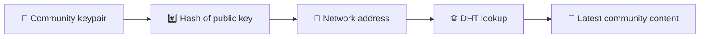
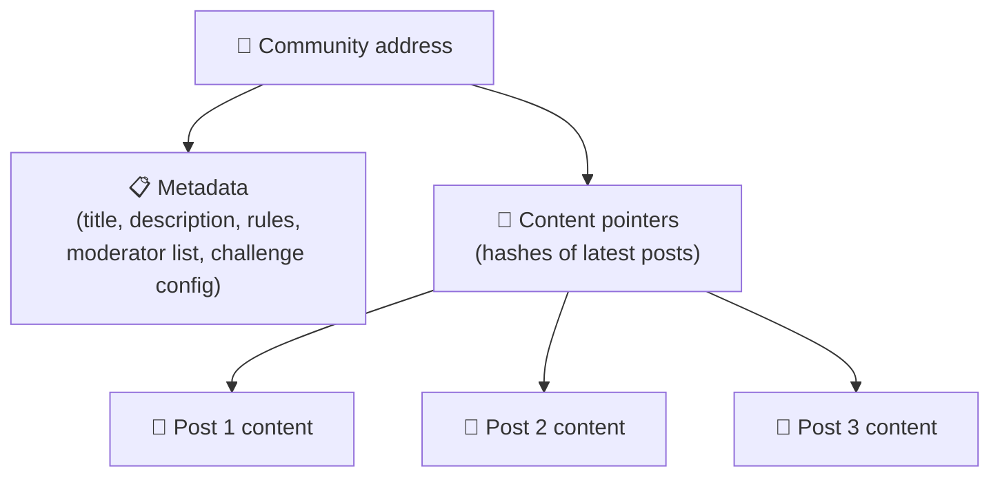
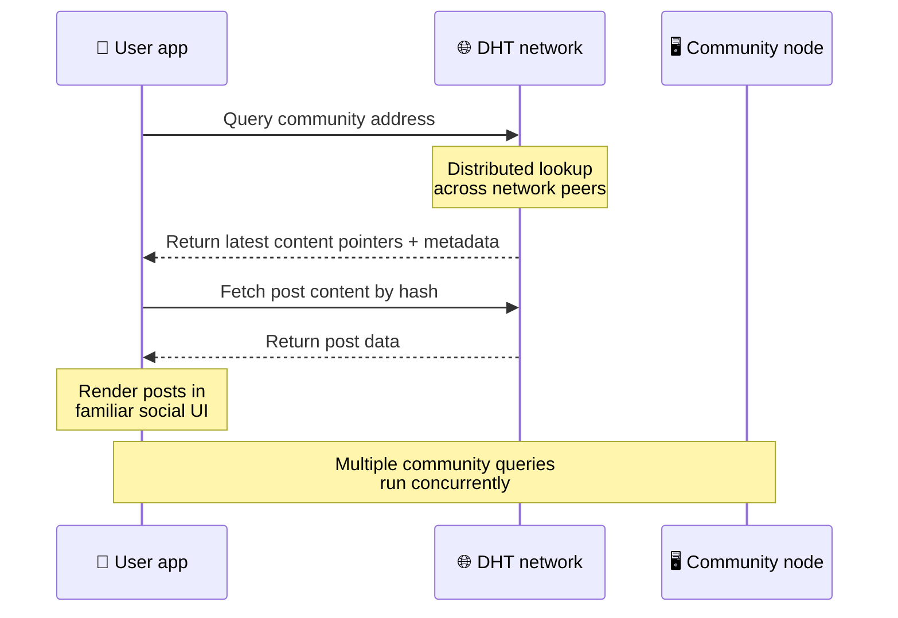
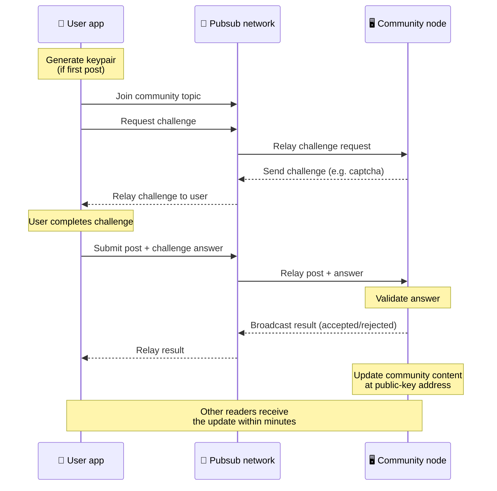
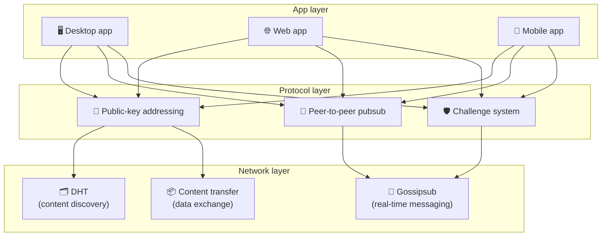

# Peer-to-Peer protokol

Bitsocial bruger ikke en blockchain, en føderationsserver eller en centraliseret backend. I stedet kombinerer det to ideer - **offentlig nøglebaseret adressering** og **peer-to-peer pubsub** - for at lade enhver være vært for et fællesskab fra forbrugerhardware, mens brugere læser og poster uden konti på nogen virksomhedskontrolleret tjeneste.

For en mindre teknisk gennemgang, læs [En komplet lægmandsforklaring af Bitsocial-protokollen](./layman-protocol-explanation.md).

## De to problemer

Et decentraliseret socialt netværk skal besvare to spørgsmål:

1. **Data** — hvordan gemmer og serverer du verdens sociale indhold uden en central database?
2. **Spam** — hvordan forhindrer du misbrug, mens du holder netværket frit at bruge?

Bitsocial løser dataproblemet ved at springe blockchain helt over: sociale medier behøver ikke global transaktionsbestilling eller permanent tilgængelighed af alle gamle indlæg. Det løser spam-problemet ved at lade hvert fællesskab køre sin egen anti-spam-udfordring over peer-to-peer-netværket.

For opdagelsesmodellen over dette netværkslag, se [Opdagelse af indhold](./content-discovery.md).

---

## Offentlig nøgle-baseret adressering

I BitTorrent bliver en fils hash dens adresse (_indholdsbaseret adressering_). Bitsocial bruger en lignende idé med offentlige nøgler: hashen af ​​et fællesskabs offentlige nøgle bliver dets netværksadresse.

Enhver peer på netværket kan udføre en DHT-forespørgsel (distributed hash table) for den pågældende adresse og hente fællesskabets seneste tilstand. Hver gang indholdet opdateres, stiger dets versionsnummer. Netværket beholder kun den nyeste version - der er ingen grund til at bevare enhver historisk tilstand, hvilket er det, der gør denne tilgang let i forhold til en blockchain.

### Hvad bliver gemt på adressen

Fællesskabsadressen indeholder ikke direkte indhold af indlæg. I stedet gemmer den en liste over indholdsidentifikatorer - hashes, der peger på de faktiske data. Klienten henter derefter hvert stykke indhold gennem DHT- eller tracker-stil opslag.

Mindst én peer har altid dataene: fællesskabsoperatørens node. Hvis fællesskabet er populært, vil mange andre jævnaldrende også have det, og belastningen fordeler sig selv, på samme måde som populære torrents er hurtigere at downloade.

---

## Peer-to-peer pubsub

Pubsub (publish-subscribe) er et meddelelsesmønster, hvor jævnaldrende abonnerer på et emne og modtager hver meddelelse, der er publiceret til det emne. Bitsocial bruger et peer-to-peer pubsub-netværk - alle kan publicere, alle kan abonnere, og der er ingen central meddelelsesmægler.

For at udgive et indlæg til et fællesskab, udgiver en bruger en besked, hvis emne svarer til fællesskabets offentlige nøgle. Community-operatørens node opfanger det, validerer det og - hvis det består anti-spam-udfordringen - inkluderer det i den næste indholdsopdatering.

---

## Anti-spam: udfordringer over pubsub

Et åbent pubsub-netværk er sårbart over for spam-oversvømmelser. Bitsocial løser dette ved at kræve, at udgivere gennemfører en **udfordring**, før deres indhold accepteres.

Udfordringssystemet er fleksibelt: hver fællesskabsoperatør konfigurerer deres egen politik. Valgmuligheder omfatter:

| Udfordringstype          | Sådan fungerer det                                      |
| ------------------------ | ------------------------------------------------------- |
| **Captcha**              | Visuelt eller interaktivt puslespil præsenteret i appen |
| **Satsbegrænsende**      | Begræns indlæg pr. tidsvindue pr. identitet             |
| **Token gate**           | Kræv bevis for balance for et specifikt token           |
| **Betaling**             | Kræv en lille betaling pr. post                         |
| **Tilladelsesliste**     | Kun forhåndsgodkendte identiteter kan sende             |
| **Brugerdefineret kode** | Enhver politik, der kan udtrykkes i kode                |

Peers, der videresender for mange mislykkede udfordringsforsøg, bliver blokeret fra pubsub-emnet, hvilket forhindrer denial-of-service-angreb på netværkslaget.

---

## Livscyklus: læse et fællesskab

Dette er, hvad der sker, når en bruger åbner appen og ser et fællesskabs seneste indlæg.

**Trin for trin:**

1. Brugeren åbner appen og ser en social grænseflade.
2. Klienten tilslutter sig peer-to-peer-netværket og laver en DHT-forespørgsel for hvert fællesskab brugeren
   følger. Forespørgsler tager et par sekunder hver, men kører samtidigt.
3. Hver forespørgsel returnerer fællesskabets seneste indholdspointer og metadata (titel, beskrivelse,
   moderatorliste, udfordringskonfiguration).
4. Klienten henter det faktiske indlægsindhold ved hjælp af disse pointere og gengiver derefter alt i en
   velkendte sociale grænseflader.

---

## Livscyklus: udgivelse af et indlæg

Udgivelse involverer et udfordring-svar-håndtryk over pubsub, før stillingen accepteres.

**Trin for trin:**

1. Appen genererer et nøglepar til brugeren, hvis de ikke har et endnu.
2. Brugeren skriver et indlæg til et fællesskab.
3. Klienten tilslutter sig pubsub-emnet for det pågældende fællesskab (nøglet til fællesskabets offentlige nøgle).
4. Klienten anmoder om en udfordring over pubsub.
5. Community-operatørens node sender en udfordring tilbage (for eksempel en captcha).
6. Brugeren fuldfører udfordringen.
7. Klienten indsender indlægget sammen med udfordringsbesvarelsen over pubsub.
8. Community-operatørens node validerer svaret. Hvis det er korrekt, accepteres indlægget.
9. Noden udsender resultatet over pubsub, så netværkskammerater ved, at de skal fortsætte med at videresende
   beskeder fra denne bruger.
10. Noden opdaterer fællesskabets indhold på dens offentlige nøgleadresse.
11. Inden for et par minutter modtager hver læser af fællesskabet opdateringen.

---

## Arkitektur oversigt

Det fulde system har tre lag, der arbejder sammen:

| Lag          | Rolle                                                                                                                                        |
| ------------ | -------------------------------------------------------------------------------------------------------------------------------------------- |
| **App**      | Brugergrænseflade. Der kan eksistere flere apps, hver med sit eget design, som alle deler de samme fællesskaber og identiteter.              |
| **Protokol** | Definerer, hvordan fællesskaber adresseres, hvordan indlæg publiceres, og hvordan spam forhindres.                                           |
| **Netværk**  | Den underliggende peer-to-peer-infrastruktur: DHT til opdagelse, sladder til meddelelser i realtid og indholdsoverførsel til dataudveksling. |

---

## Fortrolighed: fjernelse af link mellem forfattere og IP-adresser

Når en bruger udgiver et indlæg, **krypteres indholdet med fællesskabsoperatørens offentlige nøgle**, før det kommer ind på pubsub-netværket. Dette betyder, at selvom netværksobservatører kan se, at en peer har offentliggjort _noget_, kan de ikke bestemme:

- hvad indholdet siger
- hvilken forfatteridentitet offentliggjort det

Dette svarer til, hvordan BitTorrent gør det muligt at finde ud af, hvilke IP'er der starter en torrent, men ikke hvem der oprindeligt oprettede den. Krypteringslaget tilføjer en ekstra privatlivsgaranti oven i den basislinje.

---

## Browser peer-to-peer

Browser P2P er nu muligt i Bitsocial-klienter. En browser-app kan køre en [Helia](https://helia.io/)-node, bruge den samme Bitsocial-protokol-klientstack som andre apps og hente indhold fra peers i stedet for at bede en centraliseret IPFS-gateway om at betjene det. Browseren kan også deltage i pubsub direkte, så udstationering behøver ikke en platformejet pubsub-udbyder på den gode vej.

Dette er den vigtige milepæl for webdistribution: et normalt HTTPS-websted kan åbnes til en live P2P social klient. Brugere behøver ikke at installere en desktop-app, før de kan læse fra netværket, og app-operatøren behøver ikke at køre en central gateway, der bliver censur- eller moderations-chokepoint for hver browserbruger.

Browserstien har forskellige grænser fra en desktop- eller servernode:

- en browsernode kan normalt ikke acceptere vilkårlige indgående forbindelser fra det offentlige internet
- den kan indlæse, validere, cache og udgive data, mens appen er åben
- det bør ikke behandles som den langlivede vært for et fællesskabs data
- fuld fællesskabshosting håndteres stadig bedst af en desktop-app, `bitsocial-cli` eller en anden
  altid tændt node

HTTP-routere har stadig betydning for indholdsopdagelse: de returnerer udbyderadresser til en community-hash. De er ikke IPFS-gateways, fordi de ikke tjener selve indholdet. Efter opdagelse opretter browserklienten forbindelse til peers og henter dataene gennem P2P-stakken.

5chan afslører dette som en opt-in Advanced Settings switch i den normale 5chan.app webapp. Den seneste `pkc-js` browserstak er blevet stabil nok til offentlig testning efter opstrøms libp2p/gossipsub-interoparbejde rettet mod meddelelseslevering mellem Helia og Kubo-peers. Indstillingen holder browserens P2P kontrolleret, mens den bliver testet mere i den virkelige verden; når først den har tilstrækkelig produktionstillid, kan den blive standardwebstien.

## Gateway fallback

Gateway-understøttet browseradgang er stadig nyttig som en kompatibilitets- og udrulningsreserve. En gateway kan videresende data mellem P2P-netværket og en browserklient, når en browser ikke kan tilslutte sig netværket direkte, eller når appen med vilje vælger den ældre sti. Disse gateways:

- kan drives af alle
- kræver ikke brugerkonti eller betalinger
- ikke opnå forældremyndighed over brugeridentiteter eller fællesskaber
- kan skiftes ud uden at miste data

Målarkitekturen er browseren P2P først, med gateways som et valgfrit fald i stedet for standardflaskehalsen.

---

## Hvorfor ikke en blockchain?

Blockchains løser problemet med dobbeltforbrug: de skal kende den nøjagtige rækkefølge af hver transaktion for at forhindre nogen i at bruge den samme mønt to gange.

Sociale medier har ikke et problem med dobbeltforbrug. Det er ligegyldigt, om indlæg A blev publiceret et millisekund før indlæg B, og gamle indlæg behøver ikke at være permanent tilgængelige på hver node.

Ved at springe blockchain over undgår Bitsocial:

- **gasgebyrer** — opslag er gratis
- **gennemstrømningsgrænser** — ingen blokstørrelse eller blokeringstidsflaskehals
- **storage bloat** — noder beholder kun det, de har brug for
- **konsensusoverhead** — ingen minearbejdere, validatorer eller indsats påkrævet

Afvejningen er, at Bitsocial ikke garanterer permanent tilgængelighed af gammelt indhold. Men for sociale medier er det en acceptabel afvejning: Community-operatørens node holder dataene, populært indhold spredes på tværs af mange jævnaldrende, og meget gamle indlæg falmer naturligt - på samme måde som de gør på alle sociale platforme.

## Hvorfor ikke forbund?

Fødererede netværk (som e-mail eller ActivityPub-baserede platforme) forbedrer centraliseringen, men har stadig strukturelle begrænsninger:

- **Serverafhængighed** – hvert fællesskab har brug for en server med et domæne, TLS og løbende
  opretholdelse
- **Administratortillid** — serveradministratoren har fuld kontrol over brugerkonti og indhold
- **Fragmentering** — flytning mellem servere betyder ofte at miste følgere, historie eller identitet
- **Omkostninger** — nogen skal betale for hosting, hvilket skaber pres mod konsolidering

Bitsocials peer-to-peer tilgang fjerner serveren helt fra ligningen. En community node kan køre på en bærbar computer, en Raspberry Pi eller en billig VPS. Operatøren kontrollerer moderationspolitikken, men kan ikke beslaglægge brugeridentiteter, fordi identiteter er nøglepar-kontrollerede, ikke server-tildelte.

---

## Oversigt

Bitsocial er bygget på to primitiver: public-key-baseret adressering til indholdsopdagelse og peer-to-peer pubsub til realtidskommunikation. Sammen skaber de et socialt netværk, hvor:

- fællesskaber identificeres ved kryptografiske nøgler, ikke domænenavne
- indhold spredes på tværs af jævnaldrende som en torrent, ikke serveret fra en enkelt database
- spam-resistens er lokal for hvert fællesskab, ikke påtvunget af en platform
- brugere ejer deres identiteter gennem nøglepar, ikke gennem tilbagekaldelige konti
- hele systemet kører uden servere, blockchains eller platformsgebyrer
