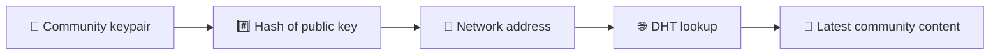
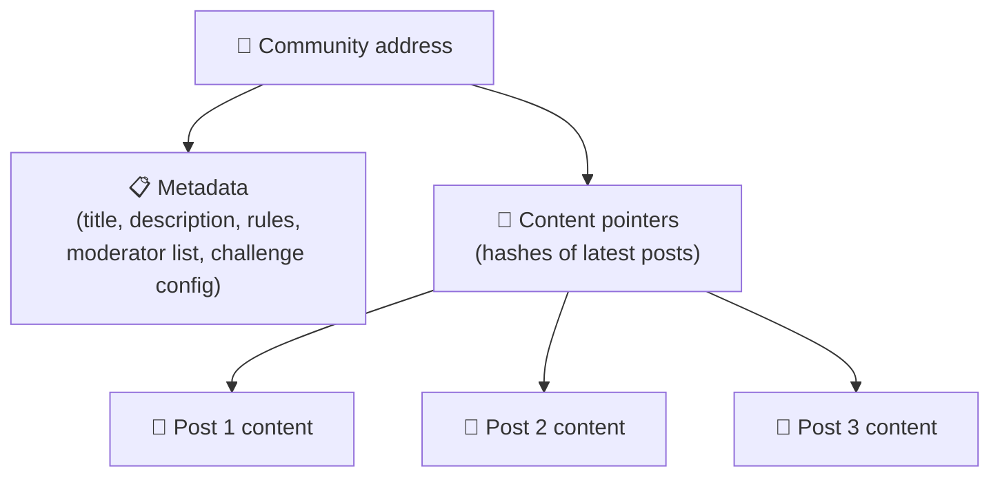
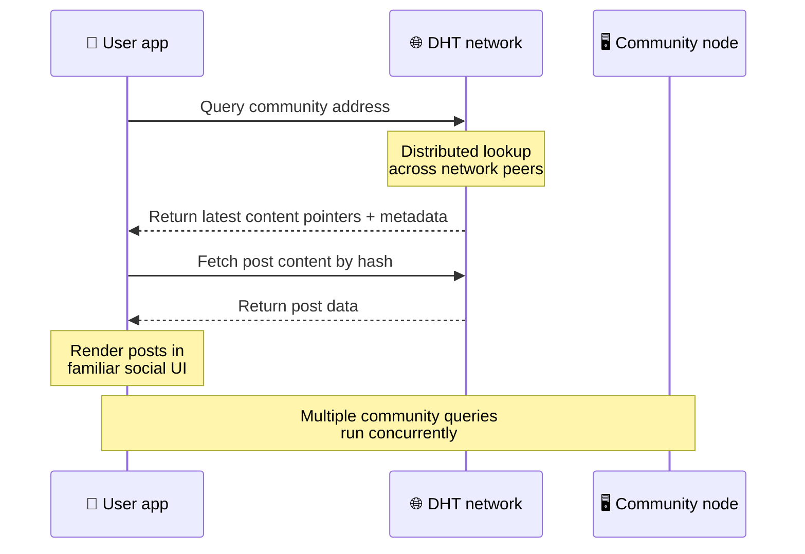
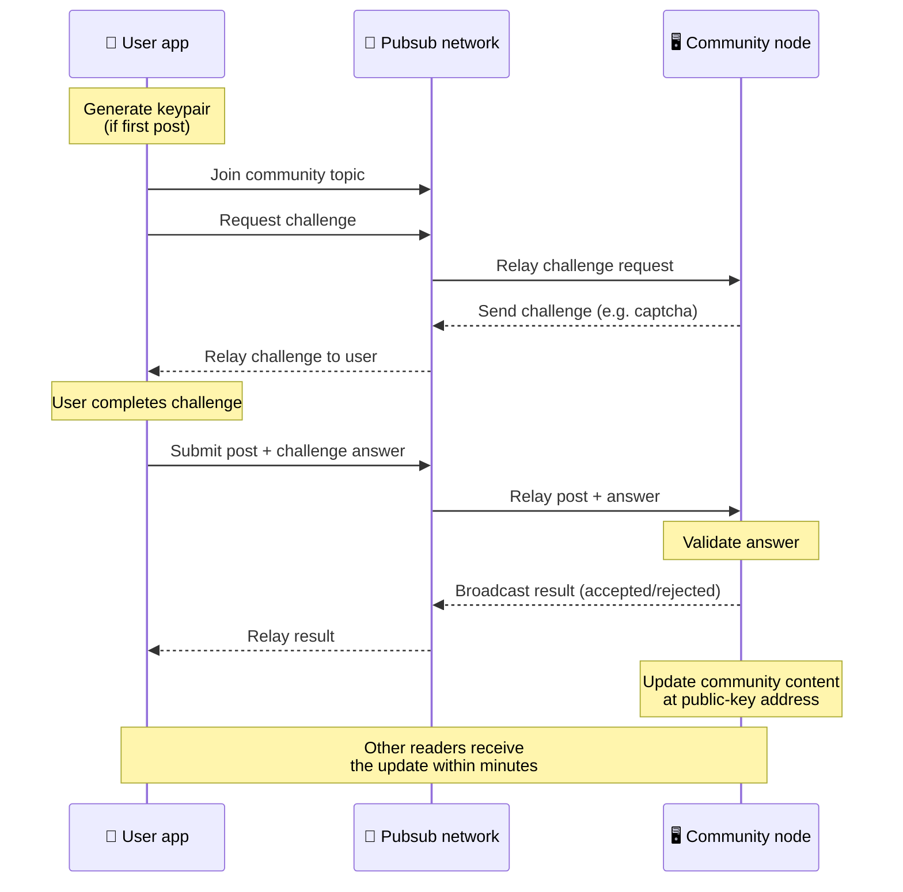
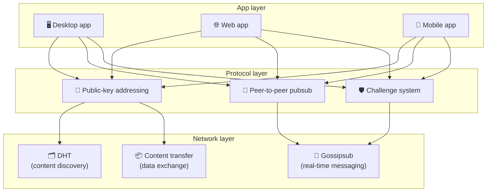

# Peer-to-Peer-Protokoll

Bitsocial verwendet keine Blockchain, keinen Verbundserver oder ein zentralisiertes Backend. Stattdessen kombiniert es zwei Ideen – **Adressierung auf Basis öffentlicher Schlüssel** und **Peer-to-Peer-Pubsub** – um es jedem zu ermöglichen, eine Community über Consumer-Hardware zu hosten, während Benutzer ohne Konto auf einem vom Unternehmen kontrollierten Dienst lesen und posten können.

Eine weniger technische Anleitung finden Sie hier [Eine vollständige Erklärung des Bitsocial-Protokolls für Laien](./layman-protocol-explanation.md).

## Die beiden Probleme

Ein dezentrales soziales Netzwerk muss zwei Fragen beantworten:

1. **Daten** – wie können Sie die sozialen Inhalte der Welt ohne eine zentrale Datenbank speichern und bereitstellen?
2. **Spam** – wie verhindern Sie Missbrauch und halten gleichzeitig die Nutzung des Netzwerks frei?

Bitsocial löst das Datenproblem, indem es die Blockchain vollständig überspringt: Social Media benötigt keine globale Transaktionsreihenfolge oder permanente Verfügbarkeit jedes alten Beitrags. Es löst das Spam-Problem, indem es jeder Community ermöglicht, ihre eigene Anti-Spam-Herausforderung über das Peer-to-Peer-Netzwerk durchzuführen.

Informationen zum Erkennungsmodell über dieser Netzwerkschicht finden Sie unter [Inhaltserkennung](./content-discovery.md).

---

## Adressierung auf Basis öffentlicher Schlüssel

In BitTorrent wird der Hash einer Datei zu ihrer Adresse (_inhaltsbasierte Adressierung_). Bitsocial nutzt eine ähnliche Idee mit öffentlichen Schlüsseln: Der Hash des öffentlichen Schlüssels einer Community wird zu ihrer Netzwerkadresse.

Jeder Peer im Netzwerk kann eine DHT-Abfrage (Distributed Hash Table) für diese Adresse durchführen und den neuesten Status der Community abrufen. Jedes Mal, wenn der Inhalt aktualisiert wird, erhöht sich seine Versionsnummer. Das Netzwerk behält nur die neueste Version – es besteht nicht die Notwendigkeit, jeden historischen Zustand beizubehalten, was diesen Ansatz im Vergleich zu einer Blockchain leichtgewichtig macht.

### Was an der Adresse gespeichert wird

Die Community-Adresse enthält nicht direkt den vollständigen Beitragsinhalt. Stattdessen wird eine Liste von Inhaltskennungen gespeichert – Hashes, die auf die tatsächlichen Daten verweisen. Der Client ruft dann jeden Inhalt über die DHT- oder Tracker-Suche ab.

Mindestens ein Peer verfügt immer über die Daten: der Knoten des Community-Betreibers. Wenn die Community beliebt ist, haben sie auch viele andere Kollegen und die Last verteilt sich von selbst, genauso wie beliebte Torrents schneller heruntergeladen werden können.

---

## Peer-to-Peer-Pubsub

Pubsub (publish-subscribe) ist ein Nachrichtenmuster, bei dem Peers ein Thema abonnieren und jede zu diesem Thema veröffentlichte Nachricht erhalten. Bitsocial nutzt ein Peer-to-Peer-Pubsub-Netzwerk – jeder kann veröffentlichen, jeder kann abonnieren und es gibt keinen zentralen Nachrichtenbroker.

Um einen Beitrag in einer Community zu veröffentlichen, veröffentlicht ein Benutzer eine Nachricht, deren Thema dem öffentlichen Schlüssel der Community entspricht. Der Knoten des Community-Betreibers nimmt es auf, validiert es und nimmt es – wenn es die Anti-Spam-Herausforderung besteht – in die nächste Inhaltsaktualisierung ein.

---

## Anti-Spam: Herausforderungen bei Pubsub

Ein offenes Pubsub-Netzwerk ist anfällig für Spam-Flut. Bitsocial löst dieses Problem, indem es von Herausgebern verlangt, eine **Herausforderung** zu erfüllen, bevor ihre Inhalte akzeptiert werden.

Das Challenge-System ist flexibel: Jeder Community-Betreiber konfiguriert seine eigenen Richtlinien. Zu den Optionen gehören:

| Herausforderungstyp          | Wie es funktioniert                                         |
| ---------------------------- | ----------------------------------------------------------- | ----------------------- |
| **Captcha**                  | Visuelles oder interaktives Puzzle, präsentiert in der App  |
| **Ratenbegrenzung**          | Beiträge pro Zeitfenster pro Identität begrenzen            |
| **Token-Gate**               | Erfordern einen Guthabennachweis für einen bestimmten Token |
| **Zahlung**                  | Erfordern Sie eine kleine Zahlung pro Post                  |
| **Zulassungsliste**          | Nur vorab genehmigte Identitäten können                     | posten                  |
| **Benutzerdefinierter Code** | Jede im Code                                                | ausdrückbare Richtlinie |

Peers, die zu viele fehlgeschlagene Challenge-Versuche weiterleiten, werden vom Pubsub-Thema blockiert, was Denial-of-Service-Angriffe auf der Netzwerkebene verhindert.

---

## Lebenszyklus: Lesen einer Community

Dies geschieht, wenn ein Benutzer die App öffnet und die neuesten Beiträge einer Community anzeigt.

**Schritt für Schritt:**

1. Der Benutzer öffnet die App und sieht eine soziale Schnittstelle.
2. Der Client tritt dem Peer-to-Peer-Netzwerk bei und führt eine DHT-Abfrage für jede Community des Benutzers durch
   folgt. Die Abfragen dauern jeweils einige Sekunden, werden jedoch gleichzeitig ausgeführt.
3. Jede Abfrage gibt die neuesten Inhaltshinweise und Metadaten der Community (Titel, Beschreibung,
   Moderatorenliste, Challenge-Konfiguration).
4. Der Client ruft mithilfe dieser Zeiger den eigentlichen Beitragsinhalt ab und rendert dann alles in einem
   vertraute soziale Schnittstelle.

---

## Lebenszyklus: Veröffentlichung eines Beitrags

Beim Veröffentlichen erfolgt ein Challenge-Response-Handshake über Pubsub, bevor der Beitrag angenommen wird.

**Schritt für Schritt:**

1. Die App generiert ein Schlüsselpaar für den Benutzer, falls dieser noch keines hat.
2. Der Benutzer schreibt einen Beitrag für eine Community.
3. Der Client tritt dem Pubsub-Thema für diese Community bei (verschlüsselt mit dem öffentlichen Schlüssel der Community).
4. Der Client fordert eine Challenge über Pubsub an.
5. Der Knoten des Community-Betreibers sendet eine Herausforderung (z. B. ein Captcha) zurück.
6. Der Benutzer schließt die Herausforderung ab.
7. Der Kunde sendet den Beitrag zusammen mit der Challenge-Antwort über Pubsub.
8. Der Knoten des Community-Betreibers validiert die Antwort. Wenn korrekt, wird der Beitrag angenommen.
9. Der Knoten sendet das Ergebnis über Pubsub, sodass Netzwerkpartner wissen, dass sie mit der Weiterleitung fortfahren müssen
   Nachrichten von diesem Benutzer.
10. Der Knoten aktualisiert den Inhalt der Community unter seiner Public-Key-Adresse.
11. Innerhalb weniger Minuten erhält jeder Leser der Community das Update.

---

## Architekturübersicht

Das Gesamtsystem besteht aus drei Schichten, die zusammenarbeiten:

| Schicht       | Rolle                                                                                                                                                  |
| ------------- | ------------------------------------------------------------------------------------------------------------------------------------------------------ |
| **App**       | Benutzeroberfläche. Es können mehrere Apps vorhanden sein, jede mit eigenem Design und mit denselben Communities und Identitäten.                      |
| **Protokoll** | Definiert, wie Communities angesprochen werden, wie Beiträge veröffentlicht werden und wie Spam verhindert wird.                                       |
| **Netzwerk**  | Die zugrunde liegende Peer-to-Peer-Infrastruktur: DHT für die Erkennung, Gossipsub für Echtzeit-Messaging und Content Transfer für den Datenaustausch. |

---

## Datenschutz: Verknüpfung von Autoren und IP-Adressen aufheben

Wenn ein Benutzer einen Beitrag veröffentlicht, wird der Inhalt **mit dem öffentlichen Schlüssel des Community-Betreibers verschlüsselt**, bevor er in das Pubsub-Netzwerk gelangt. Das bedeutet, dass Netzwerkbeobachter zwar sehen können, dass ein Peer _etwas_ veröffentlicht hat, sie jedoch nicht feststellen können:

- was der Inhalt sagt
- welche Autorenidentität es veröffentlicht hat

Dies ähnelt der Art und Weise, wie BitTorrent es ermöglicht, herauszufinden, welche IPs einen Torrent auslösen, aber nicht, wer ihn ursprünglich erstellt hat. Die Verschlüsselungsschicht fügt zusätzlich zu dieser Grundlinie eine zusätzliche Datenschutzgarantie hinzu.

---

## Browser-Peer-to-Peer

Browser-P2P ist jetzt in Bitsocial-Clients möglich. Eine Browser-App kann einen [Helia](https://helia.io/)-Knoten ausführen, denselben Bitsocial-Protokoll-Client-Stack wie andere Apps verwenden und Inhalte von Peers abrufen, anstatt ein zentrales IPFS-Gateway um die Bereitstellung zu bitten. Der Browser kann auch direkt an Pubsub teilnehmen, sodass für die Veröffentlichung kein plattformeigener Pubsub-Anbieter im Happy Path erforderlich ist.

Dies ist der wichtige Meilenstein für die Webverbreitung: Eine normale HTTPS-Website kann zu einem Live-P2P-Social-Client geöffnet werden. Benutzer müssen keine Desktop-App installieren, bevor sie aus dem Netzwerk lesen können, und der App-Betreiber muss kein zentrales Gateway betreiben, das für jeden Browser-Benutzer zum Zensur- oder Moderations-Heckpunkt wird.

Der Browserpfad hat andere Grenzen als ein Desktop- oder Serverknoten:

- Ein Browserknoten kann normalerweise keine beliebigen eingehenden Verbindungen aus dem öffentlichen Internet akzeptieren
- Es kann Daten laden, validieren, zwischenspeichern und veröffentlichen, während die App geöffnet ist
- Es sollte nicht als langlebiger Host für die Daten einer Community betrachtet werden
- Das vollständige Community-Hosting lässt sich immer noch am besten über eine Desktop-App, `bitsocial-cli`, oder eine andere erledigen
  Always-on-Knoten

HTTP-Router sind für die Inhaltserkennung immer noch wichtig: Sie geben Anbieteradressen für einen Community-Hash zurück. Sie sind keine IPFS-Gateways, da sie den Inhalt selbst nicht bereitstellen. Nach der Erkennung stellt der Browser-Client eine Verbindung zu Peers her und ruft die Daten über den P2P-Stack ab.

5chan macht dies als Opt-in-Schalter für erweiterte Einstellungen in der normalen 5chan.app-Webanwendung verfügbar. Der neueste `pkc-js`-Browser-Stack ist stabil genug für öffentliche Tests geworden, nachdem sich die Upstream-Interop-Arbeiten mit libp2p/gossipsub mit der Nachrichtenzustellung zwischen Helia- und Kubo-Peers befasst haben. Die Einstellung sorgt dafür, dass das Browser-P2P kontrolliert wird, während es mehr Tests in der realen Welt gibt; Sobald er über genügend Produktionssicherheit verfügt, kann er zum Standard-Webpfad werden.

## Gateway-Fallback

Der Gateway-gestützte Browserzugriff ist weiterhin als Kompatibilitäts- und Rollout-Fallback nützlich. Ein Gateway kann Daten zwischen dem P2P-Netzwerk und einem Browser-Client weiterleiten, wenn ein Browser nicht direkt mit dem Netzwerk verbunden werden kann oder wenn die App absichtlich den älteren Pfad wählt. Diese Gateways:

- kann von jedem betrieben werden
- erfordern keine Benutzerkonten oder Zahlungen
- Erhalten Sie kein Sorgerecht für Benutzeridentitäten oder Communities
- können ohne Datenverlust ausgetauscht werden

Die Zielarchitektur ist zuerst Browser-P2P, mit Gateways als optionalem Fallback und nicht als Standardengpass.

---

## Warum nicht eine Blockchain?

Blockchains lösen das Problem der doppelten Ausgaben: Sie müssen die genaue Reihenfolge jeder Transaktion kennen, um zu verhindern, dass jemand dieselbe Münze zweimal ausgibt.

In den sozialen Medien gibt es kein Double-Spend-Problem. Es spielt keine Rolle, ob Beitrag A eine Millisekunde vor Beitrag B veröffentlicht wurde, und alte Beiträge müssen nicht dauerhaft auf jedem Knoten verfügbar sein.

Durch das Überspringen der Blockchain vermeidet Bitsocial Folgendes:

- **Gasgebühren** – die Veröffentlichung ist kostenlos
- **Durchsatzbegrenzungen** – kein Blockgrößen- oder Blockzeitengpass
- **Speicheraufblähung** – Knoten behalten nur das, was sie brauchen
- **Konsensaufwand** – keine Miner, Validatoren oder Absteckungen erforderlich

Der Nachteil besteht darin, dass Bitsocial keine dauerhafte Verfügbarkeit alter Inhalte garantiert. Aber für soziale Medien ist das ein akzeptabler Kompromiss: Der Knoten des Community-Betreibers speichert die Daten, beliebte Inhalte werden auf viele Peers verteilt und sehr alte Beiträge verschwinden ganz natürlich – genau wie auf jeder sozialen Plattform.

## Warum nicht eine Föderation?

Föderierte Netzwerke (wie E-Mail oder ActivityPub-basierte Plattformen) verbessern die Zentralisierung, weisen jedoch immer noch strukturelle Einschränkungen auf:

- **Serverabhängigkeit** – jede Community benötigt einen Server mit einer Domäne, TLS und fortlaufend
  Wartung
- **Administratorvertrauen** – Der Serveradministrator hat die volle Kontrolle über Benutzerkonten und Inhalte
- **Fragmentierung** – Der Wechsel zwischen Servern bedeutet oft den Verlust von Followern, Verlauf oder Identität
- **Kosten** – Jemand muss für das Hosting bezahlen, was Druck zur Konsolidierung erzeugt

Der Peer-to-Peer-Ansatz von Bitsocial eliminiert den Server vollständig aus der Gleichung. Ein Community-Knoten kann auf einem Laptop, einem Raspberry Pi oder einem günstigen VPS laufen. Der Betreiber kontrolliert die Moderationsrichtlinie, kann jedoch keine Benutzeridentitäten beschlagnahmen, da Identitäten schlüsselpaargesteuert und nicht vom Server gewährt werden.

---

## Zusammenfassung

Bitsocial basiert auf zwei Grundprinzipien: Adressierung auf Basis öffentlicher Schlüssel für die Inhaltserkennung und Peer-to-Peer-Pubsub für Echtzeitkommunikation. Zusammen bilden sie ein soziales Netzwerk, in dem:

- Communities werden durch kryptografische Schlüssel identifiziert, nicht durch Domänennamen
- Inhalte verbreiten sich wie ein Torrent über Peers und werden nicht aus einer einzigen Datenbank bereitgestellt
- Die Spam-Resistenz ist für jede Community lokal und wird nicht von einer Plattform auferlegt
- Benutzer besitzen ihre Identität über Schlüsselpaare, nicht über widerrufliche Konten
- Das gesamte System läuft ohne Server, Blockchains oder Plattformgebühren
