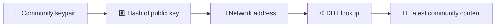
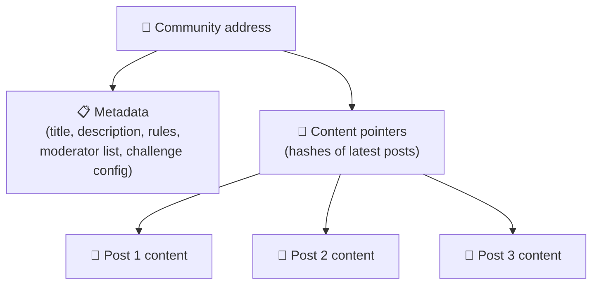
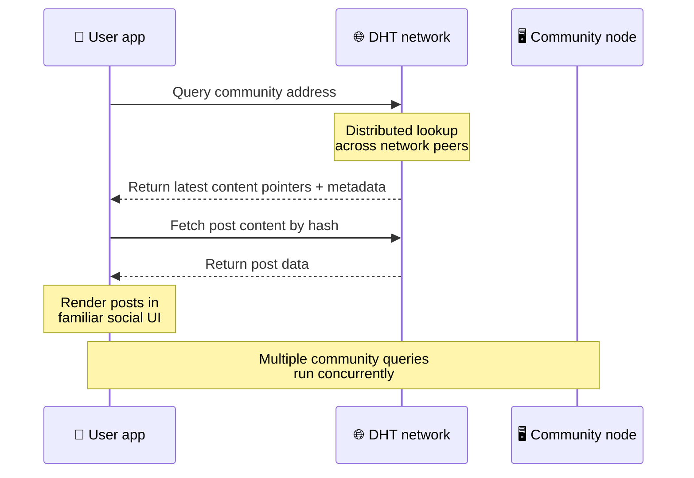
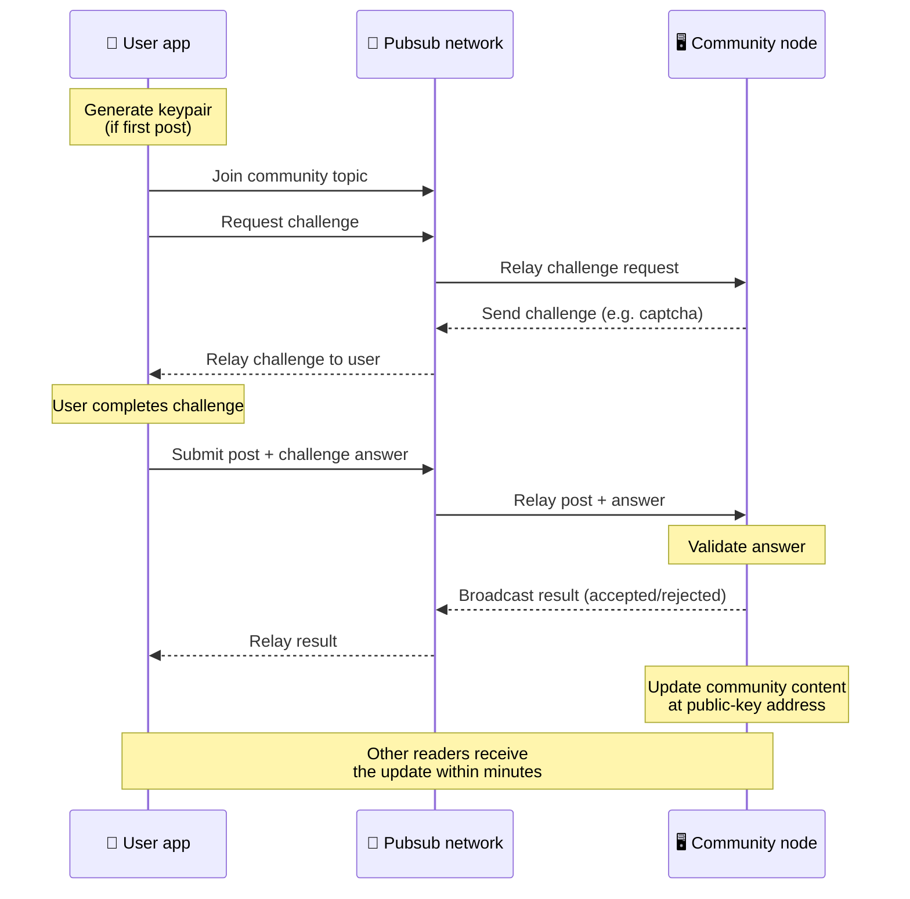
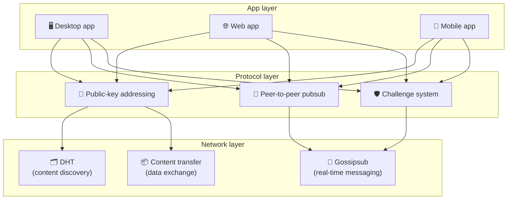

# Πρωτόκολλο Peer-to-Peer

Το Bitsocial δεν χρησιμοποιεί blockchain, διακομιστή ομοσπονδίας ή κεντρικό σύστημα υποστήριξης. Αντίθετα, συνδυάζει δύο ιδέες — **διευθυνσιοδότηση με βάση το δημόσιο κλειδί** και **παμπ ομότιμη** — για να επιτρέπει σε οποιονδήποτε να φιλοξενεί μια κοινότητα από καταναλωτικό υλικό, ενώ οι χρήστες διαβάζουν και δημοσιεύουν χωρίς λογαριασμούς σε οποιαδήποτε υπηρεσία που ελέγχεται από την εταιρεία.

Για μια λιγότερο τεχνική περιγραφή, διαβάστε [Μια πλήρης απλή εξήγηση του πρωτοκόλλου Bitsocial](./layman-protocol-explanation.md).

## Τα δύο προβλήματα

Ένα αποκεντρωμένο κοινωνικό δίκτυο πρέπει να απαντήσει σε δύο ερωτήσεις:

1. **Δεδομένα** — πώς αποθηκεύετε και εξυπηρετείτε το παγκόσμιο κοινωνικό περιεχόμενο χωρίς κεντρική βάση δεδομένων;
2. **Ανεπιθύμητα** — πώς αποτρέπετε την κατάχρηση, ενώ διατηρείτε το δίκτυο ελεύθερο στη χρήση;

Το Bitsocial λύνει το πρόβλημα δεδομένων παρακάμπτοντας εντελώς το blockchain: τα μέσα κοινωνικής δικτύωσης δεν χρειάζονται παγκόσμια παραγγελία συναλλαγών ή μόνιμη διαθεσιμότητα κάθε παλιάς ανάρτησης. Επιλύει το πρόβλημα ανεπιθύμητης αλληλογραφίας αφήνοντας κάθε κοινότητα να εκτελέσει τη δική της πρόκληση κατά του ανεπιθύμητου περιεχομένου μέσω του δικτύου peer-to-peer.

Για το μοντέλο ανακάλυψης πάνω από αυτό το επίπεδο δικτύου, δείτε [Ανακάλυψη περιεχομένου](./content-discovery.md).

---

## Διευθυνσιοδότηση με βάση το δημόσιο κλειδί

Στο BitTorrent, ο κατακερματισμός ενός αρχείου γίνεται η διεύθυνσή του (_content-based addressing_). Το Bitsocial χρησιμοποιεί μια παρόμοια ιδέα με τα δημόσια κλειδιά: ο κατακερματισμός του δημόσιου κλειδιού μιας κοινότητας γίνεται η διεύθυνση δικτύου της.

Οποιοσδήποτε peer στο δίκτυο μπορεί να εκτελέσει ένα ερώτημα DHT (κατανεμημένος πίνακας κατακερματισμού) για αυτήν τη διεύθυνση και να ανακτήσει την πιο πρόσφατη κατάσταση της κοινότητας. Κάθε φορά που ενημερώνεται το περιεχόμενο, ο αριθμός της έκδοσής του αυξάνεται. Το δίκτυο διατηρεί μόνο την πιο πρόσφατη έκδοση — δεν χρειάζεται να διατηρηθεί κάθε ιστορική κατάσταση, κάτι που κάνει αυτή την προσέγγιση ελαφριά σε σύγκριση με ένα blockchain.

### Τι αποθηκεύεται στη διεύθυνση

Η διεύθυνση της κοινότητας δεν περιέχει απευθείας πλήρες περιεχόμενο ανάρτησης. Αντίθετα, αποθηκεύει μια λίστα με αναγνωριστικά περιεχομένου — κατακερματισμοί που οδηγούν στα πραγματικά δεδομένα. Στη συνέχεια, ο πελάτης ανακτά κάθε κομμάτι περιεχομένου μέσω των αναζητήσεων DHT ή τύπου tracker.

Τουλάχιστον ένας ομότιμος έχει πάντα τα δεδομένα: τον κόμβο του τελεστή της κοινότητας. Εάν η κοινότητα είναι δημοφιλής, θα την έχουν και πολλοί άλλοι συνομήλικοι και το φορτίο διανέμεται μόνο του, με τον ίδιο τρόπο που τα δημοφιλή torrent είναι πιο γρήγορα στη λήψη.

---

## Peer-to-peer pubsub

Το Pubsub (δημοσίευση-εγγραφή) είναι ένα μοτίβο ανταλλαγής μηνυμάτων όπου οι συνομήλικοι εγγράφονται σε ένα θέμα και λαμβάνουν κάθε μήνυμα που δημοσιεύεται σε αυτό το θέμα. Το Bitsocial χρησιμοποιεί ένα peer-to-peer δίκτυο pubsub — ο καθένας μπορεί να δημοσιεύσει, ο καθένας μπορεί να εγγραφεί και δεν υπάρχει κεντρικός μεσίτης μηνυμάτων.

Για να δημοσιεύσετε μια ανάρτηση σε μια κοινότητα, ένας χρήστης δημοσιεύει ένα μήνυμα του οποίου το θέμα ισούται με το δημόσιο κλειδί της κοινότητας. Ο κόμβος του παρόχου κοινότητας τον παίρνει, τον επικυρώνει και — εάν περάσει την πρόκληση κατά του ανεπιθύμητου περιεχομένου — τον περιλαμβάνει στην επόμενη ενημέρωση περιεχομένου.

---

## Anti-spam: προκλήσεις μέσω pubsub

Ένα ανοιχτό δίκτυο παμπ είναι ευάλωτο σε πλημμύρες ανεπιθύμητων μηνυμάτων. Το Bitsocial το λύνει αυτό απαιτώντας από τους εκδότες να ολοκληρώσουν μια **πρόκληση** πριν γίνει αποδεκτό το περιεχόμενό τους.

Το σύστημα πρόκλησης είναι ευέλικτο: κάθε κοινοτικός χειριστής διαμορφώνει τη δική του πολιτική. Οι επιλογές περιλαμβάνουν:

| Τύπος πρόκλησης            | Πώς λειτουργεί                                               |
| -------------------------- | ------------------------------------------------------------ |
| **Captcha**                | Οπτικό ή διαδραστικό παζλ που παρουσιάζεται στην εφαρμογή    |
| **Περιορισμός ποσοστού**   | Περιορισμός αναρτήσεων ανά χρονικό παράθυρο ανά ταυτότητα    |
| **Token gate**             | Απαιτείται απόδειξη υπολοίπου ενός συγκεκριμένου διακριτικού |
| **Πληρωμή**                | Απαιτείται μια μικρή πληρωμή ανά ανάρτηση                    |
| **Λίστα επιτρεπόμενων**    | Μόνο προεγκεκριμένες ταυτότητες μπορούν να δημοσιεύουν       |
| **Προσαρμοσμένος κωδικός** | Οποιαδήποτε πολιτική που εκφράζεται σε κώδικα                |

Οι ομότιμοι που αναμεταδίδουν πάρα πολλές αποτυχημένες προσπάθειες πρόκλησης αποκλείονται από το θέμα του pubsub, γεγονός που αποτρέπει επιθέσεις άρνησης υπηρεσίας στο επίπεδο δικτύου.

---

## Κύκλος ζωής: ανάγνωση μιας κοινότητας

Αυτό συμβαίνει όταν ένας χρήστης ανοίγει την εφαρμογή και προβάλλει τις τελευταίες αναρτήσεις μιας κοινότητας.

**Βήμα βήμα:**

1. Ο χρήστης ανοίγει την εφαρμογή και βλέπει μια κοινωνική διεπαφή.
2. Ο πελάτης εντάσσεται στο δίκτυο peer-to-peer και κάνει ένα ερώτημα DHT για κάθε κοινότητα του χρήστη
   ακολουθεί. Τα ερωτήματα χρειάζονται μερικά δευτερόλεπτα το καθένα, αλλά εκτελούνται ταυτόχρονα.
3. Κάθε ερώτημα επιστρέφει τους πιο πρόσφατους δείκτες περιεχομένου και τα μεταδεδομένα της κοινότητας (τίτλος, περιγραφή,
   λίστα συντονιστών, διαμόρφωση πρόκλησης).
4. Ο πελάτης ανακτά το πραγματικό περιεχόμενο της ανάρτησης χρησιμοποιώντας αυτούς τους δείκτες και, στη συνέχεια, αποδίδει τα πάντα σε α
   οικεία κοινωνική διεπαφή.

---

## Κύκλος ζωής: δημοσίευση ανάρτησης

Η δημοσίευση περιλαμβάνει μια χειραψία πρόκλησης-απόκρισης πάνω από το pubsub πριν γίνει αποδεκτή η ανάρτηση.

**Βήμα βήμα:**

1. Η εφαρμογή δημιουργεί ένα ζεύγος κλειδιών για τον χρήστη εάν δεν το έχει ακόμη.
2. Ο χρήστης γράφει μια ανάρτηση για μια κοινότητα.
3. Ο πελάτης συμμετέχει στο θέμα του pubsub για αυτήν την κοινότητα (με κλειδί στο δημόσιο κλειδί της κοινότητας).
4. Ο πελάτης ζητά μια πρόκληση μέσω pubsub.
5. Ο κόμβος του τελεστή κοινότητας στέλνει πίσω μια πρόκληση (για παράδειγμα, μια captcha).
6. Ο χρήστης ολοκληρώνει την πρόκληση.
7. Ο πελάτης υποβάλλει τη δημοσίευση μαζί με την απάντηση πρόκλησης μέσω pubsub.
8. Ο κόμβος του τελεστή κοινότητας επικυρώνει την απάντηση. Εάν είναι σωστή, η ανάρτηση γίνεται αποδεκτή.
9. Ο κόμβος μεταδίδει το αποτέλεσμα μέσω του pubsub, ώστε οι ομότιμοι δικτύου να γνωρίζουν να συνεχίσουν την αναμετάδοση
   μηνύματα από αυτόν τον χρήστη.
10. Ο κόμβος ενημερώνει το περιεχόμενο της κοινότητας στη διεύθυνση δημόσιου κλειδιού του.
11. Μέσα σε λίγα λεπτά, κάθε αναγνώστης της κοινότητας λαμβάνει την ενημέρωση.

---

## Αρχιτεκτονική επισκόπηση

Το πλήρες σύστημα έχει τρία επίπεδα που λειτουργούν μαζί:

| Στρώμα         | Ρόλος                                                                                                                                                       |
| -------------- | ----------------------------------------------------------------------------------------------------------------------------------------------------------- |
| **Εφαρμογή**   | Διεπαφή χρήστη. Μπορούν να υπάρχουν πολλές εφαρμογές, η καθεμία με τη δική της σχεδίαση, που μοιράζονται όλες τις ίδιες κοινότητες και ταυτότητες.          |
| **Πρωτόκολλο** | Καθορίζει τον τρόπο με τον οποίο απευθύνονται οι κοινότητες, πώς δημοσιεύονται οι αναρτήσεις και πώς αποτρέπονται τα ανεπιθύμητα μηνύματα.                  |
| **Δίκτυο**     | Η υποκείμενη υποδομή peer-to-peer: DHT για ανακάλυψη, gossip για ανταλλαγή μηνυμάτων σε πραγματικό χρόνο και μεταφορά περιεχομένου για ανταλλαγή δεδομένων. |

---

## Απόρρητο: αποσύνδεση συγγραφέων από διευθύνσεις IP

Όταν ένας χρήστης δημοσιεύει μια ανάρτηση, το περιεχόμενο **κρυπτογραφείται με το δημόσιο κλειδί του κοινοτικού χειριστή** πριν εισέλθει στο δίκτυο pubsub. Αυτό σημαίνει ότι ενώ οι παρατηρητές του δικτύου μπορούν να δουν ότι ένας ομότιμος δημοσίευσε _something_, δεν μπορούν να προσδιορίσουν:

- τι λέει το περιεχόμενο
- ποια ταυτότητα συγγραφέα το δημοσίευσε

Αυτό είναι παρόμοιο με τον τρόπο με τον οποίο το BitTorrent καθιστά δυνατό να ανακαλύψετε ποιες IP δημιουργούσαν ένα torrent αλλά όχι ποιος το δημιούργησε αρχικά. Το επίπεδο κρυπτογράφησης προσθέτει μια πρόσθετη εγγύηση απορρήτου πάνω από αυτήν τη γραμμή βάσης.

---

## Πρόγραμμα περιήγησης peer-to-peer

Το πρόγραμμα περιήγησης P2P είναι πλέον δυνατό σε πελάτες Bitsocial. Μια εφαρμογή προγράμματος περιήγησης μπορεί να εκτελέσει έναν κόμβο [Η Ηλία](https://helia.io/), να χρησιμοποιήσει την ίδια στοίβα προγράμματος-πελάτη πρωτοκόλλου Bitsocial με άλλες εφαρμογές και να ανακτήσει περιεχόμενο από ομοτίμους αντί να ζητήσει από μια κεντρική πύλη IPFS να το εξυπηρετήσει. Το πρόγραμμα περιήγησης μπορεί επίσης να συμμετέχει απευθείας στο pubsub, επομένως η δημοσίευση δεν χρειάζεται μια πλατφόρμα που ανήκει στην υπηρεσία happy pubsub.

Αυτό είναι το σημαντικό ορόσημο για τη διανομή ιστού: ένας κανονικός ιστότοπος HTTPS μπορεί να ανοίξει σε έναν ζωντανό πελάτη κοινωνικής δικτύωσης P2P. Οι χρήστες δεν χρειάζεται να εγκαταστήσουν μια εφαρμογή επιτραπέζιου υπολογιστή για να μπορέσουν να διαβάσουν από το δίκτυο και ο χειριστής της εφαρμογής δεν χρειάζεται να εκτελέσει μια κεντρική πύλη που γίνεται το σημείο αποκλεισμού λογοκρισίας ή εποπτείας για κάθε χρήστη του προγράμματος περιήγησης.

Η διαδρομή του προγράμματος περιήγησης έχει διαφορετικά όρια από έναν κόμβο επιφάνειας εργασίας ή διακομιστή:

- ένας κόμβος προγράμματος περιήγησης συνήθως δεν μπορεί να δεχτεί αυθαίρετες εισερχόμενες συνδέσεις από το δημόσιο διαδίκτυο
- μπορεί να φορτώσει, να επικυρώσει, να αποθηκεύσει στην κρυφή μνήμη και να δημοσιεύσει δεδομένα ενώ η εφαρμογή είναι ανοιχτή
- δεν θα πρέπει να αντιμετωπίζεται ως ο μακροχρόνιος οικοδεσπότης για τα δεδομένα μιας κοινότητας
- Η πλήρης φιλοξενία κοινότητας εξακολουθεί να διαχειρίζεται καλύτερα μια εφαρμογή υπολογιστή, `bitsocial-cli` ή άλλη
  πάντα ενεργός κόμβος

Οι δρομολογητές HTTP εξακολουθούν να έχουν σημασία για την ανακάλυψη περιεχομένου: επιστρέφουν διευθύνσεις παρόχου για ένα κατακερματισμό κοινότητας. Δεν είναι πύλες IPFS, επειδή δεν εξυπηρετούν το ίδιο το περιεχόμενο. Μετά την ανακάλυψη, το πρόγραμμα-πελάτης του προγράμματος περιήγησης συνδέεται με ομότιμους και ανακτά τα δεδομένα μέσω της στοίβας P2P.

Το 5chan το εκθέτει ως διακόπτη επιλογής Σύνθετες ρυθμίσεις στην κανονική εφαρμογή ιστού 5chan.app. Η πιο πρόσφατη στοίβα προγράμματος περιήγησης `pkc-js` έχει γίνει αρκετά σταθερή για δημόσιες δοκιμές μετά από εργασίες διασύνδεσης libp2p/gossipsub που αφορούν την παράδοση μηνυμάτων μεταξύ Helia και Kubo peers. Η ρύθμιση διατηρεί τον έλεγχο του προγράμματος περιήγησης P2P ενώ λαμβάνει περισσότερες δοκιμές στον πραγματικό κόσμο. Μόλις αποκτήσει αρκετή εμπιστοσύνη παραγωγής, μπορεί να γίνει η προεπιλεγμένη διαδρομή ιστού.

## Επιστροφή στην πύλη

Η πρόσβαση στο πρόγραμμα περιήγησης που υποστηρίζεται από πύλη εξακολουθεί να είναι χρήσιμη ως εναλλακτική λύση συμβατότητας και διάθεσης. Μια πύλη μπορεί να αναμεταδίδει δεδομένα μεταξύ του δικτύου P2P και ενός προγράμματος-πελάτη προγράμματος περιήγησης όταν ένα πρόγραμμα περιήγησης δεν μπορεί να συνδεθεί απευθείας στο δίκτυο ή όταν η εφαρμογή επιλέγει σκόπιμα την παλαιότερη διαδρομή. Αυτές οι πύλες:

- μπορεί να διευθύνεται από οποιονδήποτε
- δεν απαιτούν λογαριασμούς χρηστών ή πληρωμές
- μην αποκτήσετε την επιμέλεια των ταυτοτήτων ή των κοινοτήτων χρηστών
- μπορεί να αντικατασταθεί χωρίς απώλεια δεδομένων

Η αρχιτεκτονική στόχος είναι πρώτα το πρόγραμμα περιήγησης P2P, με τις πύλες ως προαιρετικό εναλλακτικό αντί για το προεπιλεγμένο σημείο συμφόρησης.

---

## Γιατί όχι blockchain;

Τα blockchains λύνουν το πρόβλημα της διπλής δαπάνης: πρέπει να γνωρίζουν την ακριβή σειρά κάθε συναλλαγής για να εμποδίσουν κάποιον να ξοδέψει το ίδιο νόμισμα δύο φορές.

Τα social media δεν έχουν πρόβλημα διπλής δαπάνης. Δεν έχει σημασία αν η ανάρτηση Α δημοσιεύτηκε ένα χιλιοστό του δευτερολέπτου πριν από τη θέση Β, και οι παλιές αναρτήσεις δεν χρειάζεται να είναι μόνιμα διαθέσιμες σε κάθε κόμβο.

Παρακάμπτοντας το blockchain, η Bitsocial αποφεύγει:

- **τέλη αερίου** — η ανάρτηση είναι δωρεάν
- **Όρια απόδοσης** — χωρίς μέγεθος μπλοκ ή χρονική συμφόρηση
- **φούσκωμα αποθήκευσης** — οι κόμβοι διατηρούν μόνο ό,τι χρειάζονται
- **συναινετικά έξοδα** — δεν απαιτούνται εξορύκτες, επικυρωτές ή ποντάρισμα

Το συμβιβασμό είναι ότι το Bitsocial δεν εγγυάται τη μόνιμη διαθεσιμότητα παλιού περιεχομένου. Αλλά για τα μέσα κοινωνικής δικτύωσης, αυτό είναι μια αποδεκτή αντιστάθμιση: ο κόμβος του παρόχου κοινότητας κρατά τα δεδομένα, το δημοφιλές περιεχόμενο εξαπλώνεται σε πολλούς συνομηλίκους και οι πολύ παλιές αναρτήσεις ξεθωριάζουν φυσικά - με τον ίδιο τρόπο που κάνουν σε κάθε πλατφόρμα κοινωνικής δικτύωσης.

## Γιατί όχι ομοσπονδία;

Τα ενοποιημένα δίκτυα (όπως το ηλεκτρονικό ταχυδρομείο ή οι πλατφόρμες που βασίζονται στο ActivityPub) βελτιώνουν τη συγκέντρωση, αλλά εξακολουθούν να έχουν δομικούς περιορισμούς:

- **Εξάρτηση διακομιστή** — κάθε κοινότητα χρειάζεται έναν διακομιστή με τομέα, TLS και συνεχή
  συντήρηση
- **Εμπιστοσύνη διαχειριστή** — ο διαχειριστής διακομιστή έχει τον πλήρη έλεγχο των λογαριασμών χρηστών και του περιεχομένου
- **Κατακερματισμός** — η μετακίνηση μεταξύ διακομιστών συχνά σημαίνει απώλεια οπαδών, ιστορίας ή ταυτότητας
- **Κόστος** — κάποιος πρέπει να πληρώσει για τη φιλοξενία, γεγονός που δημιουργεί πίεση προς την ενοποίηση

Η προσέγγιση peer-to-peer της Bitsocial αφαιρεί εντελώς τον διακομιστή από την εξίσωση. Ένας κοινοτικός κόμβος μπορεί να τρέξει σε φορητό υπολογιστή, Raspberry Pi ή φθηνό VPS. Ο χειριστής ελέγχει την πολιτική εποπτείας, αλλά δεν μπορεί να κατασχέσει τις ταυτότητες χρηστών, επειδή οι ταυτότητες ελέγχονται από ζεύγος κλειδιών και δεν εκχωρούνται από διακομιστή.

---

## Περίληψη

Το Bitsocial βασίζεται σε δύο πρωτόγονες αρχές: τη διευθυνσιοδότηση με βάση το δημόσιο κλειδί για την ανακάλυψη περιεχομένου και το peer-to-peer pubsub για επικοινωνία σε πραγματικό χρόνο. Μαζί παράγουν ένα κοινωνικό δίκτυο όπου:

- Οι κοινότητες προσδιορίζονται με κρυπτογραφικά κλειδιά και όχι με ονόματα τομέα
- Το περιεχόμενο εξαπλώνεται σε ομοτίμους σαν torrent, που δεν εξυπηρετείται από μια ενιαία βάση δεδομένων
- Η αντίσταση στα ανεπιθύμητα μηνύματα είναι τοπική σε κάθε κοινότητα, δεν επιβάλλεται από μια πλατφόρμα
- Οι χρήστες κατέχουν την ταυτότητά τους μέσω ζευγών κλειδιών και όχι μέσω ανακλήσιμων λογαριασμών
- ολόκληρο το σύστημα λειτουργεί χωρίς διακομιστές, blockchains ή χρεώσεις πλατφόρμας
