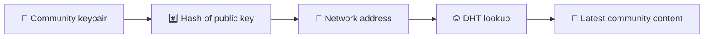
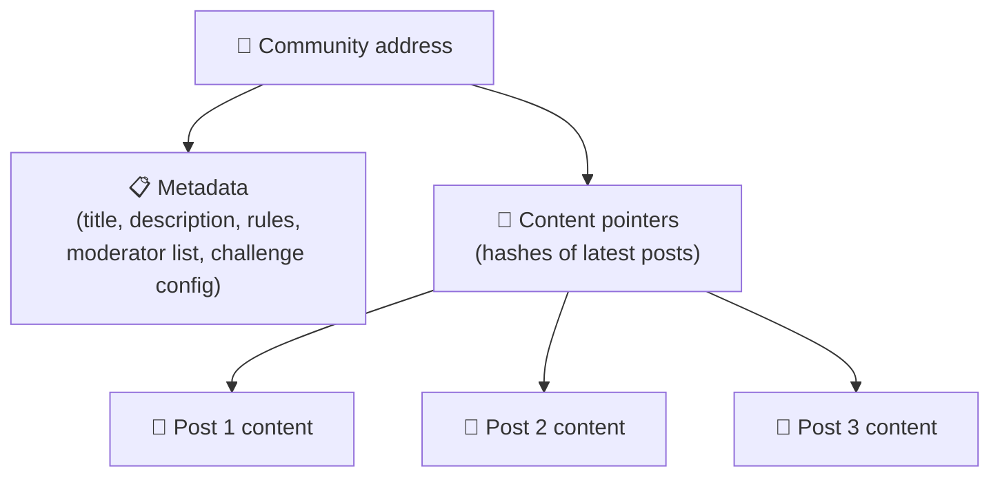
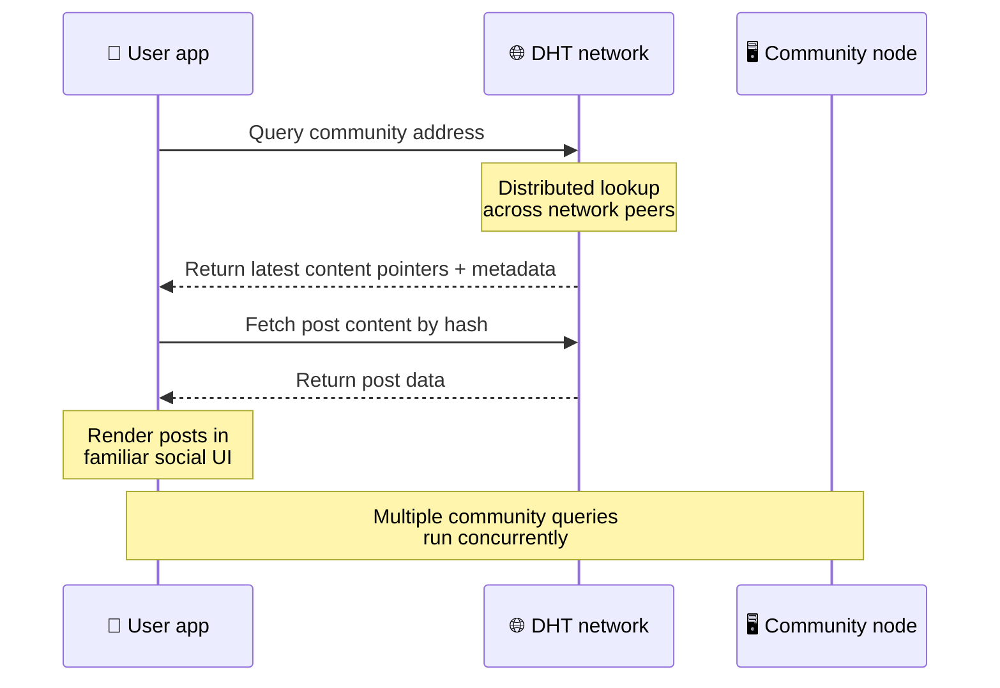
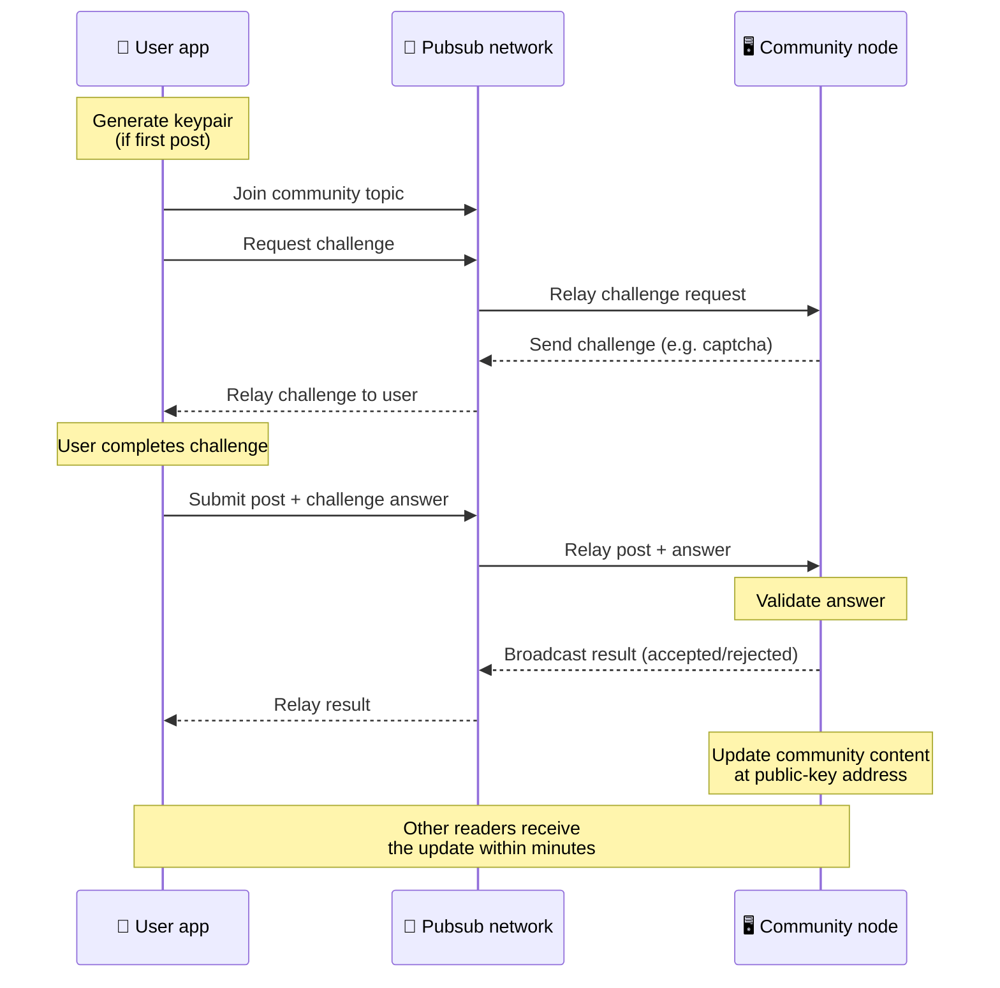
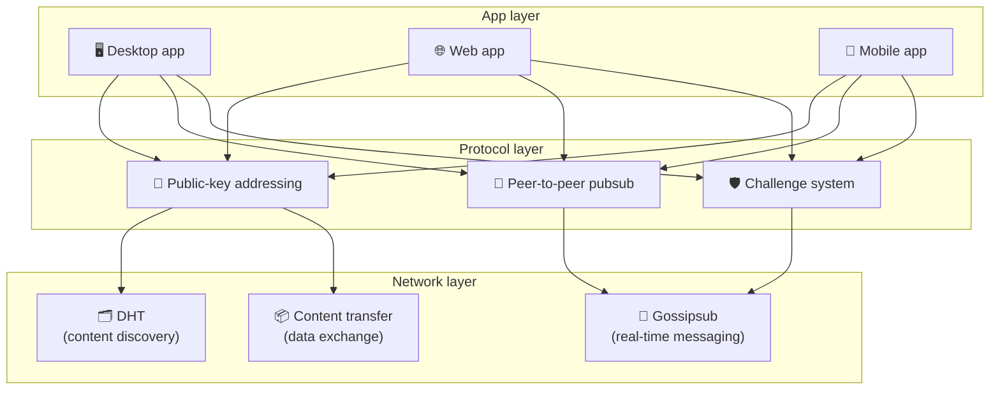

# Protocolo de igual a igual

Bitsocial no utiliza una cadena de bloques, un servidor de federación ni un backend centralizado. En lugar de eso, combina dos ideas (**direccionamiento basado en clave pública** y **pubsub de igual a igual**) para permitir que cualquiera albergue una comunidad desde hardware de consumo mientras los usuarios leen y publican sin cuentas en cualquier servicio controlado por la empresa.

Para un tutorial menos técnico, lea [Una explicación completa y sencilla del protocolo Bitsocial.](./layman-protocol-explanation.md).

## Los dos problemas

Una red social descentralizada tiene que responder dos preguntas:

1. **Datos**: ¿cómo se almacena y sirve el contenido social del mundo sin una base de datos central?
2. **Spam**: ¿cómo se puede evitar el abuso y al mismo tiempo mantener la red libre de uso?

Bitsocial resuelve el problema de los datos al saltarse la cadena de bloques por completo: las redes sociales no necesitan pedidos de transacciones globales ni disponibilidad permanente de cada publicación antigua. Resuelve el problema del spam al permitir que cada comunidad ejecute su propio desafío antispam a través de la red peer-to-peer.

Para el modelo de descubrimiento por encima de esta capa de red, consulta [Descubrimiento de contenido](./content-discovery.md).

---

## Direccionamiento basado en clave pública

En BitTorrent, el hash de un archivo se convierte en su dirección (_direccionamiento basado en contenido_). Bitsocial utiliza una idea similar con las claves públicas: el hash de la clave pública de una comunidad se convierte en su dirección de red.

Cualquier par en la red puede realizar una consulta DHT (tabla hash distribuida) para esa dirección y recuperar el estado más reciente de la comunidad. Cada vez que se actualiza el contenido, aumenta su número de versión. La red solo conserva la última versión; no es necesario preservar cada estado histórico, que es lo que hace que este enfoque sea liviano en comparación con una cadena de bloques.

### Qué se almacena en la dirección

La dirección de la comunidad no incluye directamente el contenido completo de la publicación. En lugar de eso, almacena una lista de identificadores de contenido: hashes que apuntan a los datos reales. Luego, el cliente recupera cada contenido a través de DHT o búsquedas de estilo rastreador.

Al menos un par siempre tiene los datos: el nodo del operador de la comunidad. Si la comunidad es popular, muchos otros compañeros también la tendrán y la carga se distribuye sola, de la misma manera que los torrents populares se descargan más rápido.

---

## Pubsub de igual a igual

Pubsub (publicar-suscribir) es un patrón de mensajería en el que los pares se suscriben a un tema y reciben todos los mensajes publicados en ese tema. Bitsocial utiliza una red pubsub de igual a igual: cualquiera puede publicar, cualquiera puede suscribirse y no existe un intermediario de mensajes central.

Para publicar una publicación en una comunidad, un usuario publica un mensaje cuyo tema es igual a la clave pública de la comunidad. El nodo del operador de la comunidad lo recoge, lo valida y, si supera el desafío antispam, lo incluye en la siguiente actualización de contenido.

---

## Antispam: desafíos sobre pubsub

Una red pubsub abierta es vulnerable a inundaciones de spam. Bitsocial resuelve esto exigiendo a los editores que completen un **desafío** antes de que se acepte su contenido.

El sistema de desafío es flexible: cada operador comunitario configura su propia política. Las opciones incluyen:

| Tipo de desafío          | Cómo funciona                                                 |
| ------------------------ | ------------------------------------------------------------- |
| **Captcha**              | Rompecabezas visual o interactivo presentado en la aplicación |
| **Limitación de tasa**   | Limitar publicaciones por ventana de tiempo por identidad     |
| **Puerta de token**      | Requerir prueba de saldo de un token específico               |
| **Pago**                 | Requerir un pequeño pago por publicación                      |
| **Lista de permitidos**  | Sólo las identidades previamente aprobadas pueden publicar    |
| **Código personalizado** | Cualquier política expresable en código                       |

Los pares que transmiten demasiados intentos fallidos de desafío son bloqueados del tema pubsub, lo que evita ataques de denegación de servicio en la capa de red.

---

## Ciclo de vida: leer una comunidad

Esto es lo que sucede cuando un usuario abre la aplicación y ve las últimas publicaciones de una comunidad.

**Paso a paso:**

1. El usuario abre la aplicación y ve una interfaz social.
2. El cliente se une a la red peer-to-peer y realiza una consulta DHT para cada comunidad en la que el usuario
   sigue. Las consultas tardan unos segundos cada una, pero se ejecutan simultáneamente.
3. Cada consulta devuelve los últimos metadatos y sugerencias de contenido de la comunidad (título, descripción,
   lista de moderadores, configuración del desafío).
4. El cliente obtiene el contenido real de la publicación utilizando esos punteros y luego representa todo en un
   interfaz social familiar.

---

## Ciclo de vida: publicar una publicación

La publicación implica un apretón de manos de desafío-respuesta a través de pubsub antes de que se acepte la publicación.

**Paso a paso:**

1. La aplicación genera un par de claves para el usuario si aún no tiene uno.
2. El usuario escribe una publicación para una comunidad.
3. El cliente se une al tema pubsub de esa comunidad (con la clave pública de la comunidad).
4. El cliente solicita un desafío a través de pubsub.
5. El nodo del operador de la comunidad devuelve un desafío (por ejemplo, un captcha).
6. El usuario completa el desafío.
7. El cliente envía la publicación junto con la respuesta al desafío a través de pubsub.
8. El nodo del operador comunitario valida la respuesta. Si es correcto se acepta el post.
9. El nodo transmite el resultado a través de pubsub para que los pares de la red sepan que deben continuar transmitiendo.
   mensajes de este usuario.
10. El nodo actualiza el contenido de la comunidad en su dirección de clave pública.
11. En unos minutos, todos los lectores de la comunidad reciben la actualización.

---

## Descripción general de la arquitectura

El sistema completo tiene tres capas que funcionan juntas:

| Capa           | Rol                                                                                                                                                                   |
| -------------- | --------------------------------------------------------------------------------------------------------------------------------------------------------------------- |
| **Aplicación** | Interfaz de usuario. Pueden existir varias aplicaciones, cada una con su propio diseño, y todas compartiendo las mismas comunidades e identidades.                    |
| **Protocolo**  | Define cómo se abordan las comunidades, cómo se publican las publicaciones y cómo se previene el spam.                                                                |
| **Red**        | La infraestructura peer-to-peer subyacente: DHT para descubrimiento, gossipsub para mensajería en tiempo real y transferencia de contenido para intercambio de datos. |

---

## Privacidad: desvincular autores de direcciones IP

Cuando un usuario publica una publicación, el contenido se **cifra con la clave pública del operador de la comunidad** antes de ingresar a la red pubsub. Esto significa que, si bien los observadores de la red pueden ver que un par publicó _algo_, no pueden determinar:

- lo que dice el contenido
- qué identidad del autor lo publicó

Esto es similar a cómo BitTorrent hace posible descubrir qué IP generan un torrent pero no quién lo creó originalmente. La capa de cifrado agrega una garantía de privacidad adicional a esa línea de base.

---

## Navegador punto a punto

El navegador P2P ahora es posible en los clientes de Bitsocial. Una aplicación de navegador puede ejecutar un nodo [helia](https://helia.io/), usar la misma pila de cliente de protocolo Bitsocial que otras aplicaciones y obtener contenido de sus pares en lugar de pedirle a una puerta de enlace IPFS centralizada que lo proporcione. El navegador también puede participar en pubsub directamente, por lo que la publicación no necesita un proveedor de pubsub propiedad de la plataforma en el camino feliz.

Este es un hito importante para la distribución web: un sitio web HTTPS normal puede abrirse en un cliente social P2P en vivo. Los usuarios no necesitan instalar una aplicación de escritorio antes de poder leer desde la red, y el operador de la aplicación no necesita ejecutar una puerta de enlace central que se convierta en el punto crítico de censura o moderación para cada usuario del navegador.

La ruta del navegador tiene límites diferentes a los de un nodo de escritorio o servidor:

- Por lo general, un nodo de navegador no puede aceptar conexiones entrantes arbitrarias desde la Internet pública.
- puede cargar, validar, almacenar en caché y publicar datos mientras la aplicación está abierta
- no debe ser tratado como el anfitrión de larga duración de los datos de una comunidad
- El hosting comunitario completo sigue siendo mejor manejado por una aplicación de escritorio, `bitsocial-cli`, u otra
  nodo siempre activo

Los enrutadores HTTP siguen siendo importantes para el descubrimiento de contenido: devuelven direcciones de proveedores para un hash comunitario. No son puertas de enlace IPFS porque no ofrecen el contenido en sí. Después del descubrimiento, el cliente del navegador se conecta con sus pares y recupera los datos a través de la pila P2P.

5chan expone esto como un interruptor de configuración avanzada opcional en la aplicación web normal 5chan.app. La última pila de navegador `pkc-js` se ha vuelto lo suficientemente estable para pruebas públicas después de que el trabajo de interoperabilidad libp2p/gossipsub abordó la entrega de mensajes entre pares Helia y Kubo. La configuración mantiene el navegador P2P controlado mientras realiza más pruebas en el mundo real; una vez que tenga suficiente confianza en la producción, puede convertirse en la ruta web predeterminada.

## Reserva de puerta de enlace

El acceso al navegador respaldado por puerta de enlace sigue siendo útil como respaldo de compatibilidad e implementación. Una puerta de enlace puede transmitir datos entre la red P2P y un cliente de navegador cuando un navegador no puede unirse a la red directamente o cuando la aplicación elige intencionalmente la ruta anterior. Estas puertas de enlace:

- puede ser dirigido por cualquiera
- no requiere cuentas de usuario ni pagos
- no obtenga la custodia de las identidades o comunidades de los usuarios
- se puede cambiar sin perder datos

La arquitectura de destino es primero P2P del navegador, con puertas de enlace como alternativa opcional en lugar del cuello de botella predeterminado.

---

## ¿Por qué no una cadena de bloques?

Las cadenas de bloques resuelven el problema del doble gasto: necesitan saber el orden exacto de cada transacción para evitar que alguien gaste la misma moneda dos veces.

Las redes sociales no tienen un problema de doble gasto. No importa si la publicación A se publicó un milisegundo antes que la publicación B, y no es necesario que las publicaciones antiguas estén disponibles permanentemente en todos los nodos.

Al saltarse la cadena de bloques, Bitsocial evita:

- **tarifas de gasolina** — la publicación es gratuita
- **límites de rendimiento**: sin cuellos de botella en el tamaño del bloque ni en el tiempo del bloque
- **inflación de almacenamiento**: los nodos solo conservan lo que necesitan
- **gastos generales de consenso**: no se requieren mineros, validadores ni apuestas

La desventaja es que Bitsocial no garantiza la disponibilidad permanente del contenido antiguo. Pero para las redes sociales, esa es una compensación aceptable: el nodo del operador de la comunidad contiene los datos, el contenido popular se difunde entre muchos pares y las publicaciones muy antiguas se desvanecen naturalmente, de la misma manera que sucede en todas las plataformas sociales.

## ¿Por qué no la federación?

Las redes federadas (como el correo electrónico o las plataformas basadas en ActivityPub) mejoran la centralización pero aún tienen limitaciones estructurales:

- **Dependencia del servidor**: cada comunidad necesita un servidor con un dominio, TLS y funcionamiento continuo.
  mantenimiento
- **Confianza del administrador**: el administrador del servidor tiene control total sobre las cuentas y el contenido de los usuarios.
- **Fragmentación**: moverse entre servidores a menudo significa perder seguidores, historial o identidad.
- **Costo**: alguien tiene que pagar por el alojamiento, lo que genera presión hacia la consolidación.

El enfoque peer-to-peer de Bitsocial elimina por completo al servidor de la ecuación. Un nodo comunitario puede ejecutarse en una computadora portátil, una Raspberry Pi o un VPS económico. El operador controla la política de moderación pero no puede apoderarse de las identidades de los usuarios, porque las identidades están controladas por pares de claves, no otorgadas por el servidor.

---

## Resumen

Bitsocial se basa en dos primitivos: direccionamiento basado en clave pública para el descubrimiento de contenido y pubsub de igual a igual para comunicación en tiempo real. Juntos producen una red social donde:

- Las comunidades se identifican mediante claves criptográficas, no por nombres de dominio.
- El contenido se propaga entre pares como un torrent, no servido desde una única base de datos.
- La resistencia al spam es local para cada comunidad, no impuesta por una plataforma.
- los usuarios poseen sus identidades a través de pares de claves, no a través de cuentas revocables
- Todo el sistema se ejecuta sin servidores, cadenas de bloques ni tarifas de plataforma.
