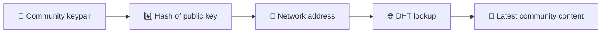
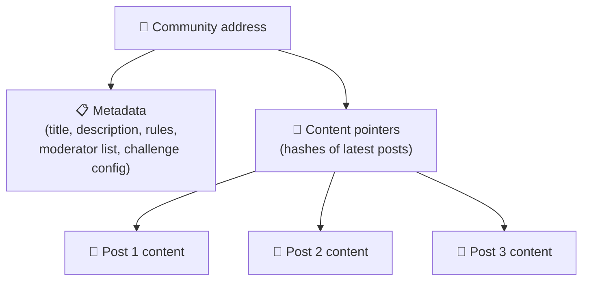
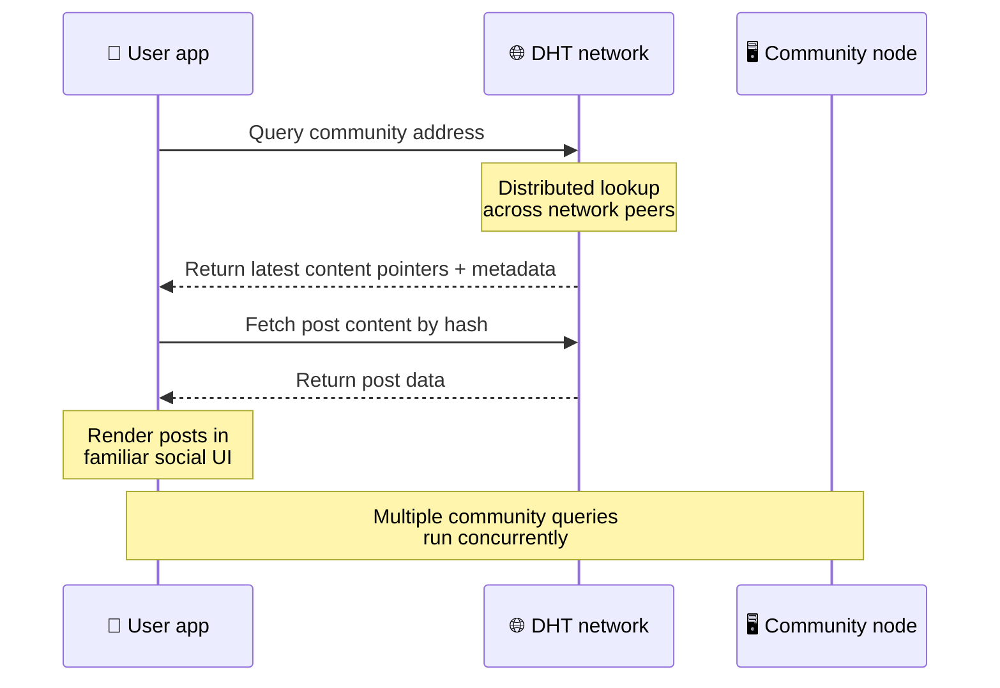
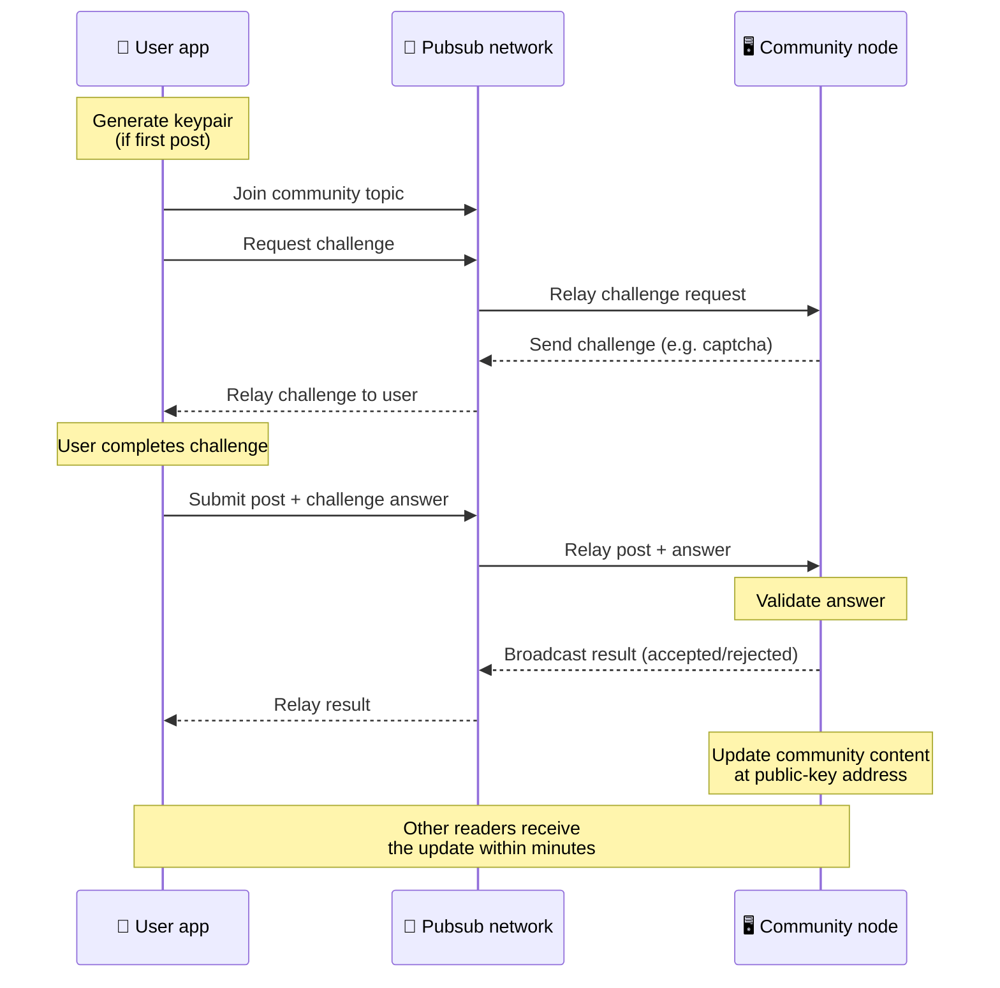
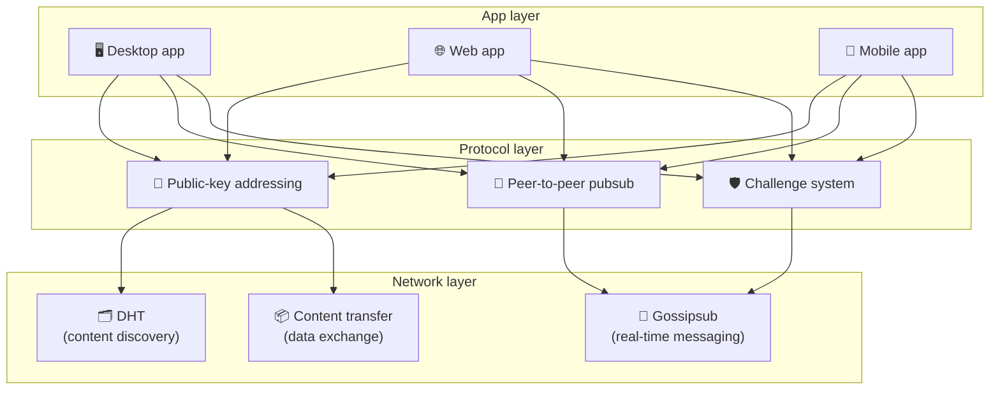

# پروتکل همتا به همتا

Bitsocial از بلاک چین، سرور فدراسیون یا باطن متمرکز استفاده نمی کند. درعوض، دو ایده را ترکیب می‌کند - **آدرس‌سازی مبتنی بر کلید عمومی** و **pubsub همتا به همتا** - به هر کسی اجازه می‌دهد یک انجمن را از سخت‌افزار مصرف‌کننده میزبانی کند در حالی که کاربران بدون حساب در هر سرویس تحت کنترل شرکت می‌خوانند و پست می‌کنند.

برای بررسی فنی کمتر، بخوانید [توضیح کاملی از پروتکل Bitsocial](./layman-protocol-explanation.md).

## دو مشکل

یک شبکه اجتماعی غیرمتمرکز باید به دو سوال پاسخ دهد:

1. **داده** — چگونه محتوای اجتماعی جهان را بدون پایگاه داده مرکزی ذخیره و ارائه می کنید؟
2. **هرزنامه** — چگونه از سوء استفاده جلوگیری می کنید و در عین حال شبکه را برای استفاده آزاد نگه می دارید؟

Bitsocial با نادیده گرفتن کامل بلاکچین مشکل داده را حل می کند: رسانه های اجتماعی به سفارش تراکنش جهانی یا در دسترس بودن دائمی هر پست قدیمی نیاز ندارند. مشکل هرزنامه را با اجازه دادن به هر جامعه ای حل می کند که چالش ضد هرزنامه خود را در شبکه همتا به همتا اجرا کند.

برای مدل کشف بالای این لایه شبکه، [کشف محتوای](./content-discovery.md) را ببینید.

---

## آدرس دهی مبتنی بر کلید عمومی

در BitTorrent، هش یک فایل به آدرس آن تبدیل می شود (_addressing مبتنی بر محتوا_). Bitsocial از ایده مشابهی در مورد کلیدهای عمومی استفاده می کند: هش کلید عمومی یک جامعه به آدرس شبکه آن تبدیل می شود.

هر همتا در شبکه می تواند یک جستار DHT (جدول هش توزیع شده) برای آن آدرس انجام دهد و آخرین وضعیت جامعه را بازیابی کند. هر بار که محتوا به روز می شود، تعداد نسخه آن افزایش می یابد. این شبکه فقط آخرین نسخه را نگه می‌دارد – نیازی به حفظ هر وضعیت تاریخی نیست، و همین باعث می‌شود این رویکرد در مقایسه با بلاک چین سبک وزن باشد.

### آنچه در آدرس ذخیره می شود

آدرس انجمن مستقیماً حاوی محتوای کامل پست نیست. در عوض فهرستی از شناسه‌های محتوا را ذخیره می‌کند - هش‌هایی که به داده‌های واقعی اشاره می‌کنند. سپس مشتری هر قسمت از محتوا را از طریق جستجوهای DHT یا به سبک ردیاب واکشی می کند.

حداقل یک همتا همیشه داده را دارد: گره اپراتور جامعه. اگر انجمن محبوب باشد، بسیاری از همتایان دیگر نیز آن را خواهند داشت و بار خود به خود توزیع می‌شود، همان‌طور که تورنت‌های محبوب سریع‌تر دانلود می‌شوند.

---

## میخانه همتا به همتا

Pubsub (انتشار-اشتراک) یک الگوی پیام رسانی است که در آن همتایان در یک موضوع مشترک می شوند و هر پیام منتشر شده در آن موضوع را دریافت می کنند. Bitsocial از یک شبکه همتا به همتا pubsub استفاده می کند - هر کسی می تواند منتشر کند، هر کسی می تواند مشترک شود، و هیچ واسطه پیام مرکزی وجود ندارد.

برای انتشار یک پست در یک انجمن، یک کاربر پیامی را منتشر می کند که موضوع آن برابر با کلید عمومی انجمن است. گره اپراتور جامعه آن را انتخاب می‌کند، آن را تأیید می‌کند، و - اگر از چالش ضد هرزنامه عبور کند - آن را در به‌روزرسانی محتوای بعدی گنجانده است.

---

## ضد هرزنامه: چالش ها در pubsub

یک شبکه میخانه باز در برابر سیل هرزنامه ها آسیب پذیر است. Bitsocial این مشکل را با درخواست از ناشران برای تکمیل یک **چالش** قبل از پذیرش محتوای آنها حل می کند.

سیستم چالش انعطاف پذیر است: هر اپراتور جامعه خط مشی خود را پیکربندی می کند. گزینه ها عبارتند از:

| نوع چالش        | چگونه کار می کند                              |
| --------------- | --------------------------------------------- |
| **کپچا**        | پازل بصری یا تعاملی ارائه شده در برنامه       |
| **محدودیت نرخ** | محدود کردن پست ها در پنجره زمانی به ازای هویت |
| **دروازه رمز**  | نیاز به اثبات موجودی یک نشانه خاص             |
| **پرداخت**      | نیاز به پرداخت اندکی برای هر پست              |
| **لیست مجاز**   | فقط هویت های از پیش تأیید شده می توانند پست   |
| **کد سفارشی**   | هر خط مشی قابل بیان در کد                     |

همتاهایی که بسیاری از تلاش‌های ناموفق چالش را ارسال می‌کنند، از موضوع pubsub مسدود می‌شوند، که از حملات انکار سرویس در لایه شبکه جلوگیری می‌کند.

---

## چرخه زندگی: خواندن یک جامعه

این چیزی است که زمانی اتفاق می افتد که کاربر برنامه را باز می کند و آخرین پست های یک انجمن را مشاهده می کند.

**گام به گام:**

1. کاربر برنامه را باز می کند و یک رابط اجتماعی را می بیند.
2. مشتری به شبکه همتا به همتا ملحق می شود و برای هر جامعه ای که کاربر است یک پرس و جو DHT ایجاد می کند
   را دنبال می کند. پرس و جوها هر کدام چند ثانیه طول می کشند اما همزمان اجرا می شوند.
3. هر پرس و جو آخرین نشانگرهای محتوای جامعه و ابرداده ها (عنوان، توضیحات،
   لیست تعدیل کننده، پیکربندی چالش).
4. مشتری محتوای پست واقعی را با استفاده از آن نشانگرها واکشی می کند، سپس همه چیز را در یک رندر می کند
   رابط اجتماعی آشنا

---

## چرخه حیات: انتشار یک پست

انتشار شامل یک دست دادن به چالش-پاسخ قبل از پذیرش پست در pubsub است.

**گام به گام:**

1. اگر کاربر هنوز یک جفت کلید نداشته باشد، این برنامه یک جفت کلید برای او ایجاد می کند.
2. کاربر یک پست برای یک انجمن می نویسد.
3. مشتری به موضوع pubsub برای آن انجمن می‌پیوندد (کلید کلید عمومی انجمن).
4. مشتری از طریق pubsub درخواست چالش می کند.
5. گره اپراتور جامعه یک چالش (مثلاً یک کپچا) را پس می فرستد.
6. کاربر چالش را کامل می کند.
7. مشتری پست را همراه با پاسخ چالش در pubsub ارسال می کند.
8. گره اپراتور جامعه پاسخ را تأیید می کند. در صورت صحت، پست پذیرفته می شود.
9. گره نتیجه را از طریق pubsub پخش می کند تا همتایان شبکه بدانند که به پخش ادامه دهند
   پیام های این کاربر
10. گره محتوای انجمن را در آدرس کلید عمومی خود به روز می کند.
11. در عرض چند دقیقه، هر خواننده جامعه این به روز رسانی را دریافت می کند.

---

## نمای کلی معماری

سیستم کامل دارای سه لایه است که با هم کار می کنند:

| لایه       | نقش                                                                                                                                                |
| ---------- | -------------------------------------------------------------------------------------------------------------------------------------------------- |
| **برنامه** | رابط کاربری. برنامه‌های متعددی می‌توانند وجود داشته باشند که هر کدام طراحی خاص خود را دارند و همگی جوامع و هویت‌های یکسانی را به اشتراک می‌گذارند. |
| **پروتکل** | نحوه آدرس دهی به انجمن ها، نحوه انتشار پست ها و جلوگیری از هرزنامه را مشخص می کند.                                                                 |
| **شبکه**   | زیرساخت‌های همتا به همتا: DHT برای کشف، gossip برای پیام‌رسانی هم‌زمان، و انتقال محتوا برای تبادل داده.                                            |

---

## حریم خصوصی: قطع ارتباط نویسندگان از آدرس های IP

هنگامی که کاربر پستی را منتشر می کند، محتوا قبل از ورود به شبکه pubsub با کلید عمومی اپراتور انجمن \*\* رمزگذاری می شود. این بدان معناست که در حالی که ناظران شبکه می‌توانند ببینند که همتا چیزی را منتشر کرده است، نمی‌توانند تعیین کنند:

- آنچه که محتوا می گوید
- هویت نویسنده آن را منتشر کرده است

این شبیه به روشی است که بیت تورنت این امکان را به شما می دهد که بفهمید کدام IP تورنت را ایجاد کرده است، اما نه اینکه چه کسی آن را ایجاد کرده است. لایه رمزگذاری یک ضمانت حفظ حریم خصوصی اضافی در بالای آن خط پایه اضافه می کند.

---

## مرورگر نظیر به نظیر

مرورگر P2P اکنون در مشتریان Bitsocial امکان پذیر است. یک برنامه مرورگر می‌تواند یک گره [هلیا](https://helia.io/) را اجرا کند، از همان پشته کلاینت پروتکل Bitsocial مانند سایر برنامه‌ها استفاده کند، و به جای درخواست از دروازه IPFS متمرکز برای ارائه محتوا، محتوا را از همتایان دریافت کند. مرورگر همچنین می‌تواند مستقیماً در pubsub شرکت کند، بنابراین پست کردن نیازی به یک پلتفرم در ارائه‌دهنده مسیر شاد pubsub ندارد.

این نقطه عطف مهم برای توزیع وب است: یک وب سایت HTTPS معمولی می تواند به یک مشتری اجتماعی P2P زنده باز شود. کاربران قبل از اینکه بتوانند از شبکه بخوانند، نیازی به نصب یک برنامه دسکتاپ ندارند، و اپراتور برنامه نیازی به اجرای یک دروازه مرکزی که برای هر کاربر مرورگر سانسور یا تعدیل می شود، ندارد.

مسیر مرورگر دارای محدودیت های متفاوتی نسبت به گره دسکتاپ یا سرور است:

- یک گره مرورگر معمولاً نمی تواند اتصالات ورودی دلخواه از اینترنت عمومی را بپذیرد
- می‌تواند در زمانی که برنامه باز است، داده‌ها را بارگیری، اعتبارسنجی، حافظه پنهان و انتشار دهد
- نباید به عنوان میزبان طولانی مدت برای داده های یک جامعه در نظر گرفته شود
- میزبانی کامل جامعه هنوز به بهترین وجه توسط یک برنامه دسکتاپ، `bitsocial-cli` یا برنامه دیگر مدیریت می شود.
  گره همیشه روشن

روترهای HTTP هنوز برای کشف محتوا اهمیت دارند: آنها آدرس های ارائه دهنده را برای یک هش جامعه برمی گرداند. آنها دروازه های IPFS نیستند، زیرا خود محتوا را ارائه نمی دهند. پس از کشف، مشتری مرورگر به همتایان متصل می شود و داده ها را از طریق پشته P2P واکشی می کند.

5chan این را به عنوان یک سوئیچ تنظیمات پیشرفته در برنامه عادی وب 5chan.app نشان می‌دهد. آخرین پشته مرورگر `pkc-js` به اندازه کافی برای آزمایش عمومی پس از انجام کار interop بالادستی libp2p/gossipsub که به تحویل پیام بین همتایان Helia و Kubo پرداخته است، پایدار شده است. این تنظیمات مرورگر P2P را کنترل می‌کند در حالی که آزمایش‌های بیشتری در دنیای واقعی انجام می‌شود. هنگامی که اطمینان تولید کافی داشته باشد، می تواند به مسیر وب پیش فرض تبدیل شود.

## بازگشتی دروازه

دسترسی مرورگر مبتنی بر Gateway هنوز به عنوان یک سازگاری و نسخه جایگزین مفید است. زمانی که مرورگر نمی تواند مستقیماً به شبکه بپیوندد یا زمانی که برنامه عمداً مسیر قدیمی را انتخاب می کند، یک دروازه می تواند داده ها را بین شبکه P2P و مشتری مرورگر انتقال دهد. این دروازه ها:

- می تواند توسط هر کسی اداره شود
- نیازی به حساب کاربری یا پرداخت ندارید
- حضانت هویت یا جوامع کاربر را به دست نیاورید
- را می توان بدون از دست دادن داده ها تعویض کرد

معماری هدف ابتدا مرورگر P2P است، با دروازه ها به عنوان یک بازگشت اختیاری به جای گلوگاه پیش فرض.

---

## چرا بلاک چین نیست؟

بلاک چین ها مشکل دوبار خرج کردن را حل می کنند: آنها باید ترتیب دقیق هر تراکنش را بدانند تا از مصرف دوبار یک سکه جلوگیری کنند.

شبکه های اجتماعی مشکل دوبرابر خرج کردن ندارند. مهم نیست که پست A یک میلی ثانیه قبل از پست B منتشر شده باشد، و پست های قدیمی نیازی به در دسترس بودن دائمی در هر گره ندارند.

با پرش از بلاک چین، Bitsocial از:

- **هزینه گاز** — ارسال رایگان است
- **محدودیت های توان عملیاتی ** - بدون اندازه بلوک یا گلوگاه زمانی بلوک
- **نفخ ذخیره سازی** - گره ها فقط آنچه را که نیاز دارند نگه می دارند
- **سربار اجماع ** - نیازی به ماینرها، اعتباردهنده ها یا شرط بندی نیست

معامله این است که Bitsocial در دسترس بودن دائمی محتوای قدیمی را تضمین نمی کند. اما برای رسانه‌های اجتماعی، این یک مبادله قابل قبول است: گره اپراتور جامعه داده‌ها را نگه می‌دارد، محتوای پرطرفدار در بسیاری از همتایان پخش می‌شود، و پست‌های بسیار قدیمی به طور طبیعی محو می‌شوند - به همان روشی که در هر پلتفرم اجتماعی انجام می‌دهند.

## چرا فدراسیون نه؟

شبکه‌های فدرال (مانند ایمیل یا پلتفرم‌های مبتنی بر ActivityPub) در تمرکز بهبود می‌یابند، اما همچنان محدودیت‌های ساختاری دارند:

- **وابستگی به سرور** - هر جامعه به یک سرور با دامنه، TLS و در حال انجام نیاز دارد
  تعمیر و نگهداری
- **اعتماد مدیر** — مدیر سرور کنترل کاملی بر حساب های کاربری و محتوا دارد
- **تجزیه** - جابجایی بین سرورها اغلب به معنای از دست دادن فالوورها، تاریخچه یا هویت است
- **هزینه** - کسی باید برای میزبانی هزینه کند، که باعث ایجاد فشار برای ادغام می شود

رویکرد Peer-to-Peer Bitsocial سرور را به طور کامل از معادله حذف می کند. یک گره اجتماعی می تواند بر روی یک لپ تاپ، یک Raspberry Pi یا یک VPS ارزان اجرا شود. اپراتور خط‌مشی تعدیل را کنترل می‌کند اما نمی‌تواند هویت کاربر را ضبط کند، زیرا هویت‌ها توسط جفت کلید کنترل می‌شوند، نه توسط سرور.

---

## خلاصه

Bitsocial بر اساس دو اصل اولیه ساخته شده است: آدرس‌دهی مبتنی بر کلید عمومی برای کشف محتوا و همتا به همتا pubsub برای ارتباطات بلادرنگ. آنها با هم یک شبکه اجتماعی تولید می کنند که در آن:

- جوامع با کلیدهای رمزنگاری شناسایی می شوند، نه نام دامنه
- محتوا مانند یک تورنت در سراسر همتایان پخش می شود، نه از یک پایگاه داده واحد
- مقاومت در برابر هرزنامه محلی برای هر جامعه است، نه توسط یک پلت فرم تحمیل شده است
- کاربران هویت خود را از طریق جفت‌های کلید دارند، نه از طریق حساب‌های قابل فسخ
- کل سیستم بدون سرور، بلاک چین یا هزینه پلتفرم اجرا می شود
