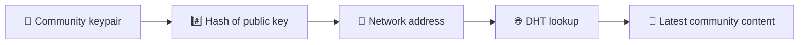
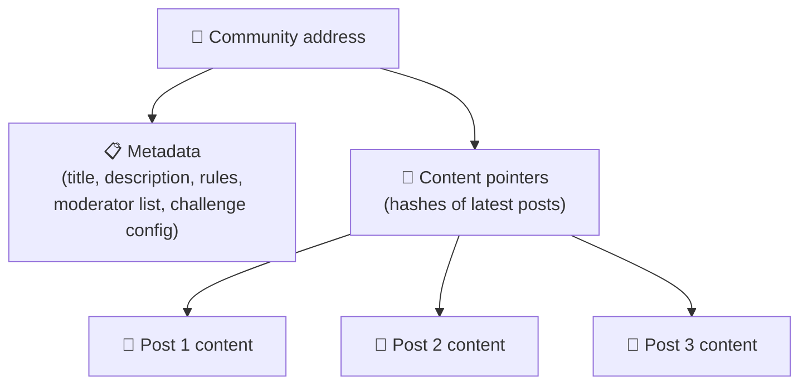
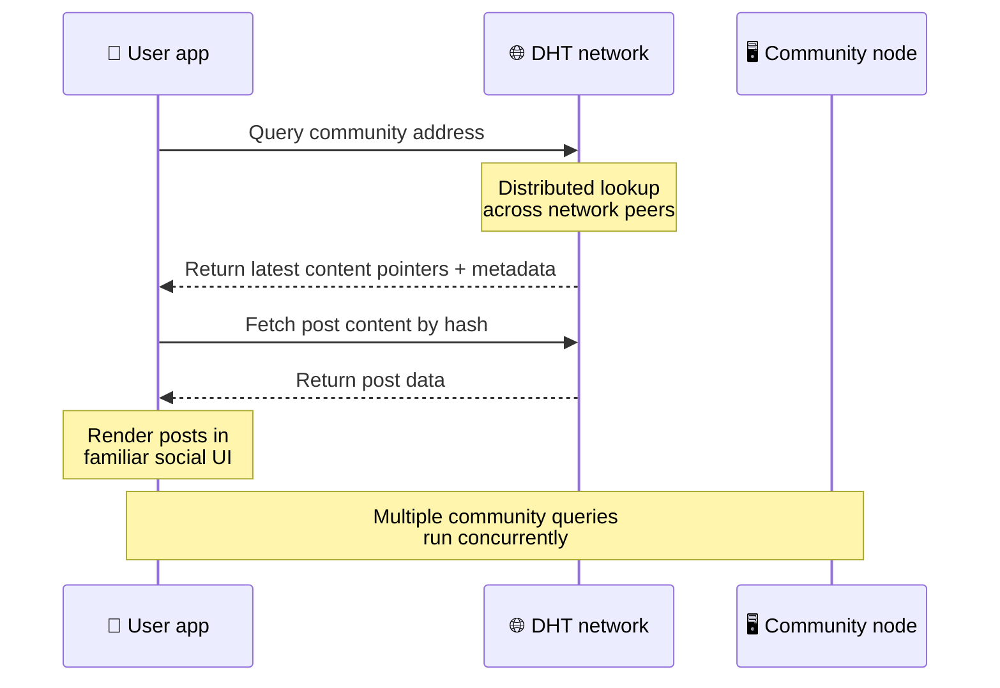
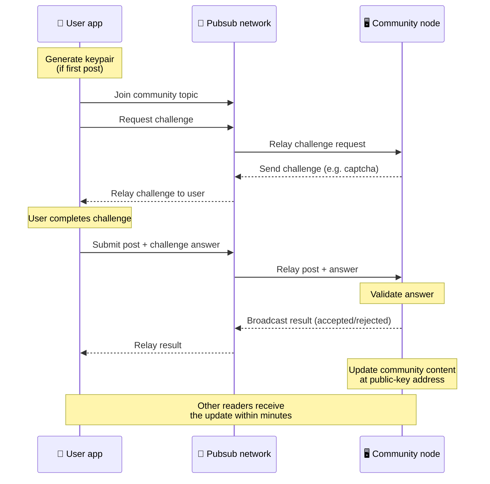
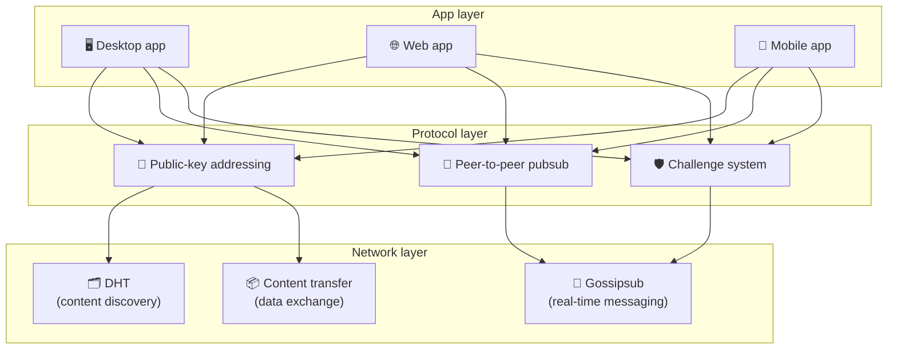

# Peer-to-Peer-protokolla

Bitsocial ei käytä lohkoketjua, liitospalvelinta tai keskitettyä taustajärjestelmää. Sen sijaan se yhdistää kaksi ideaa – **julkiseen avaimeen perustuva osoitus** ja **vertaispub** – joiden avulla kuka tahansa voi isännöidä yhteisöä kuluttajalaitteiston kautta, kun käyttäjät lukevat ja julkaisevat ilman tilejä yrityksen ohjaamissa palveluissa.

Lue vähemmän tekninen esittely [Täydellinen maallikon selitys Bitsocial-protokollasta](./layman-protocol-explanation.md).

## Kaksi ongelmaa

Hajautetun sosiaalisen verkoston on vastattava kahteen kysymykseen:

1. **Data** — miten tallennat ja palvelet maailman sosiaalista sisältöä ilman keskustietokantaa?
2. **Roskaposti** — miten estät väärinkäytön ja pidät verkon vapaana?

Bitsocial ratkaisee dataongelman ohittamalla lohkoketjun kokonaan: sosiaalinen media ei tarvitse globaalia tapahtumajärjestystä tai jokaisen vanhan postauksen pysyvää saatavuutta. Se ratkaisee roskapostiongelman antamalla jokaisen yhteisön suorittaa oman roskapostin estohaasteensa vertaisverkon kautta.

Tämän verkkokerroksen yläpuolella olevasta etsintämallista löytyy [Sisällön löytäminen](./content-discovery.md).

---

## Julkiseen avaimeen perustuva osoitus

BitTorrentissa tiedoston tiivisteestä tulee sen osoite (_sisältöpohjainen osoite_). Bitsocial käyttää samanlaista ideaa julkisten avainten kanssa: yhteisön julkisen avaimen tiivisteestä tulee sen verkko-osoite.

Mikä tahansa verkon vertaiskäyttäjä voi suorittaa DHT-kyselyn (jaettu hash-taulukko) kyseiselle osoitteelle ja hakea yhteisön viimeisimmän tilan. Joka kerta kun sisältöä päivitetään, sen versionumero kasvaa. Verkko säilyttää vain uusimman version – jokaista historiallista tilaa ei tarvitse säilyttää, mikä tekee tästä lähestymistavasta kevyen lohkoketjuun verrattuna.

### Mitä osoitteeseen tallennetaan

Yhteisön osoite ei sisällä suoraan koko viestin sisältöä. Sen sijaan se tallentaa luettelon sisältötunnisteista – tiivisteistä, jotka osoittavat todellisiin tietoihin. Asiakas hakee sitten jokaisen sisällön DHT- tai tracker-tyyppisten hakujen kautta.

Ainakin yhdellä vertaisella on aina tiedot: yhteisön operaattorin solmu. Jos yhteisö on suosittu, myös monilla muilla vertaisilla on se ja kuorma jakautuu itsestään, samalla tavalla kuin suositut torrentit ovat nopeampia ladata.

---

## Vertaispubi

Pubsub (julkaisu-tilaa) on viestimalli, jossa kumppanit tilaavat aiheen ja saavat kaikki kyseiseen aiheeseen julkaistut viestit. Bitsocial käyttää peer-to-peer pub-verkkoa – kuka tahansa voi julkaista, kuka tahansa voi tilata, eikä siellä ole keskitettyä viestivälittäjää.

Julkaistakseen julkaisun yhteisölle käyttäjä julkaisee viestin, jonka aihe vastaa yhteisön julkista avainta. Yhteisön operaattorin solmu poimii sen, vahvistaa sen ja – jos se läpäisee roskapostin estohaasteen – sisällyttää sen seuraavaan sisältöpäivitykseen.

---

## Roskapostin esto: haasteita pubissa

Avoin pubiverkko on alttiina roskapostitulville. Bitsocial ratkaisee tämän vaatimalla julkaisijoita suorittamaan **haasteen** ennen kuin heidän sisältönsä hyväksytään.

Haastejärjestelmä on joustava: jokainen yhteisön toimija määrittää oman käytäntönsä. Vaihtoehtoja ovat:

| Haastetyyppi             | Miten se toimii                                          |
| ------------------------ | -------------------------------------------------------- |
| **Captcha**              | Visuaalinen tai interaktiivinen palapeli sovelluksessa   |
| **Korkearajoitus**       | Rajoita viestejä aikaikkunaa kohti identiteettiä kohti   |
| **Token Gate**           | Vaadi todistus tietyn tunnuksen saldosta                 |
| **Maksu**                | Vaadi pieni maksu postia kohden                          |
| **Sallittujen luettelo** | Vain ennalta hyväksytyt henkilöllisyydet voivat lähettää |
| **Muokattu koodi**       | Mikä tahansa koodissa                                    |

Liian monta epäonnistunutta haasteyritystä välittävät vertaiskäyttäjät estetään pubsub-aiheesta, mikä estää palvelunestohyökkäykset verkkokerrokseen.

---

## Elinkaari: yhteisön lukeminen

Näin tapahtuu, kun käyttäjä avaa sovelluksen ja katselee yhteisön uusimpia viestejä.

**Askel askeleelta:**

1. Käyttäjä avaa sovelluksen ja näkee sosiaalisen käyttöliittymän.
2. Asiakas liittyy peer-to-peer-verkkoon ja tekee DHT-kyselyn jokaiselle käyttäjäyhteisölle
   seuraa. Kyselyt vievät kukin muutaman sekunnin, mutta ne suoritetaan samanaikaisesti.
3. Jokainen kysely palauttaa yhteisön uusimmat sisältöosoittimet ja metatiedot (otsikko, kuvaus,
   moderaattoriluettelo, haastekokoonpano).
4. Asiakas hakee todellisen viestin sisällön näiden osoittimien avulla ja hahmontaa sitten kaiken a
   tuttu sosiaalinen käyttöliittymä.

---

## Elinkaari: postauksen julkaiseminen

Julkaisemiseen kuuluu haaste-vastaus-kättely pubsubissa ennen julkaisun hyväksymistä.

**Askel askeleelta:**

1. Sovellus luo avainparin käyttäjälle, jos hänellä ei vielä ole sellaista.
2. Käyttäjä kirjoittaa julkaisun yhteisölle.
3. Asiakas liittyy kyseisen yhteisön pub-aiheeseen (avaimella yhteisön julkiseen avaimeen).
4. Asiakas pyytää haastetta pubin kautta.
5. Yhteisön operaattorin solmu lähettää takaisin haasteen (esimerkiksi captcha).
6. Käyttäjä suorittaa haasteen.
7. Asiakas lähettää julkaisun haastevastauksen kanssa pubsub-palvelun kautta.
8. Yhteisön operaattorin solmu vahvistaa vastauksen. Jos oikein, viesti hyväksytään.
9. Solmu lähettää tuloksen pubsubin kautta, jotta verkon vertaiskäyttäjät tietävät jatkavansa välittämistä
   viestit tältä käyttäjältä.
10. Solmu päivittää yhteisön sisällön julkisen avaimen osoitteeseen.
11. Muutamassa minuutissa jokainen yhteisön lukija saa päivityksen.

---

## Arkkitehtuurin yleiskatsaus

Koko järjestelmässä on kolme kerrosta, jotka toimivat yhdessä:

| Kerros         | Rooli                                                                                                                               |
| -------------- | ----------------------------------------------------------------------------------------------------------------------------------- |
| **Sovellus**   | Käyttöliittymä. Voi olla useita sovelluksia, joista jokaisella on oma muotoilu, ja kaikilla on samat yhteisöt ja identiteetit.      |
| **Pöytäkirja** | Määrittää, kuinka yhteisöjä käsitellään, miten viestit julkaistaan ​​ja kuinka roskapostia estetään.                                |
| **Verkko**     | Taustalla oleva peer-to-peer-infrastruktuuri: DHT etsimiseen, gossipsub reaaliaikaiseen viestiin ja sisällön siirto tiedonvaihtoon. |

---

## Tietosuoja: tekijöiden linkityksen poistaminen IP-osoitteista

Kun käyttäjä julkaisee viestin, sisältö **salataan yhteisön operaattorin julkisella avaimella** ennen kuin se saapuu pub-verkkoon. Tämä tarkoittaa, että vaikka verkon tarkkailijat voivat nähdä, että vertaiskäyttäjä julkaisi _jotain_, he eivät voi määrittää:

- mitä sisältö kertoo
- mikä tekijän henkilöllisyys sen julkaisi

Tämä on samanlainen tapa kuin BitTorrentin avulla on mahdollista selvittää, mitkä IP-osoitteet synnyttävät torrentin, mutta ei kuka sen alun perin loi. Salauskerros lisää ylimääräisen tietosuojatakuun perustason päälle.

---

## Selaimen vertaisverkko

Selain P2P on nyt mahdollista Bitsocial-asiakkaissa. Selainsovellus voi suorittaa [Helia](https://helia.io/)-solmun, käyttää samaa Bitsocial-protokollaasiakaspinoa kuin muut sovellukset ja hakea sisältöä vertaisilta sen sijaan, että se pyytäisi keskitettyä IPFS-yhdyskäytävää palvelemaan sitä. Selain voi myös osallistua suoraan pubsub-palveluun, joten postaukseen ei tarvita alustan omistamaa pubsub-palveluntarjoajaa onnellisen polun kautta.

Tämä on tärkeä virstanpylväs verkkojakelulle: normaali HTTPS-verkkosivusto voi avautua eläväksi P2P-sosiaaliseksi asiakkaaksi. Käyttäjien ei tarvitse asentaa työpöytäsovellusta ennen kuin he voivat lukea verkosta, eikä sovellusoperaattorin tarvitse käyttää keskusyhdyskäytävää, josta tulee jokaisen selaimen käyttäjän sensuurin tai moderoinnin rajoituspiste.

Selainpolulla on erilaiset rajoitukset kuin työpöydällä tai palvelinsolmulla:

- selainsolmu ei yleensä voi hyväksyä mielivaltaisia ​​saapuvia yhteyksiä julkisesta Internetistä
- se voi ladata, vahvistaa, tallentaa välimuistiin ja julkaista tietoja sovelluksen ollessa auki
- sitä ei pitäisi käsitellä yhteisön tietojen pitkäikäisenä isäntänä
- koko yhteisöisännöinti onnistuu edelleen parhaiten työpöytäsovelluksella, `bitsocial-cli` tai muulla
  aina päällä oleva solmu

HTTP-reitittimillä on edelleen merkitystä sisällön löytämisessä: ne palauttavat palveluntarjoajan osoitteet yhteisön hashille. Ne eivät ole IPFS-yhdyskäytäviä, koska ne eivät palvele itse sisältöä. Löytämisen jälkeen selainasiakas muodostaa yhteyden vertaisverkkoihin ja hakee tiedot P2P-pinon kautta.

5chan paljastaa tämän valinnaisena Lisäasetukset-kytkimenä tavallisessa 5chan.app-verkkosovelluksessa. Uusimmasta `pkc-js`-selainpinosta on tullut riittävän vakaa julkista testausta varten sen jälkeen, kun ylävirran libp2p/gossipsub-yhteistoimitus käsitteli viestien toimittamista Helian ja Kubon vertaisten välillä. Asetus pitää selaimen P2P-hallinnan samalla kun se saa enemmän todellista testausta; Kun sillä on tarpeeksi tuotantovarmuutta, siitä voi tulla oletusverkkopolku.

## Gateway-varaus

Yhdyskäytävätuettu selaimen käyttöoikeus on edelleen hyödyllinen yhteensopivuuden ja käyttöönoton vararatkaisuna. Yhdyskäytävä voi välittää tietoja P2P-verkon ja selainasiakkaan välillä, kun selain ei voi liittyä verkkoon suoraan tai kun sovellus valitsee tarkoituksella vanhemman polun. Nämä yhdyskäytävät:

- voi johtaa kuka tahansa
- eivät vaadi käyttäjätilejä tai maksuja
- älä saa käyttäjien identiteettejä tai yhteisöjä
- voidaan vaihtaa ilman tietojen menettämistä

Kohdearkkitehtuuri on selain P2P ensin, ja yhdyskäytävät ovat valinnainen varavaihtoehto oletuspullonkaulan sijaan.

---

## Miksei lohkoketju?

Lohkoketjut ratkaisevat kaksinkertaisen kulutuksen ongelman: niiden on tiedettävä jokaisen tapahtuman tarkka järjestys, jotta joku ei kuluttaisi samaa kolikkoa kahdesti.

Sosiaalisessa mediassa ei ole kaksinkertaisen kulutuksen ongelmaa. Ei ole väliä, jos viesti A julkaistiin millisekuntia ennen viestiä B, eikä vanhojen viestien tarvitse olla pysyvästi saatavilla jokaisessa solmussa.

Ohitamalla lohkoketjun Bitsocial välttää:

- **kaasumaksut** — postitus on ilmaista
- **suorituskykyrajoitukset** — ei lohkon kokoa tai lohkon ajan pullonkaulaa
- **säilytys bloat** — solmut säilyttävät vain tarvitsemansa
- **konsensuskulut** — ei vaadi kaivostyöläisiä, validaattoreita tai panostamista

Kompromissi on, että Bitsocial ei takaa vanhan sisällön pysyvää saatavuutta. Mutta sosiaalisen median kannalta se on hyväksyttävä kompromissi: yhteisön operaattorin solmu pitää tiedot hallussaan, suosittu sisältö leviää monien vertaisten kesken ja hyvin vanhat viestit haalistuvat luonnollisesti – samalla tavalla kuin kaikilla sosiaalisilla alustoilla.

## Miksei liitto?

Federoidut verkot (kuten sähköposti tai ActivityPub-pohjaiset alustat) parantavat keskittämistä, mutta niillä on silti rakenteellisia rajoituksia:

- **Palvelinriippuvuus** — jokainen yhteisö tarvitsee palvelimen, jossa on verkkotunnus, TLS ja jatkuva
  huolto
- **Järjestelmänvalvojan luottamus** — palvelimen järjestelmänvalvojalla on täysi määräysvalta käyttäjätileihin ja sisältöön
- **Fragmentoituminen** — palvelimien välillä siirtyminen tarkoittaa usein seuraajien, historian tai identiteetin menettämistä
- **Kustannus** — jonkun on maksettava isännöinnistä, mikä luo painetta konsolidointiin

Bitsocialin peer-to-peer-lähestymistapa poistaa palvelimen yhtälöstä kokonaan. Yhteisösolmu voi toimia kannettavalla tietokoneella, Raspberry Pi:llä tai halvalla VPS:llä. Operaattori hallitsee moderointikäytäntöä, mutta ei voi taata käyttäjien identiteettejä, koska identiteetit ovat avainparin ohjaamia, ei palvelimen myöntämiä.

---

## Yhteenveto

Bitsocial perustuu kahteen primitiiviin: julkiseen avaimeen perustuvaan osoitteeseen sisällön löytämiseen ja vertaispubiin reaaliaikaiseen viestintään. Yhdessä he tuottavat sosiaalisen verkoston, jossa:

- yhteisöt tunnistetaan salausavaimilla, ei verkkotunnuksilla
- sisältö leviää toistensa välillä kuin torrent, ei toimiteta yhdestä tietokannasta
- roskapostin vastustus on paikallista jokaiselle yhteisölle, ei alustan määräämä
- käyttäjät omistavat henkilöllisyytensä avainparien kautta, eivät peruutettavien tilien kautta
- koko järjestelmä toimii ilman palvelimia, lohkoketjuja tai alustamaksuja
