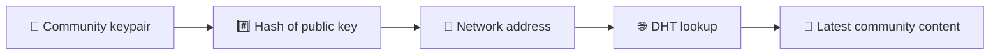
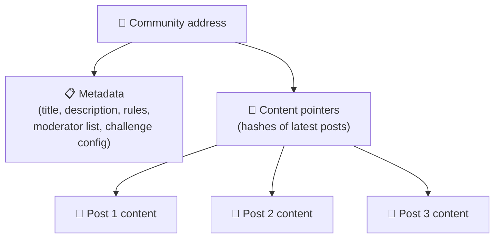
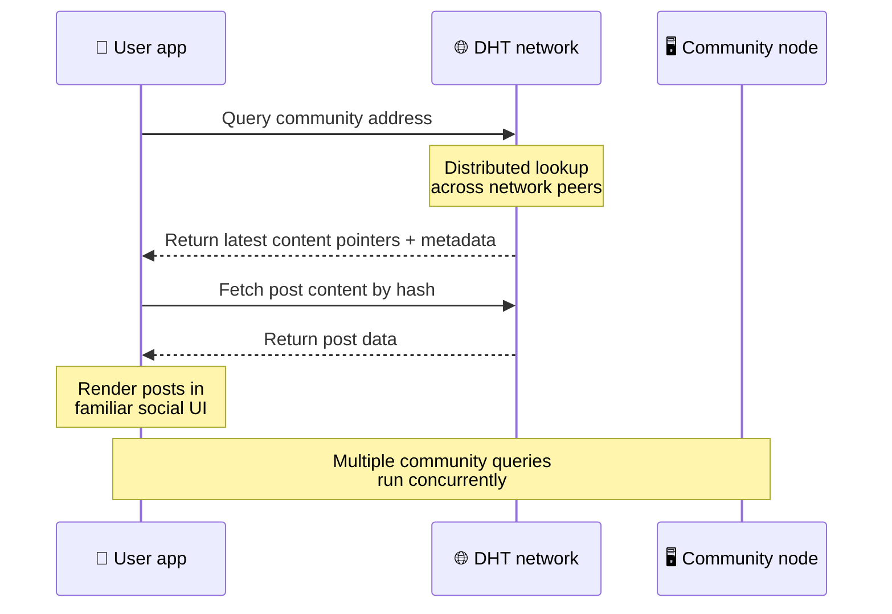
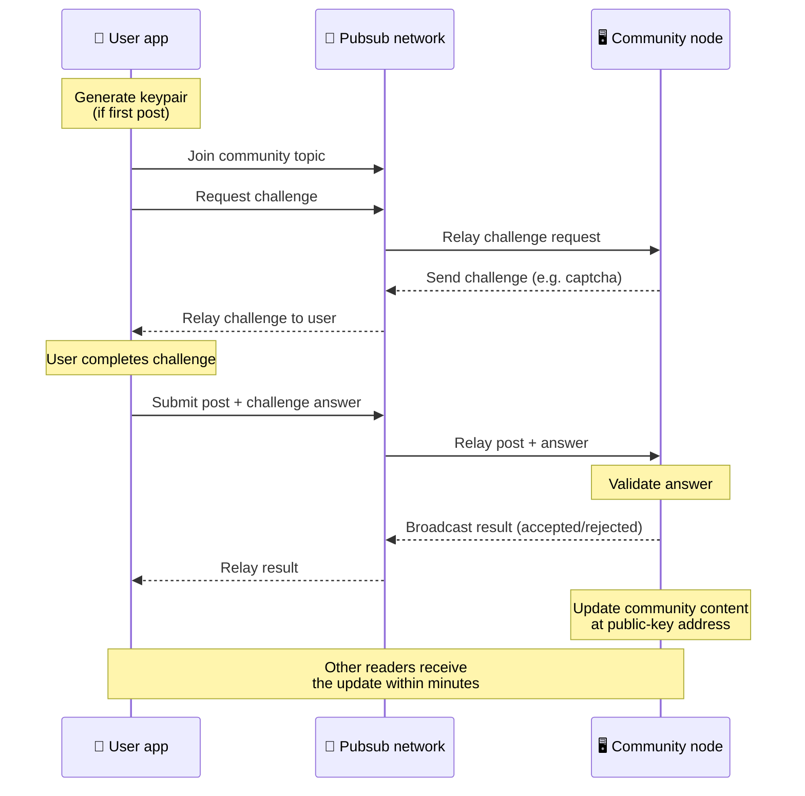
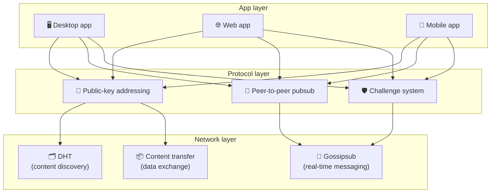

# Protokol ng Peer-to-Peer

Ang Bitsocial ay hindi gumagamit ng blockchain, federation server, o sentralisadong backend. Sa halip, pinagsasama nito ang dalawang ideya — **public-key-based addressing** at **peer-to-peer pubsub** — upang hayaan ang sinuman na mag-host ng isang komunidad mula sa consumer hardware habang ang mga user ay nagbabasa at nagpo-post nang walang mga account sa anumang serbisyong kontrolado ng kumpanya.

Para sa hindi gaanong teknikal na walkthrough, basahin [Isang kumpletong paliwanag ng karaniwang tao sa Bitsocial protocol](./layman-protocol-explanation.md).

## Ang dalawang problema

Ang isang desentralisadong social network ay kailangang sagutin ang dalawang tanong:

1. **Data** — paano ka mag-iimbak at maghahatid ng social content sa mundo nang walang central database?
2. **Spam** — paano mo mapipigilan ang pang-aabuso habang pinananatiling malayang gamitin ang network?

Nilulutas ng Bitsocial ang problema sa data sa pamamagitan ng paglaktaw sa blockchain nang buo: hindi kailangan ng social media ang pag-order ng pandaigdigang transaksyon o permanenteng pagkakaroon ng bawat lumang post. Niresolba nito ang problema sa spam sa pamamagitan ng pagpayag sa bawat komunidad na magpatakbo ng sarili nitong anti-spam na hamon sa peer-to-peer network.

Para sa modelo ng pagtuklas sa itaas ng network layer na ito, tingnan ang [Pagtuklas ng Nilalaman](./content-discovery.md).

---

## Pampublikong-key-based na addressing

Sa BitTorrent, ang hash ng file ay nagiging address nito (_content-based addressing_). Gumagamit ang Bitsocial ng katulad na ideya sa mga pampublikong key: ang hash ng pampublikong key ng isang komunidad ay nagiging address ng network nito.

Maaaring magsagawa ng DHT (distributed hash table) ang sinumang peer sa network para sa address na iyon at makuha ang pinakabagong estado ng komunidad. Sa tuwing ina-update ang content, tataas ang numero ng bersyon nito. Pinapanatili lamang ng network ang pinakabagong bersyon — hindi na kailangang pangalagaan ang bawat makasaysayang estado, na siyang dahilan kung bakit magaan ang diskarteng ito kumpara sa isang blockchain.

### Ano ang nakaimbak sa address

Ang address ng komunidad ay hindi naglalaman ng buong nilalaman ng post nang direkta. Sa halip, nag-iimbak ito ng listahan ng mga tagatukoy ng nilalaman — mga hash na tumuturo sa aktwal na data. Pagkatapos ay kinukuha ng kliyente ang bawat piraso ng nilalaman sa pamamagitan ng DHT o mga paghahanap sa istilo ng tracker.

Hindi bababa sa isang peer ang palaging may data: ang node ng operator ng komunidad. Kung sikat ang komunidad, maraming iba pang mga kapantay ang magkakaroon din nito at ang load ay namamahagi mismo, sa parehong paraan na mas mabilis ma-download ang mga sikat na torrents.

---

## Peer-to-peer na pubsub

Ang Pubsub (publish-subscribe) ay isang pattern ng pagmemensahe kung saan nag-subscribe ang mga kapantay sa isang paksa at natatanggap ang bawat mensaheng na-publish sa paksang iyon. Gumagamit ang Bitsocial ng isang peer-to-peer na pubsub network — sinuman ay maaaring mag-publish, sinuman ay maaaring mag-subscribe, at walang sentral na broker ng mensahe.

Upang mag-publish ng post sa isang komunidad, ang isang user ay nag-publish ng isang mensahe na ang paksa ay katumbas ng pampublikong key ng komunidad. Kinukuha ito ng node ng operator ng komunidad, pinapatunayan ito, at — kung papasa ito sa anti-spam na hamon — isasama ito sa susunod na pag-update ng nilalaman.

---

## Anti-spam: mga hamon sa pubsub

Ang isang bukas na network ng pubsub ay mahina sa pagbaha ng spam. Niresolba ito ng Bitsocial sa pamamagitan ng pag-aatas sa mga publisher na kumpletuhin ang isang **hamon** bago tanggapin ang kanilang nilalaman.

Ang sistema ng hamon ay nababaluktot: ang bawat operator ng komunidad ay nagko-configure ng kanilang sariling patakaran. Kasama sa mga opsyon ang:

| Uri ng hamon            | Paano ito gumagana                                                          |
| ----------------------- | --------------------------------------------------------------------------- |
| **Captcha**             | Visual o interactive na puzzle na ipinakita sa app                          |
| **Paglilimita sa rate** | Limitahan ang mga post sa bawat window ng oras bawat pagkakakilanlan        |
| **Token gate**          | Nangangailangan ng patunay ng balanse ng isang partikular na token          |
| **Pagbabayad**          | Nangangailangan ng maliit na pagbabayad sa bawat post                       |
| **Allowlist**           | Tanging mga pre-approved na pagkakakilanlan lamang ang maaaring mag-post ng |
| **Custom na code**      | Anumang patakarang maipahayag sa code                                       |

Ang mga kapantay na naghahatid ng napakaraming nabigong pagsubok sa paghamon ay naharang mula sa paksang pubsub, na pumipigil sa mga pag-atake ng pagtanggi sa serbisyo sa layer ng network.

---

## Lifecycle: pagbabasa ng isang komunidad

Ito ang nangyayari kapag binuksan ng isang user ang app at tiningnan ang mga pinakabagong post ng isang komunidad.

**Step by step:**

1. Binubuksan ng user ang app at nakakita ng isang social interface.
2. Sumasali ang kliyente sa peer-to-peer network at gumagawa ng DHT query para sa bawat komunidad ng user
   sumusunod. Ang mga query ay tumatagal ng ilang segundo bawat isa ngunit tumatakbo nang sabay-sabay.
3. Ibinabalik ng bawat query ang pinakabagong content pointer at metadata ng komunidad (pamagat, paglalarawan,
   listahan ng moderator, configuration ng hamon).
4. Kinukuha ng kliyente ang aktwal na nilalaman ng post gamit ang mga pointer na iyon, pagkatapos ay ire-render ang lahat sa a
   pamilyar na interface ng lipunan.

---

## Lifecycle: pag-publish ng post

Ang pag-publish ay nagsasangkot ng pakikipagkamay sa pagtugon sa hamon sa pubsub bago tanggapin ang post.

**Step by step:**

1. Bumubuo ang app ng keypair para sa user kung wala pa sila nito.
2. Nagsusulat ang user ng post para sa isang komunidad.
3. Ang kliyente ay sumali sa pubsub na paksa para sa komunidad na iyon (naka-key sa pampublikong susi ng komunidad).
4. Humihiling ang kliyente ng hamon sa pubsub.
5. Ang node ng operator ng komunidad ay nagpapadala ng isang hamon (halimbawa, isang captcha).
6. Nakumpleto ng user ang hamon.
7. Isusumite ng kliyente ang post kasama ang sagot sa hamon sa pubsub.
8. Pinapatunayan ng node ng operator ng komunidad ang sagot. Kung tama, tinatanggap ang post.
9. Ibina-broadcast ng node ang resulta sa pubsub para malaman ng mga kasamahan sa network na magpatuloy sa pag-relay
   mga mensahe mula sa user na ito.
10. Ina-update ng node ang nilalaman ng komunidad sa pampublikong-key address nito.
11. Sa loob ng ilang minuto, natatanggap ng bawat mambabasa ng komunidad ang update.

---

## Pangkalahatang-ideya ng arkitektura

Ang buong sistema ay may tatlong layer na nagtutulungan:

| Layer        | Tungkulin                                                                                                                                                                          |
| ------------ | ---------------------------------------------------------------------------------------------------------------------------------------------------------------------------------- |
| **App**      | User interface. Maaaring umiral ang maraming app, bawat isa ay may sariling disenyo, lahat ay nagbabahagi ng parehong mga komunidad at pagkakakilanlan.                            |
| **Protocol** | Tinutukoy kung paano tinutugunan ang mga komunidad, kung paano na-publish ang mga post, at kung paano pinipigilan ang spam.                                                        |
| **Network**  | Ang pinagbabatayan na imprastraktura ng peer-to-peer: DHT para sa pagtuklas, gossipsub para sa real-time na pagmemensahe, at paglilipat ng nilalaman para sa pagpapalitan ng data. |

---

## Privacy: pag-unlink ng mga may-akda mula sa mga IP address

Kapag ang isang user ay nag-publish ng isang post, ang nilalaman ay **naka-encrypt gamit ang pampublikong key ng operator ng komunidad** bago ito pumasok sa pubsub network. Nangangahulugan ito na habang nakikita ng mga tagamasid sa network na ang isang peer ay naglathala ng _something_, hindi nila matukoy ang:

- kung ano ang sinasabi ng nilalaman
- kung aling pagkakakilanlan ng may-akda ang naglathala nito

Ito ay katulad ng kung paano ginagawang posible ng BitTorrent na matuklasan kung aling mga IP ang nagbubunga ng isang torrent ngunit hindi kung sino ang orihinal na lumikha nito. Ang layer ng pag-encrypt ay nagdaragdag ng karagdagang garantiya sa privacy sa itaas ng baseline na iyon.

---

## Browser peer-to-peer

Ang Browser P2P ay posible na ngayon sa mga kliyenteng Bitsocial. Ang isang browser app ay maaaring magpatakbo ng isang [Helia](https://helia.io/) node, gumamit ng parehong Bitsocial protocol client stack gaya ng iba pang app, at kumuha ng content mula sa mga peer sa halip na humiling sa isang sentralisadong IPFS gateway upang ihatid ito. Ang browser ay maaari ding direktang lumahok sa pubsub, kaya ang pag-post ay hindi nangangailangan ng isang platform-owned pubsub provider sa happy path.

Ito ang mahalagang milestone para sa pamamahagi ng web: ang isang normal na website ng HTTPS ay maaaring magbukas sa isang live na P2P social client. Hindi kailangang mag-install ng desktop app ang mga user bago sila makapagbasa mula sa network, at hindi kailangang magpatakbo ng central gateway ang operator ng app na nagiging censorship o moderation chokepoint para sa bawat user ng browser.

Ang path ng browser ay may iba't ibang limitasyon mula sa isang desktop o server node:

- ang isang browser node ay karaniwang hindi maaaring tumanggap ng mga arbitrary na papasok na koneksyon mula sa pampublikong internet
- maaari itong mag-load, mag-validate, mag-cache, at mag-publish ng data habang bukas ang app
- hindi ito dapat ituring bilang pangmatagalang host para sa data ng isang komunidad
- ang buong community hosting ay pinakamainam pa ring pinangangasiwaan ng isang desktop app, `bitsocial-cli`, o iba pa
  palaging nasa node

Mahalaga pa rin ang mga HTTP router para sa pagtuklas ng content: nagbabalik sila ng mga address ng provider para sa isang hash ng komunidad. Hindi sila IPFS gateway, dahil hindi nila inihahatid ang nilalaman mismo. Pagkatapos ng pagtuklas, kumokonekta ang browser client sa mga peer at kinukuha ang data sa pamamagitan ng P2P stack.

Inilalantad ito ng 5chan bilang switch ng mga Advanced na Setting ng pag-opt in sa normal na 5chan.app web app. Ang pinakabagong `pkc-js` browser stack ay naging sapat na stable para sa pampublikong pagsubok pagkatapos ng upstream libp2p/gossipsub interop work na tumugon sa paghahatid ng mensahe sa pagitan ng mga kasamahan ni Helia at Kubo. Pinapanatili ng setting na kontrolado ang P2P ng browser habang nakakakuha ito ng higit pang real-world na pagsubok; kapag mayroon na itong sapat na kumpiyansa sa produksyon, maaari itong maging default na web path.

## Gateway fallback

Ang access sa browser na suportado ng gateway ay kapaki-pakinabang pa rin bilang compatibility at rollout fallback. Ang isang gateway ay maaaring mag-relay ng data sa pagitan ng P2P network at isang browser client kapag ang isang browser ay hindi maaaring direktang sumali sa network o kapag ang app ay sadyang pumili ng mas lumang path. Ang mga gateway na ito:

- maaaring patakbuhin ng sinuman
- hindi nangangailangan ng mga user account o pagbabayad
- huwag makakuha ng kustodiya sa mga pagkakakilanlan o komunidad ng gumagamit
- maaaring ipagpalit nang hindi nawawala ang data

Ang target na arkitektura ay browser P2P muna, na may mga gateway bilang isang opsyonal na fallback sa halip na ang default na bottleneck.

---

## Bakit hindi blockchain?

Nalulutas ng mga blockchain ang problema sa dobleng paggastos: kailangan nilang malaman ang eksaktong pagkakasunud-sunod ng bawat transaksyon upang maiwasan ang isang tao na gumastos ng parehong barya nang dalawang beses.

Walang problema sa double-spend ang social media. Hindi mahalaga kung na-publish ang post A isang millisecond bago ang post B, at hindi kailangang permanenteng available ang mga lumang post sa bawat node.

Sa pamamagitan ng paglaktaw sa blockchain, iniiwasan ng Bitsocial ang:

- **mga bayarin sa gas** — libre ang pag-post
- **throughput limits** — walang block size o block time bottleneck
- **storage bloat** — pinapanatili lang ng mga node ang kailangan nila
- **consensus overhead** — walang minero, validator, o staking na kinakailangan

Ang tradeoff ay hindi ginagarantiya ng Bitsocial ang permanenteng pagkakaroon ng lumang content. Ngunit para sa social media, iyon ay isang katanggap-tanggap na tradeoff: hawak ng node ng operator ng komunidad ang data, kumakalat ang sikat na content sa maraming mga kapantay, at natural na kumukupas ang mga lumang post — katulad ng ginagawa nila sa bawat social platform.

## Bakit hindi federation?

Ang mga federated network (tulad ng email o mga platform na nakabatay sa ActivityPub) ay bumubuti sa sentralisasyon ngunit mayroon pa ring mga limitasyon sa istruktura:

- **Server dependency** — bawat komunidad ay nangangailangan ng isang server na may domain, TLS, at patuloy
  pagpapanatili
- **Admin trust** — ang server admin ay may ganap na kontrol sa mga user account at content
- **Fragmentation** — ang paglipat sa pagitan ng mga server ay kadalasang nangangahulugan ng pagkawala ng mga tagasunod, kasaysayan, o pagkakakilanlan
- **Gastos** — kailangang magbayad ng isang tao para sa pagho-host, na nagdudulot ng pressure tungo sa pagsasama-sama

Ang peer-to-peer na diskarte ng Bitsocial ay ganap na nag-aalis ng server mula sa equation. Ang isang community node ay maaaring tumakbo sa isang laptop, isang Raspberry Pi, o isang murang VPS. Kinokontrol ng operator ang patakaran sa pagmo-moderate ngunit hindi maaaring makuha ang mga pagkakakilanlan ng user, dahil ang mga pagkakakilanlan ay kontrolado ng keypair, hindi ipinagkaloob ng server.

---

## Buod

Binuo ang Bitsocial sa dalawang primitive: pampublikong-key-based na pagtugon para sa pagtuklas ng nilalaman, at peer-to-peer pubsub para sa real-time na komunikasyon. Magkasama silang gumawa ng isang social network kung saan:

- nakikilala ang mga komunidad sa pamamagitan ng mga cryptographic key, hindi mga domain name
- kumakalat ang nilalaman sa mga kapantay tulad ng isang torrent, hindi inihahatid mula sa isang database
- Ang paglaban sa spam ay lokal sa bawat komunidad, hindi ipinataw ng isang platform
- pagmamay-ari ng mga user ang kanilang mga pagkakakilanlan sa pamamagitan ng mga keypair, hindi sa pamamagitan ng mga revocable account
- ang buong sistema ay tumatakbo nang walang mga server, blockchain, o bayad sa platform
