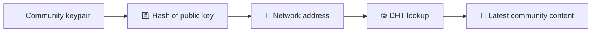
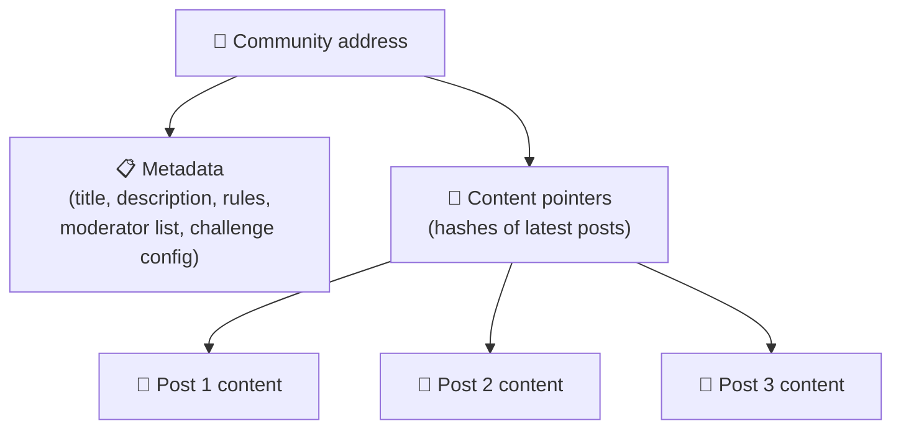
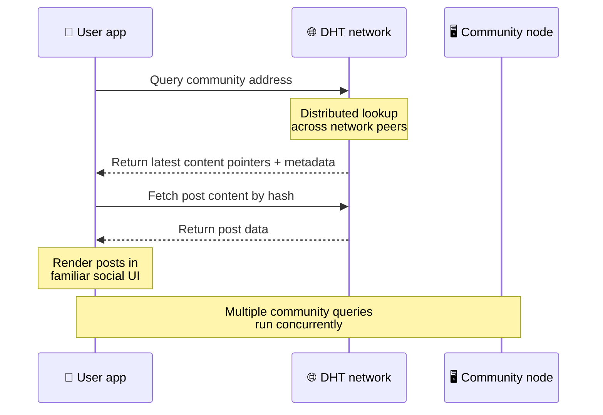
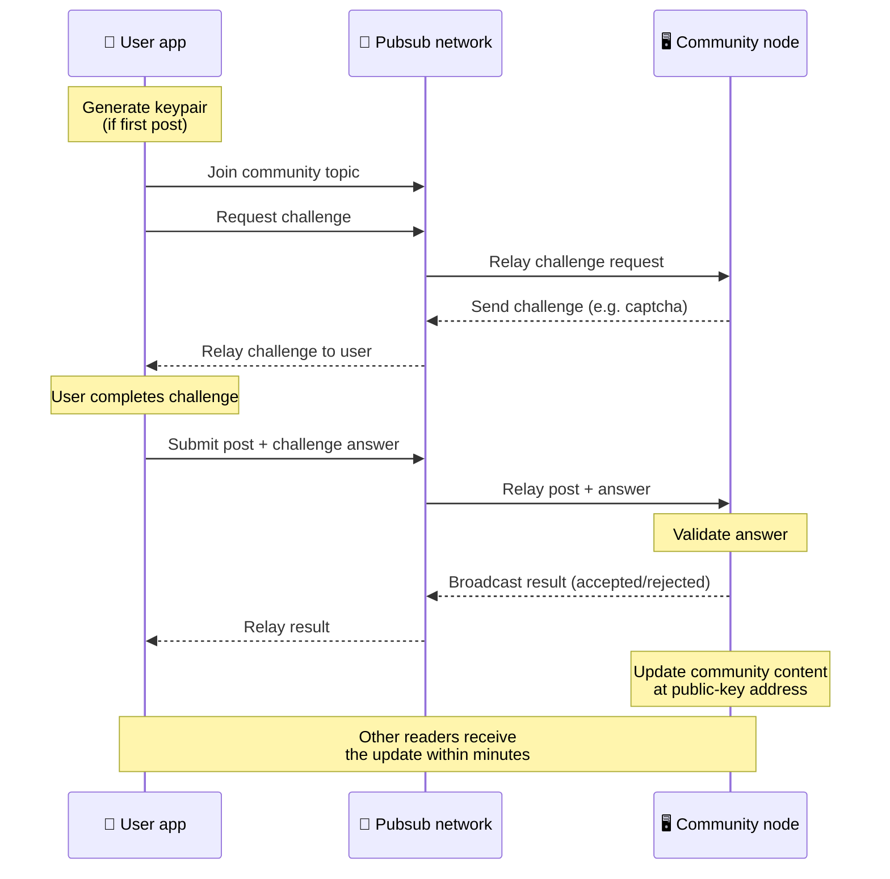
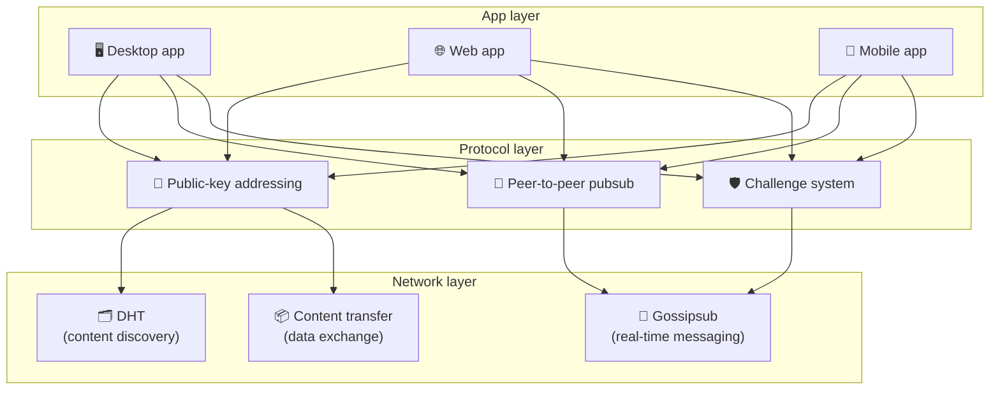

# Protocole peer-to-peer

Bitsocial n'utilise pas de blockchain, de serveur de fédération ou de backend centralisé. Au lieu de cela, il combine deux idées : **adressage basé sur une clé publique** et **pubsub peer-to-peer** - pour permettre à quiconque d'héberger une communauté à partir d'un matériel grand public pendant que les utilisateurs lisent et publient sans compte sur n'importe quel service contrôlé par l'entreprise.

Pour une procédure pas à pas moins technique, lisez [Une explication profane complète du protocole Bitsocial](./layman-protocol-explanation.md).

## Les deux problèmes

Un réseau social décentralisé doit répondre à deux questions :

1. **Données** : comment stocker et diffuser le contenu social mondial sans base de données centrale ?
2. **Spam** : comment prévenir les abus tout en gardant le réseau libre d'utilisation ?

Bitsocial résout le problème des données en ignorant complètement la blockchain : les médias sociaux n'ont pas besoin d'un ordre global des transactions ni d'une disponibilité permanente de chaque ancienne publication. Il résout le problème du spam en permettant à chaque communauté de lancer son propre défi anti-spam sur le réseau peer-to-peer.

Pour le modèle de découverte au-dessus de cette couche réseau, voir [Découverte de contenu](./content-discovery.md).

---

## Adressage basé sur la clé publique

Dans BitTorrent, le hachage d'un fichier devient son adresse (_adressage basé sur le contenu_). Bitsocial utilise une idée similaire avec les clés publiques : le hachage de la clé publique d'une communauté devient son adresse réseau.

N'importe quel homologue du réseau peut effectuer une requête DHT (table de hachage distribuée) pour cette adresse et récupérer le dernier état de la communauté. Chaque fois que le contenu est mis à jour, son numéro de version augmente. Le réseau ne conserve que la dernière version : il n’est pas nécessaire de conserver chaque état historique, ce qui rend cette approche plus légère par rapport à une blockchain.

### Ce qui est stocké à l'adresse

L’adresse de la communauté ne contient pas directement le contenu complet de la publication. Au lieu de cela, il stocke une liste d’identifiants de contenu – des hachages qui pointent vers les données réelles. Le client récupère ensuite chaque élément de contenu via les recherches DHT ou de type tracker.

Au moins un homologue dispose toujours des données : le nœud de l'opérateur communautaire. Si la communauté est populaire, de nombreux autres pairs l'auront également et la charge se répartira d'elle-même, de la même manière que les torrents populaires sont plus rapides à télécharger.

---

## PubSub peer-to-peer

Pubsub (publication-abonnement) est un modèle de messagerie dans lequel les pairs s'abonnent à un sujet et reçoivent chaque message publié sur ce sujet. Bitsocial utilise un réseau pubsub peer-to-peer : tout le monde peut publier, tout le monde peut s'abonner et il n'y a pas de courtier de messages central.

Pour publier une publication dans une communauté, un utilisateur publie un message dont le sujet est égal à la clé publique de la communauté. Le nœud de l'opérateur communautaire le récupère, le valide et, s'il réussit le défi anti-spam, l'inclut dans la prochaine mise à jour du contenu.

---

## Anti-spam : les défis liés au pubsub

Un réseau pubsub ouvert est vulnérable aux inondations de spam. Bitsocial résout ce problème en obligeant les éditeurs à relever un **défi** avant que leur contenu ne soit accepté.

Le système de challenge est flexible : chaque opérateur communautaire configure sa propre politique. Les options incluent :

| Type de défi           | Comment ça marche                                            |
| ---------------------- | ------------------------------------------------------------ |
| **Captcha**            | Puzzle visuel ou interactif présenté dans l'application      |
| **Limitation de taux** | Limiter les publications par fenêtre horaire et par identité |
| **Porte de jetons**    | Exiger une preuve du solde d'un jeton spécifique             |
| **Paiement**           | Exiger un petit paiement par publication                     |
| **Liste autorisée**    | Seules les identités pré-approuvées peuvent publier          |
| **Code personnalisé**  | Toute politique exprimable dans le code                      |

Les pairs qui relaient trop de tentatives de contestation infructueuses sont bloqués du sujet pubsub, ce qui empêche les attaques par déni de service sur la couche réseau.

---

## Cycle de vie : lire une communauté

C'est ce qui se produit lorsqu'un utilisateur ouvre l'application et consulte les derniers messages d'une communauté.

**Pas à pas:**

1. L'utilisateur ouvre l'application et voit une interface sociale.
2. Le client rejoint le réseau peer-to-peer et effectue une requête DHT pour chaque communauté de l'utilisateur.
   suit. Les requêtes prennent quelques secondes chacune mais s'exécutent simultanément.
3. Chaque requête renvoie les derniers pointeurs de contenu et métadonnées de la communauté (titre, description,
   liste des modérateurs, configuration du défi).
4. Le client récupère le contenu réel de la publication à l'aide de ces pointeurs, puis restitue le tout dans un format
   interface sociale familière.

---

## Cycle de vie : publication d'un article

La publication implique une poignée de main défi-réponse sur pubsub avant que la publication ne soit acceptée.

**Pas à pas:**

1. L'application génère une paire de clés pour l'utilisateur s'il n'en a pas encore.
2. L'utilisateur écrit un message pour une communauté.
3. Le client rejoint le sujet pubsub de cette communauté (lié à la clé publique de la communauté).
4. Le client demande un défi via pubsub.
5. Le nœud de l'opérateur communautaire renvoie un challenge (par exemple, un captcha).
6. L'utilisateur termine le défi.
7. Le client soumet le message avec la réponse au défi via pubsub.
8. Le nœud de l'opérateur communautaire valide la réponse. Si c'est correct, le message est accepté.
9. Le nœud diffuse le résultat sur pubsub afin que les homologues du réseau sachent qu'il faut continuer à relayer.
   messages de cet utilisateur.
10. Le nœud met à jour le contenu de la communauté à son adresse de clé publique.
11. En quelques minutes, chaque lecteur de la communauté reçoit la mise à jour.

---

## Présentation de l'architecture

Le système complet comporte trois couches qui fonctionnent ensemble :

| Couche          | Rôle                                                                                                                                                               |
| --------------- | ------------------------------------------------------------------------------------------------------------------------------------------------------------------ |
| **Application** | Interface utilisateur. Plusieurs applications peuvent exister, chacune avec son propre design, partageant toutes les mêmes communautés et identités.               |
| **Protocole**   | Définit la manière dont les communautés sont adressées, la manière dont les publications sont publiées et la manière dont le spam est évité.                       |
| **Réseau**      | L'infrastructure peer-to-peer sous-jacente : DHT pour la découverte, gossipsub pour la messagerie en temps réel et transfert de contenu pour l'échange de données. |

---

## Confidentialité : dissocier les auteurs des adresses IP

Lorsqu'un utilisateur publie une publication, le contenu est **crypté avec la clé publique de l'opérateur communautaire** avant d'entrer dans le réseau pubsub. Cela signifie que même si les observateurs du réseau peuvent voir qu'un homologue a publié _quelque chose_, ils ne peuvent pas déterminer :

- ce que dit le contenu
- quel auteur l'a publié

Ceci est similaire à la façon dont BitTorrent permet de découvrir quelles adresses IP génèrent un torrent mais pas qui l'a créé à l'origine. La couche de cryptage ajoute une garantie de confidentialité supplémentaire à cette base de référence.

---

## Navigateur peer-to-peer

Le P2P par navigateur est désormais possible dans les clients Bitsocial. Une application de navigateur peut exécuter un nœud [Hélia](https://helia.io/), utiliser la même pile client de protocole Bitsocial que d'autres applications et récupérer le contenu de ses pairs au lieu de demander à une passerelle IPFS centralisée de le servir. Le navigateur peut également participer directement à pubsub, donc la publication n'a pas besoin d'un fournisseur pubsub appartenant à la plate-forme dans le chemin heureux.

Il s’agit d’une étape importante pour la distribution Web : un site Web HTTPS normal peut s’ouvrir sur un client social P2P en direct. Les utilisateurs n'ont pas besoin d'installer une application de bureau avant de pouvoir lire sur le réseau, et l'opérateur de l'application n'a pas besoin d'exécuter une passerelle centrale qui devient le point d'étranglement de la censure ou de la modération pour chaque utilisateur du navigateur.

Le chemin du navigateur a des limites différentes de celles d'un nœud de bureau ou de serveur :

- un nœud de navigateur ne peut généralement pas accepter les connexions entrantes arbitraires provenant de l'Internet public
- il peut charger, valider, mettre en cache et publier des données pendant que l'application est ouverte
- il ne doit pas être traité comme un hôte de longue durée pour les données d'une communauté
- l'hébergement communautaire complet est toujours mieux géré par une application de bureau, `bitsocial-cli` ou une autre
  nœud toujours actif

Les routeurs HTTP sont toujours importants pour la découverte de contenu : ils renvoient les adresses des fournisseurs pour un hachage de communauté. Ce ne sont pas des passerelles IPFS, car elles ne servent pas le contenu lui-même. Après la découverte, le client du navigateur se connecte à ses pairs et récupère les données via la pile P2P.

5chan expose cela en tant que commutateur de paramètres avancés opt-in dans l'application Web 5chan.app normale. La dernière pile de navigateur `pkc-js` est devenue suffisamment stable pour des tests publics après que le travail d'interopérabilité en amont de libp2p/gossipsub ait abordé la transmission des messages entre les pairs Helia et Kubo. Le paramètre permet de contrôler le P2P du navigateur pendant qu'il subit davantage de tests dans le monde réel ; une fois qu’il a suffisamment confiance en la production, il peut devenir le chemin Web par défaut.

## Passerelle de secours

L'accès au navigateur basé sur une passerelle est toujours utile comme solution de secours en matière de compatibilité et de déploiement. Une passerelle peut relayer les données entre le réseau P2P et un client navigateur lorsqu'un navigateur ne peut pas rejoindre directement le réseau ou lorsque l'application choisit intentionnellement l'ancien chemin. Ces passerelles :

- peut être dirigé par n'importe qui
- ne nécessitent pas de comptes d'utilisateurs ni de paiements
- ne pas avoir la garde des identités ou des communautés des utilisateurs
- peut être remplacé sans perte de données

L'architecture cible est d'abord le navigateur P2P, avec des passerelles comme solution de secours facultative plutôt que comme goulot d'étranglement par défaut.

---

## Pourquoi pas une blockchain ?

Les blockchains résolvent le problème de la double dépense : elles doivent connaître l’ordre exact de chaque transaction pour empêcher quelqu’un de dépenser deux fois la même pièce.

Les réseaux sociaux n’ont pas de problème de double dépense. Peu importe si la publication A a été publiée une milliseconde avant la publication B, et les anciennes publications n'ont pas besoin d'être disponibles en permanence sur chaque nœud.

En sautant la blockchain, Bitsocial évite :

- **frais d'essence** — la publication est gratuite
- **limites de débit** — pas de goulot d'étranglement de taille de bloc ni de goulot d'étranglement de temps de blocage
- **ballonnement du stockage** — les nœuds ne conservent que ce dont ils ont besoin
- ** frais généraux de consensus ** — aucun mineur, validateur ou jalonnement requis

Le compromis est que Bitsocial ne garantit pas la disponibilité permanente des anciens contenus. Mais pour les médias sociaux, il s’agit d’un compromis acceptable : le nœud de l’opérateur communautaire détient les données, le contenu populaire se propage entre de nombreux pairs et les publications très anciennes disparaissent naturellement – ​​de la même manière qu’elles le font sur toutes les plateformes sociales.

## Pourquoi pas une fédération ?

Les réseaux fédérés (comme les plates-formes de messagerie ou basées sur ActivityPub) améliorent la centralisation mais présentent toujours des limites structurelles :

- **Dépendance du serveur** — chaque communauté a besoin d'un serveur avec un domaine, TLS et continu
  entretien
- **Confiance administrateur** : l'administrateur du serveur a un contrôle total sur les comptes d'utilisateurs et le contenu.
- **Fragmentation** : passer d'un serveur à l'autre signifie souvent perdre des abonnés, de l'historique ou de l'identité.
- **Coût** : quelqu'un doit payer pour l'hébergement, ce qui crée une pression en faveur de la consolidation.

L'approche peer-to-peer de Bitsocial supprime complètement le serveur de l'équation. Un nœud communautaire peut fonctionner sur un ordinateur portable, un Raspberry Pi ou un VPS bon marché. L'opérateur contrôle la politique de modération mais ne peut pas saisir les identités des utilisateurs, car les identités sont contrôlées par paire de clés et non accordées par le serveur.

---

## Résumé

Bitsocial est construit sur deux primitives : l'adressage basé sur une clé publique pour la découverte de contenu et le pubsub peer-to-peer pour la communication en temps réel. Ensemble, ils créent un réseau social où :

- les communautés sont identifiées par des clés cryptographiques et non par des noms de domaine
- le contenu se propage entre pairs comme un torrent, et n'est pas servi à partir d'une seule base de données
- la résistance au spam est locale à chaque communauté et n'est pas imposée par une plateforme
- les utilisateurs possèdent leur identité via des paires de clés, et non via des comptes révocables
- l'ensemble du système fonctionne sans serveurs, blockchains ou frais de plateforme
