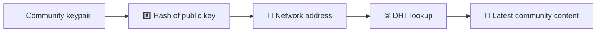
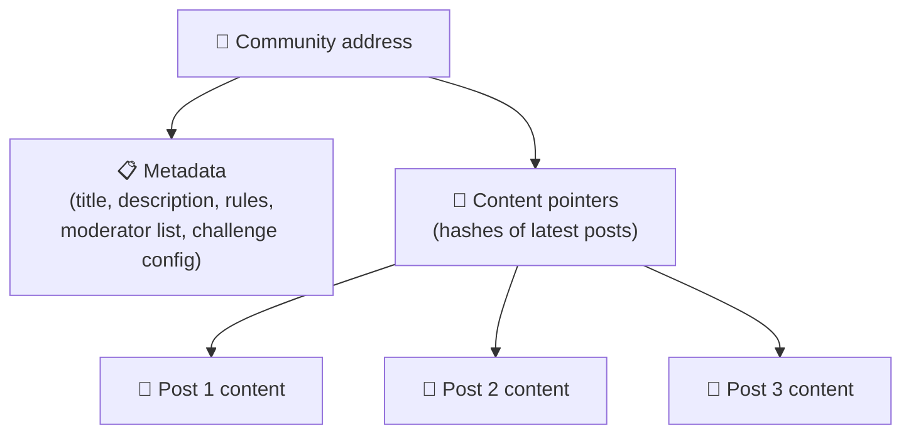
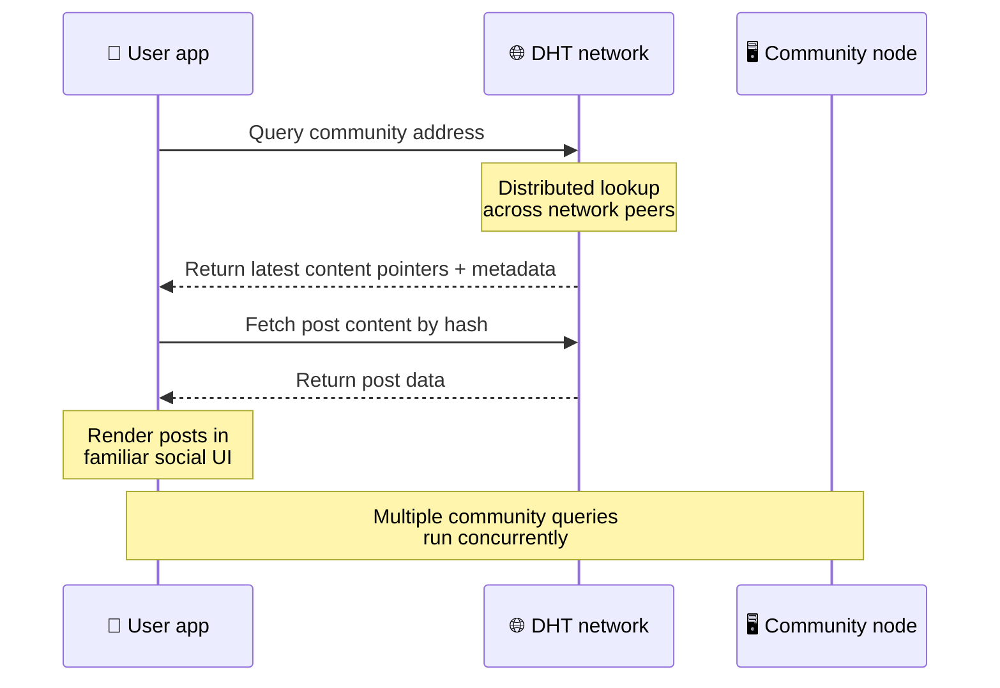
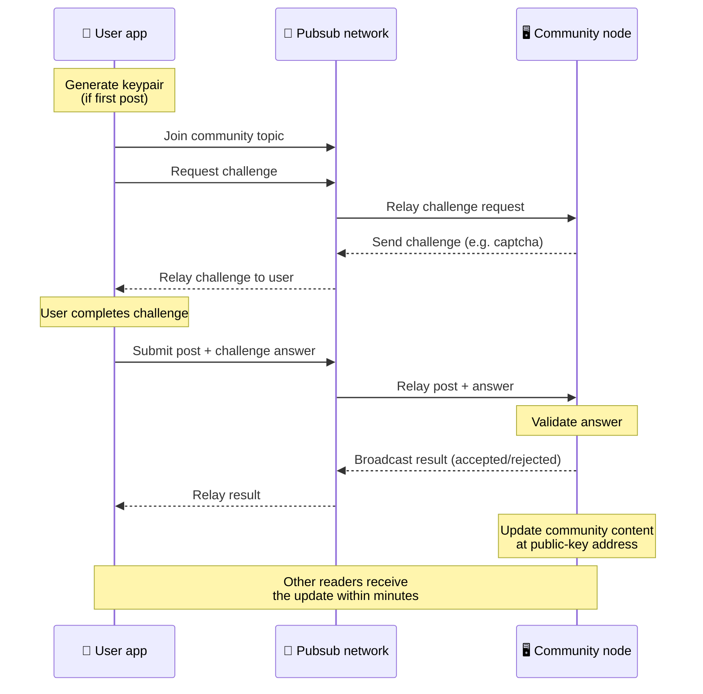
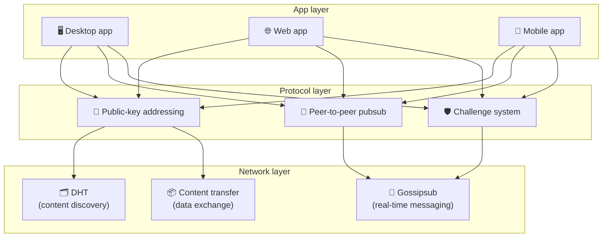

# פרוטוקול עמית לעמית

Bitsocial אינו משתמש בבלוקצ'יין, בשרת פדרציה או ב-backend מרכזי. במקום זאת הוא משלב שני רעיונות - **כתובת מבוססת-מפתח ציבורי** ו-**Peer-to-peer pubsub** - כדי לאפשר לכל אחד לארח קהילה מחומרה צרכנית בזמן שמשתמשים קוראים ומפרסמים ללא חשבונות בכל שירות שבשליטת החברה.

להדרכה פחות טכנית, קרא [הסבר שלם של הדיוט על פרוטוקול Bitsocial](./layman-protocol-explanation.md).

## שתי הבעיות

רשת חברתית מבוזרת צריכה לענות על שתי שאלות:

1. **נתונים** — איך מאחסנים ומגישים את התוכן החברתי בעולם ללא מסד נתונים מרכזי?
2. **דואר זבל** — איך מונעים שימוש לרעה תוך שמירה על הרשת חופשית לשימוש?

Bitsocial פותר את בעיית הנתונים על ידי דילוג מוחלט על הבלוקצ'יין: מדיה חברתית אינה זקוקה להזמנת עסקאות גלובלית או לזמינות קבועה של כל פוסט ישן. זה פותר את בעיית הספאם בכך שהוא מאפשר לכל קהילה להפעיל את אתגר האנטי-ספאם שלה ברשת עמית לעמית.

למודל הגילוי מעל שכבת רשת זו, ראה [גילוי תוכן](./content-discovery.md).

---

## כתובת מבוססת מפתח ציבורי

ב-BitTorrent, ה-hash של קובץ הופך לכתובת שלו (_כתובת מבוססת-תוכן_). Bitsocial משתמש ברעיון דומה עם מפתחות ציבוריים: ה-hash של המפתח הציבורי של קהילה הופך לכתובת הרשת שלה.

כל עמית ברשת יכול לבצע שאילתת DHT (טבלת hash מבוזרת) עבור כתובת זו ולאחזר את המצב האחרון של הקהילה. בכל פעם שהתוכן מתעדכן, מספר הגרסה שלו עולה. הרשת שומרת רק את הגרסה העדכנית ביותר - אין צורך לשמר כל מצב היסטורי, וזה מה שהופך את הגישה הזו לקלת משקל בהשוואה לבלוקצ'יין.

### מה נשמר בכתובת

כתובת הקהילה אינה מכילה תוכן פוסט מלא ישירות. במקום זאת הוא מאחסן רשימה של מזהי תוכן - גיבובים המצביעים על הנתונים בפועל. לאחר מכן, הלקוח מביא כל פיסת תוכן דרך חיפושי DHT או מעקבים בסגנון מעקב.

לפחות לעמית אחד יש תמיד את הנתונים: הצומת של מפעיל הקהילה. אם הקהילה פופולרית, גם לעמיתים רבים אחרים יש את זה והעומס מתחלק מעצמו, באותה דרך שבה הורדה של טורנטים פופולריים מהירים יותר.

---

## פאב-סאב עמית לעמית

Pubsub (פרסם-מנוי) הוא דפוס הודעות שבו עמיתים נרשמים לנושא ומקבלים כל הודעה שפורסמה לנושא זה. Bitsocial משתמשת ברשת pubsub peer-to-peer - כל אחד יכול לפרסם, כל אחד יכול להירשם, ואין מתווך הודעות מרכזי.

כדי לפרסם פוסט לקהילה, משתמש מפרסם הודעה שהנושא שלה שווה למפתח הציבורי של הקהילה. הצומת של מפעיל הקהילה קולט אותו, מאמת אותו, ואם הוא עובר את אתגר האנטי-ספאם - כולל אותו בעדכון התוכן הבא.

---

## אנטי ספאם: אתגרים על pubsub

רשת פאב-סאב פתוחה פגיעה להצפות ספאם. Bitsocial פותרת זאת על ידי דרישה מבעלי אתרים להשלים **אתגר** לפני שהתוכן שלהם יתקבל.

מערכת האתגרים גמישה: כל מפעיל קהילה מגדיר את המדיניות שלו. האפשרויות כוללות:

| סוג אתגר            | איך זה עובד                               |
| ------------------- | ----------------------------------------- |
| **קפטצ'ה**          | פאזל חזותי או אינטראקטיבי המוצג באפליקציה |
| **הגבלת תעריף**     | הגבלת פוסטים לכל חלון זמן לכל זהות        |
| **שער אסימון**      | דרוש הוכחה לאיזון של אסימון ספציפי        |
| **תשלום**           | דרוש תשלום קטן לכל פוסט                   |
| **רשימת ההיתרים**   | רק זהויות מאושרות מראש יכולות לפרסם       |
| **קוד מותאם אישית** | כל מדיניות המתבטאת בקוד                   |

עמיתים שמעבירים יותר מדי ניסיונות אתגר כושלים נחסמים מהנושא של pubsub, מה שמונע התקפות מניעת שירות על שכבת הרשת.

---

## מחזור חיים: קריאת קהילה

זה מה שקורה כאשר משתמש פותח את האפליקציה וצופה בפוסטים האחרונים של קהילה.

**שלב אחר שלב:**

1. המשתמש פותח את האפליקציה ורואה ממשק חברתי.
2. הלקוח מצטרף לרשת peer-to-peer ומבצע שאילתת DHT עבור כל קהילה של המשתמש
   עוקב. שאילתות נמשכות מספר שניות כל אחת אך פועלות במקביל.
3. כל שאילתה מחזירה את מצביעי התוכן והמטא נתונים העדכניים ביותר של הקהילה (כותרת, תיאור,
   רשימת מנהלים, תצורת אתגר).
4. הלקוח מביא את תוכן הפוסט בפועל באמצעות המצביעים הללו, ואז מעבד הכל ב-a
   ממשק חברתי מוכר.

---

## מחזור חיים: פרסום פוסט

פרסום כרוך בלחיצת יד בתגובה לאתגר על pubsub לפני שהפוסט מתקבל.

**שלב אחר שלב:**

1. האפליקציה מייצרת צמד מפתחות עבור המשתמש אם עדיין אין לו.
2. המשתמש כותב פוסט עבור קהילה.
3. הלקוח מצטרף לנושא pubsub עבור אותה קהילה (מפתח למפתח הציבורי של הקהילה).
4. הלקוח מבקש אתגר דרך pubsub.
5. הצומת של מפעיל הקהילה שולח בחזרה אתגר (לדוגמה, captcha).
6. המשתמש משלים את האתגר.
7. הלקוח מגיש את הפוסט יחד עם התשובה לאתגר דרך pubsub.
8. הצומת של מפעיל הקהילה מאמת את התשובה. אם נכון, הפוסט יתקבל.
9. הצומת משדר את התוצאה דרך pubsub כך שעמיתים לרשת ידעו להמשיך להעביר
   הודעות ממשתמש זה.
10. הצומת מעדכן את תוכן הקהילה בכתובת המפתח הציבורי שלה.
11. תוך דקות ספורות, כל קורא בקהילה מקבל את העדכון.

---

## סקירת אדריכלות

למערכת המלאה שלוש שכבות הפועלות יחד:

| שכבה         | תפקיד                                                                                                |
| ------------ | ---------------------------------------------------------------------------------------------------- |
| **אפליקציה** | ממשק משתמש. יכולות להתקיים מספר אפליקציות, כל אחת עם עיצוב משלה, כולן חולקות את אותן קהילות וזהויות. |
| **פרוטוקול** | מגדיר כיצד מתייחסים לקהילות, כיצד מתפרסמים פוסטים וכיצד מונעים דואר זבל.                             |
| **רשת**      | תשתית העמית לעמית הבסיסית: DHT לגילוי, gossipsub להעברת הודעות בזמן אמת והעברת תוכן להחלפת נתונים.   |

---

## פרטיות: ביטול קישור מחברים מכתובות IP

כאשר משתמש מפרסם פוסט, התוכן **מוצפן עם המפתח הציבורי של מפעיל הקהילה** לפני שהוא נכנס לרשת pubsub. המשמעות היא שבעוד שמשקיפים ברשת יכולים לראות שעמית פרסם _משהו_, הם לא יכולים לקבוע:

- מה אומר התוכן
- איזה זהות מחבר פרסמה אותו

זה דומה לאופן שבו BitTorrent מאפשר לגלות אילו כתובות IP מוצאות טורנט אך לא מי יצר אותו במקור. שכבת ההצפנה מוסיפה הבטחת פרטיות נוספת על קו הבסיס הזה.

---

## דפדפן עמית לעמית

דפדפן P2P אפשרי כעת בלקוחות Bitsocial. אפליקציית דפדפן יכולה להריץ צומת [הליה](https://helia.io/), להשתמש באותה מחסנית של פרוטוקול Bitsocial כמו אפליקציות אחרות, ולהביא תוכן מעמיתים במקום לבקש משער IPFS מרכזי לשרת אותו. הדפדפן יכול גם להשתתף ישירות ב-pubsub, כך שפרסום אינו צריך ספק pubsub בבעלות פלטפורמה בדרך המאושרת.

זוהי אבן הדרך החשובה להפצה באינטרנט: אתר HTTPS רגיל יכול להיפתח ללקוח חברתי P2P חי. משתמשים לא צריכים להתקין אפליקציית שולחן עבודה לפני שהם יכולים לקרוא מהרשת, ומפעיל האפליקציה לא צריך להפעיל שער מרכזי שהופך לנקודת החנק לצנזורה או לניהול של כל משתמש בדפדפן.

לנתיב הדפדפן יש מגבלות שונות מצומת שולחן עבודה או שרת:

- צומת דפדפן בדרך כלל אינו יכול לקבל חיבורים נכנסים שרירותיים מהאינטרנט הציבורי
- הוא יכול לטעון, לאמת, לשמור במטמון ולפרסם נתונים בזמן שהאפליקציה פתוחה
- אין להתייחס אליו כמארח ארוך-החיים עבור נתונים של קהילה
- אירוח קהילה מלא עדיין מטופל על ידי אפליקציית שולחן עבודה, `bitsocial-cli` או אחר
  צומת תמיד

נתבי HTTP עדיין חשובים לגילוי תוכן: הם מחזירים כתובות של ספקים עבור hash קהילתי. הם אינם שערים של IPFS, מכיוון שהם אינם משרתים את התוכן עצמו. לאחר הגילוי, לקוח הדפדפן מתחבר לעמיתים ומביא את הנתונים דרך מחסנית ה-P2P.

5chan חושף זאת כמתג הגדרות מתקדמות להצטרפות באפליקציית האינטרנט הרגילה של 5chan.app. ערימת הדפדפנים האחרונה של `pkc-js` הפכה יציבה מספיק לבדיקה ציבורית לאחר שעבודת אינטראפ libp2p/gossipsub במעלה הזרם התייחסה להעברת הודעות בין עמיתים של Helia ו-Kubo. ההגדרה שומרת על שליטה ב-P2P של הדפדפן בזמן שהיא מקבלת יותר בדיקות בעולם האמיתי; ברגע שיש לו מספיק בטחון ייצור, הוא יכול להפוך לנתיב האינטרנט המוגדר כברירת מחדל.

## שער נפילה

גישה לדפדפן מגובת שער עדיין שימושית כפתרון תאימות והשקה. שער יכול להעביר נתונים בין רשת P2P ללקוח דפדפן כאשר דפדפן אינו יכול להצטרף ישירות לרשת או כאשר האפליקציה בוחרת בכוונה בנתיב הישן יותר. שערים אלה:

- יכול להיות מנוהל על ידי כל אחד
- לא דורשים חשבונות משתמש או תשלומים
- אל תשיג משמורת על זהויות משתמש או קהילות
- ניתן להחליף מבלי לאבד נתונים

ארכיטקטורת היעד היא דפדפן P2P תחילה, עם שערים כ-fallback אופציונלי במקום צוואר הבקבוק המוגדר כברירת מחדל.

---

## למה לא בלוקצ'יין?

בלוקצ'יין פותרים את בעיית ההוצאה הכפולה: הם צריכים לדעת את הסדר המדויק של כל עסקה כדי למנוע ממישהו להוציא את אותו המטבע פעמיים.

במדיה החברתית אין בעיה של הוצאה כפולה. זה לא משנה אם פוסט א' פורסם מילי-שנייה אחת לפני פוסט ב', ופוסטים ישנים לא צריכים להיות זמינים לצמיתות בכל צומת.

על ידי דילוג על הבלוקצ'יין, Bitsocial נמנע:

- **דמי דלק** - הפרסום הוא בחינם
- **מגבלות תפוקה** — ללא גודל בלוק או צוואר בקבוק בזמן חסימה
- **נפח אחסון** - צמתים שומרים רק את מה שהם צריכים
- **תקורה בקונצנזוס** - לא נדרשים כורים, נותנים תוקף או הימור

הפשרה היא ש-Bitsocial אינה מבטיחה זמינות קבועה של תוכן ישן. אבל עבור מדיה חברתית, זה פשרה מקובלת: הצומת של מפעיל הקהילה מחזיק את הנתונים, תוכן פופולרי מתפשט על פני עמיתים רבים ופוסטים ישנים מאוד מתפוגגים באופן טבעי - כפי שהם עושים בכל פלטפורמה חברתית.

## למה לא פדרציה?

רשתות מאוחדות (כמו דואר אלקטרוני או פלטפורמות מבוססות ActivityPub) משתפרות בריכוזיות אך עדיין יש להן מגבלות מבניות:

- **תלות בשרת** - כל קהילה זקוקה לשרת עם דומיין, TLS ומתמשך
  תַחזוּקָה
- **אמון אדמין** - למנהל השרת יש שליטה מלאה על חשבונות המשתמש והתוכן
- **פיצול** - מעבר בין שרתים פירושו לעתים קרובות איבוד עוקבים, היסטוריה או זהות
- **עלות** - מישהו צריך לשלם עבור אירוח, מה שיוצר לחץ לקראת איחוד

גישת ה-peer-to-peer של Bitsocial מסירה את השרת מהמשוואה לחלוטין. צומת קהילה יכול לפעול על מחשב נייד, Raspberry Pi או VPS זול. המפעיל שולט במדיניות הניהול אך אינו יכול לתפוס זהויות משתמש, מכיוון שהזהויות נשלטות על ידי צמד מפתחות, לא ניתנות לשרת.

---

## תַקצִיר

Bitsocial בנויה על שני פרימיטיבים: כתובת מבוססת מפתח ציבורי לגילוי תוכן, ו-peer-to-peer pubsub לתקשורת בזמן אמת. יחד הם מייצרים רשת חברתית שבה:

- קהילות מזוהות על ידי מפתחות קריפטוגרפיים, לא שמות דומיין
- תוכן מתפשט בין עמיתים כמו סיקור, לא מוגש ממסד נתונים בודד
- עמידות בפני דואר זבל היא מקומית לכל קהילה, ולא נכפית על ידי פלטפורמה
- המשתמשים הבעלים של זהותם באמצעות צמדי מפתחות, לא באמצעות חשבונות הניתנים לביטול
- המערכת כולה פועלת ללא שרתים, בלוקצ'יין או עמלות פלטפורמה
