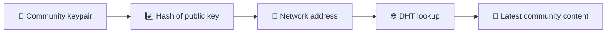
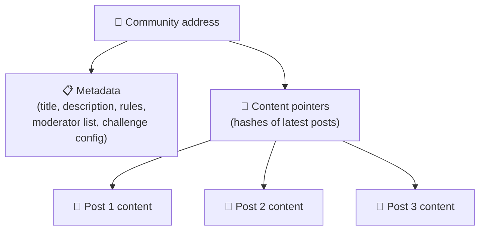
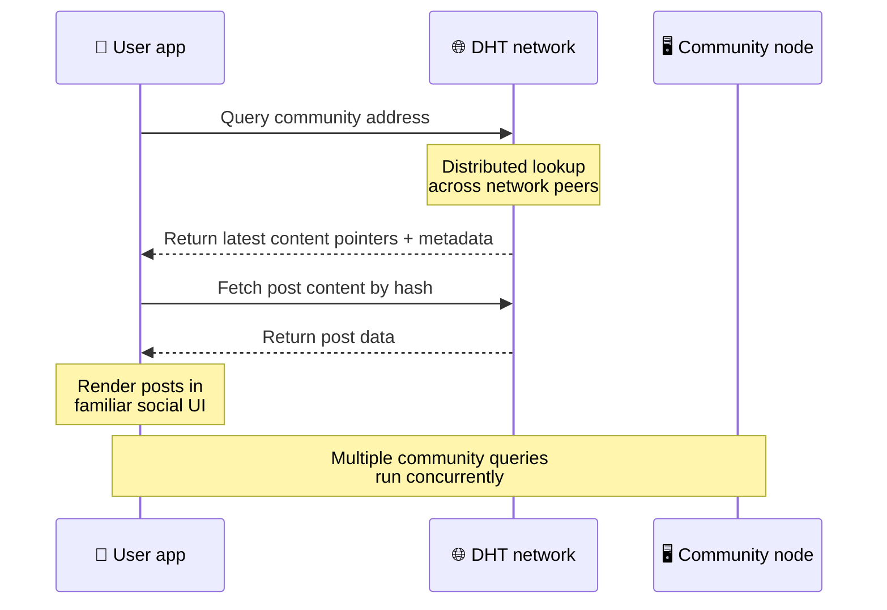
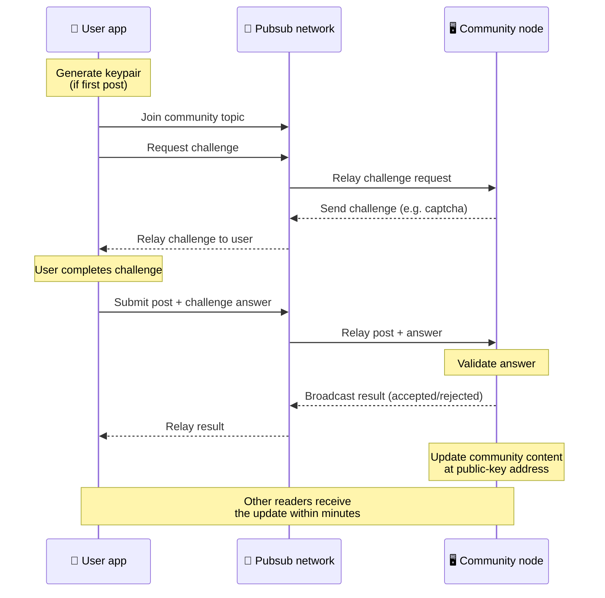
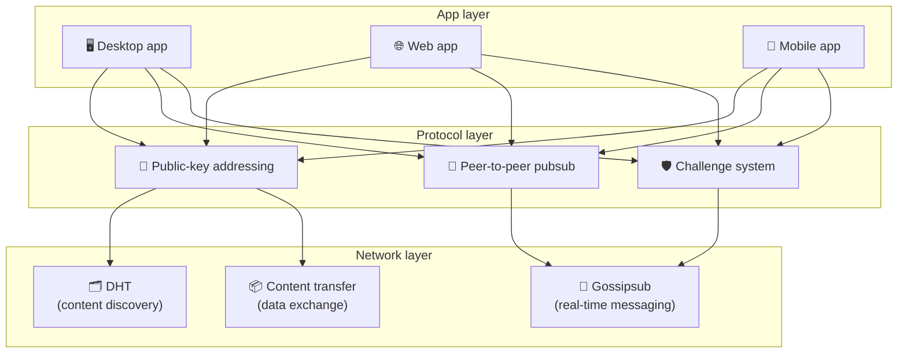

# पीयर-टू-पीयर प्रोटोकॉल

बिटसोशल ब्लॉकचेन, फेडरेशन सर्वर या केंद्रीकृत बैकएंड का उपयोग नहीं करता है। इसके बजाय यह दो विचारों को जोड़ती है - **सार्वजनिक-कुंजी-आधारित एड्रेसिंग** और **पीयर-टू-पीयर पबसब** - किसी को भी उपभोक्ता हार्डवेयर से एक समुदाय की मेजबानी करने की अनुमति देता है, जबकि उपयोगकर्ता किसी भी कंपनी-नियंत्रित सेवा पर खातों के बिना पढ़ते और पोस्ट करते हैं।

कम तकनीकी पूर्वाभ्यास के लिए पढ़ें [बिटसोशल प्रोटोकॉल का एक संपूर्ण आम आदमी स्पष्टीकरण](./layman-protocol-explanation.md).

## दो समस्याएँ

एक विकेन्द्रीकृत सामाजिक नेटवर्क को दो प्रश्नों का उत्तर देना होता है:

1. **डेटा** - आप केंद्रीय डेटाबेस के बिना दुनिया की सामाजिक सामग्री को कैसे संग्रहीत और परोसते हैं?
2. **स्पैम** - आप नेटवर्क को उपयोग के लिए स्वतंत्र रखते हुए दुरुपयोग को कैसे रोकेंगे?

बिटसोशल ब्लॉकचेन को पूरी तरह से छोड़कर डेटा समस्या का समाधान करता है: सोशल मीडिया को वैश्विक लेनदेन ऑर्डर या हर पुरानी पोस्ट की स्थायी उपलब्धता की आवश्यकता नहीं है। यह प्रत्येक समुदाय को पीयर-टू-पीयर नेटवर्क पर अपनी स्वयं की एंटी-स्पैम चुनौती चलाने की अनुमति देकर स्पैम समस्या का समाधान करता है।

इस नेटवर्क परत के ऊपर खोज मॉडल के लिए, [सामग्री खोज](./content-discovery.md) देखें।

---

## सार्वजनिक-कुंजी-आधारित संबोधन

बिटटोरेंट में, किसी फ़ाइल का हैश उसका पता (_सामग्री-आधारित पता_) बन जाता है। बिटसोशल सार्वजनिक कुंजी के साथ एक समान विचार का उपयोग करता है: किसी समुदाय की सार्वजनिक कुंजी का हैश उसका नेटवर्क पता बन जाता है।

नेटवर्क पर कोई भी सहकर्मी उस पते के लिए DHT (वितरित हैश टेबल) क्वेरी निष्पादित कर सकता है और समुदाय की नवीनतम स्थिति प्राप्त कर सकता है। हर बार जब सामग्री अद्यतन की जाती है, तो इसकी संस्करण संख्या बढ़ जाती है। नेटवर्क केवल नवीनतम संस्करण रखता है - प्रत्येक ऐतिहासिक स्थिति को संरक्षित करने की कोई आवश्यकता नहीं है, जो ब्लॉकचेन की तुलना में इस दृष्टिकोण को हल्का बनाता है।

### पते पर क्या संग्रहित होता है

समुदाय पते में सीधे तौर पर पूरी पोस्ट सामग्री शामिल नहीं होती. इसके बजाय यह सामग्री पहचानकर्ताओं की एक सूची संग्रहीत करता है - हैश जो वास्तविक डेटा की ओर इशारा करते हैं। फिर क्लाइंट सामग्री के प्रत्येक टुकड़े को DHT या ट्रैकर-शैली लुकअप के माध्यम से प्राप्त करता है।

कम से कम एक सहकर्मी के पास हमेशा डेटा होता है: समुदाय ऑपरेटर का नोड। यदि समुदाय लोकप्रिय है, तो कई अन्य साथियों के पास भी यह होगा और लोड अपने आप वितरित हो जाता है, उसी तरह लोकप्रिय टोरेंट डाउनलोड करने में तेज़ होते हैं।

---

## पीयर-टू-पीयर पबसब

पबसब (प्रकाशित-सदस्यता लें) एक मैसेजिंग पैटर्न है जहां सहकर्मी किसी विषय की सदस्यता लेते हैं और उस विषय पर प्रकाशित प्रत्येक संदेश प्राप्त करते हैं। बिटसोशल एक पीयर-टू-पीयर पबसब नेटवर्क का उपयोग करता है - कोई भी प्रकाशित कर सकता है, कोई भी सदस्यता ले सकता है, और कोई केंद्रीय संदेश ब्रोकर नहीं है।

किसी समुदाय में पोस्ट प्रकाशित करने के लिए, उपयोगकर्ता एक संदेश प्रकाशित करता है जिसका विषय समुदाय की सार्वजनिक कुंजी के बराबर होता है। समुदाय ऑपरेटर का नोड इसे उठाता है, इसे मान्य करता है, और - यदि यह एंटी-स्पैम चुनौती को पार कर जाता है - तो इसे अगले सामग्री अपडेट में शामिल करता है।

---

## एंटी-स्पैम: पबसब पर चुनौतियाँ

एक खुला पबसब नेटवर्क स्पैम बाढ़ के प्रति संवेदनशील है। बिटसोशल प्रकाशकों को उनकी सामग्री स्वीकार करने से पहले एक **चुनौती** को पूरा करने की आवश्यकता के द्वारा इसका समाधान करता है।

चुनौती प्रणाली लचीली है: प्रत्येक समुदाय ऑपरेटर अपनी स्वयं की नीति कॉन्फ़िगर करता है। विकल्पों में शामिल हैं:

| चुनौती प्रकार   | यह कैसे काम करता है                                      |
| --------------- | -------------------------------------------------------- |
| **कैप्चा**      | ऐप में प्रस्तुत दृश्य या इंटरैक्टिव पहेली                |
| **दर सीमित**    | प्रति समय विंडो प्रति पहचान के हिसाब से पोस्ट सीमित करें |
| **टोकन गेट**    | किसी विशिष्ट टोकन के संतुलन के प्रमाण की आवश्यकता है     |
| **भुगतान**      | प्रति पोस्ट एक छोटे से भुगतान की आवश्यकता है             |
| **अनुमति सूची** | केवल पूर्व-अनुमोदित पहचान वाले ही पोस्ट कर सकते हैं      |
| **कस्टम कोड**   | कोड में व्यक्त कोई भी नीति                               |

जो सहकर्मी बहुत अधिक असफल चुनौती प्रयासों को रिले करते हैं, उन्हें पबसब विषय से अवरुद्ध कर दिया जाता है, जो नेटवर्क परत पर सेवा से इनकार करने वाले हमलों को रोकता है।

---

## जीवनचक्र: एक समुदाय को पढ़ना

ऐसा तब होता है जब कोई उपयोगकर्ता ऐप खोलता है और किसी समुदाय की नवीनतम पोस्ट देखता है।

**क्रमशः:**

1. उपयोगकर्ता ऐप खोलता है और एक सामाजिक इंटरफ़ेस देखता है।
2. क्लाइंट पीयर-टू-पीयर नेटवर्क से जुड़ता है और उपयोगकर्ता के प्रत्येक समुदाय के लिए एक DHT क्वेरी बनाता है
   अनुसरण करता है। प्रत्येक क्वेरी में कुछ सेकंड लगते हैं लेकिन वे समवर्ती रूप से चलती हैं।
3. प्रत्येक क्वेरी समुदाय के नवीनतम सामग्री संकेतक और मेटाडेटा (शीर्षक, विवरण,
   मॉडरेटर सूची, चुनौती विन्यास)।
4. क्लाइंट उन पॉइंटर्स का उपयोग करके वास्तविक पोस्ट सामग्री प्राप्त करता है, फिर सब कुछ प्रस्तुत करता है
   परिचित सामाजिक इंटरफ़ेस.

---

## जीवनचक्र: एक पोस्ट प्रकाशित करना

प्रकाशन में पोस्ट स्वीकार करने से पहले पबसब पर एक चुनौती-प्रतिक्रिया हाथ मिलाना शामिल है।

**क्रमशः:**

1. यदि उपयोगकर्ता के पास अभी तक कोई की-जोड़ी नहीं है तो ऐप उसके लिए एक की-जोड़ी तैयार करता है।
2. उपयोगकर्ता किसी समुदाय के लिए पोस्ट लिखता है.
3. क्लाइंट उस समुदाय के लिए पबसब विषय से जुड़ता है (समुदाय की सार्वजनिक कुंजी से जुड़ा हुआ)।
4. क्लाइंट पबसब पर चुनौती का अनुरोध करता है।
5. समुदाय ऑपरेटर का नोड एक चुनौती (उदाहरण के लिए, एक कैप्चा) वापस भेजता है।
6. उपयोगकर्ता चुनौती पूरी करता है.
7. क्लाइंट पबसब पर चुनौती के उत्तर के साथ पोस्ट सबमिट करता है।
8. समुदाय ऑपरेटर का नोड उत्तर को मान्य करता है। यदि सही है तो पोस्ट स्वीकार कर ली जायेगी.
9. नोड परिणाम को पबसब पर प्रसारित करता है ताकि नेटवर्क साथियों को पता चल सके कि रिले करना जारी रखना है
   इस उपयोगकर्ता के संदेश.
10. नोड समुदाय की सामग्री को उसके सार्वजनिक-कुंजी पते पर अद्यतन करता है।
11. कुछ ही मिनटों में, समुदाय के प्रत्येक पाठक को अपडेट प्राप्त हो जाता है।

---

## वास्तुकला सिंहावलोकन

पूरे सिस्टम में तीन परतें हैं जो एक साथ काम करती हैं:

| परत           | भूमिका                                                                                                                                    |
| ------------- | ----------------------------------------------------------------------------------------------------------------------------------------- |
| **ऐप**        | प्रयोक्ता इंटरफ़ेस। एकाधिक ऐप्स मौजूद हो सकते हैं, प्रत्येक का अपना डिज़ाइन होता है, सभी समान समुदाय और पहचान साझा करते हैं।              |
| **प्रोटोकॉल** | परिभाषित करता है कि समुदायों को कैसे संबोधित किया जाता है, पोस्ट कैसे प्रकाशित की जाती हैं और स्पैम को कैसे रोका जाता है।                 |
| **नेटवर्क**   | अंतर्निहित पीयर-टू-पीयर बुनियादी ढांचा: खोज के लिए डीएचटी, वास्तविक समय संदेश के लिए गॉसिपसब, और डेटा एक्सचेंज के लिए सामग्री स्थानांतरण। |

---

## गोपनीयता: आईपी पते से लेखकों को अनलिंक करना

जब कोई उपयोगकर्ता कोई पोस्ट प्रकाशित करता है, तो पबसब नेटवर्क में प्रवेश करने से पहले सामग्री **सामुदायिक ऑपरेटर की सार्वजनिक कुंजी के साथ एन्क्रिप्टेड** होती है। इसका मतलब यह है कि हालांकि नेटवर्क पर्यवेक्षक यह देख सकते हैं कि किसी सहकर्मी ने _कुछ_ प्रकाशित किया है, लेकिन वे यह निर्धारित नहीं कर सकते हैं:

- सामग्री क्या कहती है
- किस लेखक की पहचान ने इसे प्रकाशित किया

यह उसी तरह है जैसे बिटटोरेंट यह पता लगाना संभव बनाता है कि कौन से आईपी टोरेंट को सीड करते हैं लेकिन यह नहीं कि इसे मूल रूप से किसने बनाया है। एन्क्रिप्शन परत उस आधार रेखा के शीर्ष पर एक अतिरिक्त गोपनीयता गारंटी जोड़ती है।

---

## ब्राउज़र पीयर-टू-पीयर

ब्राउज़र पी2पी अब बिटसोशल क्लाइंट्स में संभव है। एक ब्राउज़र ऐप एक [हेलिया] (https://helia.io/) नोड चला सकता है, अन्य ऐप्स के समान बिटसोशल प्रोटोकॉल क्लाइंट स्टैक का उपयोग कर सकता है, और इसे परोसने के लिए केंद्रीकृत आईपीएफएस गेटवे से पूछने के बजाय साथियों से सामग्री प्राप्त कर सकता है। ब्राउज़र सीधे पबसब में भी भाग ले सकता है, इसलिए पोस्टिंग के लिए हैप्पी पाथ में प्लेटफ़ॉर्म के स्वामित्व वाले पबसब प्रदाता की आवश्यकता नहीं होती है।

यह वेब वितरण के लिए महत्वपूर्ण मील का पत्थर है: एक सामान्य HTTPS वेबसाइट एक लाइव पी2पी सोशल क्लाइंट में खुल सकती है। उपयोगकर्ताओं को नेटवर्क से पढ़ने से पहले डेस्कटॉप ऐप इंस्टॉल करने की आवश्यकता नहीं है, और ऐप ऑपरेटर को एक केंद्रीय गेटवे चलाने की आवश्यकता नहीं है जो प्रत्येक ब्राउज़र उपयोगकर्ता के लिए सेंसरशिप या मॉडरेशन चोकपॉइंट बन जाता है।

ब्राउज़र पथ की डेस्कटॉप या सर्वर नोड से भिन्न सीमाएँ होती हैं:

- एक ब्राउज़र नोड आमतौर पर सार्वजनिक इंटरनेट से मनमाना इनबाउंड कनेक्शन स्वीकार नहीं कर सकता है
- ऐप खुला रहने पर यह डेटा को लोड, सत्यापित, कैश और प्रकाशित कर सकता है
- इसे किसी समुदाय के डेटा के लिए दीर्घकालिक होस्ट के रूप में नहीं माना जाना चाहिए
- पूर्ण सामुदायिक होस्टिंग अभी भी डेस्कटॉप ऐप, `bitsocial-cli`, या किसी अन्य द्वारा सबसे अच्छी तरह से प्रबंधित की जाती है
  हमेशा चालू नोड

सामग्री खोज के लिए HTTP राउटर अभी भी मायने रखते हैं: वे समुदाय हैश के लिए प्रदाता पते लौटाते हैं। वे आईपीएफएस गेटवे नहीं हैं, क्योंकि वे स्वयं सामग्री की सेवा नहीं करते हैं। खोज के बाद, ब्राउज़र क्लाइंट साथियों से जुड़ता है और पी2पी स्टैक के माध्यम से डेटा प्राप्त करता है।

5chan इसे सामान्य 5chan.app वेब ऐप में एक ऑप्ट-इन एडवांस्ड सेटिंग्स स्विच के रूप में प्रदर्शित करता है। नवीनतम `pkc-js` ब्राउज़र स्टैक अपस्ट्रीम libp2p/gossipsub इंटरऑप कार्य द्वारा हेलिया और कुबो साथियों के बीच संदेश वितरण को संबोधित करने के बाद सार्वजनिक परीक्षण के लिए पर्याप्त रूप से स्थिर हो गया है। यह सेटिंग ब्राउज़र पी2पी को नियंत्रित रखती है जबकि इसे अधिक वास्तविक दुनिया का परीक्षण मिलता है; एक बार इसमें पर्याप्त उत्पादन आत्मविश्वास आ जाए, तो यह डिफ़ॉल्ट वेब पथ बन सकता है।

## गेटवे फ़ॉलबैक

गेटवे-समर्थित ब्राउज़र एक्सेस अभी भी अनुकूलता और रोलआउट फ़ॉलबैक के रूप में उपयोगी है। एक गेटवे पी2पी नेटवर्क और ब्राउज़र क्लाइंट के बीच डेटा रिले कर सकता है जब ब्राउज़र सीधे नेटवर्क से जुड़ नहीं सकता है या जब ऐप जानबूझकर पुराना रास्ता चुनता है। ये प्रवेश द्वार:

- किसी के द्वारा भी चलाया जा सकता है
- उपयोगकर्ता खातों या भुगतान की आवश्यकता नहीं है
- उपयोगकर्ता की पहचान या समुदायों पर कब्ज़ा न करें
- डेटा खोए बिना स्वैप किया जा सकता है

लक्ष्य वास्तुकला पहले ब्राउज़र पी2पी है, जिसमें डिफ़ॉल्ट बाधा के बजाय वैकल्पिक फ़ॉलबैक के रूप में गेटवे हैं।

---

## ब्लॉकचेन क्यों नहीं?

ब्लॉकचेन दोहरे खर्च की समस्या को हल करते हैं: किसी को एक ही सिक्के को दो बार खर्च करने से रोकने के लिए उन्हें प्रत्येक लेनदेन का सटीक क्रम जानने की आवश्यकता होती है।

सोशल मीडिया में दोहरे खर्च की समस्या नहीं है। इससे कोई फर्क नहीं पड़ता कि पोस्ट ए को पोस्ट बी से एक मिलीसेकंड पहले प्रकाशित किया गया था, और पुराने पोस्ट को हर नोड पर स्थायी रूप से उपलब्ध होने की आवश्यकता नहीं है।

ब्लॉकचेन को छोड़कर, बिटसोशल इससे बचता है:

- **गैस शुल्क** — पोस्टिंग निःशुल्क है
- **थ्रूपुट सीमा** - कोई ब्लॉक आकार या ब्लॉक समय बाधा नहीं
- **भंडारण ब्लोट** - नोड्स केवल वही रखते हैं जिनकी उन्हें आवश्यकता होती है
- **आम सहमति ओवरहेड** - किसी खनिक, सत्यापनकर्ता या स्टेकिंग की आवश्यकता नहीं है

समझौता यह है कि बिटसोशल पुरानी सामग्री की स्थायी उपलब्धता की गारंटी नहीं देता है। लेकिन सोशल मीडिया के लिए, यह एक स्वीकार्य समझौता है: सामुदायिक ऑपरेटर का नोड डेटा रखता है, लोकप्रिय सामग्री कई साथियों में फैलती है, और बहुत पुरानी पोस्ट स्वाभाविक रूप से फीकी पड़ जाती हैं - उसी तरह जैसे वे हर सामाजिक मंच पर करते हैं।

## महासंघ क्यों नहीं?

फ़ेडरेटेड नेटवर्क (जैसे ईमेल या एक्टिविटीपब-आधारित प्लेटफ़ॉर्म) केंद्रीकरण में सुधार करते हैं लेकिन अभी भी संरचनात्मक सीमाएँ हैं:

- **सर्वर निर्भरता** - प्रत्येक समुदाय को एक डोमेन, टीएलएस और चालू सर्वर की आवश्यकता होती है
  रखरखाव
- **एडमिन ट्रस्ट** - सर्वर एडमिन का उपयोगकर्ता खातों और सामग्री पर पूर्ण नियंत्रण होता है
- **विखंडन** - सर्वरों के बीच जाने का मतलब अक्सर अनुयायियों, इतिहास या पहचान को खोना होता है
- **लागत** - किसी को होस्टिंग के लिए भुगतान करना पड़ता है, जो समेकन की ओर दबाव बनाता है

बिटसोशल का पीयर-टू-पीयर दृष्टिकोण सर्वर को समीकरण से पूरी तरह हटा देता है। एक सामुदायिक नोड लैपटॉप, रास्पबेरी पाई या सस्ते वीपीएस पर चल सकता है। ऑपरेटर मॉडरेशन नीति को नियंत्रित करता है, लेकिन उपयोगकर्ता की पहचान को जब्त नहीं कर सकता, क्योंकि पहचान की-जोड़ी-नियंत्रित होती है, सर्वर-प्रदत्त नहीं।

---

## सारांश

बिटसोशल दो प्राइमेटिव्स पर बनाया गया है: सामग्री खोज के लिए सार्वजनिक-कुंजी-आधारित एड्रेसिंग, और वास्तविक समय संचार के लिए पीयर-टू-पीयर पबसब। वे मिलकर एक सोशल नेटवर्क तैयार करते हैं जहां:

- समुदायों की पहचान क्रिप्टोग्राफ़िक कुंजियों से की जाती है, डोमेन नामों से नहीं
- सामग्री एक धार की तरह साथियों के बीच फैलती है, किसी एक डेटाबेस से नहीं परोसी जाती
- स्पैम प्रतिरोध प्रत्येक समुदाय के लिए स्थानीय है, किसी मंच द्वारा थोपा नहीं गया है
- उपयोगकर्ता अपनी पहचान की-जोड़ियों के माध्यम से रखते हैं, न कि निरस्तीकरणीय खातों के माध्यम से
- पूरा सिस्टम सर्वर, ब्लॉकचेन या प्लेटफ़ॉर्म शुल्क के बिना चलता है
