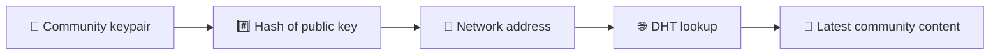
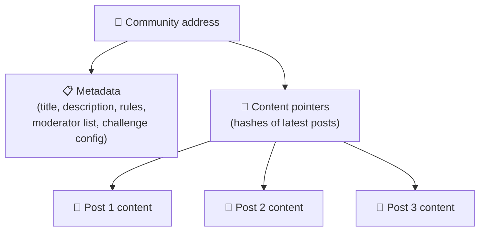
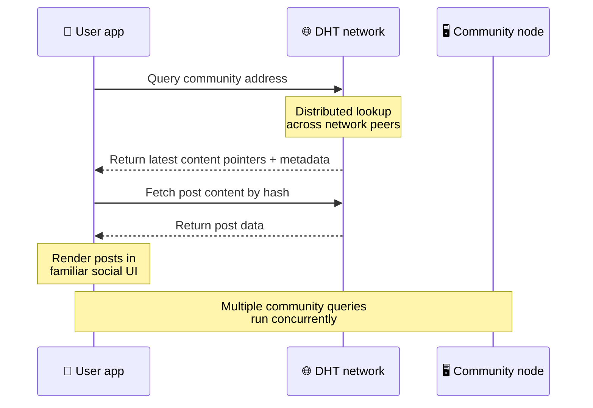
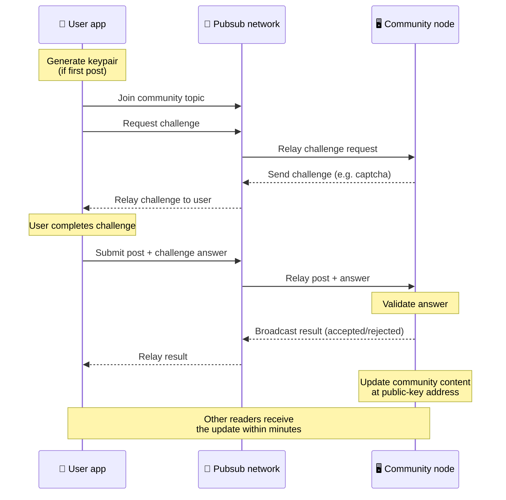
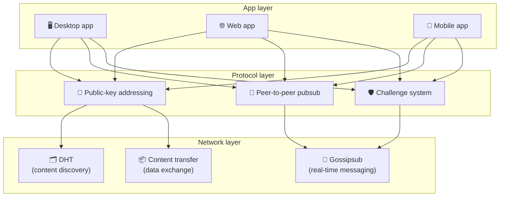

# Peer-to-Peer Protokoll

A Bitsocial nem használ blokkláncot, összevonási szervert vagy központi háttérrendszert. Ehelyett két ötletet ötvöz – **nyilvános kulcson alapuló címzés** és **peer-to-peer pub** –, amelyek lehetővé teszik, hogy bárki otthont adjon egy közösségnek fogyasztói hardverről, miközben a felhasználók fiókok nélkül olvasnak és posztolnak a vállalat által vezérelt szolgáltatásokban.

A kevésbé technikai áttekintésért olvassa el [A Bitsocial protokoll teljes laikus magyarázata](./layman-protocol-explanation.md).

## A két probléma

A decentralizált közösségi hálózatnak két kérdésre kell választ adnia:

1. **Adatok** — hogyan tárolja és szolgálja ki a világ közösségi tartalmait központi adatbázis nélkül?
2. **Spam** — hogyan akadályozhatja meg a visszaéléseket, miközben a hálózat ingyenesen használható?

A Bitsocial úgy oldja meg az adatproblémát, hogy teljesen kihagyja a blokkláncot: a közösségi médiának nincs szüksége globális tranzakciós rendelésre vagy minden régi bejegyzés állandó elérhetőségére. Megoldja a levélszemét-problémát azáltal, hogy minden közösség számára lehetővé teszi a saját levélszemét-ellenes kihívásának futtatását a peer-to-peer hálózaton keresztül.

A hálózati réteg feletti felfedezési modellhez lásd: [Tartalom felfedezése](./content-discovery.md).

---

## Nyilvános kulcs alapú címzés

A BitTorrentben egy fájl hash-je lesz a címe (_tartalom-alapú címzés_). A Bitsocial hasonló ötletet használ a nyilvános kulcsokkal: egy közösség nyilvános kulcsának hash-je lesz a hálózati címe.

A hálózat bármely partnere végrehajthat egy DHT (distributed hash table) lekérdezést az adott címre, és lekérheti a közösség legújabb állapotát. Minden alkalommal, amikor a tartalom frissül, a verziószáma növekszik. A hálózat csak a legújabb verziót tartja meg – nincs szükség minden történelmi állapot megőrzésére, ami miatt ez a megközelítés könnyű a blokklánchoz képest.

### Mi kerül tárolásra a címen

A közösségi cím nem tartalmazza közvetlenül a teljes bejegyzés tartalmát. Ehelyett a tartalomazonosítók listáját tárolja – a tényleges adatokra mutató kivonatokat. A kliens ezután lekéri az egyes tartalmakat a DHT vagy tracker-stílusú kereséseken keresztül.

Legalább egy partner mindig rendelkezik az adatokkal: a közösségi operátor csomópontja. Ha a közösség népszerű, akkor sok más társ is rendelkezik vele, és a terhelés magától eloszlik, ugyanúgy, ahogy a népszerű torrentek letöltése is gyorsabb.

---

## Peer-to-peer pub

A Pubsub (közzététel-feliratkozás) egy üzenetküldési minta, amelyben a társak feliratkoznak egy témára, és megkapják az adott témában közzétett minden üzenetet. A Bitsocial peer-to-peer pub-hálózatot használ – bárki publikálhat, bárki feliratkozhat, és nincs központi üzenetközvetítő.

Egy közösségnek való bejegyzés közzétételéhez a felhasználó közzétesz egy üzenetet, amelynek témája megegyezik a közösség nyilvános kulcsával. A közösségi üzemeltető csomópontja felveszi, ellenőrzi, és – ha megfelel a levélszemét-ellenes kihívásnak – beleveszi a következő tartalomfrissítésbe.

---

## Anti-spam: kihívások a pubsub miatt

A nyílt pub-hálózat ki van téve a levélszemét-özönnek. A Bitsocial ezt úgy oldja meg, hogy megköveteli a megjelenítőktől, hogy teljesítsenek egy **kihívást**, mielőtt tartalmukat elfogadják.

A kihívásrendszer rugalmas: minden közösségi üzemeltető konfigurálja a saját szabályzatát. A lehetőségek a következők:

| Kihívás típusa       | Hogyan működik                                              |
| -------------------- | ----------------------------------------------------------- | ------------------ |
| **Captcha**          | Az alkalmazásban bemutatott vizuális vagy interaktív puzzle |
| **Drátakorlátozás**  | Bejegyzések korlátozása időablakonként identitásonként      |
| **Token gate**       | Egy adott token egyenlegének igazolása                      |
| **Fizetés**          | Kis befizetés megkövetelése bejegyzésenként                 |
| **Engedélyezőlista** | Csak előre jóváhagyott személyazonosságok tehetnek közzé    |
| **Egyéni kód**       | Bármilyen szabályzat, amely                                 | kódban kifejezhető |

A túl sok sikertelen kihívási kísérletet közvetítő társak le vannak tiltva a közzétételi témakörből, ami megakadályozza a szolgáltatásmegtagadási támadásokat a hálózati rétegen.

---

## Életciklus: közösség olvasása

Ez történik, amikor a felhasználó megnyitja az alkalmazást, és megtekinti egy közösség legújabb bejegyzéseit.

**Lépésről lépésre:**

1. A felhasználó megnyitja az alkalmazást, és egy közösségi felületet lát.
2. A kliens csatlakozik a peer-to-peer hálózathoz, és DHT-lekérdezést végez minden egyes közösség számára
   következik. A lekérdezések mindegyike néhány másodpercet vesz igénybe, de párhuzamosan fut.
3. Minden lekérdezés visszaadja a közösség legújabb tartalmi mutatóit és metaadatait (cím, leírás,
   moderátorlista, kihívás konfigurációja).
4. A kliens lekéri a bejegyzés tényleges tartalmát ezen mutatók segítségével, majd mindent megjelenít a
   ismerős közösségi felület.

---

## Életciklus: bejegyzés közzététele

A közzététel egy kihívás-válasz kézfogást jelent a pubsub felett, mielőtt a bejegyzést elfogadják.

**Lépésről lépésre:**

1. Az alkalmazás létrehoz egy kulcspárt a felhasználó számára, ha még nem rendelkezik ilyennel.
2. A felhasználó bejegyzést ír egy közösség számára.
3. Az ügyfél csatlakozik az adott közösség közzétételi témájához (a közösség nyilvános kulcsához kulcsolva).
4. Az ügyfél kihívást kér a pubsub-on keresztül.
5. A közösségi operátor csomópontja kihívást küld vissza (például captcha).
6. A felhasználó teljesíti a kihívást.
7. Az ügyfél elküldi a bejegyzést a kihívás válaszával együtt a pubsub-on keresztül.
8. A közösségi operátor csomópontja érvényesíti a választ. Ha helyes, a posztot elfogadjuk.
9. A csomópont a pubsub-on keresztül sugározza az eredményt, így a hálózati partnerek tudják, hogy folytatják a továbbítást
   üzenetek ettől a felhasználótól.
10. A csomópont frissíti a közösség tartalmát a nyilvános kulcsú címén.
11. Néhány percen belül a közösség minden olvasója megkapja a frissítést.

---

## Építészeti áttekintés

A teljes rendszer három rétegből áll, amelyek együtt működnek:

| Réteg           | Szerep                                                                                                                                                |
| --------------- | ----------------------------------------------------------------------------------------------------------------------------------------------------- |
| **Alkalmazás**  | Felhasználói felület. Több alkalmazás is létezhet, mindegyik saját dizájnnal rendelkezik, és mindegyik ugyanazt a közösséget és identitást használja. |
| **Jegyzőkönyv** | Meghatározza a közösségek megszólításának módját, a bejegyzések közzétételének módját és a spamek megelőzésének módját.                               |
| **Hálózat**     | A mögöttes peer-to-peer infrastruktúra: DHT a felfedezéshez, gossipsub a valós idejű üzenetküldéshez és tartalomátvitel az adatcseréhez.              |

---

## Adatvédelem: a szerzők leválasztása az IP-címekről

Amikor egy felhasználó közzétesz egy bejegyzést, a tartalmat **titkosítják a közösségi üzemeltető nyilvános kulcsával**, mielőtt belépne a közzétételi hálózatba. Ez azt jelenti, hogy bár a hálózati megfigyelők láthatják, hogy egy társszolgáltató közzétett _valamit_, nem tudják megállapítani:

- amit a tartalom mond
- melyik szerző identitása tette közzé

Ez hasonló ahhoz, ahogy a BitTorrent lehetővé teszi annak felfedezését, hogy mely IP-címek indítanak el egy torrentet, de azt nem, hogy eredetileg ki hozta létre azt. A titkosítási réteg az alapvonalon felül további adatvédelmi garanciát ad.

---

## Böngésző peer-to-peer

A P2P böngésző mostantól lehetséges a Bitsocial kliensekben. A böngészőalkalmazások futtathatnak egy [Helia](https://helia.io/) csomópontot, ugyanazt a Bitsocial protokoll kliens veremét használhatják, mint más alkalmazások, és tartalmat kérhetnek le a társaktól, ahelyett, hogy központi IPFS-átjárót kérnének a kiszolgáláshoz. A böngésző közvetlenül is részt vehet a közzétételben, így a közzétételhez nincs szükség platformtulajdonos pubsub-szolgáltatóra a boldog útvonalon.

Ez a webes terjesztés fontos mérföldköve: egy normál HTTPS-webhely megnyílhat élő P2P közösségi klienssé. A felhasználóknak nem kell asztali alkalmazást telepíteniük ahhoz, hogy olvashassanak a hálózatról, és az alkalmazás üzemeltetőjének nem kell központi átjárót futtatnia, amely minden böngészőfelhasználó számára a cenzúra vagy a moderálás korlátja lesz.

A böngésző elérési útja eltérő korlátokkal rendelkezik, mint egy asztali vagy kiszolgáló csomópont:

- egy böngésző csomópont általában nem tud tetszőleges bejövő kapcsolatokat elfogadni a nyilvános internetről
- képes betölteni, ellenőrizni, gyorsítótárazni és közzétenni az adatokat, amíg az alkalmazás nyitva van
- nem szabad egy közösség adatainak hosszú életű gazdájaként kezelni
- a teljes közösségi tárhelyszolgáltatást továbbra is legjobban egy asztali alkalmazás, a `bitsocial-cli` vagy más
  mindig bekapcsolt csomópont

A HTTP-útválasztók továbbra is fontosak a tartalomfelderítés szempontjából: a közösségi hash-hez szolgáltatói címeket adnak vissza. Ezek nem IPFS-átjárók, mert nem magát a tartalmat szolgálják ki. A felfedezés után a böngészőkliens csatlakozik a társakhoz, és lekéri az adatokat a P2P-veremen keresztül.

Az 5chan ezt a normál 5chan.app webalkalmazás Speciális beállítások kapcsolójaként teszi közzé. A legújabb `pkc-js` böngészőverem kellően stabillá vált a nyilvános teszteléshez, miután a libp2p/gossipsub felfelé irányuló együttműködési munkája címzett üzeneteket kézbesített a Helia és a Kubo partnerek között. A beállítás a böngésző P2P vezérlését tartja, miközben több valós tesztelést kap; amint elegendő termelési biztonsággal rendelkezik, az alapértelmezett webes elérési úttá válhat.

## Átjáró tartalék

Az átjáró által támogatott böngészőhozzáférés továbbra is hasznos a kompatibilitás és a bevezetés tartalékaként. Az átjáró adatokat továbbíthat a P2P hálózat és a böngészőkliens között, ha a böngésző nem tud közvetlenül csatlakozni a hálózathoz, vagy ha az alkalmazás szándékosan a régebbi utat választja. Ezek az átjárók:

- bárki irányíthatja
- nem igényel felhasználói fiókot vagy fizetést
- ne szerezzen felügyeleti jogot a felhasználói identitások vagy közösségek felett
- adatvesztés nélkül kicserélhető

A célarchitektúra először a böngésző P2P, és az átjárók opcionális tartalék, nem pedig az alapértelmezett szűk keresztmetszet.

---

## Miért nem blokklánc?

A blokkláncok megoldják a dupla költés problémáját: tudniuk kell minden tranzakció pontos sorrendjét, nehogy valaki kétszer költse el ugyanazt az érmét.

A közösségi médiának nincs dupla költési problémája. Nem számít, ha az A bejegyzést egy ezredmásodperccel a B bejegyzés előtt tették közzé, és a régi bejegyzéseknek nem kell állandóan elérhetőnek lenniük minden csomóponton.

A blokklánc kihagyásával a Bitsocial elkerüli:

- **gázdíj** — a postázás ingyenes
- **áteresztőképességi korlátok** — nincs blokkméret vagy blokkidő szűk keresztmetszet
- **tárhely felfúvódás** — a csomópontok csak azt tartják meg, amire szükségük van
- **konszenzusos költség** — nincs szükség bányászokra, érvényesítőkre vagy kockára

A kompromisszum az, hogy a Bitsocial nem garantálja a régi tartalmak állandó elérhetőségét. De a közösségi médiában ez elfogadható kompromisszum: a közösségi üzemeltető csomópontja tárolja az adatokat, a népszerű tartalom sok társ között elterjed, és a nagyon régi bejegyzések természetesen elhalványulnak – ugyanúgy, ahogy minden közösségi platformon teszik.

## Miért nem szövetség?

Az egyesített hálózatok (például az e-mail vagy az ActivityPub-alapú platformok) javítják a központosítást, de továbbra is vannak szerkezeti korlátai:

- **Szerverfüggőség** – minden közösségnek szüksége van egy tartományra, TLS-re és folyamatos szerverre
  karbantartás
- **Rendszergazdai bizalom** – a szerveradminisztrátor teljes mértékben felügyeli a felhasználói fiókokat és a tartalmat
- **Fragmentáltság** – a szerverek közötti mozgás gyakran követők, előzmények vagy identitás elvesztésével jár
- **Költség** – valakinek fizetnie kell a tárhelyért, ami nyomást gyakorol a konszolidációra

A Bitsocial peer-to-peer megközelítése teljesen eltávolítja a szervert az egyenletből. Egy közösségi csomópont futhat laptopon, Raspberry Pi-n vagy olcsó VPS-en. Az operátor szabályozza a moderálási szabályzatot, de nem tudja lefoglalni a felhasználói identitásokat, mivel az identitásokat kulcspár vezérli, nem a szerver adja meg.

---

## Összegzés

A Bitsocial két primitívre épül: a nyilvános kulcson alapuló címzésre a tartalomfelderítéshez és a peer-to-peer pub-ra a valós idejű kommunikációhoz. Együtt létrehoznak egy közösségi hálózatot, ahol:

- a közösségeket kriptográfiai kulcsok azonosítják, nem pedig domain nevek
- a tartalom torrentként terjed a társaik között, nem egyetlen adatbázisból szolgálják ki
- A kéretlen levelekkel szembeni ellenállás minden közösségben helyi jellegű, nem egy platform kényszeríti rá
- a felhasználók kulcspárokon keresztül birtokolják identitásukat, nem visszavonható fiókokon keresztül
- az egész rendszer szerverek, blokkláncok vagy platformdíjak nélkül fut
