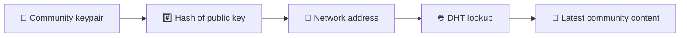
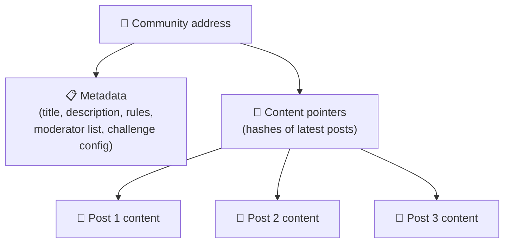
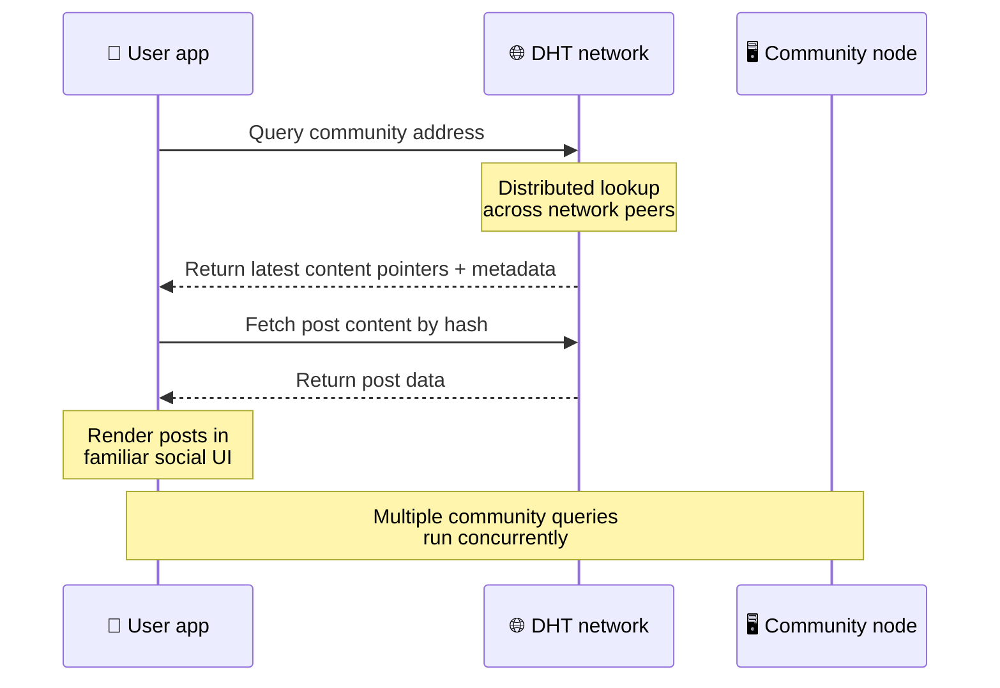
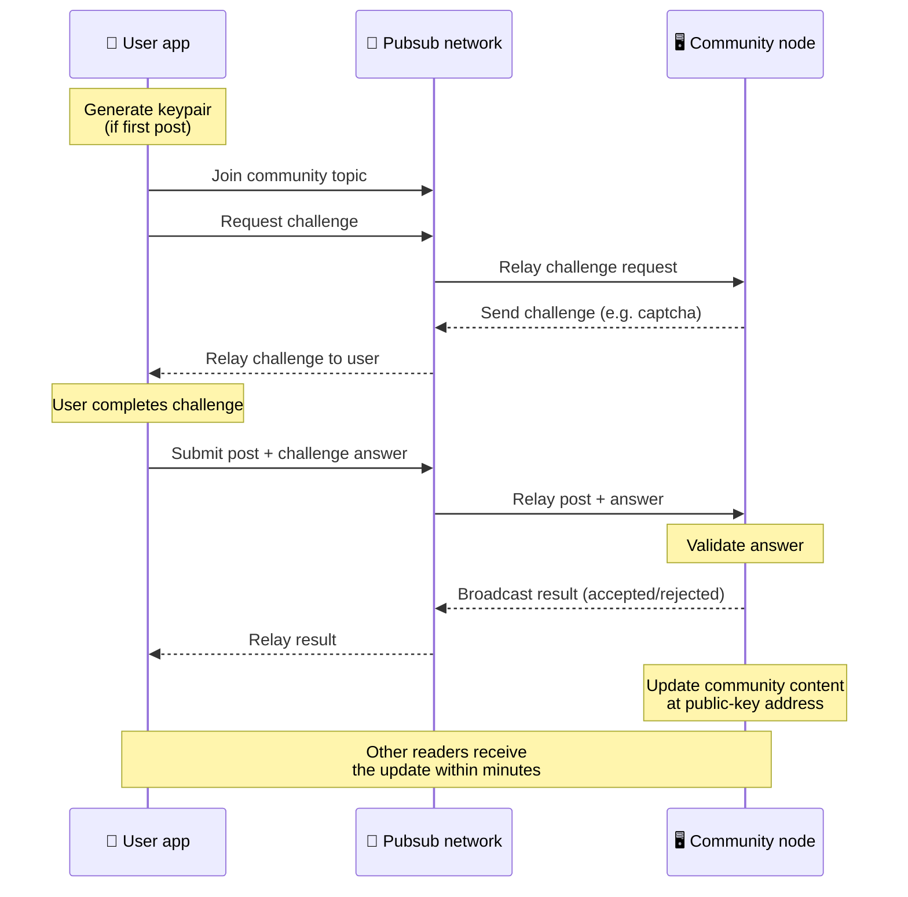
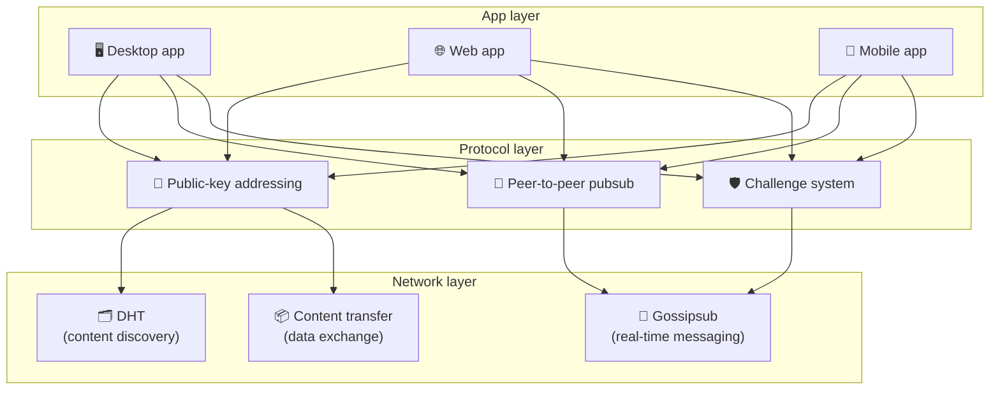

# Protokol Peer-to-Peer

Bitsocial tidak menggunakan blockchain, server federasi, atau backend terpusat. Sebaliknya, ini menggabungkan dua ide — **pengalamatan berbasis kunci publik** dan **pubsub peer-to-peer** — untuk memungkinkan siapa pun menghosting komunitas dari perangkat keras konsumen sementara pengguna membaca dan memposting tanpa akun di layanan yang dikendalikan perusahaan.

Untuk panduan yang kurang teknis, baca [Penjelasan awam lengkap tentang protokol Bitsocial](./layman-protocol-explanation.md).

## Kedua masalah tersebut

Jejaring sosial yang terdesentralisasi harus menjawab dua pertanyaan:

1. **Data** — bagaimana Anda menyimpan dan menyajikan konten sosial dunia tanpa database pusat?
2. **Spam** — bagaimana Anda mencegah penyalahgunaan sekaligus menjaga jaringan tetap bebas digunakan?

Bitsocial memecahkan masalah data dengan melewatkan blockchain sepenuhnya: media sosial tidak memerlukan pemesanan transaksi global atau ketersediaan permanen dari setiap postingan lama. Ini memecahkan masalah spam dengan membiarkan setiap komunitas menjalankan tantangan anti-spamnya sendiri melalui jaringan peer-to-peer.

Untuk model penemuan di atas lapisan jaringan ini, lihat [Penemuan Konten](./content-discovery.md).

---

## Pengalamatan berbasis kunci publik

Di BitTorrent, hash file menjadi alamatnya (_pengalamatan berbasis konten_). Bitsocial menggunakan ide serupa dengan kunci publik: hash dari kunci publik komunitas menjadi alamat jaringannya.

Setiap rekan di jaringan dapat melakukan kueri DHT (tabel hash terdistribusi) untuk alamat tersebut dan mengambil status terbaru komunitas. Setiap kali konten diperbarui, nomor versinya bertambah. Jaringan hanya menyimpan versi terbaru — tidak perlu menyimpan setiap status historis, yang membuat pendekatan ini lebih ringan dibandingkan dengan blockchain.

### Apa yang disimpan di alamat tersebut

Alamat komunitas tidak memuat konten postingan lengkap secara langsung. Sebaliknya, ia menyimpan daftar pengidentifikasi konten — hash yang menunjuk ke data sebenarnya. Klien kemudian mengambil setiap konten melalui DHT atau pencarian bergaya pelacak.

Setidaknya satu rekan selalu memiliki data: node operator komunitas. Jika komunitasnya populer, banyak rekan lain yang juga akan memilikinya dan bebannya akan didistribusikan dengan sendirinya, sama seperti torrent populer yang lebih cepat diunduh.

---

## Pubsub antar-rekan

Pubsub (terbitkan-berlangganan) adalah pola pesan di mana rekan-rekan berlangganan suatu topik dan menerima setiap pesan yang dipublikasikan untuk topik tersebut. Bitsocial menggunakan jaringan pubsub peer-to-peer — siapa pun dapat mempublikasikan, siapa pun dapat berlangganan, dan tidak ada perantara pesan pusat.

Untuk memublikasikan postingan ke komunitas, pengguna memublikasikan pesan yang topiknya sama dengan kunci publik komunitas. Node operator komunitas mengambilnya, memvalidasinya, dan — jika lolos tantangan anti-spam — memasukkannya ke dalam pembaruan konten berikutnya.

---

## Anti-spam: tantangan terhadap pubsub

Jaringan pubsub terbuka rentan terhadap banjir spam. Bitsocial memecahkan masalah ini dengan mengharuskan penerbit menyelesaikan **tantangan** sebelum konten mereka diterima.

Sistem tantangannya fleksibel: setiap operator komunitas mengonfigurasi kebijakannya sendiri. Pilihannya meliputi:

| Jenis tantangan           | Cara kerjanya                                                         |
| ------------------------- | --------------------------------------------------------------------- |
| **Captcha**               | Teka-teki visual atau interaktif disajikan dalam aplikasi             |
| **Pembatasan tarif**      | Batasi postingan per rentang waktu per identitas                      |
| **Gerbang Token**         | Memerlukan bukti saldo token tertentu                                 |
| **Pembayaran**            | Memerlukan pembayaran kecil per posting                               |
| **Daftar yang diizinkan** | Hanya identitas yang telah disetujui sebelumnya yang dapat memposting |
| **Kode khusus**           | Kebijakan apa pun yang dapat diungkapkan dalam kode                   |

Rekan yang menyampaikan terlalu banyak upaya tantangan yang gagal akan diblokir dari topik pubsub, sehingga mencegah serangan penolakan layanan pada lapisan jaringan.

---

## Siklus Hidup: membaca komunitas

Inilah yang terjadi ketika pengguna membuka aplikasi dan melihat postingan terbaru komunitas.

**Langkah demi langkah:**

1. Pengguna membuka aplikasi dan melihat antarmuka sosial.
2. Klien bergabung dengan jaringan peer-to-peer dan membuat kueri DHT untuk setiap komunitas pengguna
   berikut. Kueri masing-masing membutuhkan waktu beberapa detik tetapi dijalankan secara bersamaan.
3. Setiap kueri mengembalikan penunjuk konten dan metadata terbaru komunitas (judul, deskripsi,
   daftar moderator, konfigurasi tantangan).
4. Klien mengambil konten posting sebenarnya menggunakan pointer tersebut, lalu merender semuanya dalam a
   antarmuka sosial yang familiar.

---

## Siklus Hidup: memublikasikan postingan

Penerbitan melibatkan jabat tangan tantangan-respons atas pubsub sebelum postingan diterima.

**Langkah demi langkah:**

1. Aplikasi ini menghasilkan pasangan kunci untuk pengguna jika mereka belum memilikinya.
2. Pengguna menulis postingan untuk komunitas.
3. Klien bergabung dengan topik pubsub untuk komunitas tersebut (dikunci ke kunci publik komunitas).
4. Klien meminta tantangan atas pubsub.
5. Node operator komunitas mengirimkan kembali tantangan (misalnya, captcha).
6. Pengguna menyelesaikan tantangan.
7. Klien mengirimkan postingan beserta jawaban tantangan melalui pubsub.
8. Node operator komunitas memvalidasi jawabannya. Jika benar, postingan diterima.
9. Node menyiarkan hasilnya melalui pubsub sehingga rekan jaringan mengetahui cara meneruskannya
   pesan dari pengguna ini.
10. Node memperbarui konten komunitas di alamat kunci publiknya.
11. Dalam beberapa menit, setiap pembaca komunitas menerima pembaruan.

---

## Ikhtisar arsitektur

Sistem lengkap memiliki tiga lapisan yang bekerja sama:

| Lapisan      | Peran                                                                                                                                                       |
| ------------ | ----------------------------------------------------------------------------------------------------------------------------------------------------------- |
| **Aplikasi** | Antarmuka pengguna. Ada banyak aplikasi yang bisa dibuat, masing-masing memiliki desainnya sendiri, dan semuanya berbagi komunitas dan identitas yang sama. |
| **Protokol** | Menentukan cara komunitas ditangani, cara postingan dipublikasikan, dan cara mencegah spam.                                                                 |
| **Jaringan** | Infrastruktur peer-to-peer yang mendasari: DHT untuk penemuan, gosipsub untuk pengiriman pesan secara real-time, dan transfer konten untuk pertukaran data. |

---

## Privasi: memutuskan tautan penulis dari alamat IP

Saat pengguna memublikasikan postingan, kontennya **dienkripsi dengan kunci publik operator komunitas** sebelum memasuki jaringan pubsub. Artinya, meskipun pengamat jaringan dapat melihat bahwa rekannya memublikasikan _sesuatu_, mereka tidak dapat menentukan:

- apa yang dikatakan kontennya
- identitas penulis mana yang menerbitkannya

Hal ini mirip dengan bagaimana BitTorrent memungkinkan untuk menemukan IP mana yang menghasilkan torrent tetapi tidak mengetahui siapa yang pertama kali membuatnya. Lapisan enkripsi menambahkan jaminan privasi tambahan di atas garis dasar tersebut.

---

## Peramban peer-to-peer

P2P browser sekarang dapat dilakukan di klien Bitsocial. Aplikasi browser dapat menjalankan node [Helia](https://helia.io/), menggunakan tumpukan klien protokol Bitsocial yang sama dengan aplikasi lain, dan mengambil konten dari rekan-rekan alih-alih meminta gateway IPFS terpusat untuk menyajikannya. Browser juga dapat berpartisipasi dalam pubsub secara langsung, jadi pengeposan tidak memerlukan penyedia pubsub milik platform di jalur bahagia.

Ini adalah tonggak penting untuk distribusi web: situs web HTTPS biasa dapat dibuka menjadi klien sosial P2P langsung. Pengguna tidak perlu menginstal aplikasi desktop sebelum mereka dapat membaca dari jaringan, dan operator aplikasi tidak perlu menjalankan gateway pusat yang menjadi titik penyensoran atau moderasi untuk setiap pengguna browser.

Jalur browser memiliki batasan yang berbeda dari node desktop atau server:

- node browser biasanya tidak dapat menerima koneksi masuk yang sewenang-wenang dari internet publik
- itu dapat memuat, memvalidasi, menyimpan cache, dan mempublikasikan data saat aplikasi terbuka
- ia tidak boleh diperlakukan sebagai tempat penyimpanan data komunitas yang berumur panjang
- hosting komunitas lengkap masih paling baik ditangani oleh aplikasi desktop, `bitsocial-cli`, atau lainnya
  simpul yang selalu aktif

Router HTTP masih penting dalam penemuan konten: mereka mengembalikan alamat penyedia untuk hash komunitas. Ini bukan gateway IPFS karena tidak menyajikan konten itu sendiri. Setelah penemuan, klien browser terhubung ke rekan-rekan dan mengambil data melalui tumpukan P2P.

5chan memaparkan ini sebagai tombol Pengaturan Lanjutan keikutsertaan di aplikasi web 5chan.app normal. Tumpukan browser `pkc-js` terbaru telah menjadi cukup stabil untuk pengujian publik setelah pekerjaan interop libp2p/gossipsub upstream menangani pengiriman pesan antara rekan-rekan Helia dan Kubo. Pengaturan ini membuat P2P browser tetap terkontrol saat melakukan lebih banyak pengujian di dunia nyata; setelah memiliki kepercayaan produksi yang cukup, ini dapat menjadi jalur web default.

## Penggantian gerbang

Akses browser yang didukung gateway masih berguna sebagai pengganti kompatibilitas dan peluncuran. Gateway dapat menyampaikan data antara jaringan P2P dan klien browser ketika browser tidak dapat bergabung dengan jaringan secara langsung atau ketika aplikasi sengaja memilih jalur yang lebih lama. Gerbang ini:

- dapat dijalankan oleh siapa saja
- tidak memerlukan akun pengguna atau pembayaran
- tidak mendapatkan hak asuh atas identitas pengguna atau komunitas
- dapat ditukar tanpa kehilangan data

Arsitektur targetnya adalah P2P browser terlebih dahulu, dengan gateway sebagai alternatif opsional, bukan hambatan default.

---

## Mengapa bukan blockchain?

Blockchain memecahkan masalah pembelanjaan ganda: mereka perlu mengetahui urutan pasti setiap transaksi untuk mencegah seseorang membelanjakan koin yang sama dua kali.

Media sosial tidak memiliki masalah pembelanjaan ganda. Tidak masalah jika postingan A diterbitkan satu milidetik sebelum postingan B, dan postingan lama tidak perlu tersedia secara permanen di setiap node.

Dengan melewatkan blockchain, Bitsocial menghindari:

- **biaya bahan bakar** — posting gratis
- **batas throughput** — tidak ada hambatan ukuran blok atau waktu blok
- **penyimpanan membengkak** — node hanya menyimpan apa yang mereka perlukan
- **overhead konsensus** — tidak diperlukan penambang, validator, atau staking

Imbalannya adalah Bitsocial tidak menjamin ketersediaan konten lama secara permanen. Namun untuk media sosial, hal ini dapat diterima: node operator komunitas menyimpan data, konten populer tersebar ke banyak rekan, dan postingan yang sangat lama secara alami memudar — sama seperti yang terjadi di setiap platform sosial.

## Mengapa bukan federasi?

Jaringan gabungan (seperti email atau platform berbasis ActivityPub) meningkatkan sentralisasi tetapi masih memiliki keterbatasan struktural:

- **Ketergantungan server** — setiap komunitas memerlukan server dengan domain, TLS, dan berkelanjutan
  pemeliharaan
- **Kepercayaan Admin** — admin server memiliki kontrol penuh atas akun pengguna dan konten
- **Fragmentasi** — berpindah antar server sering kali berarti kehilangan pengikut, riwayat, atau identitas
- **Biaya** — seseorang harus membayar untuk hosting, yang menciptakan tekanan terhadap konsolidasi

Pendekatan peer-to-peer Bitsocial menghilangkan server dari persamaan sepenuhnya. Node komunitas dapat berjalan di laptop, Raspberry Pi, atau VPS murah. Operator mengontrol kebijakan moderasi tetapi tidak dapat mengambil identitas pengguna, karena identitas dikontrol oleh pasangan kunci, bukan diberikan oleh server.

---

## Ringkasan

Bitsocial dibangun di atas dua primitif: pengalamatan berbasis kunci publik untuk penemuan konten, dan pubsub peer-to-peer untuk komunikasi real-time. Bersama-sama mereka menghasilkan jaringan sosial di mana:

- komunitas diidentifikasi dengan kunci kriptografi, bukan nama domain
- konten menyebar ke seluruh rekan seperti torrent, tidak disajikan dari satu database
- resistensi terhadap spam bersifat lokal pada setiap komunitas, bukan ditentukan oleh platform
- pengguna memiliki identitas mereka melalui pasangan kunci, bukan melalui akun yang dapat dibatalkan
- seluruh sistem berjalan tanpa biaya server, blockchain, atau platform
