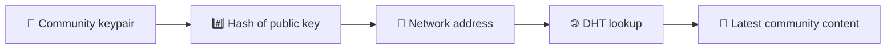
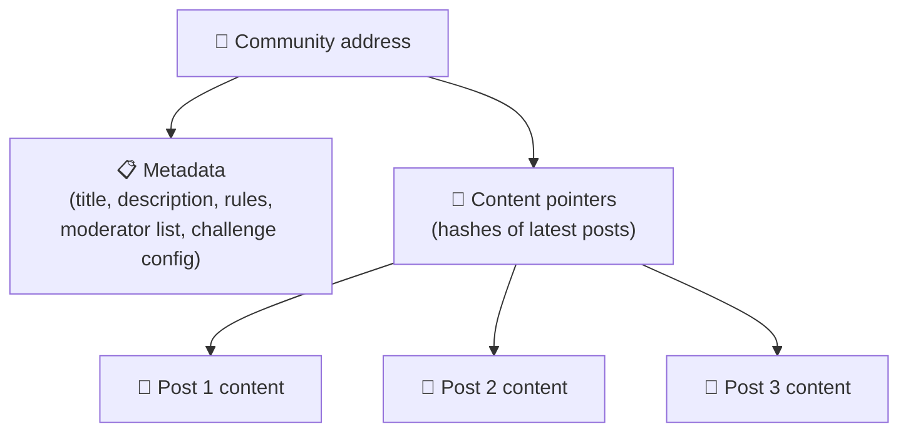
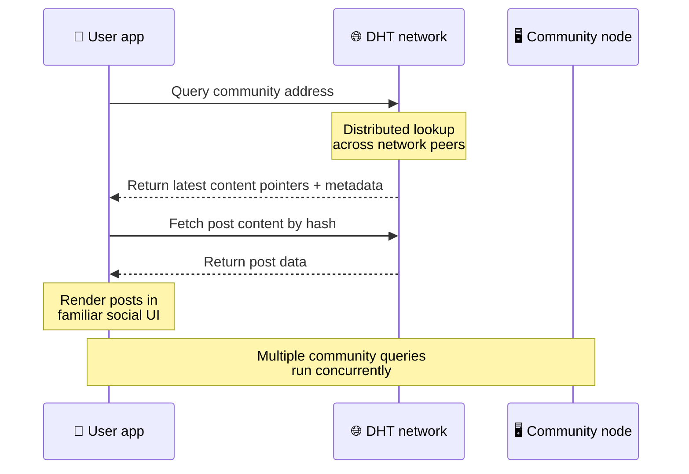
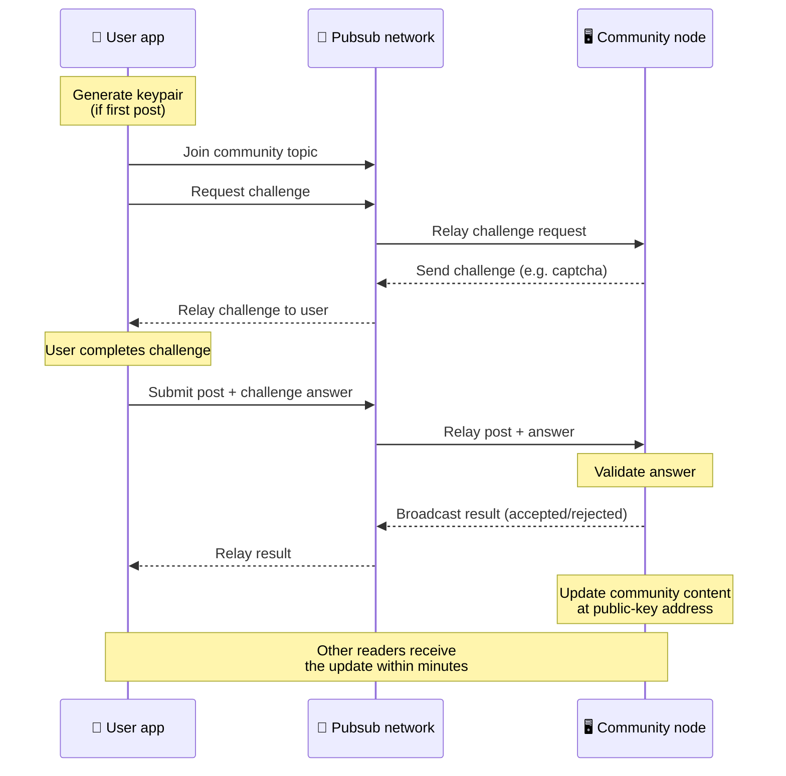
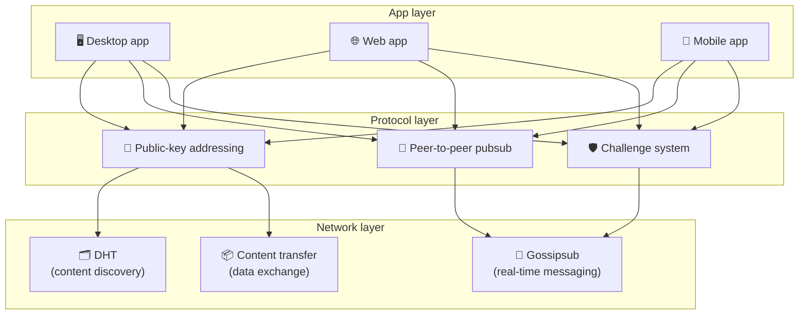

# Protocollo peer-to-peer

Bitsocial non utilizza una blockchain, un server federativo o un backend centralizzato. Combina invece due idee: **indirizzamento basato su chiave pubblica** e **pubsub peer-to-peer**, per consentire a chiunque di ospitare una comunità da hardware consumer mentre gli utenti leggono e pubblicano senza account su qualsiasi servizio controllato dall'azienda.

Per una procedura dettagliata meno tecnica, leggere [Una spiegazione completa per i non addetti ai lavori del protocollo Bitsocial](./layman-protocol-explanation.md).

## I due problemi

Un social network decentralizzato deve rispondere a due domande:

1. **Dati**: come archiviare e servire i contenuti social di tutto il mondo senza un database centrale?
2. **Spam**: come prevenire gli abusi mantenendo la rete libera da utilizzare?

Bitsocial risolve il problema dei dati saltando completamente la blockchain: i social media non hanno bisogno dell'ordine delle transazioni globali o della disponibilità permanente di ogni vecchio post. Risolve il problema dello spam consentendo a ciascuna comunità di eseguire la propria sfida anti-spam sulla rete peer-to-peer.

Per il modello di scoperta sopra questo livello di rete, consulta [Scoperta dei contenuti](./content-discovery.md).

---

## Indirizzamento basato su chiave pubblica

In BitTorrent, l'hash di un file diventa il suo indirizzo (_indirizzamento basato sul contenuto_). Bitsocial utilizza un'idea simile con le chiavi pubbliche: l'hash della chiave pubblica di una comunità diventa il suo indirizzo di rete.

Qualsiasi peer sulla rete può eseguire una query DHT (tabella hash distribuita) per quell'indirizzo e recuperare lo stato più recente della comunità. Ogni volta che il contenuto viene aggiornato, il suo numero di versione aumenta. La rete conserva solo la versione più recente: non è necessario preservare ogni stato storico, il che rende questo approccio leggero rispetto a una blockchain.

### Cosa viene memorizzato all'indirizzo

L'indirizzo della community non contiene direttamente il contenuto completo del post. Memorizza invece un elenco di identificatori di contenuto: hash che puntano ai dati effettivi. Il client quindi recupera ogni contenuto tramite DHT o ricerche in stile tracker.

Almeno un peer ha sempre i dati: il nodo dell'operatore della comunità. Se la community è popolare, anche molti altri peer lo avranno e il carico si distribuirà da solo, allo stesso modo in cui i torrent più popolari sono più veloci da scaricare.

---

## Pubsub peer-to-peer

Pubsub (pubblica-sottoscrivi) è un modello di messaggistica in cui i peer si iscrivono a un argomento e ricevono ogni messaggio pubblicato su quell'argomento. Bitsocial utilizza una rete pubsub peer-to-peer: chiunque può pubblicare, chiunque può iscriversi e non esiste un broker di messaggi centrale.

Per pubblicare un post in una comunità, un utente pubblica un messaggio il cui argomento equivale alla chiave pubblica della comunità. Il nodo dell'operatore della comunità lo preleva, lo convalida e, se supera la sfida anti-spam, lo include nel successivo aggiornamento del contenuto.

---

## Anti-spam: sfide su pubsub

Una rete pubsub aperta è vulnerabile alle inondazioni di spam. Bitsocial risolve questo problema richiedendo agli editori di completare una **sfida** prima che il loro contenuto venga accettato.

Il sistema di sfida è flessibile: ogni operatore comunitario configura la propria policy. Le opzioni includono:

| Tipo di sfida                  | Come funziona                                      |
| ------------------------------ | -------------------------------------------------- |
| **Captcha**                    | Puzzle visivo o interattivo presentato nell'app    |
| **Limitazione della velocità** | Limita i post per finestra temporale per identità  |
| **Porta gettoni**              | Richiedere prova del saldo di un gettone specifico |
| **Pagamento**                  | Richiedi un piccolo pagamento per post             |
| **Lista consentita**           | Solo le identità pre-approvate possono pubblicare  |
| **Codice personalizzato**      | Qualsiasi politica esprimibile nel codice          |

I peer che inoltrano troppi tentativi di sfida falliti vengono bloccati dall'argomento pubsub, il che impedisce attacchi di negazione del servizio a livello di rete.

---

## Ciclo di vita: leggere una comunità

Questo è ciò che accade quando un utente apre l'app e visualizza gli ultimi post di una community.

**Passo dopo passo:**

1. L'utente apre l'app e vede un'interfaccia social.
2. Il client si unisce alla rete peer-to-peer ed effettua una query DHT per ciascuna comunità dell'utente
   segue. Le query richiedono alcuni secondi ciascuna ma vengono eseguite contemporaneamente.
3. Ogni query restituisce i puntatori e i metadati dei contenuti più recenti della comunità (titolo, descrizione,
   elenco dei moderatori, configurazione della sfida).
4. Il client recupera il contenuto effettivo del post utilizzando tali puntatori, quindi esegue il rendering di tutto in a
   interfaccia sociale familiare.

---

## Ciclo di vita: pubblicare un post

La pubblicazione prevede una stretta di mano di tipo challenge-response su pubsub prima che il post venga accettato.

**Passo dopo passo:**

1. L'app genera una coppia di chiavi per l'utente se non ne ha ancora una.
2. L'utente scrive un post per una community.
3. Il client si unisce all'argomento pubsub per quella comunità (con chiave pubblica della comunità).
4. Il client richiede una sfida su pubsub.
5. Il nodo dell'operatore della comunità restituisce una sfida (ad esempio un captcha).
6. L'utente completa la sfida.
7. Il cliente invia il post insieme alla risposta alla sfida tramite pubsub.
8. Il nodo dell'operatore della comunità convalida la risposta. Se corretto, il post è accettato.
9. Il nodo trasmette il risultato su pubsub in modo che i peer della rete sappiano che devono continuare l'inoltro
   messaggi da questo utente.
10. Il nodo aggiorna il contenuto della comunità al suo indirizzo a chiave pubblica.
11. Nel giro di pochi minuti, ogni lettore della community riceve l'aggiornamento.

---

## Panoramica dell'architettura

Il sistema completo ha tre livelli che lavorano insieme:

| Strato         | Ruolo                                                                                                                                                              |
| -------------- | ------------------------------------------------------------------------------------------------------------------------------------------------------------------ |
| **App**        | Interfaccia utente. Possono esistere più app, ciascuna con il proprio design, e tutte condividono le stesse comunità e identità.                                   |
| **Protocollo** | Definisce come vengono indirizzate le comunità, come vengono pubblicati i post e come viene impedito lo spam.                                                      |
| **Rete**       | L'infrastruttura peer-to-peer sottostante: DHT per la scoperta, gossipsub per la messaggistica in tempo reale e trasferimento di contenuti per lo scambio di dati. |

---

## Privacy: scollegare gli autori dagli indirizzi IP

Quando un utente pubblica un post, il contenuto viene **crittografato con la chiave pubblica dell'operatore della comunità** prima che entri nella rete pubsub. Ciò significa che mentre gli osservatori della rete possono vedere che un peer ha pubblicato _qualcosa_, non possono determinare:

- cosa dice il contenuto
- quale identità dell'autore lo ha pubblicato

Questo è simile a come BitTorrent rende possibile scoprire quali IP seminano un torrent ma non chi lo ha originariamente creato. Il livello di crittografia aggiunge un’ulteriore garanzia di privacy oltre a quella base.

---

## Browser peer-to-peer

Il browser P2P è ora possibile nei client Bitsocial. Un'app browser può eseguire un nodo [Elia](https://helia.io/), utilizzare lo stesso stack client del protocollo Bitsocial di altre app e recuperare contenuti dai peer invece di chiedere a un gateway IPFS centralizzato di servirlo. Il browser può anche partecipare direttamente a pubsub, quindi la pubblicazione non ha bisogno di un provider pubsub di proprietà della piattaforma nel percorso felice.

Questa è la pietra miliare importante per la distribuzione sul web: un normale sito web HTTPS può aprirsi in un client sociale P2P live. Gli utenti non hanno bisogno di installare un’app desktop prima di poter leggere dalla rete e l’operatore dell’app non ha bisogno di eseguire un gateway centrale che diventa il punto di censura o di moderazione per ogni utente del browser.

Il percorso del browser ha limiti diversi da un nodo desktop o server:

- un nodo browser di solito non può accettare connessioni in entrata arbitrarie dall'Internet pubblica
- può caricare, convalidare, memorizzare nella cache e pubblicare dati mentre l'app è aperta
- non dovrebbe essere trattato come un host di lunga durata per i dati di una comunità
- l'hosting completo della comunità è ancora meglio gestito da un'app desktop, `bitsocial-cli` o un'altra
  nodo sempre attivo

I router HTTP sono ancora importanti per la scoperta dei contenuti: restituiscono gli indirizzi dei provider per un hash della comunità. Non sono gateway IPFS perché non servono il contenuto stesso. Dopo il rilevamento, il client browser si connette ai peer e recupera i dati tramite lo stack P2P.

5chan lo espone come un interruttore di attivazione delle Impostazioni avanzate nella normale app Web 5chan.app. L'ultimo stack del browser `pkc-js` è diventato sufficientemente stabile per i test pubblici dopo che il lavoro di interoperabilità upstream libp2p/gossipsub ha indirizzato la consegna dei messaggi tra i peer Helia e Kubo. L'impostazione mantiene il browser P2P controllato mentre vengono eseguiti ulteriori test nel mondo reale; una volta raggiunta una sufficiente sicurezza di produzione, può diventare il percorso Web predefinito.

## Ripiego del gateway

L'accesso al browser supportato dal gateway è ancora utile come fallback di compatibilità e implementazione. Un gateway può trasmettere dati tra la rete P2P e un client browser quando un browser non può connettersi direttamente alla rete o quando l'app sceglie intenzionalmente il percorso precedente. Questi gateway:

- può essere gestito da chiunque
- non richiedono account utente o pagamenti
- non ottenere la custodia delle identità o delle comunità degli utenti
- può essere scambiato senza perdere dati

L'architettura di destinazione è innanzitutto il P2P del browser, con i gateway come fallback opzionale anziché come collo di bottiglia predefinito.

---

## Perché non una blockchain?

Le blockchain risolvono il problema della doppia spesa: hanno bisogno di conoscere l’ordine esatto di ogni transazione per evitare che qualcuno spenda due volte la stessa moneta.

I social media non hanno problemi di doppia spesa. Non importa se il post A è stato pubblicato un millisecondo prima del post B e i vecchi post non devono essere permanentemente disponibili su ogni nodo.

Saltando la blockchain, Bitsocial evita:

- **Tasse del gas**: la pubblicazione è gratuita
- **Limiti di throughput**: nessuna dimensione del blocco o collo di bottiglia nel tempo del blocco
- **spazio di archiviazione eccessivo**: i nodi conservano solo ciò di cui hanno bisogno
- **overhead di consenso**: non sono richiesti miner, validatori o staking

Il compromesso è che Bitsocial non garantisce la disponibilità permanente dei vecchi contenuti. Ma per i social media, questo è un compromesso accettabile: il nodo dell’operatore della comunità conserva i dati, i contenuti popolari si diffondono su molti peer e i post molto vecchi svaniscono naturalmente, allo stesso modo in cui accade su ogni piattaforma social.

## Perché non la federazione?

Le reti federate (come le piattaforme di posta elettronica o basate su ActivityPub) migliorano la centralizzazione ma presentano ancora limitazioni strutturali:

- **Dipendenza dal server**: ogni comunità necessita di un server con un dominio, TLS e in corso
  manutenzione
- **Fiducia dell'amministratore**: l'amministratore del server ha il pieno controllo sugli account utente e sui contenuti
- **Frammentazione**: spostarsi tra server spesso significa perdere follower, cronologia o identità
- **Costo**: qualcuno deve pagare per l'hosting, il che crea pressione verso il consolidamento

L'approccio peer-to-peer di Bitsocial rimuove completamente il server dall'equazione. Un nodo della comunità può essere eseguito su un laptop, un Raspberry Pi o un VPS economico. L'operatore controlla la politica di moderazione ma non può impossessarsi delle identità degli utenti, poiché le identità sono controllate dalla coppia di chiavi, non concesse dal server.

---

## Riepilogo

Bitsocial è costruito su due primitive: indirizzamento basato su chiave pubblica per la scoperta di contenuti e pubsub peer-to-peer per la comunicazione in tempo reale. Insieme producono un social network in cui:

- le comunità sono identificate da chiavi crittografiche, non da nomi di dominio
- il contenuto si diffonde tra peer come un torrent, non servito da un unico database
- la resistenza allo spam è locale per ciascuna comunità, non imposta da una piattaforma
- gli utenti possiedono le proprie identità tramite coppie di chiavi, non tramite account revocabili
- l'intero sistema funziona senza server, blockchain o costi di piattaforma
