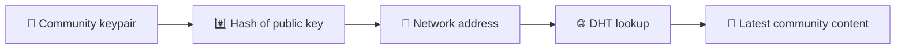
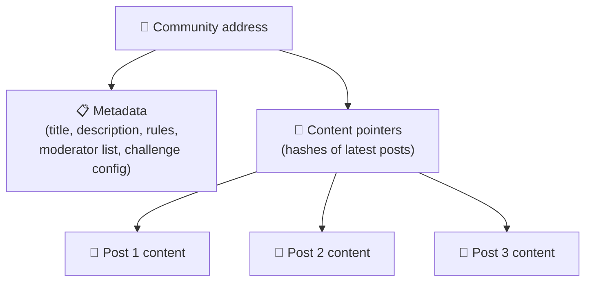
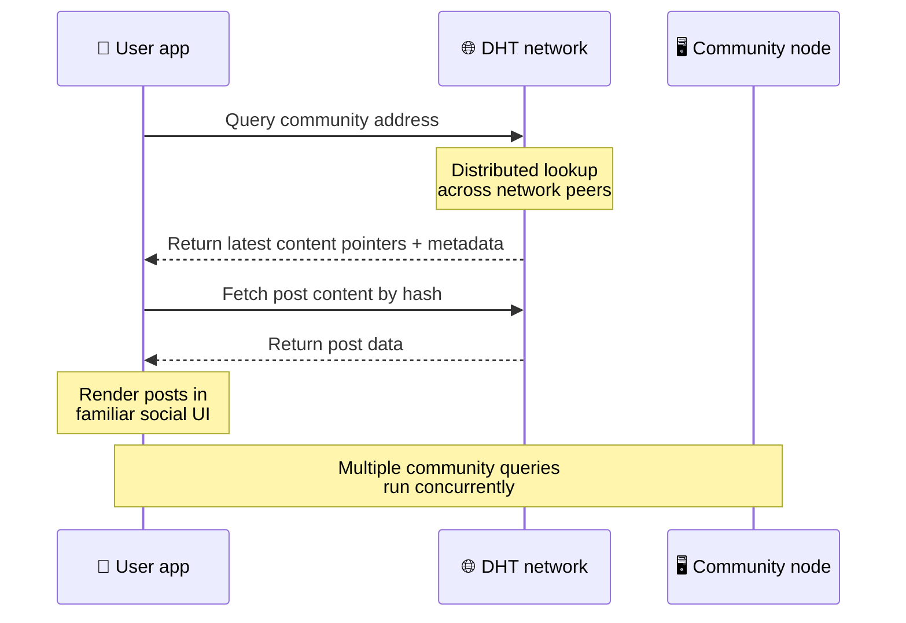
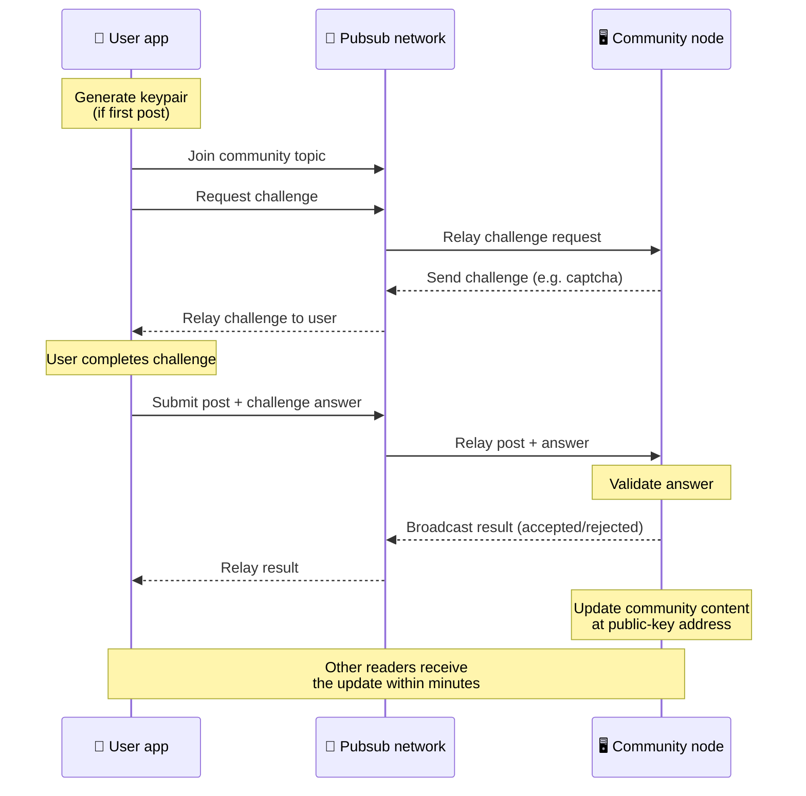
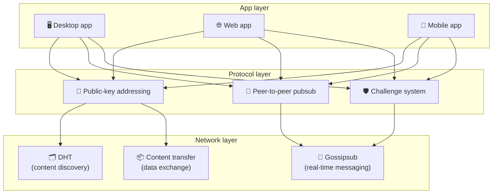

# ピアツーピアプロトコル

Bitsocial は、ブロックチェーン、フェデレーション サーバー、集中型バックエンドを使用しません。代わりに、**公開鍵ベースのアドレス指定** と **ピアツーピア pubsub** という 2 つのアイデアを組み合わせて、誰でもコンシューマ ハードウェアからコミュニティをホストできるようにし、ユーザーは企業が管理するサービスのアカウントなしで読み取りや投稿を行うことができます。

あまり技術的ではないチュートリアルについては、以下を参照してください。 [Bitsocial プロトコルの完全な素人説明](./layman-protocol-explanation.md).

## 2つの問題

分散型ソーシャル ネットワークでは、次の 2 つの質問に答える必要があります。

1. **データ** — 中央データベースを使用せずに、どのようにして世界中のソーシャル コンテンツを保存し、提供しますか?
2. **スパム** — ネットワークを自由に使用できる状態に保ちながら、悪用を防ぐにはどうすればよいでしょうか?

Bitsocial は、ブロックチェーンを完全にスキップすることでデータの問題を解決します。ソーシャル メディアには、グローバルなトランザクションの順序付けや、すべての古い投稿の永続的な可用性が必要ありません。各コミュニティがピアツーピア ネットワーク上で独自のスパム対策チャレンジを実行できるようにすることで、スパム問題を解決します。

このネットワーク層より上の検出モデルについては、[コンテンツ水平](./content-discovery.md) を参照してください。

---

## 公開鍵ベースのアドレス指定

BitTorrent では、ファイルのハッシュがそのアドレスになります (_コンテンツベースのアドレス指定_)。 Bitsocial は、公開鍵についても同様の考え方を使用しています。つまり、コミュニティの公開鍵のハッシュがそのネットワーク アドレスになります。

ネットワーク上のどのピアも、そのアドレスに対して DHT (分散ハッシュ テーブル) クエリを実行し、コミュニティの最新の状態を取得できます。コンテンツが更新されるたびに、バージョン番号が増加します。ネットワークは最新バージョンのみを保持します。すべての履歴状態を保持する必要がないため、このアプローチはブロックチェーンと比較して軽量になります。

### そのアドレスに何が保存されるか

コミュニティ アドレスには、完全な投稿コンテンツが直接含まれるわけではありません。代わりに、コンテンツ識別子のリスト、つまり実際のデータを指すハッシュが保存されます。次に、クライアントは DHT またはトラッカー スタイルのルックアップを通じて各コンテンツを取得します。

少なくとも 1 つのピア (コミュニティ オペレーターのノード) が常にデータを保持します。コミュニティが人気がある場合、他の多くのピアもコミュニティを持っており、人気のある torrent のダウンロードが高速になるのと同じように、負荷が自動的に分散されます。

---

## ピアツーピアのパブサブ

Pubsub (パブリッシュ-サブスクライブ) は、ピアがトピックにサブスクライブし、そのトピックにパブリッシュされたすべてのメッセージを受信するメッセージング パターンです。 Bitsocial はピアツーピアの pubsub ネットワークを使用しています。誰でもパブリッシュでき、誰でもサブスクライブできます。中央のメッセージ ブローカーはありません。

コミュニティに投稿を公開するには、ユーザーはコミュニティの公開キーと同じトピックを持つメッセージを公開します。コミュニティ オペレーターのノードがそれを取得して検証し、スパム対策チャレンジに合格した場合は、次のコンテンツ更新に含めます。

---

## スパム対策: pubsub に対する課題

オープンな pubsub ネットワークはスパムの洪水に対して脆弱です。 Bitsocial は、コンテンツが受け入れられる前に**チャレンジ**を完了することをパブリッシャーに要求することで、この問題を解決しています。

チャレンジ システムは柔軟です。各コミュニティ オペレーターは独自のポリシーを設定します。オプションには次のものが含まれます。

| チャレンジタイプ   | 仕組み                                                       |
| ------------------ | ------------------------------------------------------------ |
| **キャプチャ**     | アプリ内で提供されるビジュアルまたはインタラクティブなパズル |
| **レート制限**     | ID ごとに時間枠ごとに投稿を制限する                          |
| **トークンゲート** | 特定のトークンの残高証明を要求する                           |
| **お支払い**       | 投稿ごとに少額の支払いが必要                                 |
| **許可リスト**     | 事前に承認されたアイデンティティのみが投稿できます           |
| **カスタムコード** | コードで表現可能な任意のポリシー                             |

失敗したチャレンジ試行を中継するピアは pubsub トピックからブロックされるため、ネットワーク層でのサービス拒否攻撃が防止されます。

---

## ライフサイクル: コミュニティを読む

これは、ユーザーがアプリを開いてコミュニティの最新の投稿を表示したときに起こります。

**ステップバイステップ:**

1. ユーザーがアプリを開くと、ソーシャル インターフェイスが表示されます。
2. クライアントはピアツーピア ネットワークに参加し、ユーザーのコミュニティごとに DHT クエリを作成します。
   が続きます。クエリにはそれぞれ数秒かかりますが、同時に実行されます。
3. 各クエリは、コミュニティの最新のコンテンツ ポインタとメタデータ (タイトル、説明、
   モデレータリスト、チャレンジ設定）。
4. クライアントは、これらのポインターを使用して実際の投稿コンテンツをフェッチし、すべてをレンダリングします。
   おなじみのソーシャルインターフェイス。

---

## ライフサイクル: 投稿の公開

公開には、投稿が受け入れられる前に pubsub を介したチャレンジ/レスポンス ハンドシェイクが含まれます。

**ステップバイステップ:**

1. ユーザーがキーペアをまだ持っていない場合、アプリはユーザーのキーペアを生成します。
2. ユーザーはコミュニティに投稿を書きます。
3. クライアントは、そのコミュニティの pubsub トピックに参加します (コミュニティの公開鍵にキー設定されています)。
4. クライアントは pubsub 経由でチャレンジを要求します。
5. コミュニティ オペレータのノードはチャレンジ (キャプチャなど) を送り返します。
6. ユーザーはチャレンジを完了します。
7. クライアントは、pubsub 経由でチャレンジの回答とともに投稿を送信します。
8. コミュニティ オペレータのノードが回答を検証します。正しければ、投稿は受け入れられます。
9. ノードは pubsub 経由で結果をブロードキャストするため、ネットワーク ピアは中継を継続することを認識します。
   このユーザーからのメッセージ。
10. ノードは、公開キー アドレスでコミュニティのコンテンツを更新します。
11. 数分以内に、コミュニティのすべての読者が更新を受け取ります。

---

## アーキテクチャの概要

システム全体には、連携して動作する 3 つの層があります。

| レイヤー         | 役割                                                                                                                                                   |
| ---------------- | ------------------------------------------------------------------------------------------------------------------------------------------------------ |
| **アプリ**       | ユーザーインターフェース。それぞれが独自の設計を持ち、すべて同じコミュニティと ID を共有する複数のアプリが存在できます。                               |
| **プロトコル**   | コミュニティへの対応方法、投稿の公開方法、スパムの防止方法を定義します。                                                                               |
| **ネットワーク** | 基盤となるピアツーピア インフラストラクチャ: 検出のための DHT、リアルタイム メッセージングのための gossipsub、およびデータ交換のためのコンテンツ転送。 |

---

## プライバシー: 著者と IP アドレスのリンクを解除する

ユーザーが投稿を公開すると、コンテンツは pubsub ネットワークに入る前に **コミュニティ オペレーターの公開キーで暗号化**されます。これは、ネットワーク オブザーバーは、ピアが「何か」を公開したことは確認できますが、次のことを判断できないことを意味します。

- 内容が何を言っているのか
- どの著者がそれを出版したか

これは、BitTorrent が、どの IP が torrent をシードしているかは発見できるが、誰が最初にその torrent を作成したかは発見できないのと似ています。暗号化層は、そのベースラインに追加のプライバシー保証を追加します。

---

## ブラウザのピアツーピア

Bitsocial クライアントでブラウザ P2P が可能になりました。ブラウザ アプリは、[ヘリア](https://helia.io/) ノードを実行し、他のアプリと同じ Bitsocial プロトコル クライアント スタックを使用し、集中型 IPFS ゲートウェイにコンテンツの提供を依頼するのではなく、ピアからコンテンツを取得できます。ブラウザは pubsub に直接参加することもできるため、投稿にはハッピー パスにプラットフォーム所有の pubsub プロバイダーが必要ありません。

これは Web 配信にとって重要なマイルストーンです。通常の HTTPS Web サイトをライブ P2P ソーシャル クライアントとして開くことができます。ユーザーは、ネットワークから読み取る前にデスクトップ アプリをインストールする必要はありません。また、アプリのオペレーターは、すべてのブラウザ ユーザーの検閲やモデレーションのチョークポイントとなる中央ゲートウェイを実行する必要もありません。

ブラウザのパスには、デスクトップまたはサーバー ノードとは異なる制限があります。

- ブラウザノードは通常、パブリックインターネットからの任意の受信接続を受け入れることができません。
- アプリが開いている間にデータをロード、検証、キャッシュ、公開できます。
- コミュニティのデータの長期間存続するホストとして扱うべきではありません
- 完全なコミュニティ ホスティングは、やはりデスクトップ アプリ、`bitsocial-cli`、または別のアプリで処理するのが最適です。
  常時接続ノード

HTTP ルーターは、コンテンツ検出にとって依然として重要です。HTTP ルーターは、コミュニティ ハッシュのプロバイダー アドレスを返します。これらはコンテンツ自体を提供しないため、IPFS ゲートウェイではありません。検出後、ブラウザ クライアントはピアに接続し、P2P スタックを通じてデータを取得します。

5chan は、これを通常の 5chan.app Web アプリのオプトイン詳細設定スイッチとして公開します。最新の `pkc-js` ブラウザ スタックは、上流の libp2p/gossipsub 相互運用作業が Helia ピアと Kubo ピア間のメッセージ配信に対処した後、公開テストに十分な安定性を示しました。この設定により、ブラウザーの P2P は制御された状態に保たれながら、より現実的なテストが行​​われます。運用環境に十分な信頼性が得られると、それをデフォルトの Web パスにすることができます。

## ゲートウェイフォールバック

ゲートウェイによるブラウザー アクセスは、互換性とロールアウトのフォールバックとして引き続き役立ちます。ブラウザーがネットワークに直接参加できない場合、またはアプリが意図的に古いパスを選択している場合、ゲートウェイは P2P ネットワークとブラウザー クライアントの間でデータを中継できます。これらのゲートウェイは次のとおりです。

- 誰でも実行できる
- ユーザーアカウントや支払いは必要ありません
- ユーザーのアイデンティティやコミュニティの管理権を取得しないでください
- データを失わずに交換できる

ターゲット アーキテクチャはブラウザ P2P であり、デフォルトのボトルネックではなくオプションのフォールバックとしてゲートウェイを使用します。

---

## なぜブロックチェーンではないのでしょうか?

ブロックチェーンは二重支払いの問題を解決します。ブロックチェーンは、誰かが同じコインを二度使うのを防ぐために、すべてのトランザクションの正確な順序を知る必要があります。

ソーシャルメディアには二重支出の問題はありません。投稿 A が投稿 B の 1 ミリ秒前に公開されたかどうかは問題ではありません。また、古い投稿がすべてのノードで永続的に利用可能である必要はありません。

Bitsocial はブロックチェーンをスキップすることで、以下のことを回避します。

- **ガソリン代** — 投稿は無料です
- **スループット制限** — ブロック サイズやブロック時間のボトルネックなし
- **ストレージの肥大化** — ノードは必要なものだけを保持します
- **コンセンサスオーバーヘッド** — マイナー、バリデーター、ステーキングは不要です

その代償として、Bitsocial は古いコンテンツを永続的に利用できることを保証しません。しかし、ソーシャル メディアの場合、これは許容できるトレードオフです。コミュニティ オペレーターのノードがデータを保持し、人気のあるコンテンツは多くのピアに広がり、非常に古い投稿は自然に消えます。これは、すべてのソーシャル プラットフォームで行われているのと同じ方法です。

## なぜ連邦ではないのでしょうか？

フェデレーテッド ネットワーク (電子メールや ActivityPub ベースのプラットフォームなど) は集中化を改善しますが、依然として構造上の制限があります。

- **サーバーの依存関係** - 各コミュニティには、ドメイン、TLS、および継続的なサーバーが必要です。
  メンテナンス
- **管理者の信頼** - サーバー管理者はユーザー アカウントとコンテンツを完全に制御できます
- **断片化** — サーバー間の移動は、多くの場合、フォロワー、履歴、またはアイデンティティの喪失を意味します
- **コスト** — 誰かがホスティングの費用を支払わなければならないため、統合への圧力が生じます

Bitsocial のピアツーピア アプローチでは、サーバーを方程式から完全に排除します。コミュニティ ノードは、ラップトップ、Raspberry Pi、または安価な VPS 上で実行できます。オペレーターはモデレーション ポリシーを制御しますが、ID はサーバーによって付与されるものではなくキーペアによって制御されるため、ユーザー ID を取得することはできません。

---

## まとめ

Bitsocial は、コンテンツ検出のための公開キーベースのアドレス指定と、リアルタイム通信のためのピアツーピア pubsub という 2 つの基本要素に基づいて構築されています。これらは連携して、次のようなソーシャル ネットワークを構築します。

- コミュニティはドメイン名ではなく暗号キーによって識別されます
- コンテンツは単一のデータベースから提供されるのではなく、急流のようにピア間で広がります
- スパム耐性は各コミュニティにローカルなものであり、プラットフォームによって強制されるものではありません
- ユーザーは、取り消し可能なアカウントではなく、キーペアを通じて自分の ID を所有します。
- システム全体はサーバー、ブロックチェーン、プラットフォーム料金なしで実行されます
