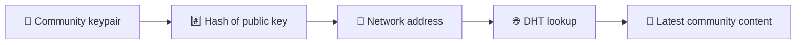
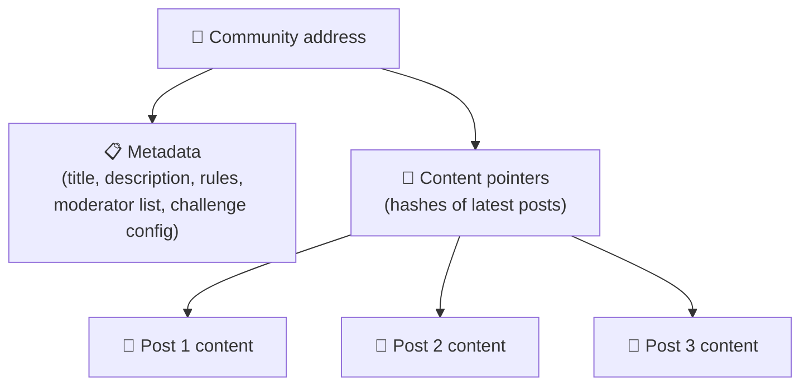
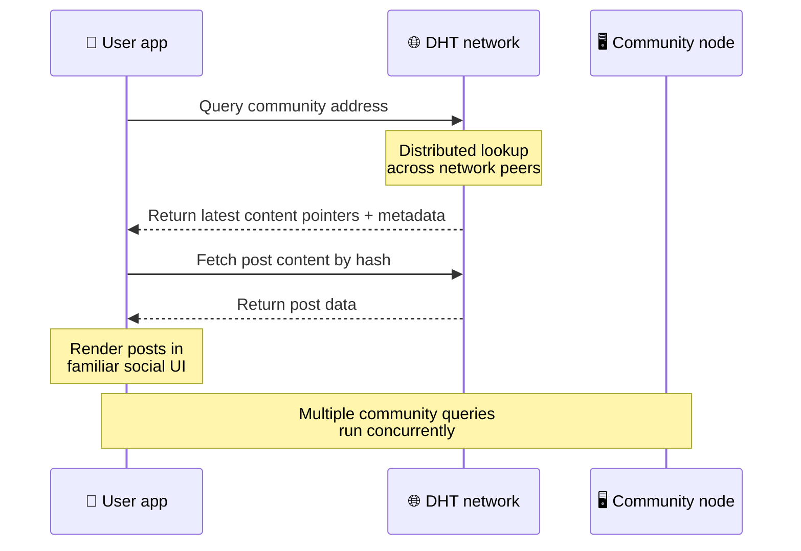
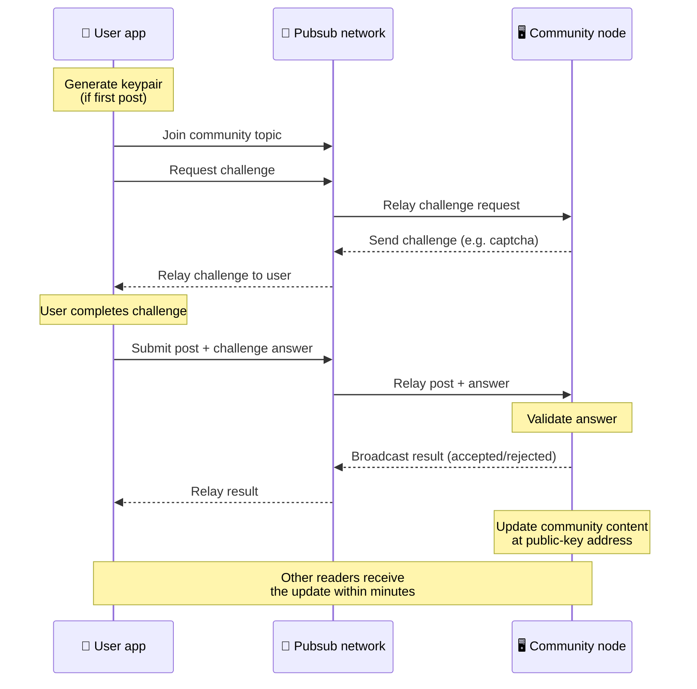
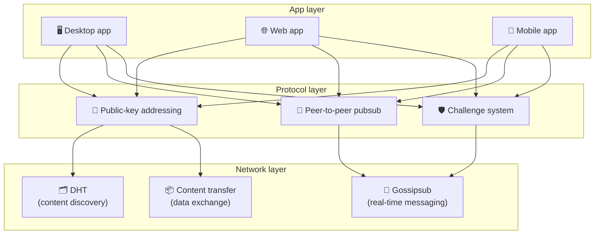

# 피어 투 피어 프로토콜

Bitsocial은 블록체인, 연합 서버 또는 중앙 집중식 백엔드를 사용하지 않습니다. 대신 **공개 키 기반 주소 지정**과 **P2P pubsub**라는 두 가지 아이디어를 결합하여 누구나 소비자 하드웨어에서 커뮤니티를 호스팅하고 사용자는 회사가 관리하는 서비스에서 계정 없이 읽고 게시할 수 있습니다.

덜 기술적인 연습을 위해서는 다음을 읽어보세요. [Bitsocial 프로토콜에 대한 완전한 평신도 설명](./layman-protocol-explanation.md).

## 두 가지 문제

분산형 소셜 네트워크는 두 가지 질문에 답해야 합니다.

1. **데이터** — 중앙 데이터베이스 없이 전 세계의 소셜 콘텐츠를 어떻게 저장하고 제공합니까?
2. **스팸** — 네트워크를 무료로 사용하면서 남용을 방지하려면 어떻게 해야 합니까?

Bitsocial은 블록체인을 완전히 건너뛰어 데이터 문제를 해결합니다. 소셜 미디어에는 글로벌 거래 순서나 모든 오래된 게시물의 영구적인 가용성이 필요하지 않습니다. 이는 각 커뮤니티가 P2P 네트워크를 통해 자체 스팸 방지 챌린지를 실행할 수 있도록 하여 스팸 문제를 해결합니다.

이 네트워크 계층 위의 검색 모델에 대해서는 [콘텐츠 발견](./content-discovery.md)을 참조하세요.

---

## 공개 키 기반 주소 지정

BitTorrent에서는 파일의 해시가 해당 주소(_콘텐츠 기반 주소 지정_)가 됩니다. Bitsocial은 공개 키와 유사한 아이디어를 사용합니다. 즉, 커뮤니티 공개 키의 해시가 네트워크 주소가 됩니다.

네트워크의 모든 피어는 해당 주소에 대해 DHT(분산 해시 테이블) 쿼리를 수행하고 커뮤니티의 최신 상태를 검색할 수 있습니다. 콘텐츠가 업데이트될 때마다 버전 번호가 늘어납니다. 네트워크는 최신 버전만 유지합니다. 모든 기록 상태를 보존할 필요가 없으므로 이 접근 방식은 블록체인에 비해 가볍습니다.

### 주소에 저장되는 내용

커뮤니티 주소에는 전체 게시물 내용이 직접 포함되지 않습니다. 대신 콘텐츠 식별자 목록(실제 데이터를 가리키는 해시)을 저장합니다. 그런 다음 클라이언트는 DHT 또는 추적기 스타일 조회를 통해 각 콘텐츠를 가져옵니다.

최소한 하나의 피어에는 항상 데이터(커뮤니티 운영자 노드)가 있습니다. 커뮤니티가 인기가 있으면 다른 많은 동료들도 커뮤니티를 갖게 되며 부하가 저절로 분산됩니다. 마찬가지로 인기 있는 토렌트를 다운로드하는 것이 더 빠릅니다.

---

## P2P pubsub

Pubsub(게시-구독)는 피어가 주제를 구독하고 해당 주제에 게시된 모든 메시지를 수신하는 메시징 패턴입니다. Bitsocial은 P2P pubsub 네트워크를 사용합니다. 누구나 게시하고 구독할 수 있으며 중앙 메시지 브로커가 없습니다.

커뮤니티에 게시물을 게시하기 위해 사용자는 주제가 커뮤니티의 공개 키와 동일한 메시지를 게시합니다. 커뮤니티 운영자의 노드는 이를 선택하여 유효성을 검사하고 스팸 방지 챌린지를 통과한 경우 다음 콘텐츠 업데이트에 포함합니다.

---

## 스팸 방지: pubsub에 대한 과제

개방형 pubsub 네트워크는 스팸 홍수에 취약합니다. Bitsocial은 콘텐츠가 승인되기 전에 게시자에게 **챌린지**를 완료하도록 요구하여 이 문제를 해결합니다.

챌린지 시스템은 유연합니다. 각 커뮤니티 운영자는 자체 정책을 구성합니다. 옵션은 다음과 같습니다:

| 챌린지 유형     | 작동 원리                             |
| --------------- | ------------------------------------- |
| **보안문자**    | 앱에 표시되는 시각적 또는 대화형 퍼즐 |
| **속도 제한**   | ID별 기간별 게시물 제한               |
| **토큰 게이트** | 특정 토큰의 잔액 증명 필요            |
| **결제**        | 게시물당 소액 결제 필요               |
| **허용 목록**   | 사전 승인된 ID만 게시할 수 있습니다   |
| **맞춤 코드**   | 코드로 표현 가능한 모든 정책          |

실패한 시도 시도를 너무 많이 전달하는 피어는 pubsub 주제에서 차단되어 네트워크 계층에 대한 서비스 거부 공격을 방지합니다.

---

## 라이프사이클: 커뮤니티 읽기

사용자가 앱을 열고 커뮤니티의 최신 게시물을 보면 이런 일이 발생합니다.

**단계별:**

1. 사용자가 앱을 열고 소셜 인터페이스를 봅니다.
2. 클라이언트는 P2P 네트워크에 참여하고 사용자가 각 커뮤니티에 대해 DHT 쿼리를 수행합니다.
   다음과 같습니다. 쿼리는 각각 몇 초 정도 걸리지만 동시에 실행됩니다.
3. 각 쿼리는 커뮤니티의 최신 콘텐츠 포인터와 메타데이터(제목, 설명,
   중재자 목록, 챌린지 구성).
4. 클라이언트는 해당 포인터를 사용하여 실제 게시물 콘텐츠를 가져온 다음 모든 것을
   친숙한 소셜 인터페이스.

---

## 수명주기: 게시물 게시

게시에는 게시물이 승인되기 전에 pubsub를 통한 시도-응답 핸드셰이크가 포함됩니다.

**단계별:**

1. 사용자가 아직 키 쌍을 갖고 있지 않은 경우 앱은 사용자를 위해 키 쌍을 생성합니다.
2. 사용자가 커뮤니티에 게시물을 작성합니다.
3. 클라이언트는 해당 커뮤니티의 pubsub 주제에 참여합니다(커뮤니티의 공개 키에 맞춰져 있음).
4. 클라이언트가 pubsub에 대한 챌린지를 요청합니다.
5. 커뮤니티 운영자의 노드는 챌린지(예: 보안 문자)를 다시 보냅니다.
6. 사용자가 챌린지를 완료합니다.
7. 클라이언트는 pubsub를 통해 인증 확인 답변과 함께 게시물을 제출합니다.
8. 커뮤니티 운영자의 노드가 답변을 검증합니다. 맞다면 게시물이 승인됩니다.
9. 노드는 pubsub를 통해 결과를 브로드캐스트하므로 네트워크 피어는 계속 중계를 알 수 있습니다.
   이 사용자의 메시지입니다.
10. 노드는 공개 키 주소에서 커뮤니티의 콘텐츠를 업데이트합니다.
11. 몇 분 내에 커뮤니티의 모든 독자가 업데이트를 받습니다.

---

## 아키텍처 개요

전체 시스템에는 함께 작동하는 세 가지 계층이 있습니다.

| 레이어       | 역할                                                                                                       |
| ------------ | ---------------------------------------------------------------------------------------------------------- |
| **앱**       | 사용자 인터페이스. 각각 고유한 디자인을 갖고 동일한 커뮤니티와 ID를 공유하는 여러 앱이 존재할 수 있습니다. |
| **프로토콜** | 커뮤니티의 주소 지정 방법, 게시물 게시 방법, 스팸 방지 방법을 정의합니다.                                  |
| **네트워크** | 기본 P2P 인프라: 검색을 위한 DHT, 실시간 메시징을 위한 gossipsub, 데이터 교환을 위한 콘텐츠 전송.          |

---

## 개인 정보 보호: IP 주소에서 작성자 연결 해제

사용자가 게시물을 게시하면 해당 콘텐츠는 게시구독 네트워크에 들어가기 전에 **커뮤니티 운영자의 공개 키로 암호화**됩니다. 이는 네트워크 관찰자가 피어가 *무언가*를 게시했음을 볼 수 있지만 다음 사항을 결정할 수는 없음을 의미합니다.

- 내용이 무슨 말인지
- 어떤 저자의 신원이 출판되었는지

이는 BitTorrent를 사용하여 토렌트를 생성한 IP가 누구인지는 알 수 있지만 원래 토렌트를 만든 사람은 알 수 없는 방식과 유사합니다. 암호화 계층은 해당 기준 위에 추가적인 개인 정보 보호 보장을 추가합니다.

---

## 브라우저 P2P

이제 Bitsocial 클라이언트에서 브라우저 P2P가 가능합니다. 브라우저 앱은 [헬리아](https://helia.io/) 노드를 실행하고, 다른 앱과 동일한 Bitsocial 프로토콜 클라이언트 스택을 사용하고, 중앙 집중식 IPFS 게이트웨이에 콘텐츠 제공을 요청하는 대신 피어로부터 콘텐츠를 가져올 수 있습니다. 브라우저는 pubsub에 직접 참여할 수도 있으므로 행복한 경로에서 게시하는 데 플랫폼 소유 pubsub 공급자가 필요하지 않습니다.

이는 웹 배포의 중요한 이정표입니다. 일반 HTTPS 웹사이트는 라이브 P2P 소셜 클라이언트로 열릴 수 있습니다. 사용자는 네트워크에서 읽기 전에 데스크탑 앱을 설치할 필요가 없으며, 앱 운영자는 모든 브라우저 사용자에 대한 검열 또는 조정 초크포인트가 되는 중앙 게이트웨이를 실행할 필요가 없습니다.

브라우저 경로에는 데스크톱 또는 서버 노드와 다른 제한이 있습니다.

- 브라우저 노드는 일반적으로 공용 인터넷에서 임의의 인바운드 연결을 허용할 수 없습니다.
- 앱이 열려 있는 동안 데이터를 로드, 검증, 캐시 및 게시할 수 있습니다.
- 커뮤니티 데이터의 장기 호스트로 취급되어서는 안 됩니다.
- 전체 커뮤니티 호스팅은 여전히 ​​데스크톱 앱인 `bitsocial-cli` 또는 다른 앱으로 가장 잘 처리됩니다.
  상시 접속 노드

HTTP 라우터는 콘텐츠 검색에 여전히 중요합니다. 커뮤니티 해시에 대한 공급자 주소를 반환합니다. 컨텐츠 자체를 제공하지 않기 때문에 IPFS 게이트웨이가 아닙니다. 검색 후 브라우저 클라이언트는 피어에 연결하고 P2P 스택을 통해 데이터를 가져옵니다.

5chan은 이를 일반 5chan.app 웹 앱의 옵트인 고급 설정 스위치로 노출합니다. 최신 `pkc-js` 브라우저 스택은 Helia와 Kubo 피어 간의 메시지 전달을 다루는 업스트림 libp2p/gossipsub 상호 운용성 작업 이후 공개 테스트를 할 수 있을 만큼 충분히 안정적이 되었습니다. 이 설정은 실제 테스트를 더 많이 수행하는 동안 브라우저 P2P 제어를 유지합니다. 프로덕션 신뢰도가 충분히 확보되면 기본 웹 경로가 될 수 있습니다.

## 게이트웨이 대체

게이트웨이 지원 브라우저 액세스는 호환성 및 롤아웃 대체 수단으로 여전히 유용합니다. 게이트웨이는 브라우저가 네트워크에 직접 참여할 수 없거나 앱이 의도적으로 이전 경로를 선택할 때 P2P 네트워크와 브라우저 클라이언트 간에 데이터를 중계할 수 있습니다. 이러한 게이트웨이는 다음과 같습니다.

- 누구나 운영할 수 있다
- 사용자 계정이나 결제가 필요하지 않습니다.
- 사용자 신원이나 커뮤니티에 대한 관리권을 얻지 않습니다.
- 데이터 손실 없이 교체 가능

대상 아키텍처는 기본 병목 현상이 아닌 선택적 폴백으로 게이트웨이를 사용하는 브라우저 P2P 우선입니다.

---

## 왜 블록체인이 아닌가?

블록체인은 이중 지출 문제를 해결합니다. 누군가가 동일한 코인을 두 번 지출하는 것을 방지하려면 모든 거래의 정확한 순서를 알아야 합니다.

소셜 미디어에는 이중 지출 문제가 없습니다. 게시물 A가 게시물 B보다 1밀리초 먼저 게시되었는지 여부는 중요하지 않으며 이전 게시물을 모든 노드에서 영구적으로 사용할 수 있을 필요는 없습니다.

블록체인을 건너뛰어 Bitsocial은 다음을 방지합니다.

- **가스 요금** — 게시는 무료입니다.
- **처리량 제한** — 블록 크기 또는 블록 시간 병목 현상 없음
- **스토리지 팽창** — 노드는 필요한 것만 보관합니다.
- **합의 오버헤드** — 채굴자, 검증자 또는 스테이킹이 필요하지 않습니다.

단점은 Bitsocial이 오래된 콘텐츠의 영구적인 가용성을 보장하지 않는다는 것입니다. 그러나 소셜 미디어의 경우 이는 허용 가능한 절충안입니다. 커뮤니티 운영자의 노드가 데이터를 보유하고, 인기 있는 콘텐츠가 많은 동료에게 퍼지고, 아주 오래된 게시물이 자연스럽게 사라집니다. 모든 소셜 플랫폼에서와 마찬가지로 말입니다.

## 왜 연맹이 아니지?

연합 네트워크(예: 이메일 또는 ActivityPub 기반 플랫폼)는 중앙 집중화를 개선하지만 여전히 구조적 한계가 있습니다.

- **서버 종속성** — 각 커뮤니티에는 도메인, TLS 및 지속적인 서버가 필요합니다.
  유지
- **관리자 신뢰** — 서버 관리자는 사용자 계정과 콘텐츠에 대한 모든 권한을 가집니다.
- **조각화** — 서버 간 이동은 팔로어, 기록 또는 신원을 잃는 것을 의미하는 경우가 많습니다.
- **비용** — 누군가 호스팅 비용을 지불해야 하므로 통합에 대한 부담이 커집니다.

Bitsocial의 P2P 접근 방식은 방정식에서 서버를 완전히 제거합니다. 커뮤니티 노드는 노트북, Raspberry Pi 또는 저렴한 VPS에서 실행될 수 있습니다. 운영자는 중재 정책을 제어하지만 사용자 ID는 서버에서 부여하는 것이 아니라 키 쌍으로 제어하므로 사용자 ID를 압류할 수 없습니다.

---

## 요약

Bitsocial은 콘텐츠 검색을 위한 공개 키 기반 주소 지정과 실시간 통신을 위한 P2P PubSub라는 두 가지 기본 요소를 기반으로 구축되었습니다. 이들은 함께 다음과 같은 소셜 네트워크를 생성합니다.

- 커뮤니티는 도메인 이름이 아닌 암호화 키로 식별됩니다.
- 콘텐츠는 단일 데이터베이스에서 제공되지 않고 토렌트처럼 여러 피어에 분산됩니다.
- 스팸 저항은 플랫폼에 의해 부과되는 것이 아니라 각 커뮤니티에 국한됩니다.
- 사용자는 취소 가능한 계정이 아닌 키 쌍을 통해 자신의 신원을 소유합니다.
- 전체 시스템은 서버, 블록체인 또는 플랫폼 수수료 없이 실행됩니다.
