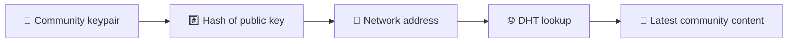
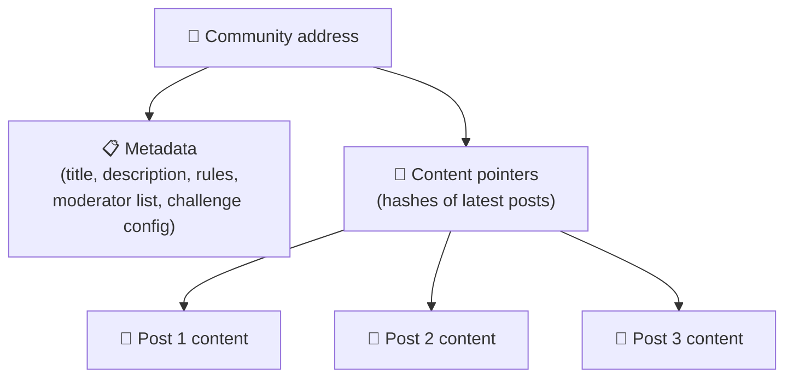
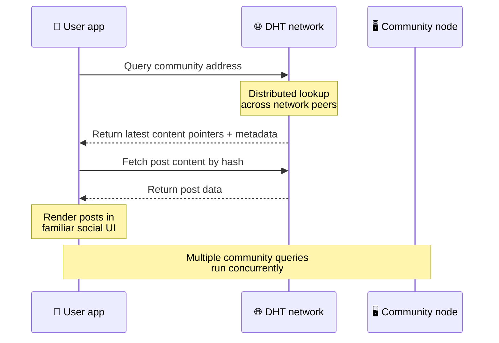
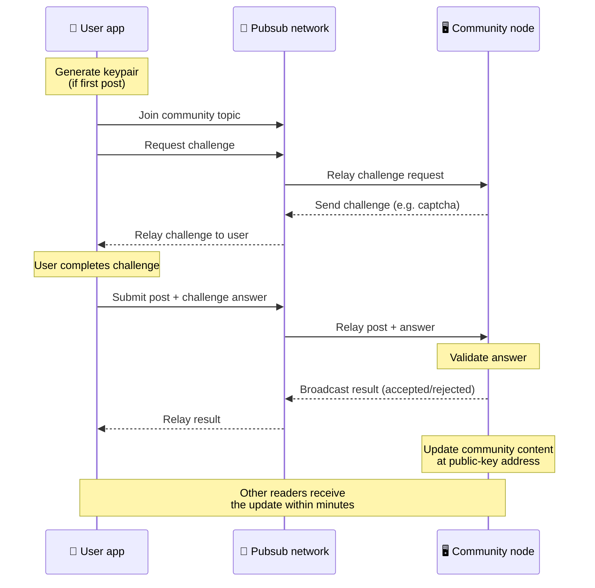
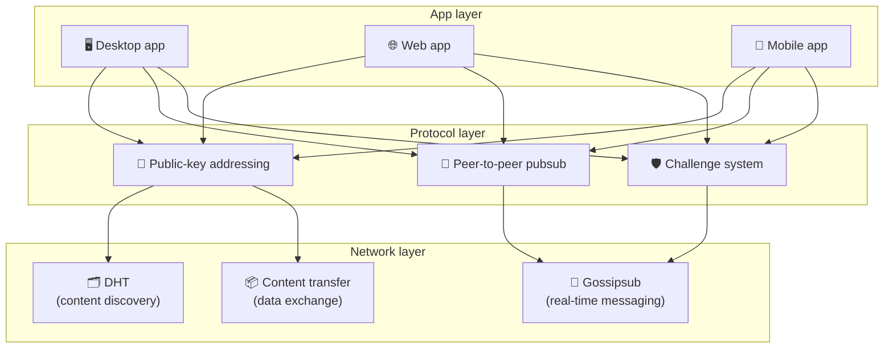

# पीअर-टू-पीअर प्रोटोकॉल

Bitsocial ब्लॉकचेन, फेडरेशन सर्व्हर किंवा केंद्रीकृत बॅकएंड वापरत नाही. त्याऐवजी ते दोन कल्पना एकत्र करते — **पब्लिक-की-आधारित ॲड्रेसिंग** आणि **पीअर-टू-पीअर पबसब** — वापरकर्ते कोणत्याही कंपनी-नियंत्रित सेवेवर खाते नसताना वाचू आणि पोस्ट करत असताना ग्राहक हार्डवेअरवरून समुदाय होस्ट करू द्या.

कमी तांत्रिक वॉकथ्रूसाठी, वाचा [बिटसोशियल प्रोटोकॉलचे संपूर्ण सामान्य स्पष्टीकरण](./layman-protocol-explanation.md).

## दोन समस्या

विकेंद्रित सोशल नेटवर्कला दोन प्रश्नांची उत्तरे द्यावी लागतात:

1. **डेटा** — तुम्ही केंद्रीय डेटाबेसशिवाय जगाची सामाजिक सामग्री कशी साठवता आणि सर्व्ह करता?
2. **स्पॅम** — नेटवर्क वापरण्यासाठी मुक्त ठेवताना तुम्ही गैरवर्तन कसे टाळता?

बिटसोशियल ब्लॉकचेन पूर्णपणे वगळून डेटा समस्या सोडवते: सोशल मीडियाला जागतिक व्यवहार ऑर्डरिंग किंवा प्रत्येक जुन्या पोस्टची कायमस्वरूपी उपलब्धता आवश्यक नसते. हे प्रत्येक समुदायाला पीअर-टू-पीअर नेटवर्कवर स्वतःचे स्पॅम विरोधी आव्हान चालवू देऊन स्पॅम समस्येचे निराकरण करते.

या नेटवर्क स्तरावरील शोध मॉडेलसाठी, [सामग्री शोध](./content-discovery.md) पहा.

---

## सार्वजनिक-की-आधारित पत्ता

BitTorrent मध्ये, फाईलचा हॅश त्याचा पत्ता (_content-based addressing_) बनतो. Bitsocial सार्वजनिक की सह समान कल्पना वापरते: समुदायाच्या सार्वजनिक कीचा हॅश त्याचा नेटवर्क पत्ता बनतो.

नेटवर्कवरील कोणताही समवयस्क त्या पत्त्यासाठी DHT (वितरित हॅश टेबल) क्वेरी करू शकतो आणि समुदायाची नवीनतम स्थिती पुनर्प्राप्त करू शकतो. प्रत्येक वेळी सामग्री अद्यतनित केल्यावर, त्याची आवृत्ती संख्या वाढते. नेटवर्क फक्त नवीनतम आवृत्ती ठेवते — प्रत्येक ऐतिहासिक स्थिती जतन करण्याची आवश्यकता नाही, ज्यामुळे ब्लॉकचेनच्या तुलनेत हा दृष्टिकोन हलका होतो.

### पत्त्यावर काय साठवले जाते

समुदाय पत्त्यामध्ये संपूर्ण पोस्ट सामग्री थेट नसते. त्याऐवजी ते सामग्री अभिज्ञापकांची सूची संग्रहित करते — वास्तविक डेटाकडे निर्देशित करणारे हॅश. क्लायंट नंतर प्रत्येक सामग्रीचा भाग DHT किंवा ट्रॅकर-शैली लुकअपद्वारे मिळवतो.

किमान एका समवयस्काकडे नेहमी डेटा असतो: समुदाय ऑपरेटरचा नोड. जर समुदाय लोकप्रिय असेल, तर इतर अनेक समवयस्कांनाही ते मिळेल आणि लोड स्वतःच वितरीत होईल, त्याच प्रकारे लोकप्रिय टॉरंट डाउनलोड करण्यासाठी जलद आहेत.

---

## पीअर-टू-पीअर पबसब

पबसब (प्रकाशित-सदस्यता) हा एक मेसेजिंग पॅटर्न आहे जेथे समवयस्क एखाद्या विषयाचे सदस्यत्व घेतात आणि त्या विषयावर प्रकाशित केलेला प्रत्येक संदेश प्राप्त करतात. बिटसोशियल पीअर-टू-पीअर पबसब नेटवर्क वापरते — कोणीही प्रकाशित करू शकतो, कोणीही सदस्यता घेऊ शकतो आणि कोणताही केंद्रीय संदेश दलाल नाही.

समुदायावर पोस्ट प्रकाशित करण्यासाठी, वापरकर्ता एक संदेश प्रकाशित करतो ज्याचा विषय समुदायाच्या सार्वजनिक कीच्या बरोबरीचा आहे. समुदाय ऑपरेटरचे नोड ते उचलते, ते प्रमाणित करते आणि — जर ते स्पॅम विरोधी आव्हान उत्तीर्ण करते — तर पुढील सामग्री अद्यतनामध्ये ते समाविष्ट करते.

---

## अँटी-स्पॅम: पबसबवर आव्हाने

ओपन पबसब नेटवर्क स्पॅम फ्लडसाठी असुरक्षित आहे. Bitsocial प्रकाशकांना त्यांची सामग्री स्वीकारण्यापूर्वी **आव्हान** पूर्ण करणे आवश्यक करून याचे निराकरण करते.

आव्हान प्रणाली लवचिक आहे: प्रत्येक समुदाय ऑपरेटर त्यांचे स्वतःचे धोरण कॉन्फिगर करतो. पर्यायांमध्ये हे समाविष्ट आहे:

| आव्हान प्रकार   | ते कसे कार्य करते                                   |
| --------------- | --------------------------------------------------- |
| **कॅप्चा**      | ॲपमध्ये सादर केलेले दृश्य किंवा परस्परसंवादी कोडे   |
| **दर मर्यादित** | प्रति ओळख प्रति टाईम विंडो प्रति पोस्ट मर्यादित करा |
| **टोकन गेट**    | विशिष्ट टोकन शिल्लक असल्याचा पुरावा आवश्यक आहे      |
| **पेमेंट**      | प्रति पोस्ट एक लहान पेमेंट आवश्यक आहे               |
| **अनुमत यादी**  | केवळ पूर्व-मंजूर ओळख पोस्ट करू शकतात                |
| **कस्टम कोड**   | कोडमध्ये व्यक्त करता येणारे कोणतेही धोरण            |

अनेक अयशस्वी आव्हान प्रयत्न रिले करणारे साथीदार पबसब विषयावरून अवरोधित केले जातात, जे नेटवर्क स्तरावरील सेवा-नकाराच्या हल्ल्यांना प्रतिबंधित करते.

---

## जीवनचक्र: समुदाय वाचणे

जेव्हा वापरकर्ता ॲप उघडतो आणि समुदायाच्या नवीनतम पोस्ट पाहतो तेव्हा असे होते.

**स्टेप बाय स्टेप:**

1. वापरकर्ता ॲप उघडतो आणि सोशल इंटरफेस पाहतो.
2. क्लायंट पीअर-टू-पीअर नेटवर्कमध्ये सामील होतो आणि वापरकर्त्यासाठी प्रत्येक समुदायासाठी DHT क्वेरी करतो
   अनुसरण करते. प्रश्नांना प्रत्येकी काही सेकंद लागतात परंतु एकाच वेळी चालतात.
3. प्रत्येक क्वेरी समुदायाचे नवीनतम सामग्री पॉइंटर्स आणि मेटाडेटा (शीर्षक, वर्णन,
   नियंत्रक सूची, आव्हान कॉन्फिगरेशन).
4. क्लायंट त्या पॉइंटर्सचा वापर करून वास्तविक पोस्ट सामग्री मिळवतो, नंतर सर्वकाही a मध्ये प्रस्तुत करतो
   परिचित सामाजिक इंटरफेस.

---

## जीवनचक्र: पोस्ट प्रकाशित करणे

प्रकाशनामध्ये पोस्ट स्वीकारण्यापूर्वी पबसबवर आव्हान-प्रतिसाद हँडशेकचा समावेश होतो.

**स्टेप बाय स्टेप:**

1. ॲप वापरकर्त्यांकडे अद्याप एक कीपेअर नसल्यास त्यांच्यासाठी एक की-पेअर व्युत्पन्न करते.
2. वापरकर्ता समुदायासाठी पोस्ट लिहितो.
3. क्लायंट त्या समुदायासाठी पबसब विषयात सामील होतो (समुदायाच्या सार्वजनिक कीला जोडलेला).
4. क्लायंट पबसबवर आव्हानाची विनंती करतो.
5. समुदाय ऑपरेटरचा नोड एक आव्हान परत पाठवतो (उदाहरणार्थ, कॅप्चा).
6. वापरकर्ता आव्हान पूर्ण करतो.
7. क्लायंट पबसबवर आव्हान उत्तरासह पोस्ट सबमिट करतो.
8. समुदाय ऑपरेटरचा नोड उत्तर प्रमाणित करतो. योग्य असल्यास, पद स्वीकारले जाते.
9. नोड पबसबवर निकाल प्रसारित करतो त्यामुळे नेटवर्क समवयस्कांना रिले करणे सुरू ठेवण्याची माहिती असते
   या वापरकर्त्याचे संदेश.
10. नोड समुदायाची सामग्री त्याच्या सार्वजनिक-की पत्त्यावर अद्यतनित करते.
11. काही मिनिटांत, समुदायातील प्रत्येक वाचकाला अपडेट प्राप्त होतो.

---

## आर्किटेक्चर विहंगावलोकन

संपूर्ण प्रणालीमध्ये तीन स्तर आहेत जे एकत्र कार्य करतात:

| थर            | भूमिका                                                                                                                           |
| ------------- | -------------------------------------------------------------------------------------------------------------------------------- |
| **ॲप**        | वापरकर्ता इंटरफेस. एकाधिक ॲप्स अस्तित्वात असू शकतात, प्रत्येकाची स्वतःची रचना आहे, सर्व समान समुदाय आणि ओळख सामायिक करतात.       |
| **प्रोटोकॉल** | समुदायांना कसे संबोधित केले जाते, पोस्ट कसे प्रकाशित केले जातात आणि स्पॅम कसे प्रतिबंधित केले जातात ते परिभाषित करते.            |
| **नेटवर्क**   | अंतर्निहित पीअर-टू-पीअर इन्फ्रास्ट्रक्चर: शोधासाठी DHT, रिअल-टाइम मेसेजिंगसाठी गॉसिप्सब आणि डेटा एक्सचेंजसाठी सामग्री हस्तांतरण. |

---

## गोपनीयता: IP पत्त्यांमधून लेखकांची लिंक काढून टाकणे

जेव्हा वापरकर्ता पोस्ट प्रकाशित करतो, तेव्हा सामग्री पबसब नेटवर्कमध्ये प्रवेश करण्यापूर्वी **समुदाय ऑपरेटरच्या सार्वजनिक कीसह कूटबद्ध केली जाते**. याचा अर्थ असा की नेटवर्क निरीक्षक हे पाहू शकतात की समवयस्कांनी _something_ प्रकाशित केले आहे, ते निर्धारित करू शकत नाहीत:

- सामग्री काय म्हणते
- कोणत्या लेखकाच्या ओळखीने ते प्रकाशित केले

हे BitTorrent सारखेच आहे की कोणत्या IPs मध्ये टॉरेंट आहे हे शोधणे शक्य होते परंतु ते मूळ कोणी तयार केले नाही. एनक्रिप्शन लेयर त्या बेसलाइनच्या वर अतिरिक्त गोपनीयतेची हमी जोडते.

---

## ब्राउझर पीअर-टू-पीअर

Bitsocial क्लायंटमध्ये P2P ब्राउझर आता शक्य आहे. ब्राउझर ॲप [हेलिया](https://helia.io/) नोड) चालवू शकतो, इतर ॲप्स प्रमाणेच Bitsocial प्रोटोकॉल क्लायंट स्टॅक वापरू शकतो आणि ते सर्व्ह करण्यासाठी केंद्रीकृत IPFS गेटवे विचारण्याऐवजी समवयस्कांकडून सामग्री आणू शकतो. ब्राउझर थेट पबसबमध्ये देखील सहभागी होऊ शकतो, त्यामुळे पोस्टिंगसाठी हॅपीपथ प्रदात्यामध्ये प्लॅटफॉर्मच्या मालकीची आवश्यकता नाही.

वेब वितरणासाठी हा महत्त्वाचा टप्पा आहे: एक सामान्य HTTPS वेबसाइट थेट P2P सोशल क्लायंटमध्ये उघडू शकते. वापरकर्त्यांना नेटवर्कवरून वाचता येण्यापूर्वी डेस्कटॉप ॲप स्थापित करण्याची आवश्यकता नाही आणि ॲप ऑपरेटरला प्रत्येक ब्राउझर वापरकर्त्यासाठी सेन्सॉरशिप किंवा मॉडरेशन चोकपॉइंट बनणारे केंद्रीय गेटवे चालवण्याची आवश्यकता नाही.

ब्राउझर मार्गाला डेस्कटॉप किंवा सर्व्हर नोडपासून भिन्न मर्यादा आहेत:

- ब्राउझर नोड सहसा सार्वजनिक इंटरनेटवरून अनियंत्रित इनबाउंड कनेक्शन स्वीकारू शकत नाही
- ॲप उघडे असताना ते डेटा लोड, प्रमाणीकरण, कॅशे आणि प्रकाशित करू शकते
- त्याला समुदायाच्या डेटासाठी दीर्घायुषी होस्ट मानले जाऊ नये
- संपूर्ण समुदाय होस्टिंग अद्याप डेस्कटॉप ॲप, `bitsocial-cli`, किंवा अन्य द्वारे उत्तम प्रकारे हाताळले जाते
  नेहमी चालू नोड

HTTP राउटर अजूनही सामग्री शोधासाठी महत्त्वाचे आहेत: ते समुदाय हॅशसाठी प्रदाता पत्ते परत करतात. ते IPFS गेटवे नाहीत, कारण ते सामग्री स्वतःच देत नाहीत. शोधानंतर, ब्राउझर क्लायंट समवयस्कांशी कनेक्ट होतो आणि P2P स्टॅकद्वारे डेटा मिळवतो.

5chan ने हे सामान्य 5chan.app वेब ॲपमध्ये प्रगत सेटिंग्ज स्विच म्हणून निवडले आहे. नवीनतम `pkc-js` ब्राउझर स्टॅक अपस्ट्रीम libp2p/gossipsub इंटरॉप वर्क हेलिया आणि कुबो सहकाऱ्यांमधील संदेश वितरणानंतर सार्वजनिक चाचणीसाठी पुरेसा स्थिर झाला आहे. सेटिंग ब्राउझर P2P नियंत्रित ठेवते जेव्हा ते अधिक वास्तविक-जागतिक चाचणी घेते; एकदा पुरेसा उत्पादन आत्मविश्वास मिळाल्यास, तो डीफॉल्ट वेब मार्ग बनू शकतो.

## गेटवे फॉलबॅक

गेटवे-बॅक्ड ब्राउझर प्रवेश अद्याप सुसंगतता आणि रोलआउट फॉलबॅक म्हणून उपयुक्त आहे. जेव्हा ब्राउझर थेट नेटवर्कमध्ये सामील होऊ शकत नाही किंवा जेव्हा ॲप जाणूनबुजून जुना मार्ग निवडतो तेव्हा गेटवे P2P नेटवर्क आणि ब्राउझर क्लायंट दरम्यान डेटा रिले करू शकतो. हे प्रवेशद्वार:

- कोणीही चालवू शकतो
- वापरकर्ता खाती किंवा देयके आवश्यक नाहीत
- वापरकर्ता ओळख किंवा समुदायांवर ताबा मिळवू नका
- डेटा न गमावता स्वॅप आउट केले जाऊ शकते

लक्ष्य आर्किटेक्चर प्रथम ब्राउझर P2P आहे, गेटवे डीफॉल्ट अडथळ्याऐवजी पर्यायी फॉलबॅक म्हणून.

---

## ब्लॉकचेन का नाही?

ब्लॉकचेन दुहेरी-खर्चाची समस्या सोडवतात: एखाद्याला समान नाणे दोनदा खर्च करण्यापासून रोखण्यासाठी त्यांना प्रत्येक व्यवहाराचा अचूक क्रम माहित असणे आवश्यक आहे.

सोशल मीडियावर दुहेरी खर्च करण्याची समस्या नाही. पोस्ट A पोस्ट B च्या आधी एक मिलिसेकंद प्रकाशित झाले असल्यास काही फरक पडत नाही आणि जुन्या पोस्ट प्रत्येक नोडवर कायमस्वरूपी उपलब्ध असणे आवश्यक नाही.

ब्लॉकचेन वगळून, बिटसोशियल टाळते:

- **गॅस शुल्क** — पोस्ट करणे विनामूल्य आहे
- **थ्रूपुट मर्यादा** — ब्लॉक आकार किंवा ब्लॉक टाइम अडथळा नाही
- **स्टोरेज ब्लोट** — नोड्स फक्त त्यांना आवश्यक तेच ठेवतात
- **एकमत ओव्हरहेड** — खाणकाम करणारे, प्रमाणीकरण करणारे किंवा स्टॅकिंग आवश्यक नाही

ट्रेडऑफ असा आहे की बिटसोशियल जुन्या सामग्रीच्या कायमस्वरूपी उपलब्धतेची हमी देत ​​नाही. परंतु सोशल मीडियासाठी, ते एक स्वीकार्य ट्रेडऑफ आहे: समुदाय ऑपरेटरच्या नोडमध्ये डेटा असतो, लोकप्रिय सामग्री अनेक समवयस्कांमध्ये पसरते आणि खूप जुन्या पोस्ट नैसर्गिकरित्या फिकट होतात — त्याचप्रमाणे ते प्रत्येक सोशल प्लॅटफॉर्मवर करतात.

## महासंघ का नाही?

फेडरेट केलेले नेटवर्क (जसे की ईमेल किंवा ॲक्टिव्हिटीपब-आधारित प्लॅटफॉर्म) केंद्रीकरणात सुधारणा करतात परंतु तरीही संरचनात्मक मर्यादा आहेत:

- **सर्व्हर अवलंबित्व** — प्रत्येक समुदायाला डोमेन, TLS आणि चालू असलेल्या सर्व्हरची आवश्यकता असते
  देखभाल
- **प्रशासकाचा विश्वास** — सर्व्हर प्रशासकाचे वापरकर्ता खाती आणि सामग्रीवर पूर्ण नियंत्रण असते
- **विखंडन** — सर्व्हर दरम्यान फिरणे म्हणजे अनुयायी, इतिहास किंवा ओळख गमावणे
- **किंमत** — एखाद्याला होस्टिंगसाठी पैसे द्यावे लागतात, ज्यामुळे एकत्रीकरणासाठी दबाव निर्माण होतो

बिटसोशियलचा पीअर-टू-पीअर दृष्टिकोन सर्व्हरला समीकरणातून पूर्णपणे काढून टाकतो. समुदाय नोड लॅपटॉप, रास्पबेरी पाई किंवा स्वस्त VPS वर चालू शकतो. ऑपरेटर नियंत्रण धोरण नियंत्रित करतो परंतु वापरकर्ता ओळख जप्त करू शकत नाही, कारण ओळखी की-पेअर-नियंत्रित असतात, सर्व्हर-मंजुरी देत ​​नाहीत.

---

## सारांश

बिटसोशियल हे दोन आदिम गोष्टींवर आधारित आहे: सामग्री शोधण्यासाठी सार्वजनिक-की-आधारित ॲड्रेसिंग आणि रिअल-टाइम कम्युनिकेशनसाठी पीअर-टू-पीअर पबसब. एकत्रितपणे ते एक सामाजिक नेटवर्क तयार करतात जेथे:

- समुदायांची ओळख क्रिप्टोग्राफिक की द्वारे केली जाते, डोमेन नावांनी नाही
- सामग्री टोरेंटप्रमाणे समवयस्कांमध्ये पसरते, एका डेटाबेसमधून दिली जात नाही
- स्पॅम प्रतिरोध प्रत्येक समुदायासाठी स्थानिक आहे, प्लॅटफॉर्मद्वारे लादलेला नाही
- वापरकर्ते त्यांच्या ओळखीची मालकी keypairs द्वारे, रद्द करण्यायोग्य खात्यांद्वारे नाही
- संपूर्ण प्रणाली सर्व्हर, ब्लॉकचेन किंवा प्लॅटफॉर्म फीशिवाय चालते
