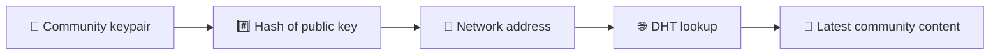
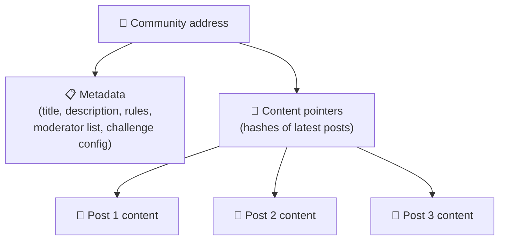
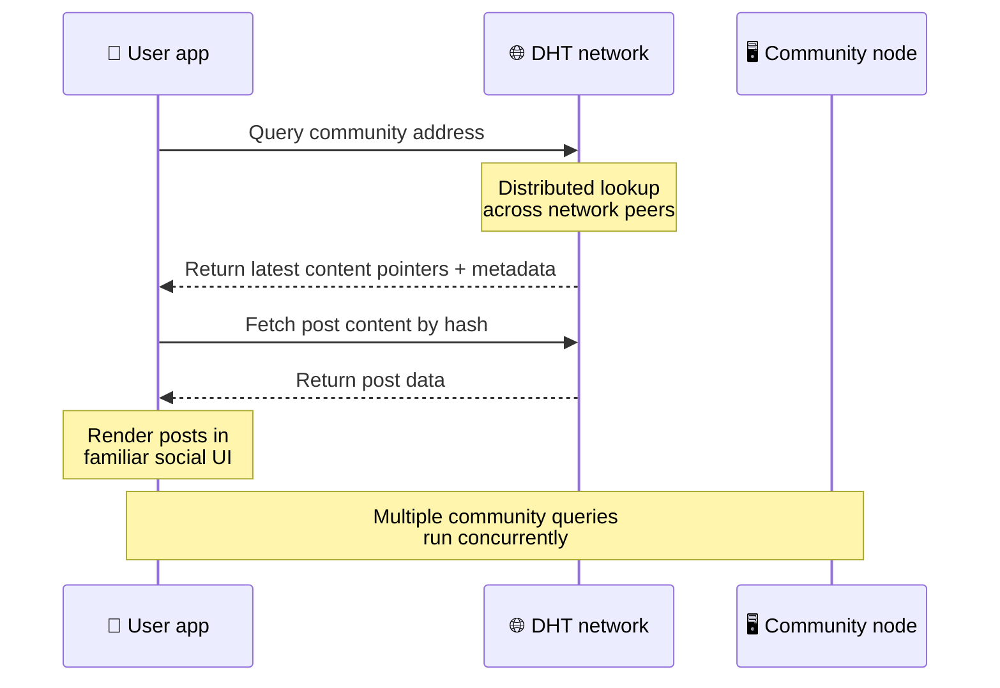
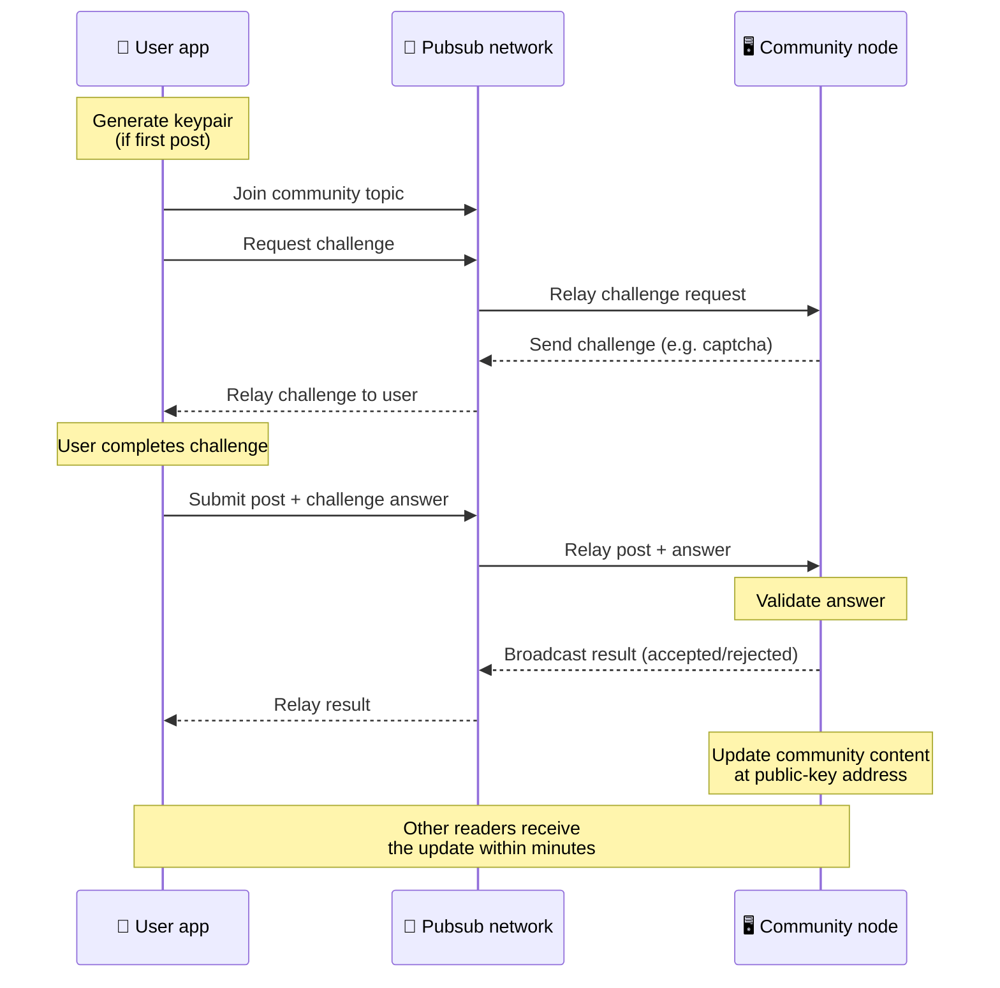
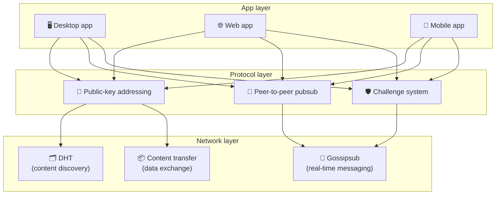

# Peer-to-peer-protocol

Bitsocial maakt geen gebruik van een blockchain, een federatieserver of een gecentraliseerde backend. In plaats daarvan combineert het twee ideeën – **public-key-based adressering** en **peer-to-peer pubsub** – om iedereen een community te laten hosten vanaf consumentenhardware terwijl gebruikers lezen en posten zonder accounts op een door het bedrijf gecontroleerde service.

Voor een minder technische uitleg, lees [Een volledige uitleg voor leken van het Bitsocial-protocol](./layman-protocol-explanation.md).

## De twee problemen

Een gedecentraliseerd sociaal netwerk moet twee vragen beantwoorden:

1. **Gegevens** — hoe bewaart en bedient u de sociale inhoud van de wereld zonder een centrale database?
2. **Spam** — hoe voorkom je misbruik terwijl je het netwerk vrij kunt gebruiken?

Bitsocial lost het dataprobleem op door de blockchain volledig over te slaan: sociale media hebben geen wereldwijde transactiebestelling of permanente beschikbaarheid van elk oud bericht nodig. Het lost het spamprobleem op door elke community zijn eigen anti-spam-uitdaging te laten uitvoeren via het peer-to-peer-netwerk.

Voor het ontdekkingsmodel boven deze netwerklaag, zie [Inhoud ontdekken](./content-discovery.md).

---

## Op openbare sleutels gebaseerde adressering

In BitTorrent wordt de hash van een bestand het adres (_content-based adressering_). Bitsocial gebruikt een soortgelijk idee met publieke sleutels: de hash van de publieke sleutel van een community wordt het netwerkadres.

Elke peer op het netwerk kan een DHT-query (gedistribueerde hashtabel) uitvoeren voor dat adres en de laatste status van de community ophalen. Elke keer dat de inhoud wordt bijgewerkt, wordt het versienummer verhoogd. Het netwerk bewaart alleen de nieuwste versie – het is niet nodig om elke historische status te behouden, wat deze aanpak lichtgewicht maakt vergeleken met een blockchain.

### Wat wordt opgeslagen op het adres

Het communityadres bevat niet rechtstreeks de volledige berichtinhoud. In plaats daarvan slaat het een lijst met inhoudsidentificatoren op: hashes die naar de daadwerkelijke gegevens verwijzen. De client haalt vervolgens elk stukje inhoud op via de DHT- of tracker-stijl lookups.

Minstens één peer beschikt altijd over de gegevens: het knooppunt van de communityoperator. Als de community populair is, zullen veel andere peers het ook hebben en de last verdeelt zichzelf, net zoals populaire torrents sneller te downloaden zijn.

---

## Peer-to-peer pubsub

Pubsub (publiceren-inschrijven) is een berichtenpatroon waarbij peers zich abonneren op een onderwerp en elk bericht ontvangen dat over dat onderwerp wordt gepubliceerd. Bitsocial maakt gebruik van een peer-to-peer pubsub-netwerk: iedereen kan publiceren, iedereen kan zich abonneren en er is geen centrale berichtenmakelaar.

Om een ​​bericht in een community te publiceren, publiceert een gebruiker een bericht waarvan het onderwerp gelijk is aan de openbare sleutel van de community. Het knooppunt van de community-operator pikt het op, valideert het en neemt het – als het de anti-spam-uitdaging doorstaat – op in de volgende inhoudsupdate.

---

## Antispam: uitdagingen over pubsub

Een open pubsub-netwerk is kwetsbaar voor spamoverstromingen. Bitsocial lost dit op door van uitgevers te eisen dat ze een **uitdaging** voltooien voordat hun inhoud wordt geaccepteerd.

Het challenge-systeem is flexibel: elke gemeenschapsoperator configureert zijn eigen beleid. Opties zijn onder meer:

| Uitdagingstype      | Hoe het werkt                                          |
| ------------------- | ------------------------------------------------------ |
| **Captcha**         | Visuele of interactieve puzzel gepresenteerd in de app |
| **Snelheidslimiet** | Beperk berichten per tijdvenster per identiteit        |
| **Tokenpoort**      | Bewijs van saldo van een specifiek token vereisen      |
| **Betaling**        | Vereisen een kleine betaling per post                  |
| **Toelatingslijst** | Alleen vooraf goedgekeurde identiteiten kunnen         |
| **Aangepaste code** | Elk beleid dat in code kan worden uitgedrukt           |

Peers die te veel mislukte uitdagingspogingen doorgeven, worden geblokkeerd voor het pubsub-onderwerp, waardoor denial-of-service-aanvallen op de netwerklaag worden voorkomen.

---

## Levenscyclus: het lezen van een gemeenschap

Dit is wat er gebeurt wanneer een gebruiker de app opent en de nieuwste berichten van een community bekijkt.

**Stap voor stap:**

1. De gebruiker opent de app en ziet een sociale interface.
2. De client sluit zich aan bij het peer-to-peer-netwerk en maakt een DHT-query voor elke community van de gebruiker
   volgt. Query's duren elk een paar seconden, maar worden gelijktijdig uitgevoerd.
3. Elke zoekopdracht retourneert de nieuwste inhoudsaanwijzers en metagegevens van de community (titel, beschrijving,
   moderatorlijst, uitdagingsconfiguratie).
4. De client haalt de daadwerkelijke berichtinhoud op met behulp van deze verwijzingen en geeft alles vervolgens weer in een
   vertrouwde sociale interface.

---

## Levenscyclus: een bericht publiceren

Publiceren omvat een handdruk tussen uitdaging en antwoord via pubsub voordat het bericht wordt geaccepteerd.

**Stap voor stap:**

1. De app genereert een sleutelpaar voor de gebruiker als deze er nog geen heeft.
2. De gebruiker schrijft een bericht voor een community.
3. De client neemt deel aan het pubsub-onderwerp voor die community (versleuteld aan de openbare sleutel van de community).
4. De klant vraagt ​​een uitdaging aan via pubsub.
5. Het knooppunt van de communityoperator stuurt een uitdaging terug (bijvoorbeeld een captcha).
6. De gebruiker voltooit de uitdaging.
7. De klant verzendt het bericht samen met het uitdagingsantwoord via pubsub.
8. Het knooppunt van de communityoperator valideert het antwoord. Indien correct, wordt de post geaccepteerd.
9. Het knooppunt zendt het resultaat uit via pubsub, zodat netwerkgenoten weten dat ze moeten doorgaan met doorgeven
   berichten van deze gebruiker.
10. Het knooppunt werkt de inhoud van de community bij op het adres met de publieke sleutel.
11. Binnen een paar minuten ontvangt elke lezer van de community de update.

---

## Architectuur overzicht

Het volledige systeem bestaat uit drie lagen die samenwerken:

| Laag         | Rol                                                                                                                                                              |
| ------------ | ---------------------------------------------------------------------------------------------------------------------------------------------------------------- |
| **App**      | Gebruikersinterface. Er kunnen meerdere apps bestaan, elk met een eigen ontwerp, die allemaal dezelfde gemeenschappen en identiteiten delen.                     |
| **Protocol** | Definieert hoe communities worden aangesproken, hoe berichten worden gepubliceerd en hoe spam wordt voorkomen.                                                   |
| **Netwerk**  | De onderliggende peer-to-peer-infrastructuur: DHT voor ontdekking, gossipsub voor realtime berichtenuitwisseling en inhoudsoverdracht voor gegevensuitwisseling. |

---

## Privacy: auteurs ontkoppelen van IP-adressen

Wanneer een gebruiker een bericht publiceert, wordt de inhoud **versleuteld met de openbare sleutel van de community-operator** voordat deze het pubsub-netwerk binnengaat. Dit betekent dat hoewel netwerkwaarnemers kunnen zien dat een peer _iets_ heeft gepubliceerd, ze niet kunnen bepalen:

- wat de inhoud zegt
- welke auteursidentiteit het heeft gepubliceerd

Dit is vergelijkbaar met hoe BitTorrent het mogelijk maakt om te ontdekken welke IP's een torrent seeden, maar niet wie deze oorspronkelijk heeft gemaakt. De encryptielaag voegt een extra privacygarantie toe bovenop die basislijn.

---

## Peer-to-peer-browser

Browser P2P is nu mogelijk in Bitsocial-clients. Een browser-app kan een [Helia](https://helia.io/)-knooppunt uitvoeren, dezelfde Bitsocial-protocol-clientstack gebruiken als andere apps, en inhoud ophalen van peers in plaats van een gecentraliseerde IPFS-gateway te vragen om deze te bedienen. De browser kan ook rechtstreeks deelnemen aan pubsub, dus voor het plaatsen van berichten is op het gelukkige pad geen pubsub-provider nodig die eigendom is van een platform.

Dit is de belangrijke mijlpaal voor webdistributie: een normale HTTPS-website kan worden geopend in een live P2P sociale client. Gebruikers hoeven geen desktop-app te installeren voordat ze van het netwerk kunnen lezen, en de app-operator hoeft geen centrale gateway te runnen die voor elke browsergebruiker het censuur- of moderatie-knelpunt wordt.

Het browserpad heeft andere limieten dan een desktop- of serverknooppunt:

- een browserknooppunt kan doorgaans geen willekeurige inkomende verbindingen van het openbare internet accepteren
- het kan gegevens laden, valideren, in de cache opslaan en publiceren terwijl de app geopend is
- het mag niet worden behandeld als de langlevende host voor de gegevens van een gemeenschap
- volledige communityhosting kan nog steeds het beste worden afgehandeld via een desktop-app, `bitsocial-cli`, of een andere
  Always-on-knooppunt

HTTP-routers zijn nog steeds belangrijk voor het ontdekken van inhoud: ze retourneren provideradressen voor een community-hash. Het zijn geen IPFS-gateways, omdat ze de inhoud zelf niet bedienen. Na ontdekking maakt de browserclient verbinding met peers en haalt de gegevens op via de P2P-stack.

5chan stelt dit bloot als een opt-in geavanceerde instellingenschakelaar in de normale 5chan.app-webapp. De nieuwste `pkc-js`-browserstack is stabiel genoeg geworden voor openbare tests nadat upstream libp2p/gossipsub-interoperabiliteit de bezorging van berichten tussen Helia- en Kubo-peers had aangepakt. De instelling houdt de browser P2P onder controle terwijl deze in de praktijk wordt getest; zodra het voldoende productievertrouwen heeft, kan het het standaard webpad worden.

## Terugval op de gateway

Door een gateway ondersteunde browsertoegang is nog steeds nuttig als reserve voor compatibiliteit en uitrol. Een gateway kan gegevens doorgeven tussen het P2P-netwerk en een browserclient wanneer een browser niet rechtstreeks verbinding kan maken met het netwerk of wanneer de app opzettelijk het oudere pad kiest. Deze gateways:

- kan door iedereen worden gerund
- vereisen geen gebruikersaccounts of betalingen
- verkrijg geen voogdij over gebruikersidentiteiten of gemeenschappen
- kan worden uitgewisseld zonder gegevensverlies

De doelarchitectuur is eerst browser-P2P, met gateways als optionele fallback in plaats van het standaardknelpunt.

---

## Waarom geen blockchain?

Blockchains lossen het probleem van dubbele uitgaven op: ze moeten de exacte volgorde van elke transactie weten om te voorkomen dat iemand dezelfde munt twee keer uitgeeft.

Sociale media hebben geen probleem met dubbele uitgaven. Het maakt niet uit of bericht A één milliseconde vóór bericht B is gepubliceerd, en oude berichten hoeven niet permanent op elk knooppunt beschikbaar te zijn.

Door de blockchain over te slaan, vermijdt Bitsocial:

- **gaskosten** — plaatsen is gratis
- **doorvoerlimieten** — geen knelpunt in blokgrootte of bloktijd
- **opslag opgeblazen** — knooppunten behouden alleen wat ze nodig hebben
- **consensus-overhead** — geen miners, validators of staking vereist

De afweging is dat Bitsocial geen permanente beschikbaarheid van oude inhoud garandeert. Maar voor sociale media is dat een acceptabele afweging: het knooppunt van de community-operator bewaart de gegevens, populaire inhoud verspreidt zich over veel leeftijdsgenoten, en heel oude berichten verdwijnen vanzelf – net zoals ze dat op elk sociaal platform doen.

## Waarom geen federatie?

Federatieve netwerken (zoals e-mail of op ActivityPub gebaseerde platforms) verbeteren de centralisatie, maar hebben nog steeds structurele beperkingen:

- **Serverafhankelijkheid** — elke community heeft een server nodig met een domein, TLS en doorlopend
  onderhoud
- **Admin trust** — de serverbeheerder heeft volledige controle over gebruikersaccounts en inhoud
- **Fragmentatie** — het verplaatsen tussen servers betekent vaak het verlies van volgers, geschiedenis of identiteit
- **Kosten** — iemand moet betalen voor hosting, wat druk creëert in de richting van consolidatie

De peer-to-peer-aanpak van Bitsocial verwijdert de server volledig uit de vergelijking. Een communitynode kan draaien op een laptop, een Raspberry Pi of een goedkope VPS. De operator beheert het moderatiebeleid, maar kan geen gebruikersidentiteiten in beslag nemen, omdat identiteiten door sleutelparen worden beheerd en niet door de server worden toegekend.

---

## Samenvatting

Bitsocial is gebouwd op twee primitieven: op openbare sleutels gebaseerde adressering voor het ontdekken van inhoud, en peer-to-peer pubsub voor realtime communicatie. Samen produceren ze een sociaal netwerk waar:

- gemeenschappen worden geïdentificeerd door cryptografische sleutels, niet door domeinnamen
- inhoud verspreidt zich als een torrent over peers en wordt niet vanuit één database aangeboden
- Spamresistentie is lokaal voor elke community en niet opgelegd door een platform
- gebruikers bezitten hun identiteit via sleutelparen, niet via herroepbare accounts
- het hele systeem draait zonder servers, blockchains of platformkosten
