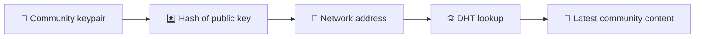
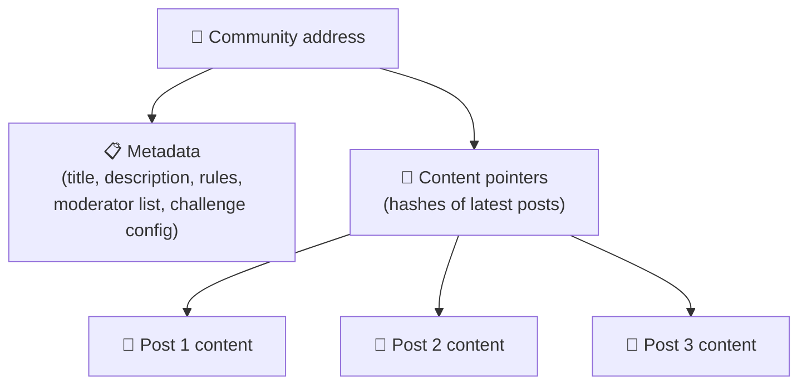
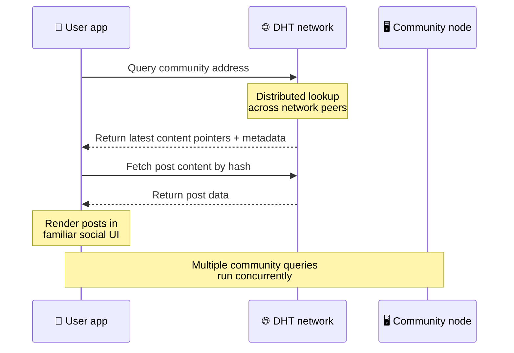
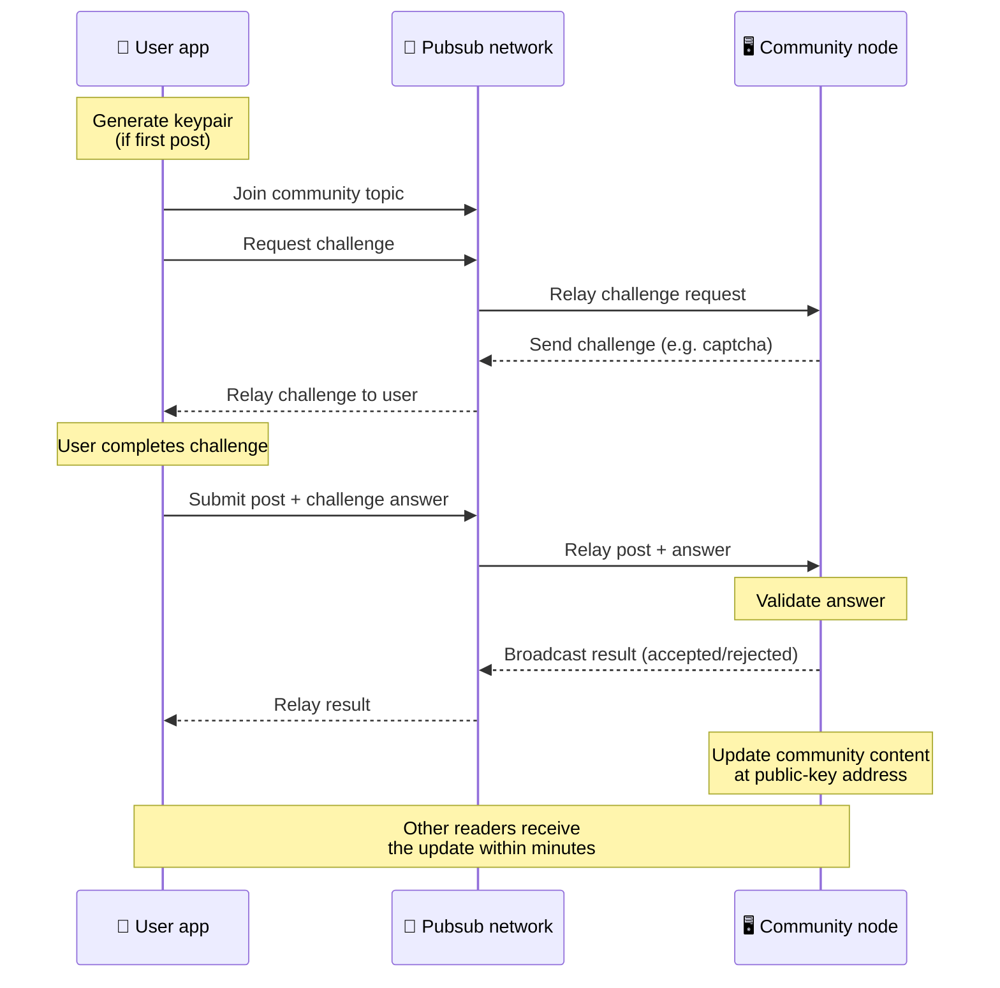
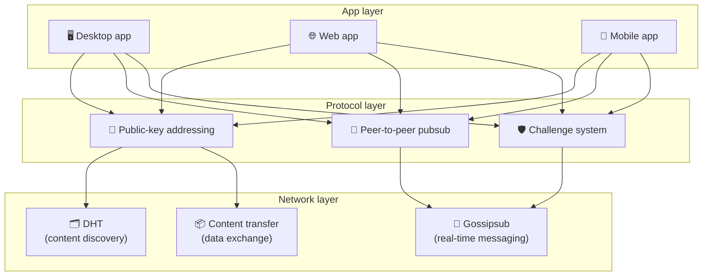

# Peer-to-Peer-protokoll

Bitsocial bruker ikke en blokkjede, en føderasjonsserver eller en sentralisert backend. I stedet kombinerer den to ideer – **offentlig nøkkelbasert adressering** og **node-til-node pubsub** – for å la hvem som helst være vert for et fellesskap fra forbrukermaskinvare mens brukere leser og legger ut uten kontoer på noen bedriftskontrollert tjeneste.

For en mindre teknisk gjennomgang, les [En fullstendig lekmannsforklaring av Bitsocial-protokollen](./layman-protocol-explanation.md).

## De to problemene

Et desentralisert sosialt nettverk må svare på to spørsmål:

1. **Data** — hvordan lagrer og serverer du verdens sosiale innhold uten en sentral database?
2. **Spam** — hvordan forhindrer du misbruk mens du holder nettverket fritt å bruke?

Bitsocial løser dataproblemet ved å hoppe over blokkjeden helt: sosiale medier trenger ikke global transaksjonsbestilling eller permanent tilgjengelighet for alle gamle innlegg. Det løser spam-problemet ved å la hvert fellesskap kjøre sin egen anti-spam-utfordring over peer-to-peer-nettverket.

For funnmodellen over dette nettverkslaget, se [Oppdagelse av innhold](./content-discovery.md).

---

## Offentlig nøkkelbasert adressering

I BitTorrent blir en fils hash adresse (_innholdsbasert adressering_). Bitsocial bruker en lignende idé med offentlige nøkler: hashen til fellesskapets offentlige nøkkel blir nettverksadressen.

Enhver peer på nettverket kan utføre en DHT (distribuert hash-tabell)-spørring for den adressen og hente fellesskapets siste status. Hver gang innholdet oppdateres, øker versjonsnummeret. Nettverket beholder bare den nyeste versjonen - det er ikke nødvendig å bevare enhver historisk tilstand, noe som gjør denne tilnærmingen lett sammenlignet med en blokkjede.

### Hva lagres på adressen

Fellesskapets adresse inneholder ikke fullstendig innleggsinnhold direkte. I stedet lagrer den en liste over innholdsidentifikatorer - hashes som peker til de faktiske dataene. Klienten henter deretter hver del av innholdet gjennom DHT- eller tracker-stil oppslag.

Minst én peer har alltid dataene: fellesskapsoperatørens node. Hvis fellesskapet er populært, vil mange andre jevnaldrende ha det også, og belastningen fordeler seg, på samme måte som populære torrenter er raskere å laste ned.

---

## Peer-to-peer pubsub

Pubsub (publiser-abonner) er et meldingsmønster der jevnaldrende abonnerer på et emne og mottar hver melding som er publisert til det emnet. Bitsocial bruker et peer-to-peer pubsub-nettverk - hvem som helst kan publisere, hvem som helst kan abonnere, og det er ingen sentral meldingsmegler.

For å publisere et innlegg til et fellesskap, publiserer en bruker en melding hvis emne tilsvarer fellesskapets offentlige nøkkel. Fellesskapsoperatørens node plukker den opp, validerer den og – hvis den består anti-spam-utfordringen – inkluderer den i neste innholdsoppdatering.

---

## Anti-spam: utfordringer over pubsub

Et åpent pubsub-nettverk er sårbart for spamflommer. Bitsocial løser dette ved å kreve at utgivere fullfører en **utfordring** før innholdet deres blir akseptert.

Utfordringssystemet er fleksibelt: hver fellesskapsoperatør konfigurerer sin egen policy. Alternativene inkluderer:

| Utfordringstype       | Slik fungerer det                                       |
| --------------------- | ------------------------------------------------------- |
| **Captcha**           | Visuelt eller interaktivt puslespill presentert i appen |
| **Satsbegrensning**   | Begrens innlegg per tidsvindu per identitet             |
| **Token gate**        | Krev bevis på balanse for et spesifikt token            |
| **Betaling**          | Krev en liten betaling per post                         |
| **Tillatelsesliste**  | Bare forhåndsgodkjente identiteter kan legge inn        |
| **Egendefinert kode** | Enhver policy som kan uttrykkes i kode                  |

Peers som videresender for mange mislykkede utfordringsforsøk, blir blokkert fra pubsub-emnet, noe som forhindrer tjenestenektangrep på nettverkslaget.

---

## Livssyklus: å lese et fellesskap

Dette er hva som skjer når en bruker åpner appen og ser på et fellesskaps siste innlegg.

**Trinn for trinn:**

1. Brukeren åpner appen og ser et sosialt grensesnitt.
2. Klienten blir med i peer-to-peer-nettverket og lager en DHT-spørring for hvert fellesskap brukeren
   følger. Spørringene tar noen sekunder hver, men kjøres samtidig.
3. Hvert søk returnerer fellesskapets siste innholdspekere og metadata (tittel, beskrivelse,
   moderatorliste, utfordringskonfigurasjon).
4. Klienten henter det faktiske innleggsinnholdet ved å bruke disse pekerne, og gjengir deretter alt i en
   kjent sosialt grensesnitt.

---

## Livssyklus: publisere et innlegg

Publisering innebærer et utfordring-svar-håndtrykk over pubsub før innlegget blir akseptert.

**Trinn for trinn:**

1. Appen genererer et nøkkelpar for brukeren hvis de ikke har et ennå.
2. Brukeren skriver et innlegg for et fellesskap.
3. Klienten blir med i pubsub-emnet for det fellesskapet (tastet til fellesskapets offentlige nøkkel).
4. Klienten ber om en utfordring over pubsub.
5. Fellesskapsoperatørens node sender tilbake en utfordring (for eksempel en captcha).
6. Brukeren fullfører utfordringen.
7. Klienten sender inn innlegget sammen med utfordringssvaret over pubsub.
8. Fellesskapsoperatørens node validerer svaret. Hvis det er riktig, godtas innlegget.
9. Noden kringkaster resultatet over pubsub slik at nettverkskolleger vet at de skal fortsette videresendingen
   meldinger fra denne brukeren.
10. Noden oppdaterer fellesskapets innhold til dens offentlige nøkkeladresse.
11. I løpet av noen få minutter mottar hver leser av fellesskapet oppdateringen.

---

## Arkitektur oversikt

Hele systemet har tre lag som fungerer sammen:

| Lag           | Rolle                                                                                                                                       |
| ------------- | ------------------------------------------------------------------------------------------------------------------------------------------- |
| **App**       | Brukergrensesnitt. Flere apper kan eksistere, hver med sitt eget design, som alle deler de samme fellesskapene og identitetene.             |
| **Protokoll** | Definerer hvordan fellesskap adresseres, hvordan innlegg publiseres og hvordan spam forhindres.                                             |
| **Nettverk**  | Den underliggende peer-to-peer-infrastrukturen: DHT for oppdagelse, sladder for sanntidsmeldinger og innholdsoverføring for datautveksling. |

---

## Personvern: koble fra forfattere fra IP-adresser

Når en bruker publiserer et innlegg, blir innholdet **kryptert med fellesskapsoperatørens offentlige nøkkel** før det kommer inn i pubsub-nettverket. Dette betyr at mens nettverksobservatører kan se at en peer publiserte _noe_, kan de ikke fastslå:

- hva innholdet sier
- hvilken forfatteridentitet som publiserte det

Dette ligner på hvordan BitTorrent gjør det mulig å oppdage hvilke IP-er som setter en torrent, men ikke hvem som opprinnelig opprettet den. Krypteringslaget legger til en ekstra personverngaranti på toppen av den grunnlinjen.

---

## Nettleser peer-to-peer

Nettleser P2P er nå mulig i Bitsocial-klienter. En nettleserapp kan kjøre en [Helia](https://helia.io/)-node, bruke den samme Bitsocial-protokollklientstabelen som andre apper, og hente innhold fra jevnaldrende i stedet for å be en sentralisert IPFS-gateway om å betjene den. Nettleseren kan også delta i pubsub direkte, slik at publisering ikke trenger en plattformeid pubsub-leverandør i den gode banen.

Dette er den viktige milepælen for nettdistribusjon: et normalt HTTPS-nettsted kan åpnes til en live P2P sosial klient. Brukere trenger ikke å installere en desktop-app før de kan lese fra nettverket, og app-operatøren trenger ikke å kjøre en sentral gateway som blir sensur- eller modererings-chokepoint for hver nettleserbruker.

Nettleserbanen har forskjellige grenser fra en skrivebords- eller servernode:

- en nettlesernode kan vanligvis ikke akseptere vilkårlige innkommende tilkoblinger fra det offentlige internett
- den kan laste, validere, hurtigbufre og publisere data mens appen er åpen
- den skal ikke behandles som den langvarige verten for et fellesskaps data
- full fellesskapshosting håndteres fortsatt best av en skrivebordsapp, `bitsocial-cli` eller en annen
  alltid på node

HTTP-rutere har fortsatt betydning for innholdsoppdagelse: de returnerer leverandøradresser for en felleshash. De er ikke IPFS-gatewayer, fordi de ikke tjener selve innholdet. Etter oppdagelse kobler nettleserklienten seg til peers og henter dataene gjennom P2P-stakken.

5chan avslører dette som en opt-in Advanced Settings-bryter i den vanlige 5chan.app-nettappen. Den siste `pkc-js` nettleserstabelen har blitt stabil nok for offentlig testing etter oppstrøms libp2p/gossipsub-interoparbeid adressert meldingslevering mellom Helia- og Kubo-kolleger. Innstillingen holder nettleseren P2P-kontrollert mens den blir mer testing i den virkelige verden; når den har nok produksjonstillit, kan den bli standard webbane.

## Gateway fallback

Gateway-støttet nettlesertilgang er fortsatt nyttig som en kompatibilitets- og utrullingsreserve. En gateway kan videresende data mellom P2P-nettverket og en nettleserklient når en nettleser ikke kan koble seg direkte til nettverket eller når appen med vilje velger den eldre banen. Disse portene:

- kan drives av hvem som helst
- krever ikke brukerkontoer eller betalinger
- ikke få varetekt over brukeridentiteter eller fellesskap
- kan byttes ut uten å miste data

Målarkitekturen er nettleseren P2P først, med gatewayer som en valgfri reserve i stedet for standard flaskehals.

---

## Hvorfor ikke en blokkjede?

Blokkjeder løser problemet med dobbeltforbruk: de trenger å vite den nøyaktige rekkefølgen på hver transaksjon for å forhindre at noen bruker den samme mynten to ganger.

Sosiale medier har ikke et problem med dobbeltforbruk. Det spiller ingen rolle om innlegg A ble publisert ett millisekund før innlegg B, og gamle innlegg trenger ikke å være permanent tilgjengelig på hver node.

Ved å hoppe over blokkjeden unngår Bitsocial:

- **gassavgifter** — innlegging er gratis
- **gjennomstrømningsgrenser** — ingen blokkstørrelse eller blokkeringstidsflaskehals
- **oppblåst lagring** — noder beholder bare det de trenger
- **konsensusoverhead** — ingen gruvearbeidere, validatorer eller innsats kreves

Avveiningen er at Bitsocial ikke garanterer permanent tilgjengelighet av gammelt innhold. Men for sosiale medier er det en akseptabel avveining: Fellesskapsoperatørens node holder dataene, populært innhold spres over mange jevnaldrende, og veldig gamle innlegg blekner naturlig – på samme måte som de gjør på alle sosiale plattformer.

## Hvorfor ikke forbund?

Federerte nettverk (som e-post eller ActivityPub-baserte plattformer) forbedrer sentraliseringen, men har fortsatt strukturelle begrensninger:

- **Tjeneravhengighet** – hvert fellesskap trenger en server med et domene, TLS og pågående
  vedlikehold
- **Administratortillit** — serveradministratoren har full kontroll over brukerkontoer og innhold
- **Fragmentering** — flytting mellom servere betyr ofte å miste følgere, historikk eller identitet
- **Kostnad** — noen må betale for hosting, noe som skaper press mot konsolidering

Bitsocials peer-to-peer-tilnærming fjerner serveren helt fra ligningen. En fellesskapsnode kan kjøres på en bærbar datamaskin, en Raspberry Pi eller en billig VPS. Operatøren kontrollerer modereringspolicy, men kan ikke gripe brukeridentiteter, fordi identiteter er nøkkelpar-kontrollert, ikke server-tildelt.

---

## Sammendrag

Bitsocial er bygget på to primitiver: offentlig-nøkkel-basert adressering for innholdsoppdagelse, og peer-to-peer pubsub for sanntidskommunikasjon. Sammen produserer de et sosialt nettverk der:

- fellesskap identifiseres av kryptografiske nøkler, ikke domenenavn
- innhold spres over jevnaldrende som en torrent, ikke servert fra en enkelt database
- spam-motstand er lokal for hvert fellesskap, ikke pålagt av en plattform
- brukere eier identiteten sin gjennom nøkkelpar, ikke gjennom gjenkallbare kontoer
- hele systemet kjører uten servere, blokkjeder eller plattformavgifter
