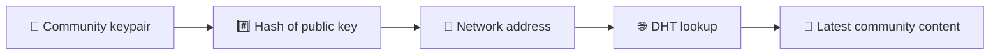
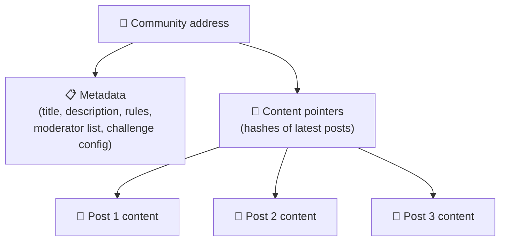
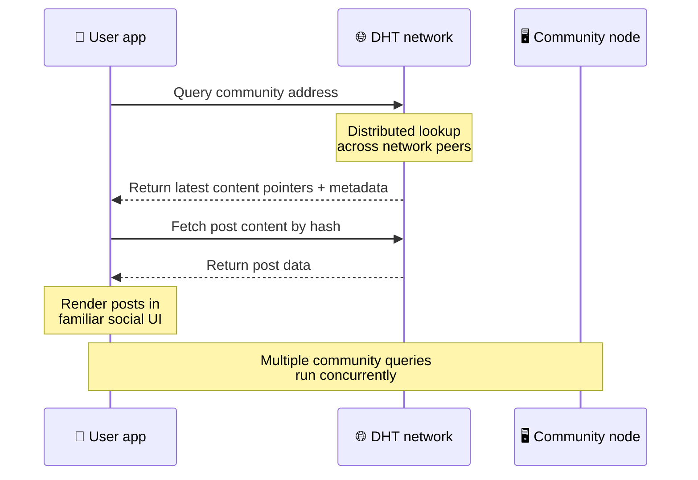
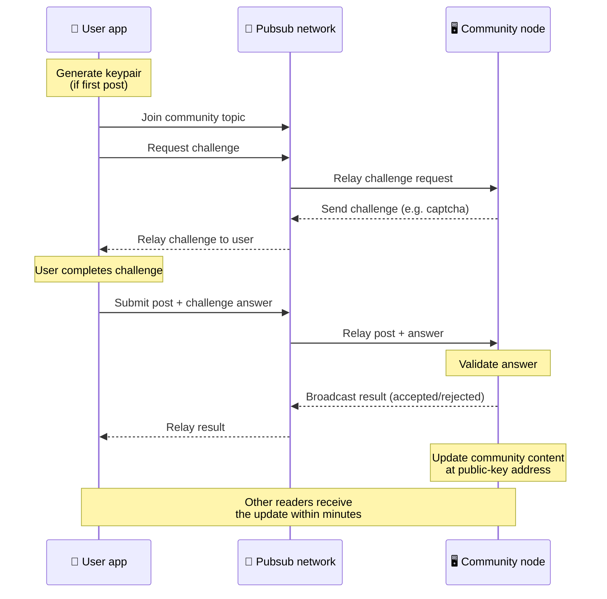
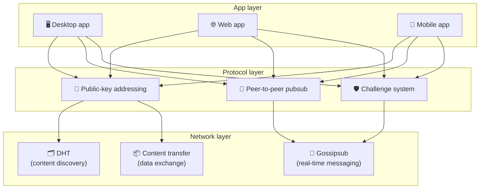

# Protokół peer-to-peer

Bitsocial nie korzysta z blockchainu, serwera federacyjnego ani scentralizowanego backendu. Zamiast tego łączy w sobie dwa pomysły — **adresowanie oparte na kluczu publicznym** i **pubsub peer-to-peer** — aby umożliwić każdemu hostowanie społeczności na sprzęcie konsumenckim, podczas gdy użytkownicy czytają i publikują posty bez konta w jakiejkolwiek usłudze kontrolowanej przez firmę.

Aby zapoznać się z mniej technicznym przewodnikiem, przeczytaj [Kompletne wyjaśnienie protokołu Bitsocial dla laika](./layman-protocol-explanation.md).

## Dwa problemy

Zdecentralizowana sieć społecznościowa musi odpowiedzieć na dwa pytania:

1. **Dane** — jak przechowywać i udostępniać treści społecznościowe z całego świata bez centralnej bazy danych?
2. **Spam** — jak zapobiegać nadużyciom, zachowując jednocześnie swobodę korzystania z sieci?

Bitsocial rozwiązuje problem danych, całkowicie pomijając blockchain: media społecznościowe nie wymagają globalnego porządkowania transakcji ani stałej dostępności każdego starego postu. Rozwiązuje problem spamu, umożliwiając każdej społeczności prowadzenie własnego wyzwania antyspamowego w sieci peer-to-peer.

Model odkrywania nad tą warstwą sieci opisuje [Odkrywanie treści](./content-discovery.md).

---

## Adresowanie oparte na kluczu publicznym

W BitTorrent skrót pliku staje się jego adresem (_adresowanie oparte na treści_). Bitsocial używa podobnego pomysłu w przypadku kluczy publicznych: skrót klucza publicznego społeczności staje się jej adresem sieciowym.

Każdy element równorzędny w sieci może wykonać zapytanie DHT (rozproszona tabela skrótów) dla tego adresu i pobrać najnowszy stan społeczności. Za każdym razem, gdy treść jest aktualizowana, numer jej wersji wzrasta. Sieć przechowuje tylko najnowszą wersję — nie ma potrzeby zachowywania każdego stanu historycznego, co sprawia, że ​​to podejście jest lekkie w porównaniu z blockchainem.

### Co zostaje zapisane pod adresem

Adres społeczności nie zawiera bezpośrednio pełnej treści posta. Zamiast tego przechowuje listę identyfikatorów treści — skrótów wskazujących rzeczywiste dane. Następnie klient pobiera każdy fragment treści za pomocą wyszukiwania DHT lub modułu śledzącego.

Przynajmniej jeden peer zawsze ma dane: węzeł operatora społeczności. Jeśli społeczność jest popularna, będzie ją mieć także wielu innych użytkowników, a obciążenie rozłoży się samoczynnie, w ten sam sposób, w jaki pobieranie popularnych torrentów jest szybsze.

---

## Pubsub typu peer-to-peer

Pubsub (publish-subscribe) to wzorzec przesyłania wiadomości, w którym współpracownicy subskrybują temat i otrzymują każdą wiadomość opublikowaną w tym temacie. Bitsocial korzysta z sieci pubsub typu peer-to-peer — każdy może publikować, każdy może subskrybować i nie ma centralnego brokera wiadomości.

Aby opublikować post w społeczności, użytkownik publikuje wiadomość, której temat jest równy kluczowi publicznemu społeczności. Węzeł operatora społeczności odbiera go, sprawdza poprawność i – jeśli przejdzie pomyślnie test antyspamowy – uwzględnia go w następnej aktualizacji zawartości.

---

## Ochrona przed spamem: wyzwania dotyczące pubsub

Otwarta sieć pubsub jest podatna na zalew spamu. Bitsocial rozwiązuje ten problem, wymagając od wydawców ukończenia **wyzwania** przed zaakceptowaniem ich treści.

System wyzwań jest elastyczny: każdy operator społecznościowy konfiguruje własną politykę. Opcje obejmują:

| Rodzaj wyzwania            | Jak to działa                                                 |
| -------------------------- | ------------------------------------------------------------- |
| **Captcha**                | Wizualna lub interaktywna łamigłówka prezentowana w aplikacji |
| **Ograniczenie szybkości** | Limit postów na okno czasowe na tożsamość                     |
| **Żetonowa brama**         | Wymagaj dowodu salda określonego tokena                       |
| **Płatność**               | Wymagaj niewielkiej płatności za post                         |
| **Lista dozwolonych**      | Tylko wstępnie zatwierdzone tożsamości mogą publikować        |
| **Kod niestandardowy**     | Dowolna polityka wyrażona w kodzie                            |

Elementy równorzędne, które przekazują zbyt wiele nieudanych prób wyzwania, są blokowane w temacie pubsub, co zapobiega atakom typu „odmowa usługi” w warstwie sieciowej.

---

## Cykl życia: czytanie społeczności

Dzieje się tak, gdy użytkownik otwiera aplikację i przegląda najnowsze posty społeczności.

**Krok po kroku:**

1. Użytkownik otwiera aplikację i widzi interfejs społecznościowy.
2. Klient przyłącza się do sieci peer-to-peer i wysyła zapytanie DHT do każdej społeczności będącej użytkownikiem
   następuje. Zapytania trwają kilka sekund, ale są uruchamiane jednocześnie.
3. Każde zapytanie zwraca najnowsze wskaźniki zawartości społeczności i metadane (tytuł, opis,
   lista moderatorów, konfiguracja wyzwania).
4. Klient pobiera rzeczywistą treść postu za pomocą tych wskaźników, a następnie renderuje wszystko w pliku a
   znany interfejs społecznościowy.

---

## Cykl życia: publikacja postu

Publikowanie obejmuje uścisk dłoni w odpowiedzi na wyzwanie w pubsub przed zaakceptowaniem postu.

**Krok po kroku:**

1. Aplikacja generuje parę kluczy dla użytkownika, jeśli jeszcze jej nie posiada.
2. Użytkownik pisze post dla społeczności.
3. Klient przyłącza się do tematu pubsub dla tej społeczności (kluczem publicznym społeczności).
4. Klient prosi o wyzwanie poprzez pubsub.
5. Węzeł operatora społeczności odsyła wezwanie (na przykład captcha).
6. Użytkownik kończy wyzwanie.
7. Klient przesyła post wraz z odpowiedzią na wyzwanie za pośrednictwem pubsub.
8. Węzeł operatora społeczności sprawdza odpowiedź. Jeżeli jest poprawny, post zostaje zaakceptowany.
9. Węzeł rozgłasza wynik poprzez pubsub, aby uczestnicy sieci wiedzieli, że mogą kontynuować przekazywanie
   wiadomości od tego użytkownika.
10. Węzeł aktualizuje zawartość społeczności pod adresem klucza publicznego.
11. W ciągu kilku minut każdy czytelnik społeczności otrzyma aktualizację.

---

## Przegląd architektury

Pełny system składa się z trzech współpracujących ze sobą warstw:

| Warstwa       | Rola                                                                                                                                                      |
| ------------- | --------------------------------------------------------------------------------------------------------------------------------------------------------- |
| **Aplikacja** | Interfejs użytkownika. Może istnieć wiele aplikacji, każda z własnym projektem, wszystkie współdzielące te same społeczności i tożsamości.                |
| **Protokół**  | Określa sposób zwracania się do społeczności, sposobu publikowania postów i zapobiegania spamowi.                                                         |
| **Sieć**      | Podstawowa infrastruktura peer-to-peer: DHT do wykrywania, plotki do przesyłania wiadomości w czasie rzeczywistym i przesyłanie treści do wymiany danych. |

---

## Prywatność: odłączanie autorów od adresów IP

Kiedy użytkownik publikuje post, jego treść jest **szyfrowana kluczem publicznym operatora społeczności** zanim trafi do sieci pubsub. Oznacza to, że chociaż obserwatorzy sieci mogą zobaczyć, że inny użytkownik opublikował _coś_, nie mogą określić:

- co mówi treść
- która tożsamość autora go opublikowała

Przypomina to sposób, w jaki BitTorrent umożliwia odkrycie, które adresy IP wysyłają torrent, ale nie to, kto go pierwotnie stworzył. Warstwa szyfrowania zapewnia dodatkową gwarancję prywatności oprócz tej wartości bazowej.

---

## Przeglądarka peer-to-peer

Przeglądarka P2P jest teraz możliwa w klientach Bitsocial. Aplikacja przeglądarkowa może uruchomić węzeł [Helia](https://helia.io/), używać tego samego stosu klienta protokołu Bitsocial co inne aplikacje i pobierać treści od równorzędnych użytkowników, zamiast prosić scentralizowaną bramę IPFS o jej obsłużenie. Przeglądarka może również bezpośrednio uczestniczyć w pubsub, więc publikowanie nie wymaga obecności dostawcy pubsub będącego własnością platformy na szczęśliwej ścieżce.

Jest to ważny kamień milowy w dystrybucji internetowej: zwykła witryna internetowa HTTPS może otworzyć się na działającym kliencie społecznościowym P2P. Użytkownicy nie muszą instalować aplikacji komputerowej, zanim będą mogli czytać z sieci, a operator aplikacji nie musi uruchamiać centralnej bramy, która staje się wąskim punktem cenzury lub moderacji dla każdego użytkownika przeglądarki.

Ścieżka przeglądarki ma inne ograniczenia niż węzeł pulpitu lub serwera:

- węzeł przeglądarki zwykle nie może akceptować dowolnych połączeń przychodzących z publicznego Internetu
- może ładować, sprawdzać, buforować i publikować dane, gdy aplikacja jest otwarta
- nie należy go traktować jako długotrwałego hosta danych społeczności
- pełny hosting społecznościowy nadal najlepiej obsługuje aplikacja komputerowa `bitsocial-cli` lub inna
  węzeł zawsze włączony

Routery HTTP nadal mają znaczenie w wykrywaniu treści: zwracają adresy dostawców dla skrótu społeczności. Nie są bramami IPFS, ponieważ nie obsługują samej treści. Po wykryciu klient przeglądarki łączy się z urządzeniami równorzędnymi i pobiera dane za pośrednictwem stosu P2P.

5chan udostępnia to jako opcjonalny przełącznik ustawień zaawansowanych w zwykłej aplikacji internetowej 5chan.app. Najnowszy stos przeglądarki `pkc-js` stał się wystarczająco stabilny, aby można było go publicznie przetestować po tym, jak wcześniejsza praca interoperacyjna libp2p/gossipsub zajęła się dostarczaniem komunikatów pomiędzy urządzeniami równorzędnymi Helia i Kubo. To ustawienie utrzymuje kontrolę nad P2P w przeglądarce, podczas gdy jest poddawana większej liczbie testów w świecie rzeczywistym; gdy uzyska wystarczającą pewność produkcji, może stać się domyślną ścieżką internetową.

## Powrót do bramy

Dostęp do przeglądarki wspieranej przez bramę jest nadal przydatny jako zabezpieczenie w zakresie zgodności i wdrażania awaryjnego. Brama może przekazywać dane pomiędzy siecią P2P a klientem przeglądarki, gdy przeglądarka nie może bezpośrednio połączyć się z siecią lub gdy aplikacja celowo wybiera starszą ścieżkę. Te bramy:

- może być prowadzony przez każdego
- nie wymagają kont użytkowników ani płatności
- nie przejmuj kontroli nad tożsamościami użytkowników ani społecznościami
- można wymienić bez utraty danych

Docelowa architektura to przede wszystkim P2P w przeglądarce, z bramami jako opcjonalnym rozwiązaniem awaryjnym, a nie domyślnym wąskim gardłem.

---

## Dlaczego nie blockchain?

Blockchainy rozwiązują problem podwójnych wydatków: muszą znać dokładną kolejność każdej transakcji, aby zapobiec dwukrotnemu wydaniu tej samej monety.

W mediach społecznościowych nie ma problemu podwójnych wydatków. Nie ma znaczenia, czy post A został opublikowany milisekundę przed postem B, a stare posty nie muszą być stale dostępne w każdym węźle.

Pomijając blockchain, Bitsocial unika:

- **opłaty za gaz** — wysłanie jest bezpłatne
- **limity przepustowości** — brak wąskich gardeł związanych z rozmiarem bloku i czasem bloku
- **rozdęcie pamięci** — węzły przechowują tylko to, czego potrzebują
- **narzut konsensusu** — nie są wymagane żadne górniki, walidatory ani stakowanie

Kompromis polega na tym, że Bitsocial nie gwarantuje stałej dostępności starych treści. Jednak w przypadku mediów społecznościowych jest to akceptowalny kompromis: węzeł operatora społeczności przechowuje dane, popularne treści rozprzestrzeniają się wśród wielu użytkowników, a bardzo stare posty w naturalny sposób blakną – tak samo jak na każdej platformie społecznościowej.

## Dlaczego nie federacja?

Sieci stowarzyszone (takie jak platformy e-mail lub platformy oparte na ActivityPub) poprawiają się pod względem centralizacji, ale nadal mają ograniczenia strukturalne:

- **Zależność od serwera** — każda społeczność potrzebuje serwera z domeną, TLS i działającym
  konserwacja
- **Zaufanie administratora** — administrator serwera ma pełną kontrolę nad kontami użytkowników i treścią
- **Fragmentacja** — przemieszczanie się między serwerami często oznacza utratę obserwujących, historii lub tożsamości
- **Koszt** — ktoś musi zapłacić za hosting, co stwarza presję na konsolidację

Podejście peer-to-peer firmy Bitsocial całkowicie eliminuje serwer z równania. Węzeł społecznościowy może działać na laptopie, Raspberry Pi lub tanim VPS. Operator kontroluje politykę moderacji, ale nie może przejąć tożsamości użytkowników, ponieważ tożsamości są kontrolowane na podstawie par kluczy, a nie nadawane przez serwer.

---

## Streszczenie

Bitsocial opiera się na dwóch elementach: adresowaniu opartym na kluczu publicznym do odkrywania treści i pubsub peer-to-peer do komunikacji w czasie rzeczywistym. Razem tworzą sieć społecznościową, w której:

- społeczności są identyfikowane za pomocą kluczy kryptograficznych, a nie nazw domen
- treść rozprzestrzenia się między urządzeniami równorzędnymi jak torrent, a nie jest dostarczana z jednej bazy danych
- Odporność na spam jest lokalna dla każdej społeczności i nie jest narzucona przez platformę
- użytkownicy posiadają swoją tożsamość poprzez pary kluczy, a nie poprzez odwołalne konta
- cały system działa bez serwerów, łańcuchów bloków i opłat za platformę
