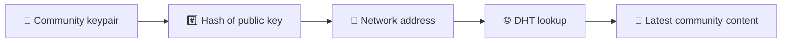
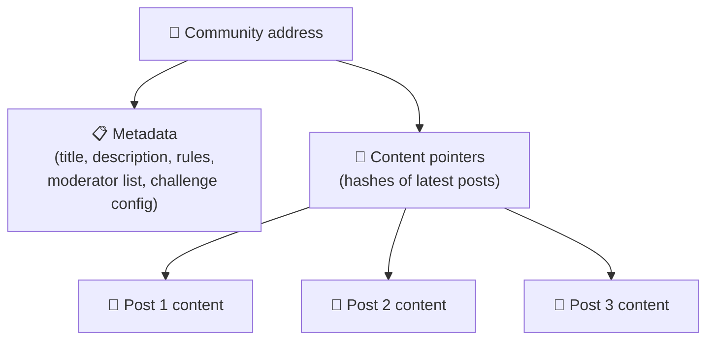
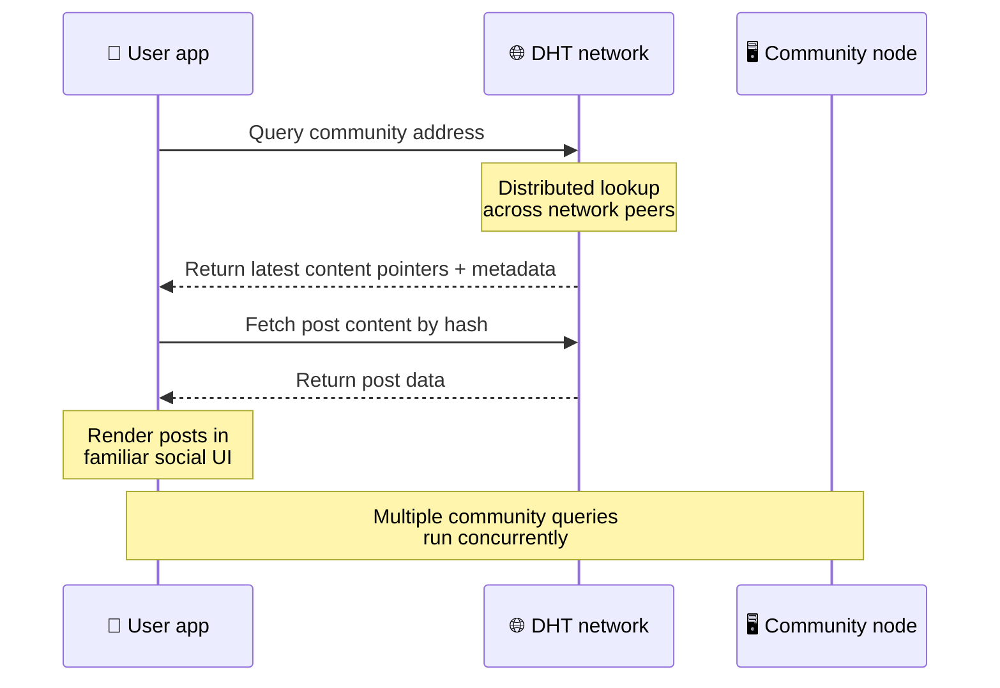
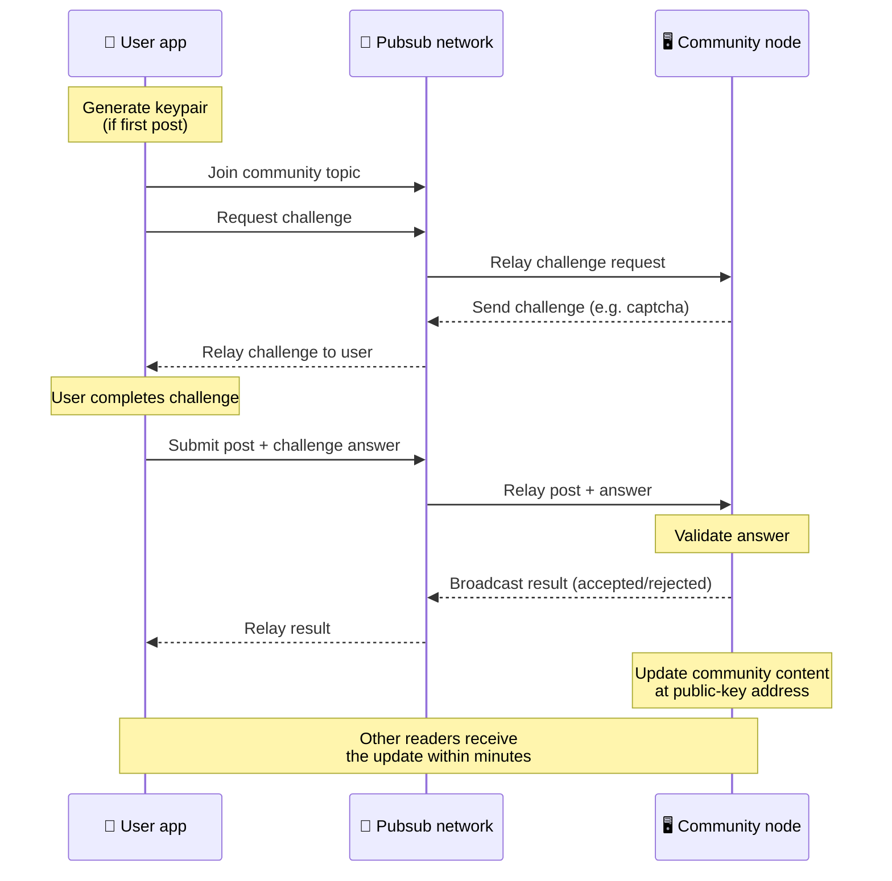
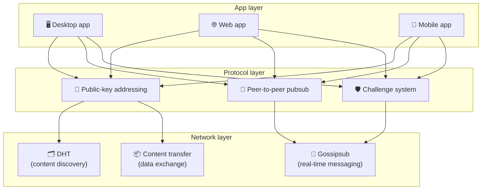

# Protocolo ponto a ponto

Bitsocial não usa blockchain, servidor de federação ou backend centralizado. Em vez disso, ele combina duas ideias — **endereçamento baseado em chave pública** e **pubsub peer-to-peer** — para permitir que qualquer pessoa hospede uma comunidade a partir de hardware de consumo enquanto os usuários leem e postam sem contas em qualquer serviço controlado pela empresa.

Para um passo a passo menos técnico, leia [Uma explicação completa para leigos do protocolo Bitsocial](./layman-protocol-explanation.md).

## Os dois problemas

Uma rede social descentralizada deve responder a duas questões:

1. **Dados** — como você armazena e fornece conteúdo social mundial sem um banco de dados central?
2. **Spam** — como você evita abusos e ao mesmo tempo mantém o uso da rede livre?

O Bitsocial resolve o problema dos dados ignorando totalmente o blockchain: a mídia social não precisa de pedidos de transações globais ou de disponibilidade permanente de todas as postagens antigas. Ele resolve o problema do spam, permitindo que cada comunidade execute seu próprio desafio anti-spam na rede ponto a ponto.

Para o modelo de descoberta acima desta camada de rede, consulte [Descoberta de conteúdo](./content-discovery.md).

---

## Endereçamento baseado em chave pública

No BitTorrent, o hash de um arquivo se torna seu endereço (_endereçamento baseado em conteúdo_). O Bitsocial usa uma ideia semelhante com chaves públicas: o hash da chave pública de uma comunidade torna-se seu endereço de rede.

Qualquer peer na rede pode realizar uma consulta DHT (tabela hash distribuída) para esse endereço e recuperar o estado mais recente da comunidade. Cada vez que o conteúdo é atualizado, seu número de versão aumenta. A rede mantém apenas a versão mais recente – não há necessidade de preservar todos os estados históricos, o que torna esta abordagem leve em comparação com um blockchain.

### O que é armazenado no endereço

O endereço da comunidade não contém diretamente o conteúdo completo da postagem. Em vez disso, ele armazena uma lista de identificadores de conteúdo – hashes que apontam para os dados reais. O cliente então busca cada parte do conteúdo por meio de pesquisas DHT ou estilo rastreador.

Pelo menos um ponto sempre possui os dados: o nó do operador da comunidade. Se a comunidade for popular, muitos outros pares também a terão e a carga se distribuirá sozinha, da mesma forma que os torrents populares são mais rápidos para baixar.

---

## Pubsub ponto a ponto

Pubsub (publicar-assinar) é um padrão de mensagens em que os pares se inscrevem em um tópico e recebem todas as mensagens publicadas nesse tópico. O Bitsocial usa uma rede pubsub peer-to-peer – qualquer um pode publicar, qualquer um pode se inscrever e não há um corretor central de mensagens.

Para publicar uma postagem em uma comunidade, um usuário publica uma mensagem cujo tópico é igual à chave pública da comunidade. O nó do operador da comunidade o coleta, valida e – se passar no desafio anti-spam – o inclui na próxima atualização de conteúdo.

---

## Anti-spam: desafios do pubsub

Uma rede pubsub aberta é vulnerável a inundações de spam. A Bitsocial resolve isso exigindo que os editores concluam um **desafio** antes que seu conteúdo seja aceito.

O sistema de desafio é flexível: cada operador comunitário configura sua própria política. As opções incluem:

| Tipo de desafio          | Como funciona                                         |
| ------------------------ | ----------------------------------------------------- |
| **Captcha**              | Quebra-cabeça visual ou interativo apresentado no app |
| **Limite de taxa**       | Limitar postagens por janela de tempo por identidade  |
| **Portão de token**      | Exigir comprovante de saldo de um token específico    |
| **Pagamento**            | Exigir um pequeno pagamento por postagem              |
| **Lista de permissões**  | Somente identidades pré-aprovadas podem postar        |
| **Código personalizado** | Qualquer política exprimível em código                |

Os peers que retransmitem muitas tentativas de desafio malsucedidas são bloqueados no tópico pubsub, o que evita ataques de negação de serviço na camada de rede.

---

## Ciclo de vida: lendo uma comunidade

Isto é o que acontece quando um usuário abre o aplicativo e visualiza as últimas postagens de uma comunidade.

**Passo a passo:**

1. O usuário abre o aplicativo e vê uma interface social.
2. O cliente se junta à rede peer-to-peer e faz uma consulta DHT para cada comunidade que o usuário
   segue. As consultas demoram alguns segundos cada, mas são executadas simultaneamente.
3. Cada consulta retorna os indicadores e metadados de conteúdo mais recentes da comunidade (título, descrição,
   lista de moderadores, configuração do desafio).
4. O cliente busca o conteúdo real da postagem usando esses ponteiros e, em seguida, renderiza tudo em um
   interface social familiar.

---

## Ciclo de vida: publicar uma postagem

A publicação envolve um aperto de mão desafio-resposta no pubsub antes que a postagem seja aceita.

**Passo a passo:**

1. O aplicativo gera um par de chaves para o usuário, caso ele ainda não tenha um.
2. O usuário escreve uma postagem para uma comunidade.
3. O cliente ingressa no tópico pubsub dessa comunidade (digitado na chave pública da comunidade).
4. O cliente solicita um desafio no pubsub.
5. O nó do operador da comunidade envia de volta um desafio (por exemplo, um captcha).
6. O usuário completa o desafio.
7. O cliente envia a postagem junto com a resposta do desafio pelo pubsub.
8. O nó do operador da comunidade valida a resposta. Se estiver correto, a postagem será aceita.
9. O nó transmite o resultado pelo pubsub para que os pares da rede saibam que devem continuar a retransmissão
   mensagens deste usuário.
10. O nó atualiza o conteúdo da comunidade no seu endereço de chave pública.
11. Em poucos minutos, todos os leitores da comunidade recebem a atualização.

---

## Visão geral da arquitetura

O sistema completo possui três camadas que funcionam juntas:

| Camada         | Função                                                                                                                                                 |
| -------------- | ------------------------------------------------------------------------------------------------------------------------------------------------------ |
| **Aplicativo** | Interface do usuário. Podem existir vários aplicativos, cada um com seu próprio design, todos compartilhando as mesmas comunidades e identidades.      |
| **Protocolo**  | Define como as comunidades são abordadas, como as postagens são publicadas e como o spam é evitado.                                                    |
| **Rede**       | A infraestrutura peer-to-peer subjacente: DHT para descoberta, gossipsub para mensagens em tempo real e transferência de conteúdo para troca de dados. |

---

## Privacidade: desvinculando autores de endereços IP

Quando um usuário publica uma postagem, o conteúdo é **criptografado com a chave pública do operador da comunidade** antes de entrar na rede pubsub. Isso significa que, embora os observadores da rede possam ver que um par publicou _alguma coisa_, eles não podem determinar:

- o que o conteúdo diz
- qual identidade do autor publicou

Isso é semelhante a como o BitTorrent torna possível descobrir quais IPs propagam um torrent, mas não quem o criou originalmente. A camada de criptografia adiciona uma garantia de privacidade adicional além dessa linha de base.

---

## Navegador ponto a ponto

O navegador P2P agora é possível em clientes Bitsocial. Um aplicativo de navegador pode executar um nó [Hélia](https://helia.io/), usar a mesma pilha de cliente de protocolo Bitsocial que outros aplicativos e buscar conteúdo de pares em vez de solicitar um gateway IPFS centralizado para servi-lo. O navegador também pode participar diretamente do pubsub, portanto, a postagem não precisa de um provedor de pubsub de propriedade da plataforma no caminho feliz.

Este é um marco importante para a distribuição na web: um site HTTPS normal pode abrir em um cliente social P2P ao vivo. Os usuários não precisam instalar um aplicativo de desktop antes de poderem ler na rede, e o operador do aplicativo não precisa executar um gateway central que se torne o gargalo de censura ou moderação para cada usuário do navegador.

O caminho do navegador tem limites diferentes de um nó de desktop ou servidor:

- um nó do navegador geralmente não pode aceitar conexões de entrada arbitrárias da Internet pública
- ele pode carregar, validar, armazenar em cache e publicar dados enquanto o aplicativo está aberto
- não deve ser tratado como um hospedeiro duradouro dos dados de uma comunidade
- hospedagem comunitária completa ainda é melhor gerenciada por um aplicativo de desktop, `bitsocial-cli` ou outro
  nó sempre ativo

Os roteadores HTTP ainda são importantes para a descoberta de conteúdo: eles retornam endereços de provedores para um hash de comunidade. Eles não são gateways IPFS porque não servem o conteúdo em si. Após a descoberta, o cliente do navegador se conecta aos pares e busca os dados por meio da pilha P2P.

O 5chan expõe isso como uma opção opcional de configurações avançadas no aplicativo da web 5chan.app normal. A pilha de navegador `pkc-js` mais recente tornou-se estável o suficiente para testes públicos depois que o trabalho de interoperabilidade upstream libp2p/gossipsub abordou a entrega de mensagens entre os pares Helia e Kubo. A configuração mantém o navegador P2P controlado enquanto realiza mais testes no mundo real; uma vez que tenha confiança de produção suficiente, ele pode se tornar o caminho da web padrão.

## Reserva de gateway

O acesso ao navegador apoiado por gateway ainda é útil como alternativa de compatibilidade e implementação. Um gateway pode retransmitir dados entre a rede P2P e um cliente de navegador quando um navegador não consegue ingressar diretamente na rede ou quando o aplicativo escolhe intencionalmente o caminho mais antigo. Esses portais:

- pode ser executado por qualquer pessoa
- não exigem contas de usuário ou pagamentos
- não obtenha custódia sobre identidades ou comunidades de usuários
- pode ser trocado sem perder dados

A arquitetura alvo é o navegador P2P primeiro, com gateways como um substituto opcional em vez do gargalo padrão.

---

## Por que não um blockchain?

As blockchains resolvem o problema do gasto duplo: elas precisam saber a ordem exata de cada transação para evitar que alguém gaste a mesma moeda duas vezes.

A mídia social não tem um problema de gasto duplo. Não importa se o post A foi publicado um milissegundo antes do post B, e os posts antigos não precisam estar permanentemente disponíveis em todos os nós.

Ao pular o blockchain, o Bitsocial evita:

- **taxas de gás** – a postagem é gratuita
- **limites de rendimento** — sem tamanho de bloco ou gargalo de tempo de bloco
- **inchaço de armazenamento** — os nós mantêm apenas o que precisam
- **sobrecarga de consenso** — sem necessidade de mineradores, validadores ou staking

A desvantagem é que o Bitsocial não garante a disponibilidade permanente de conteúdo antigo. Mas para as redes sociais, essa é uma compensação aceitável: o nó do operador da comunidade retém os dados, o conteúdo popular espalha-se por muitos pares e as publicações muito antigas desaparecem naturalmente – da mesma forma que acontece em todas as plataformas sociais.

## Por que não a federação?

Redes federadas (como e-mail ou plataformas baseadas em ActivityPub) melhoram a centralização, mas ainda têm limitações estruturais:

- **Dependência de servidor** — cada comunidade precisa de um servidor com domínio, TLS e contínuo
  manutenção
- **Confiança do administrador** — o administrador do servidor tem controle total sobre as contas e o conteúdo dos usuários
- **Fragmentação** — mover-se entre servidores geralmente significa perder seguidores, histórico ou identidade
- **Custo** — alguém tem que pagar pela hospedagem, o que cria pressão para a consolidação

A abordagem ponto a ponto do Bitsocial remove totalmente o servidor da equação. Um nó da comunidade pode ser executado em um laptop, Raspberry Pi ou VPS barato. O operador controla a política de moderação, mas não pode capturar identidades de usuários, porque as identidades são controladas por pares de chaves e não concedidas pelo servidor.

---

## Resumo

O Bitsocial é baseado em duas primitivas: endereçamento baseado em chave pública para descoberta de conteúdo e pubsub peer-to-peer para comunicação em tempo real. Juntos eles produzem uma rede social onde:

- comunidades são identificadas por chaves criptográficas, não por nomes de domínio
- o conteúdo se espalha entre pares como um torrent, não servido a partir de um único banco de dados
- a resistência ao spam é local para cada comunidade, não imposta por uma plataforma
- os usuários possuem suas identidades por meio de pares de chaves, não por meio de contas revogáveis
- todo o sistema funciona sem servidores, blockchains ou taxas de plataforma
