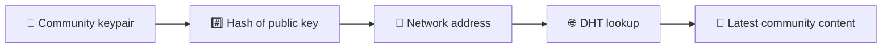
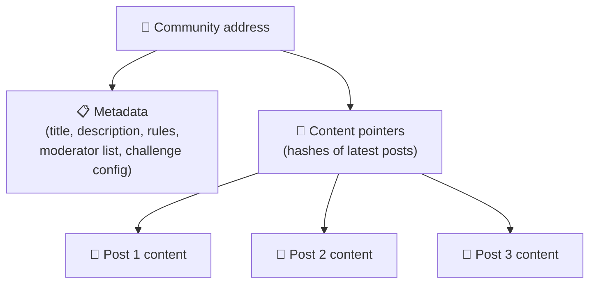
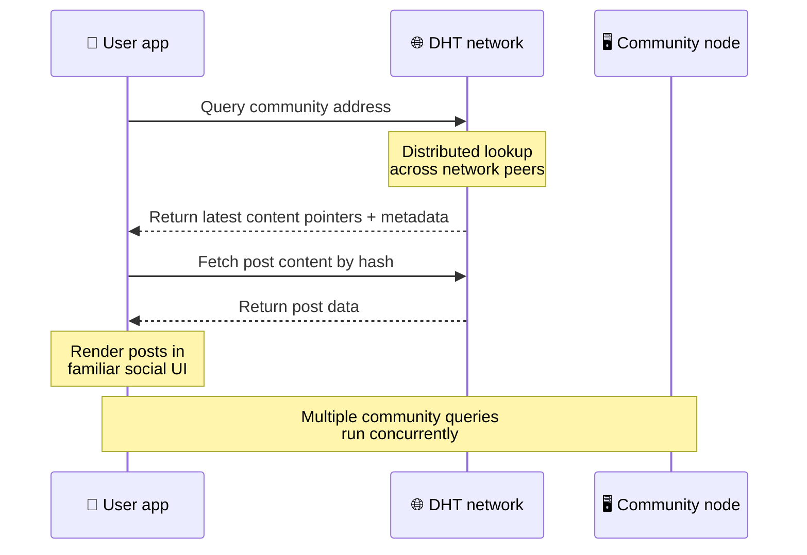
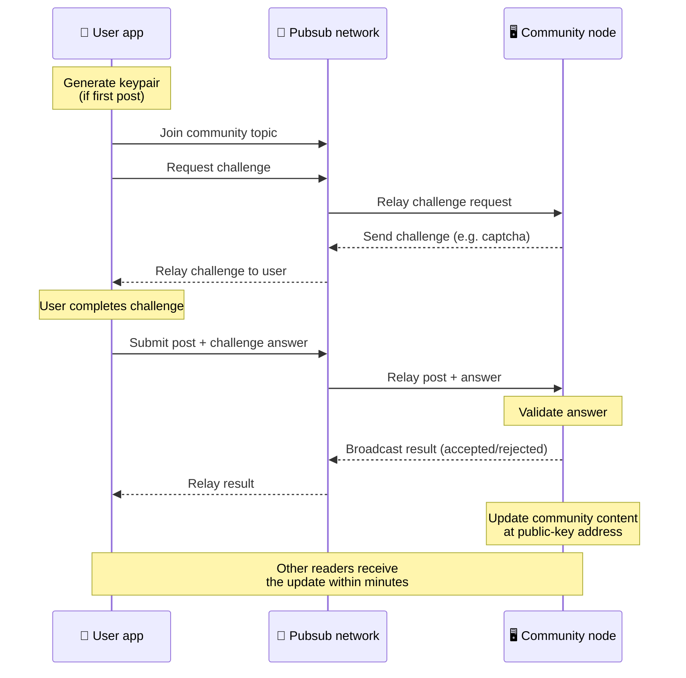
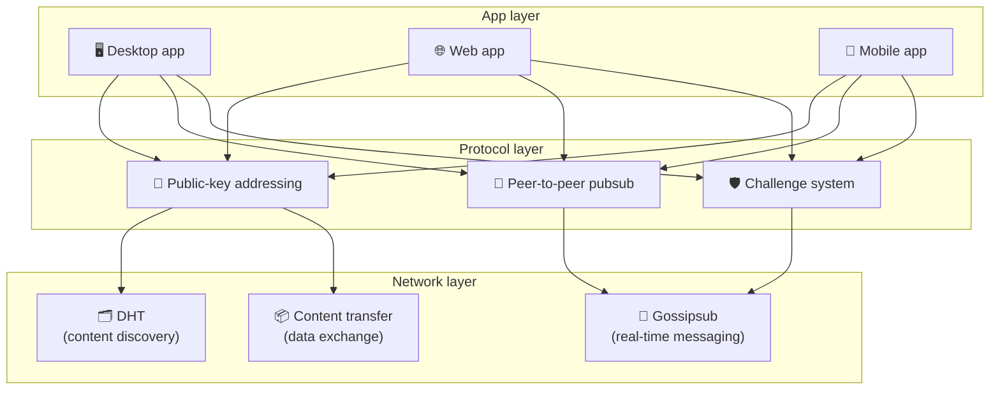

# Protocolul peer-to-peer

Bitsocial nu folosește un blockchain, un server de federație sau un backend centralizat. În schimb, combină două idei — **adresarea bazată pe cheie publică** și **pubsub peer-to-peer** — pentru a permite oricui să găzduiască o comunitate din hardware de consum, în timp ce utilizatorii citesc și postează fără conturi pe orice serviciu controlat de companie.

Pentru o prezentare mai puțin tehnică, citiți [O explicație completă a protocolului Bitsocial](./layman-protocol-explanation.md).

## Cele două probleme

O rețea socială descentralizată trebuie să răspundă la două întrebări:

1. **Date** — cum stocați și serviți conținutul social din lume fără o bază de date centrală?
2. **Spam** — cum preveniți abuzurile menținând rețeaua liberă de utilizat?

Bitsocial rezolvă problema datelor ignorând în întregime blockchain-ul: rețelele sociale nu au nevoie de comandarea tranzacțiilor globale sau disponibilitatea permanentă a fiecărei postări vechi. Rezolvă problema spam-ului, permițând fiecărei comunități să își execute propria provocare anti-spam prin rețeaua peer-to-peer.

Pentru modelul de descoperire de deasupra acestui strat de rețea, consultați [Descoperirea conținutului](./content-discovery.md).

---

## Adresare bazată pe chei publice

În BitTorrent, hash-ul unui fișier devine adresa sa (_adresare bazată pe conținut_). Bitsocial folosește o idee similară cu cheile publice: hash-ul cheii publice a unei comunități devine adresa de rețea a acesteia.

Orice peer din rețea poate efectua o interogare DHT (distributed hash table) pentru acea adresă și poate prelua cea mai recentă stare a comunității. De fiecare dată când conținutul este actualizat, numărul versiunii acestuia crește. Rețeaua păstrează doar cea mai recentă versiune - nu este nevoie să păstrați fiecare stare istorică, ceea ce face această abordare ușoară în comparație cu un blockchain.

### Ce se stochează la adresă

Adresa comunității nu conține direct conținut complet al postării. În schimb, stochează o listă de identificatori de conținut - hashuri care indică datele reale. Clientul preia apoi fiecare conținut prin DHT sau căutări în stil tracker.

Cel puțin un peer are întotdeauna datele: nodul operatorului comunității. Dacă comunitatea este populară, o vor avea și mulți alți colegi și încărcarea se distribuie singură, la fel cum torrentele populare sunt mai rapide de descărcat.

---

## Pubsub peer-to-peer

Pubsub (publicare-abonare) este un model de mesagerie în care colegii se abonează la un subiect și primesc fiecare mesaj publicat la acel subiect. Bitsocial folosește o rețea pubsub peer-to-peer - oricine poate publica, oricine se poate abona și nu există un broker central de mesaje.

Pentru a publica o postare într-o comunitate, un utilizator publică un mesaj al cărui subiect este egal cu cheia publică a comunității. Nodul operatorului comunității îl preia, îl validează și, dacă trece provocarea anti-spam, îl include în următoarea actualizare de conținut.

---

## Anti-spam: provocări legate de pubsub

O rețea pubsub deschisă este vulnerabilă la inundațiile de spam. Bitsocial rezolvă acest lucru solicitând editorilor să finalizeze o **provocare** înainte ca conținutul lor să fie acceptat.

Sistemul de provocare este flexibil: fiecare operator comunitar își configurează propria politică. Opțiunile includ:

| Tip provocare        | Cum funcționează                                      |
| -------------------- | ----------------------------------------------------- |
| **Captcha**          | Puzzle vizual sau interactiv prezentat în aplicație   |
| **Limitarea ratei**  | Limitați postările pe fereastră de timp pe identitate |
| **Token gate**       | Solicitați dovada soldului unui anumit jeton          |
| **Plata**            | Necesită o plată mică per postare                     |
| **Lista permisă**    | Numai identitățile preaprobate pot posta              |
| **Cod personalizat** | Orice politică exprimabilă în cod                     |

Colegii care transmit prea multe încercări eșuate de provocare sunt blocați din subiectul pubsub, ceea ce previne atacurile de denial-of-service la nivelul rețelei.

---

## Ciclul de viață: citirea unei comunități

Acesta este ceea ce se întâmplă atunci când un utilizator deschide aplicația și vede cele mai recente postări ale unei comunități.

**Pas cu pas:**

1. Utilizatorul deschide aplicația și vede o interfață socială.
2. Clientul se alătură rețelei peer-to-peer și face o interogare DHT pentru fiecare comunitate de utilizator
   urmează. Interogările durează câteva secunde fiecare, dar rulează simultan.
3. Fiecare interogare returnează cele mai recente indicatori de conținut și metadate ale comunității (titlu, descriere,
   lista moderatorilor, configurarea provocării).
4. Clientul preia conținutul real al postării folosind acești indicatori, apoi redă totul într-un
   interfață socială familiară.

---

## Ciclul de viață: publicarea unei postări

Publicarea implică o strângere de mână la provocare-răspuns peste pubsub înainte ca postarea să fie acceptată.

**Pas cu pas:**

1. Aplicația generează o pereche de chei pentru utilizator dacă nu are încă una.
2. Utilizatorul scrie o postare pentru o comunitate.
3. Clientul se alătură subiectului pubsub pentru acea comunitate (cheie cu cheia publică a comunității).
4. Clientul solicită o provocare prin pubsub.
5. Nodul operatorului comunității trimite înapoi o provocare (de exemplu, un captcha).
6. Utilizatorul finalizează provocarea.
7. Clientul trimite postarea împreună cu răspunsul la provocare prin pubsub.
8. Nodul operatorului comunității validează răspunsul. Dacă este corect, postarea este acceptată.
9. Nodul difuzează rezultatul prin pubsub, astfel încât colegii din rețea să știe să continue transmiterea
   mesaje de la acest utilizator.
10. Nodul actualizează conținutul comunității la adresa sa cu cheie publică.
11. În câteva minute, fiecare cititor al comunității primește actualizarea.

---

## Privire de ansamblu asupra arhitecturii

Sistemul complet are trei straturi care lucrează împreună:

| Strat         | Rol                                                                                                                                                   |
| ------------- | ----------------------------------------------------------------------------------------------------------------------------------------------------- |
| **Aplicație** | Interfață cu utilizatorul. Pot exista mai multe aplicații, fiecare cu propriul design, toate împărtășind aceleași comunități și identități.           |
| **Protocol**  | Definește modul în care sunt abordate comunitățile, cum sunt publicate postările și cum este prevenit spamul.                                         |
| **Rețea**     | Infrastructura de bază peer-to-peer: DHT pentru descoperire, gossipsub pentru mesagerie în timp real și transfer de conținut pentru schimbul de date. |

---

## Confidențialitate: deconectarea autorilor de la adresele IP

Când un utilizator publică o postare, conținutul este **criptat cu cheia publică a operatorului comunității** înainte de a intra în rețeaua pubsub. Aceasta înseamnă că, în timp ce observatorii rețelei pot vedea că un peer a publicat _ceva_, ei nu pot determina:

- ce spune conținutul
- care identitate de autor a publicat-o

Acest lucru este similar cu modul în care BitTorrent face posibilă descoperirea IP-urilor care generează un torrent, dar nu cine l-a creat inițial. Stratul de criptare adaugă o garanție suplimentară de confidențialitate pe deasupra acelei linii de bază.

---

## Browser peer-to-peer

Browserul P2P este acum posibil în clienții Bitsocial. O aplicație de browser poate rula un nod [Helia](https://helia.io/), poate folosi aceeași stivă de client de protocol Bitsocial ca și alte aplicații și poate prelua conținut de la colegi în loc să ceară unui gateway IPFS centralizat să-l servească. Browserul poate participa și la pubsub direct, astfel încât postarea nu necesită un furnizor pubsub deținut de platformă în calea fericită.

Acesta este punctul de hotar important pentru distribuția web: un site web HTTPS normal se poate deschide într-un client social P2P live. Utilizatorii nu trebuie să instaleze o aplicație desktop înainte de a putea citi din rețea, iar operatorul aplicației nu trebuie să ruleze un gateway central care devine punctul de blocare de cenzură sau moderare pentru fiecare utilizator de browser.

Calea browserului are limite diferite față de un nod desktop sau server:

- un nod de browser nu poate accepta de obicei conexiuni de intrare arbitrare de la internetul public
- poate încărca, valida, stoca în cache și publica date în timp ce aplicația este deschisă
- nu ar trebui tratat ca o gazdă de lungă durată pentru datele unei comunități
- găzduirea comunitară completă este încă gestionată cel mai bine de o aplicație desktop, `bitsocial-cli` sau de altă
  nodul mereu activ

Routerele HTTP contează încă pentru descoperirea conținutului: returnează adresele furnizorilor pentru un hash comunitar. Nu sunt gateway-uri IPFS, deoarece nu servesc conținutul în sine. După descoperire, clientul browser se conectează la colegi și preia datele prin stiva P2P.

5chan expune acest lucru ca un comutator opt-in Setări avansate în aplicația web normală 5chan.app. Cea mai recentă stivă de browser `pkc-js` a devenit suficient de stabilă pentru testarea publică după ce serviciul de interoperabilitate libp2p/gossipsub în amonte a abordat livrarea mesajelor între colegii Helia și Kubo. Setarea menține browserul P2P controlat în timp ce primește mai multe teste în lumea reală; odată ce are suficientă încredere în producție, poate deveni calea web implicită.

## Gateway alternativă

Accesul la browser susținut de gateway este încă util ca alternativă de compatibilitate și lansare. Un gateway poate transmite date între rețeaua P2P și un client de browser atunci când un browser nu se poate conecta direct la rețea sau când aplicația alege în mod intenționat calea mai veche. Aceste gateway-uri:

- poate fi condus de oricine
- nu necesită conturi de utilizator sau plăți
- nu obțineți custodia asupra identităților sau comunităților utilizatorilor
- poate fi schimbat fără a pierde date

Arhitectura țintă este browserul P2P mai întâi, cu gateway-uri ca o rezervă opțională, mai degrabă decât blocajul implicit.

---

## De ce nu un blockchain?

Blockchain-urile rezolvă problema dublei cheltuieli: trebuie să cunoască ordinea exactă a fiecărei tranzacții pentru a preveni pe cineva să cheltuiască aceeași monedă de două ori.

Rețelele de socializare nu au o problemă cu cheltuieli duble. Nu contează dacă postarea A a fost publicată cu o milisecundă înainte de postarea B, iar postările vechi nu trebuie să fie permanent disponibile pe fiecare nod.

Omitând blockchain-ul, Bitsocial evită:

- **taxe de gaz** — postarea este gratuită
- **limite de debit** — fără dimensiunea blocului sau blocaj de timp
- **balonare de stocare** — nodurile păstrează doar ceea ce au nevoie
- **consens general** — nu sunt necesare mineri, validatori sau staking

Compensația este că Bitsocial nu garantează disponibilitatea permanentă a conținutului vechi. Dar pentru rețelele sociale, acesta este un compromis acceptabil: nodul operatorului comunității deține datele, conținutul popular se răspândește peste mulți colegi, iar postările foarte vechi se estompează în mod natural - la fel cum o fac pe fiecare platformă socială.

## De ce nu federație?

Rețelele federate (cum ar fi e-mailul sau platformele bazate pe ActivityPub) îmbunătățesc centralizarea, dar au încă limitări structurale:

- **Dependență de server** — fiecare comunitate are nevoie de un server cu un domeniu, TLS și în curs de desfășurare
  întreţinere
- **Încredere în administrator** — administratorul serverului are control deplin asupra conturilor de utilizator și a conținutului
- **Fragmentare** — mutarea între servere înseamnă adesea pierderea adepților, istoricului sau identității
- **Cost** — cineva trebuie să plătească pentru găzduire, ceea ce creează presiune către consolidare

Abordarea peer-to-peer a Bitsocial elimină complet serverul din ecuație. Un nod comunitar poate rula pe un laptop, un Raspberry Pi sau un VPS ieftin. Operatorul controlează politica de moderare, dar nu poate confisca identitățile utilizatorilor, deoarece identitățile sunt controlate de perechi de chei, nu sunt acordate de server.

---

## Rezumat

Bitsocial este construit pe două primitive: adresare bazată pe chei publice pentru descoperirea conținutului și pubsub peer-to-peer pentru comunicare în timp real. Împreună produc o rețea socială în care:

- comunitățile sunt identificate prin chei criptografice, nu prin nume de domenii
- Conținutul se răspândește între semeni ca un torrent, nu este servit dintr-o singură bază de date
- Rezistența la spam este locală pentru fiecare comunitate, nu este impusă de o platformă
- utilizatorii își dețin identitățile prin perechi de chei, nu prin conturi revocabile
- întregul sistem rulează fără servere, blockchain sau taxe de platformă
