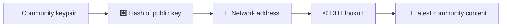
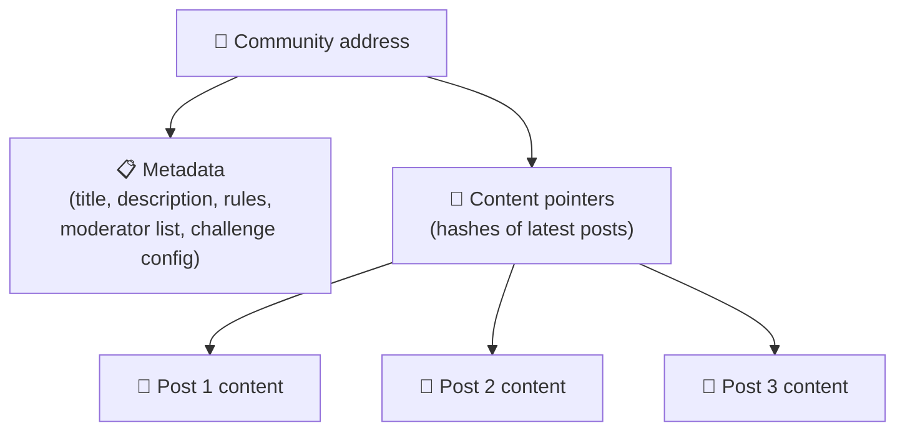
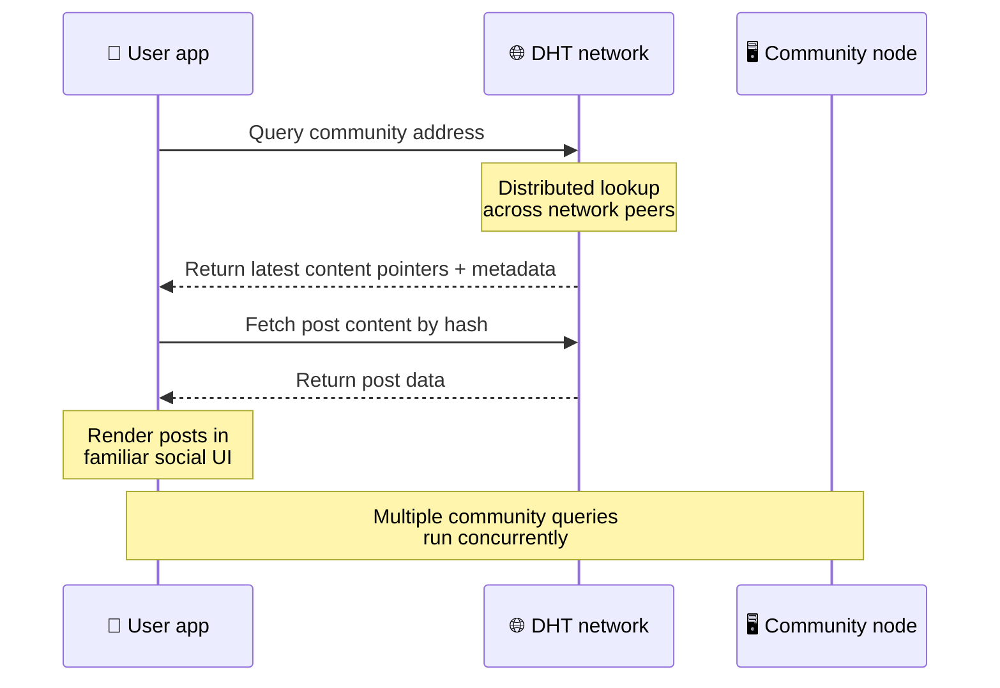
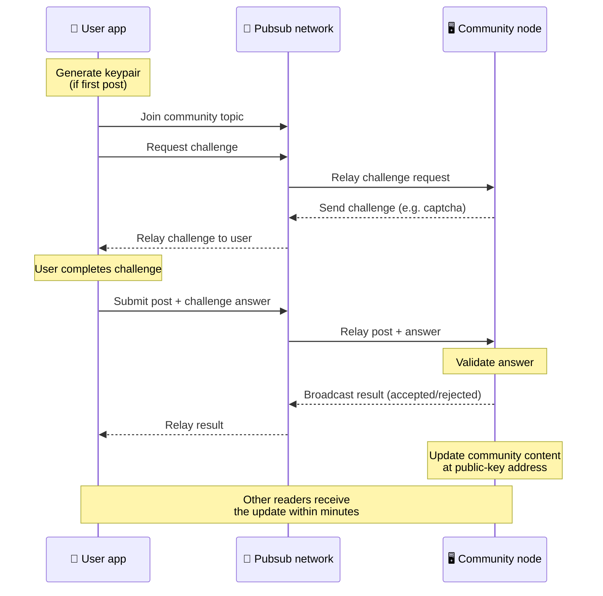
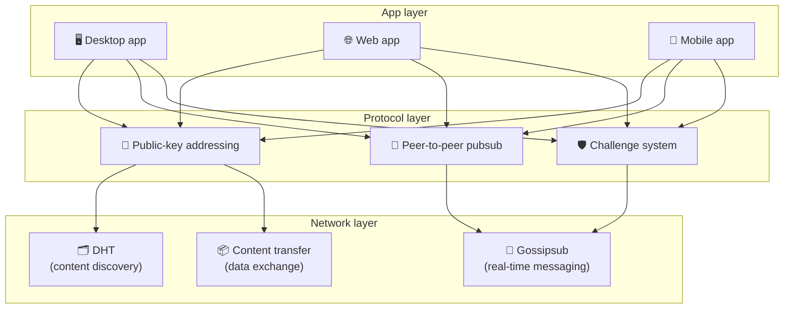

# Одноранговый протокол

Bitsocial не использует блокчейн, сервер федерации или централизованный бэкэнд. Вместо этого он сочетает в себе две идеи — **адресацию на основе открытого ключа** и **одноранговую pubsub** — чтобы позволить любому создать сообщество с помощью потребительского оборудования, в то время как пользователи читают и публикуют сообщения без учетных записей в любом сервисе, контролируемом компанией.

Менее техническое пошаговое руководство читайте [Полное объяснение протокола Bitsocial для непрофессионалов.](./layman-protocol-explanation.md).

## Две проблемы

Децентрализованная социальная сеть должна ответить на два вопроса:

1. **Данные** — как хранить и обслуживать мировой социальный контент без центральной базы данных?
2. **Спам**. Как предотвратить злоупотребления, сохраняя при этом свободу использования сети?

Bitsocial решает проблему данных, полностью игнорируя блокчейн: социальным сетям не требуется глобальный порядок транзакций или постоянная доступность каждого старого сообщения. Он решает проблему спама, позволяя каждому сообществу решать свою собственную задачу по борьбе со спамом в одноранговой сети.

Информацию о модели обнаружения над этим сетевым уровнем см. в разделе [Обнаружение контента](./content-discovery.md).

---

## Адресация на основе открытого ключа

В BitTorrent хеш файла становится его адресом (адресация на основе содержимого). Bitsocial использует аналогичную идею с открытыми ключами: хэш открытого ключа сообщества становится его сетевым адресом.

Любой узел в сети может выполнить запрос DHT (распределенной хэш-таблицы) для этого адреса и получить последнее состояние сообщества. При каждом обновлении контента номер его версии увеличивается. В сети хранится только последняя версия — нет необходимости сохранять каждое историческое состояние, что делает этот подход более легким по сравнению с блокчейном.

### Что хранится по адресу

Адрес сообщества не содержит непосредственно полного содержания публикации. Вместо этого он хранит список идентификаторов контента — хешей, которые указывают на фактические данные. Затем клиент извлекает каждую часть контента с помощью DHT или поиска в стиле трекера.

Данные всегда есть по крайней мере у одного узла: узла оператора сообщества. Если сообщество популярно, оно будет доступно и многим другим узлам, и нагрузка распределяется сама собой, точно так же, как популярные торренты загружаются быстрее.

---

## Одноранговый пабсаб

Pubsub (публикация-подписка) — это шаблон обмена сообщениями, при котором одноранговые узлы подписываются на тему и получают каждое сообщение, опубликованное в этой теме. Bitsocial использует одноранговую сеть pubsub — каждый может публиковать, любой может подписываться, и нет центрального брокера сообщений.

Чтобы опубликовать сообщение в сообществе, пользователь публикует сообщение, тема которого равна открытому ключу сообщества. Узел оператора сообщества подхватывает его, проверяет и, если он проходит проверку на защиту от спама, включает его в следующее обновление контента.

---

## Антиспам: проблемы с pubsub

Открытая сеть pubsub уязвима для спам-потоков. Bitsocial решает эту проблему, требуя от издателей выполнить **вызов**, прежде чем их контент будет принят.

Система вызовов гибкая: каждый оператор сообщества настраивает свою политику. Опции включают в себя:

| Тип вызова               | Как это работает                                                      |
| ------------------------ | --------------------------------------------------------------------- |
| **Капча**                | Визуальная или интерактивная головоломка, представленная в приложении |
| **Ограничение скорости** | Ограничить количество сообщений за временное окно для каждой личности |
| **Жетоновые ворота**     | Требовать подтверждение баланса конкретного токена                    |
| **Оплата**               | Требовать небольшую оплату за сообщение                               |
| **Белый список**         | Только предварительно одобренные личности могут публиковать сообщения |
| **Пользовательский код** | Любая политика, выраженная в коде                                     |

Одноранговые узлы, которые передают слишком много неудачных попыток запроса, блокируются из темы pubsub, что предотвращает атаки типа «отказ в обслуживании» на сетевом уровне.

---

## Жизненный цикл: чтение сообщества

Вот что происходит, когда пользователь открывает приложение и просматривает последние публикации сообщества.

**Шаг за шагом:**

1. Пользователь открывает приложение и видит социальный интерфейс.
2. Клиент присоединяется к одноранговой сети и выполняет запрос DHT для каждого сообщества, в котором находится пользователь.
   следует. Каждый запрос занимает несколько секунд, но выполняется одновременно.
3. Каждый запрос возвращает последние указатели на контент и метаданные сообщества (заголовок, описание,
   список модераторов, настройка вызова).
4. Клиент извлекает фактическое содержимое сообщения, используя эти указатели, а затем отображает все в виде
   знакомый социальный интерфейс.

---

## Жизненный цикл: публикация сообщения

Публикация включает в себя рукопожатие типа «запрос-ответ» в pubsub перед тем, как сообщение будет принято.

**Шаг за шагом:**

1. Приложение генерирует для пользователя пару ключей, если у него ее еще нет.
2. Пользователь пишет сообщение для сообщества.
3. Клиент присоединяется к теме pubsub этого сообщества (с использованием открытого ключа сообщества).
4. Клиент запрашивает вызов через pubsub.
5. Узел оператора сообщества отправляет обратно запрос (например, капчу).
6. Пользователь выполняет задание.
7. Клиент отправляет сообщение вместе с ответом на вызов через pubsub.
8. Узел оператора сообщества проверяет ответ. Если все верно, сообщение принимается.
9. Узел передает результат через pubsub, чтобы одноранговые узлы знали, что нужно продолжать ретрансляцию.
   сообщения от этого пользователя.
10. Узел обновляет контент сообщества по адресу своего открытого ключа.
11. В течение нескольких минут каждый читатель сообщества получает обновление.

---

## Обзор архитектуры

Полная система состоит из трех уровней, которые работают вместе:

| Слой           | Роль                                                                                                                                                                          |
| -------------- | ----------------------------------------------------------------------------------------------------------------------------------------------------------------------------- |
| **Приложение** | Пользовательский интерфейс. Может существовать несколько приложений, каждое из которых имеет свой собственный дизайн, и все они имеют одни и те же сообщества и идентичности. |
| **Протокол**   | Определяет, как обращаются к сообществам, как публикуются сообщения и как предотвращается спам.                                                                               |
| **Сеть**       | Базовая одноранговая инфраструктура: DHT для обнаружения, gossipsub для обмена сообщениями в реальном времени и передача контента для обмена данными.                         |

---

## Конфиденциальность: отвязка авторов от IP-адресов

Когда пользователь публикует сообщение, его содержимое **шифруется открытым ключом оператора сообщества** перед попаданием в сеть pubsub. Это означает, что хотя сетевые наблюдатели могут видеть, что узел опубликовал _что-то_, они не могут определить:

- что говорит содержание
- какой автор опубликовал это

Это похоже на то, как BitTorrent позволяет узнать, какие IP-адреса раздают торрент, но не кто его изначально создал. Уровень шифрования добавляет дополнительную гарантию конфиденциальности помимо этого базового уровня.

---

## Одноранговая сеть через браузер

Браузерный P2P теперь возможен в клиентах Bitsocial. Приложение браузера может запускать узел [Хелия](https://helia.io/)), использовать тот же клиентский стек протокола Bitsocial, что и другие приложения, и получать контент от одноранговых узлов вместо того, чтобы запрашивать его обслуживание у централизованного шлюза IPFS. Браузер также может напрямую участвовать в pubsub, поэтому для публикации на счастливом пути не требуется принадлежащий платформе провайдер pubsub.

Это важная веха в веб-распространении: обычный HTTPS-сайт может открыться в реальном P2P-клиенте социальной сети. Пользователям не нужно устанавливать настольное приложение, прежде чем они смогут читать данные из сети, а оператору приложения не нужно запускать центральный шлюз, который становится контрольной точкой цензуры или модерации для каждого пользователя браузера.

Путь браузера имеет другие ограничения от узла рабочего стола или сервера:

- узел браузера обычно не может принимать произвольные входящие соединения из общедоступного Интернета.
- он может загружать, проверять, кэшировать и публиковать данные, пока приложение открыто.
- его не следует рассматривать как долговременный хост для данных сообщества.
- полный хостинг сообщества по-прежнему лучше всего использовать настольное приложение `bitsocial-cli` или другое.
  постоянно включенный узел

HTTP-маршрутизаторы по-прежнему важны для обнаружения контента: они возвращают адреса провайдеров для хеша сообщества. Они не являются шлюзами IPFS, поскольку не обслуживают сам контент. После обнаружения клиент браузера подключается к узлам и получает данные через стек P2P.

5chan предоставляет это как переключатель дополнительных настроек в обычном веб-приложении 5chan.app. Последний стек браузера `pkc-js` стал достаточно стабильным для публичного тестирования после того, как исходная работа по взаимодействию libp2p/gossipsub направлена ​​на доставку сообщений между узлами Helia и Kubo. Эта настройка позволяет браузеру контролировать P2P, пока он подвергается большему количеству испытаний в реальных условиях; как только он приобретет достаточную уверенность в производстве, он может стать веб-путем по умолчанию.

## Резервный шлюз

Доступ к браузеру, поддерживаемый шлюзом, по-прежнему полезен в качестве запасного варианта совместимости и развертывания. Шлюз может передавать данные между сетью P2P и клиентом браузера, когда браузер не может подключиться к сети напрямую или когда приложение намеренно выбирает старый путь. Эти шлюзы:

- может управляться кем угодно
- не требуют учетных записей пользователей или платежей
- не получать контроль над личностями пользователей или сообществами
- можно заменить без потери данных

Целевая архитектура — это в первую очередь P2P браузера, а шлюзы — это необязательный запасной вариант, а не узкое место по умолчанию.

---

## Почему не блокчейн?

Блокчейны решают проблему двойного расходования: им необходимо знать точный порядок каждой транзакции, чтобы кто-то не потратил одну и ту же монету дважды.

В социальных сетях нет проблемы двойных расходов. Не имеет значения, было ли сообщение A опубликовано на одну миллисекунду раньше сообщения B, и старые сообщения не обязательно должны быть постоянно доступны на каждом узле.

Пропуская блокчейн, Bitsocial избегает:

- **плата за газ** — размещение бесплатное
- **ограничения пропускной способности** — отсутствие узких мест в размере блока или времени блока.
- **раздутие хранилища** — узлы хранят только то, что им нужно.
- **накладные расходы на согласование** — майнеры, валидаторы или стейкинг не требуются.

Компромисс заключается в том, что Bitsocial не гарантирует постоянную доступность старого контента. Но для социальных сетей это приемлемый компромисс: данные хранятся в узле оператора сообщества, популярный контент распространяется среди многих одноранговых узлов, а очень старые публикации естественным образом исчезают — так же, как это происходит на каждой социальной платформе.

## Почему не федерация?

Федеративные сети (такие как электронная почта или платформы на базе ActivityPub) улучшают централизацию, но все еще имеют структурные ограничения:

- **Зависимость от сервера** — каждому сообществу нужен сервер с доменом, TLS и постоянным
  обслуживание
- **Доверие администратора** — администратор сервера имеет полный контроль над учетными записями пользователей и контентом.
- **Фрагментация** — перемещение между серверами часто означает потерю подписчиков, истории или личности.
- **Стоимость** — кто-то должен платить за хостинг, что создает давление в сторону консолидации.

Одноранговый подход Bitsocial полностью исключает сервер из уравнения. Узел сообщества может работать на ноутбуке, Raspberry Pi или дешевом VPS. Оператор контролирует политику модерации, но не может захватить идентификационные данные пользователей, поскольку идентификационные данные контролируются парой ключей, а не предоставляются сервером.

---

## Краткое содержание

Bitsocial построен на двух примитивах: адресация на основе открытого ключа для обнаружения контента и одноранговая pubsub для связи в реальном времени. Вместе они создают социальную сеть, где:

- сообщества идентифицируются по криптографическим ключам, а не по доменным именам
- контент распространяется по узлам как торрент, а не обслуживается из единой базы данных
- устойчивость к спаму локальна для каждого сообщества, а не навязана платформой
- пользователи владеют своей личностью через пары ключей, а не через отзывные учетные записи
- вся система работает без серверов, блокчейнов и плат за платформу
