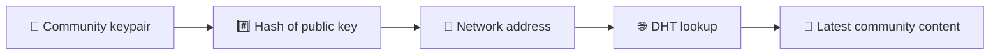
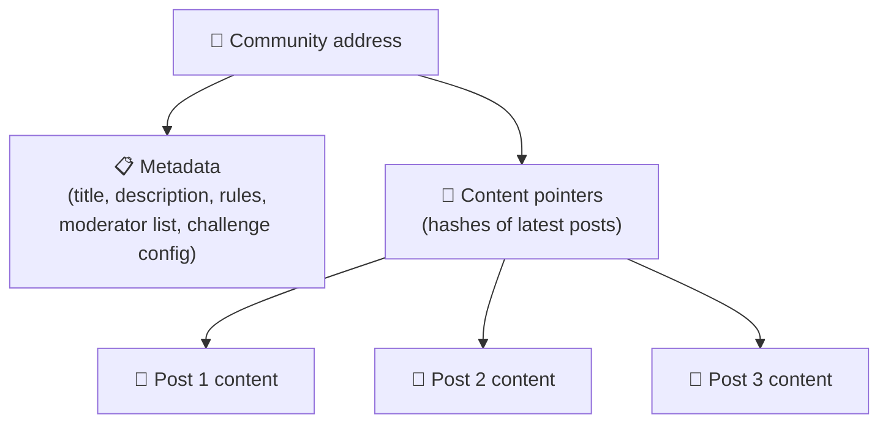
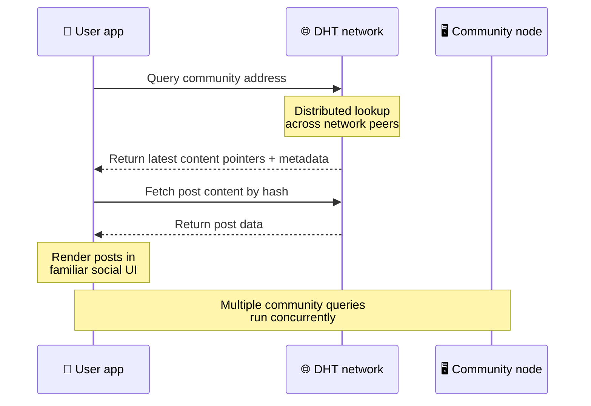
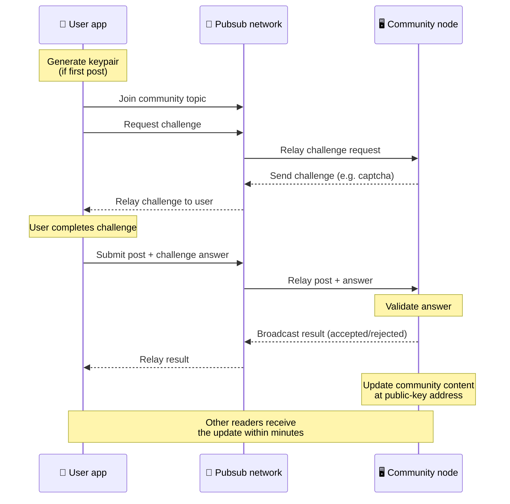
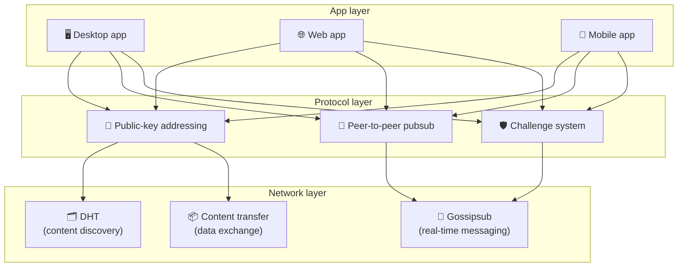

# Protokolli Peer-to-Peer

Bitsocial nuk përdor një blockchain, një server federate ose një backend të centralizuar. Në vend të kësaj, ai kombinon dy ide - **adresimi i bazuar në çelësin publik** dhe **pubsub-peer-to-peer** - për të lejuar këdo që të presë një komunitet nga hardueri i konsumatorit ndërsa përdoruesit lexojnë dhe postojnë pa llogari në çdo shërbim të kontrolluar nga kompania.

Për një zbulim më pak teknik, lexoni [Një shpjegim i plotë laik i protokollit Bitsocial](./layman-protocol-explanation.md).

## Dy problemet

Një rrjet social i decentralizuar duhet t'i përgjigjet dy pyetjeve:

1. **Të dhënat** — si ruani dhe shërbeni përmbajtjen sociale në botë pa një bazë të dhënash qendrore?
2. **Spam** — si e parandaloni abuzimin duke e mbajtur rrjetin të lirë për t'u përdorur?

Bitsocial zgjidh problemin e të dhënave duke anashkaluar tërësisht blockchain: media sociale nuk ka nevojë për porositjen globale të transaksioneve ose disponueshmërinë e përhershme të çdo postimi të vjetër. Ai zgjidh problemin e postës së padëshiruar duke lejuar çdo komunitet të ekzekutojë sfidën e tij anti-spam mbi rrjetin peer-to-peer.

Për modelin e zbulimit mbi këtë shtresë rrjeti, shihni [Zbulimi i përmbajtjes](./content-discovery.md).

---

## Adresimi i bazuar në çelës publik

Në BitTorrent, hash-i i një skedari bëhet adresa e tij (_adresimi i bazuar në përmbajtje_). Bitsocial përdor një ide të ngjashme me çelësat publikë: hash-i i çelësit publik të një komuniteti bëhet adresa e rrjetit të tij.

Çdo koleg në rrjet mund të kryejë një pyetje DHT (tabelë hash e shpërndarë) për atë adresë dhe të marrë gjendjen më të fundit të komunitetit. Sa herë që përditësohet përmbajtja, numri i versionit të saj rritet. Rrjeti ruan vetëm versionin e fundit – nuk ka nevojë të ruhet çdo gjendje historike, gjë që e bën këtë qasje të lehtë në krahasim me një blockchain.

### Çfarë ruhet në adresë

Adresa e komunitetit nuk përmban drejtpërdrejt përmbajtjen e plotë të postimit. Në vend të kësaj, ruan një listë të identifikuesve të përmbajtjes - hash që tregojnë të dhënat aktuale. Më pas klienti merr çdo pjesë të përmbajtjes përmes kërkimeve të DHT-së ose të stilit të gjurmuesit.

Të paktën një koleg i ka gjithmonë të dhënat: nyja e operatorit të komunitetit. Nëse komuniteti është i popullarizuar, do ta kenë edhe shumë kolegë të tjerë dhe ngarkesa shpërndahet vetë, në të njëjtën mënyrë që torrentët e njohur shkarkohen më shpejt.

---

## Pub-to-peer

Pubsub (publish-subscribe) është një model mesazhesh ku kolegët abonohen në një temë dhe marrin çdo mesazh të publikuar për atë temë. Bitsocial përdor një rrjet pubsub peer-to-peer - çdokush mund të publikojë, kushdo mund të abonohet dhe nuk ka asnjë ndërmjetës qendror të mesazheve.

Për të publikuar një postim në një komunitet, një përdorues publikon një mesazh, tema e të cilit është e barabartë me çelësin publik të komunitetit. Nyja e operatorit të komunitetit e merr atë, e vërteton atë dhe — nëse e kalon sfidën anti-spam — e përfshin atë në përditësimin e ardhshëm të përmbajtjes.

---

## Anti-spam: sfida mbi pubsub

Një rrjet i hapur pubs është i prekshëm nga përmbytjet e postës së padëshiruar. Bitsocial e zgjidh këtë duke u kërkuar botuesve të plotësojnë një **sfidë** përpara se përmbajtja e tyre të pranohet.

Sistemi i sfidës është fleksibël: çdo operator i komunitetit konfiguron politikën e vet. Opsionet përfshijnë:

| Lloji i sfidës           | Si funksionon                                               |
| ------------------------ | ----------------------------------------------------------- |
| **Captcha**              | Puzzle vizuale ose interaktive e paraqitur në aplikacion    |
| **Kufizimi i tarifave ** | Kufizoni postimet për dritare kohore për identitet          |
| **Gate Token**           | Kërkoni dëshmi të bilancit të një token specifik            |
| **Pagesa**               | Kërkoni një pagesë të vogël për postim                      |
| **Lista e lejimeve**     | Vetëm identitetet e miratuara paraprakisht mund të postojnë |
| **Kodi i personalizuar** | Çdo politikë e shprehur në kod                              |

Kolegët që transmetojnë shumë përpjekje sfidash të dështuara bllokohen nga tema e pubsub, gjë që parandalon sulmet e mohimit të shërbimit në shtresën e rrjetit.

---

## Cikli i jetës: leximi i një komuniteti

Kjo është ajo që ndodh kur një përdorues hap aplikacionin dhe shikon postimet më të fundit të një komuniteti.

**Hapi pas hapi:**

1. Përdoruesi hap aplikacionin dhe sheh një ndërfaqe sociale.
2. Klienti bashkohet me rrjetin peer-to-peer dhe bën një pyetje DHT për çdo komunitet përdoruesi
   vijon. Pyetjet zgjasin disa sekonda secila, por ekzekutohen njëkohësisht.
3. Çdo pyetje kthen treguesit dhe meta të dhënat më të fundit të përmbajtjes së komunitetit (titulli, përshkrimi,
   lista e moderatorëve, konfigurimi i sfidave).
4. Klienti merr përmbajtjen aktuale të postimit duke përdorur ata tregues, më pas jep gjithçka në a
   ndërfaqe e njohur sociale.

---

## Cikli i jetës: publikimi i një postimi

Publikimi përfshin një shtrëngim duarsh me përgjigje sfide mbi pubsub përpara se postimi të pranohet.

**Hapi pas hapi:**

1. Aplikacioni gjeneron një çift çelësash për përdoruesin nëse ai nuk e ka ende një të tillë.
2. Përdoruesi shkruan një postim për një komunitet.
3. Klienti bashkohet me temën e pubsub-it për atë komunitet (e lidhur me çelësin publik të komunitetit).
4. Klienti kërkon një sfidë mbi pubsub.
5. Nyja e operatorit të komunitetit dërgon një sfidë (për shembull, një captcha).
6. Përdoruesi plotëson sfidën.
7. Klienti dorëzon postimin së bashku me përgjigjen e sfidës në pubsub.
8. Nyja e operatorit të komunitetit vërteton përgjigjen. Nëse është e saktë, postimi pranohet.
9. Nyja transmeton rezultatin në pubsub në mënyrë që kolegët e rrjetit të dinë të vazhdojnë transmetimin
   mesazhe nga ky përdorues.
10. Nyja përditëson përmbajtjen e komunitetit në adresën e saj me çelës publik.
11. Brenda pak minutash, çdo lexues i komunitetit merr përditësimin.

---

## Pasqyrë e arkitekturës

Sistemi i plotë ka tre shtresa që punojnë së bashku:

| Shtresa          | Roli                                                                                                                                               |
| ---------------- | -------------------------------------------------------------------------------------------------------------------------------------------------- |
| **Aplikacioni ** | Ndërfaqja e përdoruesit. Mund të ekzistojnë shumë aplikacione, secila me dizajnin e vet, që të gjithë ndajnë të njëjtat komunitete dhe identitete. |
| **Protokolli**   | Përcakton se si adresohen komunitetet, si publikohen postimet dhe si parandalohen postimet e padëshiruara.                                         |
| **Rrjeti **      | Infrastruktura bazë peer-to-peer: DHT për zbulim, gossip për mesazhe në kohë reale dhe transferim i përmbajtjes për shkëmbimin e të dhënave.       |

---

## Privatësia: shkëputja e autorëve nga adresat IP

Kur një përdorues publikon një postim, përmbajtja **kriptohet me çelësin publik të operatorit të komunitetit** përpara se të hyjë në rrjetin e pubsub. Kjo do të thotë se ndërsa vëzhguesit e rrjetit mund të shohin se një koleg publikoi _diçka_, ata nuk mund të përcaktojnë:

- çfarë thotë përmbajtja
- cili identitet autori e ka publikuar

Kjo është e ngjashme me mënyrën se si BitTorrent bën të mundur zbulimin se cilat IP-të paraqesin një torrent, por jo kush e ka krijuar fillimisht. Shtresa e kriptimit shton një garanci shtesë të privatësisë në krye të asaj vije bazë.

---

## Shfletuesi peer-to-peer

Shfletuesi P2P tani është i mundur në klientët Bitsocial. Një aplikacion shfletuesi mund të ekzekutojë një nyje [Helia](https://helia.io/), të përdorë të njëjtin grumbull klientësh të protokollit Bitsocial si aplikacionet e tjera dhe të marrë përmbajtje nga kolegët në vend që të kërkojë nga një portë e centralizuar IPFS për ta shërbyer atë. Shfletuesi mund të marrë pjesë drejtpërdrejt në pubsub, kështu që postimi nuk ka nevojë për një platformë në pronësinë e platformës në shtegun e lumtur të pubsub-it.

Ky është momenti historik i rëndësishëm për shpërndarjen në ueb: një faqe interneti normale HTTPS mund të hapet në një klient të drejtpërdrejtë social P2P. Përdoruesit nuk kanë nevojë të instalojnë një aplikacion desktopi përpara se të mund të lexojnë nga rrjeti dhe operatori i aplikacionit nuk ka nevojë të ekzekutojë një portë qendrore që bëhet pika e censurimit ose moderimi për çdo përdorues të shfletuesit.

Rruga e shfletuesit ka kufij të ndryshëm nga një nyje desktopi ose serveri:

- një nyje shfletuesi zakonisht nuk mund të pranojë lidhje arbitrare hyrëse nga interneti publik
- mund të ngarkojë, vërtetojë, ruajë memorien dhe publikon të dhënat ndërsa aplikacioni është i hapur
- nuk duhet të trajtohet si pritës jetëgjatë për të dhënat e një komuniteti
- Pritja e plotë e komunitetit ende trajtohet më së miri nga një aplikacion desktopi, `bitsocial-cli` ose një tjetër
  nyja gjithmonë e ndezur

Ruterët HTTP ende kanë rëndësi për zbulimin e përmbajtjes: ata kthejnë adresat e ofruesit për një hash të komunitetit. Ato nuk janë porta IPFS, sepse nuk i shërbejnë vetë përmbajtjes. Pas zbulimit, klienti i shfletuesit lidhet me kolegët dhe merr të dhënat përmes stivës P2P.

5chan e ekspozon këtë si një ndërprerës i Cilësimeve të Avancuara për të zgjedhur në aplikacionin normal të uebit 5chan.app. Stafi më i fundit i shfletuesit `pkc-js` është bërë mjaft i qëndrueshëm për testimin publik pas punës së ndërveprimit të libp2p/gossipsub në rrjedhën e sipërme të adresuar dërgimin e mesazheve midis kolegëve Helia dhe Kubo. Cilësimi e mban të kontrolluar shfletuesin P2P ndërsa merr më shumë testime në botën reale; pasi të ketë besim të mjaftueshëm të prodhimit, mund të bëhet shtegu i paracaktuar i uebit.

## Rikthim i portës

Qasja e shfletuesit e mbështetur nga porta është ende e dobishme si një përputhshmëri dhe kthim prapa. Një portë mund të transmetojë të dhëna midis rrjetit P2P dhe një klienti të shfletuesit kur një shfletues nuk mund të bashkohet drejtpërdrejt me rrjetin ose kur aplikacioni zgjedh qëllimisht rrugën e vjetër. Këto porta:

- mund të drejtohet nga kushdo
- nuk kërkojnë llogari përdoruesi ose pagesa
- mos fitoni kujdestarinë mbi identitetet ose komunitetet e përdoruesve
- mund të këmbehet pa humbur të dhëna

Arkitektura e synuar është fillimisht P2P i shfletuesit, me portat si një alternativë opsionale dhe jo si pengesë e paracaktuar.

---

## Pse jo një blockchain?

Blockchains zgjidhin problemin e shpenzimeve të dyfishta: ata duhet të dinë rendin e saktë të çdo transaksioni për të parandaluar dikë që të shpenzojë dy herë të njëjtën monedhë.

Rrjetet sociale nuk kanë problem të shpenzimeve të dyfishta. Nuk ka rëndësi nëse postimi A është publikuar një milisekondë përpara postimit B, dhe postimet e vjetra nuk kanë nevojë të jenë të disponueshme përgjithmonë në çdo nyje.

Duke anashkaluar blockchain, Bitsocial shmang:

- **Tarifat e gazit** — postimi është falas
- **Kufijtë e përçueshmërisë ** - pa madhësi blloku ose pengesë kohore të bllokimit
- ** fryrje ruajtëse ** - nyjet mbajnë vetëm atë që u nevojitet
- ** shpenzimet e përgjithshme të konsensusit ** - nuk kërkohen minatorë, verifikues ose aksione

Kombinimi është se Bitsocial nuk garanton disponueshmërinë e përhershme të përmbajtjes së vjetër. Por për mediat sociale, ky është një kompromis i pranueshëm: nyja e operatorit të komunitetit mban të dhënat, përmbajtja popullore përhapet në shumë kolegë dhe postimet shumë të vjetra natyrshëm zbehen – në të njëjtën mënyrë që bëjnë në çdo platformë sociale.

## Pse jo federata?

Rrjetet e federuara (si emaili ose platformat e bazuara në ActivityPub) përmirësohen në centralizimin, por ende kanë kufizime strukturore:

- **Varësia e serverit ** - çdo komunitet ka nevojë për një server me një domen, TLS dhe në vazhdim
  mirëmbajtjen
- **Besimi i administratorit** — administratori i serverit ka kontroll të plotë mbi llogaritë e përdoruesve dhe përmbajtjen
- **Fragmentimi** — lëvizja midis serverëve shpesh nënkupton humbjen e ndjekësve, historisë ose identitetit
- **Kosto** — dikush duhet të paguajë për pritjen, gjë që krijon presion drejt konsolidimit

Qasja peer-to-peer e Bitsocial e heq plotësisht serverin nga ekuacioni. Një nyje e komunitetit mund të funksionojë në një laptop, një Raspberry Pi ose një VPS të lirë. Operatori kontrollon politikën e moderimit, por nuk mund të kapë identitetet e përdoruesve, sepse identitetet janë të kontrolluara nga çifti i çelësave, jo të dhëna nga serveri.

---

## Përmbledhje

Bitsocial është ndërtuar mbi dy primitive: adresimi i bazuar në çelës publik për zbulimin e përmbajtjes dhe pubsub peer-to-peer për komunikim në kohë reale. Së bashku ata prodhojnë një rrjet social ku:

- komunitetet identifikohen nga çelësat kriptografikë, jo nga emrat e domeneve
- përmbajtja përhapet në të gjithë bashkëmoshatarët si një përrua, që nuk shërbehet nga një bazë të dhënash e vetme
- Rezistenca ndaj spamit është lokale për çdo komunitet, jo e imponuar nga një platformë
- përdoruesit zotërojnë identitetin e tyre përmes çifteve të çelësave, jo përmes llogarive të revokueshme
- i gjithë sistemi funksionon pa serverë, blockchains ose tarifa platformash
