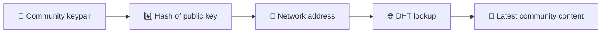
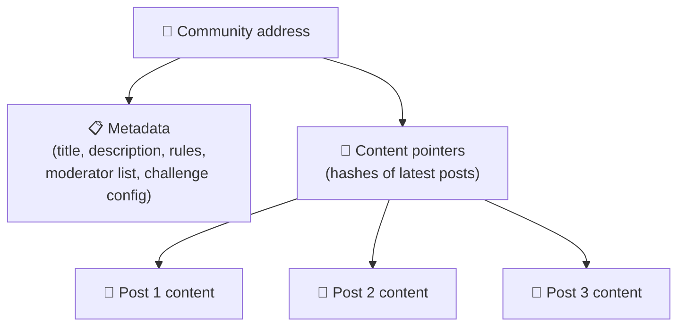
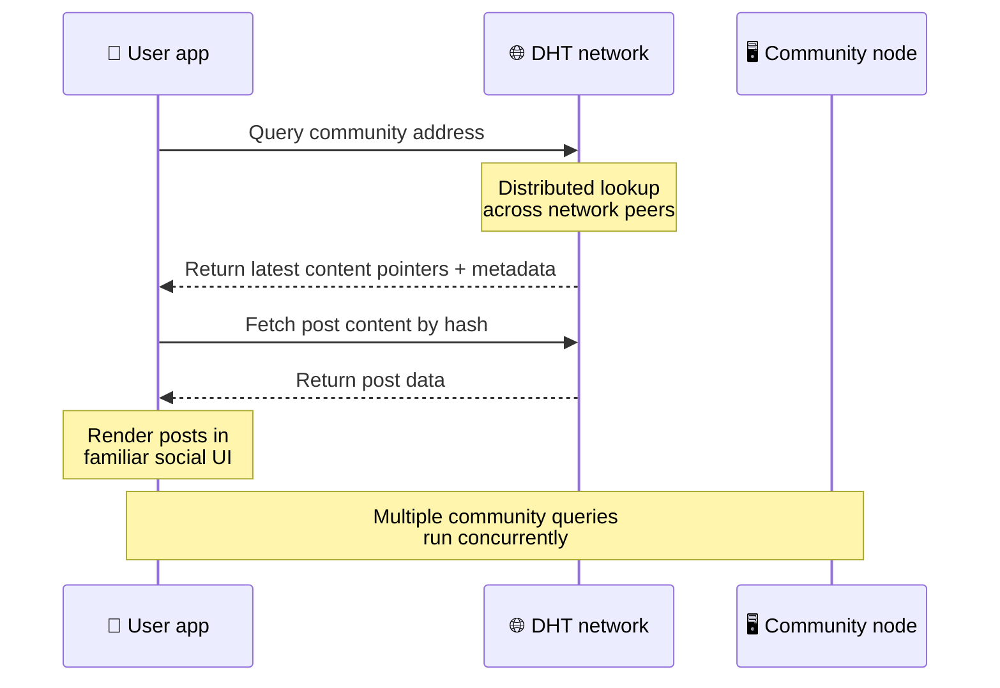
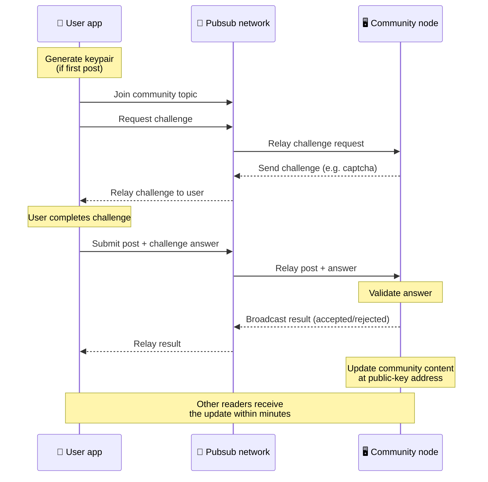
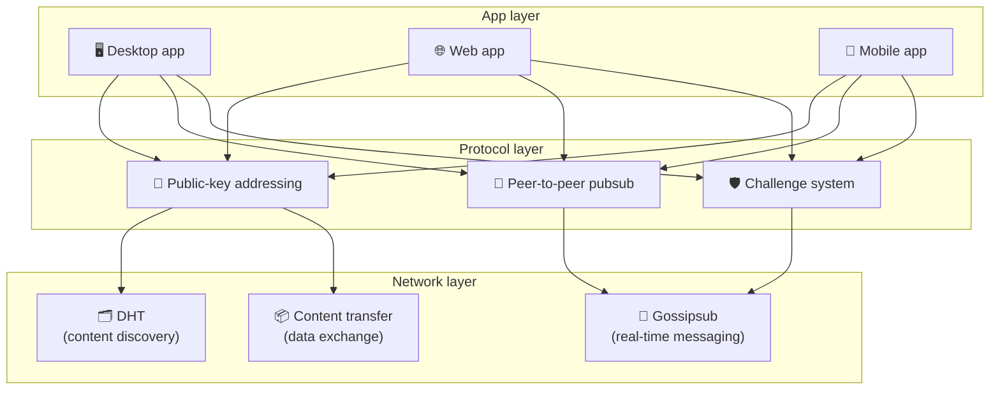

# Peer-to-Peer-protokoll

Bitsocial använder inte en blockchain, en federationsserver eller en centraliserad backend. Istället kombineras två idéer – **public-key-baserad adressering** och **peer-to-peer pubsub** – för att låta vem som helst vara värd för en community från konsumenthårdvara medan användare läser och postar utan konton på någon företagskontrollerad tjänst.

För en mindre teknisk genomgång, läs [En komplett lekmannaförklaring av Bitsocial-protokollet](./layman-protocol-explanation.md).

## De två problemen

Ett decentraliserat socialt nätverk måste svara på två frågor:

1. **Data** — hur lagrar och servar du världens sociala innehåll utan en central databas?
2. **Spam** — hur förhindrar du missbruk samtidigt som du håller nätverket fritt att använda?

Bitsocial löser dataproblemet genom att skippa blockkedjan helt: sociala medier behöver inte global transaktionsbeställning eller permanent tillgänglighet för alla gamla inlägg. Det löser spamproblemet genom att låta varje gemenskap köra sin egen anti-spam-utmaning över peer-to-peer-nätverket.

För upptäcktsmodellen ovanför detta nätverkslager, se [Innehållsupptäckt](./content-discovery.md).

---

## Public-key-baserad adressering

I BitTorrent blir en fils hash dess adress (_innehållsbaserad adressering_). Bitsocial använder en liknande idé med publika nycklar: hashen för en communitys publika nyckel blir dess nätverksadress.

Alla peer i nätverket kan utföra en DHT-fråga (distributed hash table) för den adressen och hämta communityns senaste status. Varje gång innehållet uppdateras ökar dess versionsnummer. Nätverket behåller bara den senaste versionen - det finns inget behov av att bevara varje historiskt tillstånd, vilket är det som gör detta tillvägagångssätt lätt jämfört med en blockchain.

### Vad lagras på adressen

Communityadressen innehåller inte fullständigt inläggsinnehåll direkt. Istället lagrar den en lista med innehållsidentifierare - hash som pekar på den faktiska datan. Klienten hämtar sedan varje del av innehållet genom DHT- eller spårningsliknande sökningar.

Minst en peer har alltid data: community-operatörens nod. Om communityn är populär kommer många andra kamrater att ha det också och belastningen fördelar sig själv, på samma sätt som populära torrents är snabbare att ladda ner.

---

## Peer-to-peer pubsub

Pubsub (publicera-prenumerera) är ett meddelandemönster där kamrater prenumererar på ett ämne och tar emot varje meddelande som publiceras för det ämnet. Bitsocial använder ett peer-to-peer pubsub-nätverk - vem som helst kan publicera, vem som helst kan prenumerera och det finns ingen central meddelandemäklare.

För att publicera ett inlägg till en gemenskap, publicerar en användare ett meddelande vars ämne är lika med gemenskapens offentliga nyckel. Communityoperatörens nod hämtar den, validerar den och – om den klarar anti-spam-utmaningen – inkluderar den i nästa innehållsuppdatering.

---

## Anti-spam: utmaningar över pubsub

Ett öppet pubsub-nätverk är sårbart för spamfloder. Bitsocial löser detta genom att kräva att publicister slutför en **utmaning** innan deras innehåll accepteras.

Utmaningssystemet är flexibelt: varje community-operatör konfigurerar sin egen policy. Alternativen inkluderar:

| Utmaningstyp        | Hur det fungerar                                      |
| ------------------- | ----------------------------------------------------- |
| **Captcha**         | Visuellt eller interaktivt pussel presenterat i appen |
| **Taxebegränsning** | Begränsa inlägg per tidsfönster per identitet         |
| **Token gate**      | Kräv bevis på balans för en specifik token            |
| **Betalning**       | Kräv en liten betalning per post                      |
| **Tillståndslista** | Endast förgodkända identiteter kan skicka             |
| **Anpassad kod**    | Alla policyer som kan uttryckas i kod                 |

Peers som vidarebefordrar för många misslyckade utmaningsförsök blockeras från pubsub-ämnet, vilket förhindrar denial-of-service-attacker på nätverkslagret.

---

## Livscykel: läsa en gemenskap

Detta är vad som händer när en användare öppnar appen och tittar på en communitys senaste inlägg.

**Steg för steg:**

1. Användaren öppnar appen och ser ett socialt gränssnitt.
2. Klienten ansluter sig till peer-to-peer-nätverket och gör en DHT-fråga för varje gemenskap användaren
   följer. Frågor tar några sekunder vardera men körs samtidigt.
3. Varje fråga returnerar communityns senaste innehållspekare och metadata (titel, beskrivning,
   moderatorlista, utmaningskonfiguration).
4. Klienten hämtar det faktiska inläggets innehåll med hjälp av dessa pekare och renderar sedan allt i en
   välbekant socialt gränssnitt.

---

## Livscykel: publicera ett inlägg

Publicering innebär en utmaning-svar handskakning över pubsub innan inlägget accepteras.

**Steg för steg:**

1. Appen genererar ett nyckelpar för användaren om de inte har ett ännu.
2. Användaren skriver ett inlägg för en community.
3. Klienten ansluter sig till pubsub-ämnet för den gemenskapen (nyckeld till gemenskapens publika nyckel).
4. Klienten begär en utmaning över pubsub.
5. Communityoperatörens nod skickar tillbaka en utmaning (till exempel en captcha).
6. Användaren slutför utmaningen.
7. Klienten skickar in inlägget tillsammans med utmaningssvaret över pubsub.
8. Gemenskapsoperatörens nod validerar svaret. Om det är korrekt accepteras inlägget.
9. Noden sänder resultatet över pubsub så att nätverkskollegor vet att de ska fortsätta vidarebefordra
   meddelanden från denna användare.
10. Noden uppdaterar communityns innehåll på dess offentliga nyckeladress.
11. Inom några minuter får varje läsare av communityn uppdateringen.

---

## Arkitektur översikt

Hela systemet har tre lager som fungerar tillsammans:

| Lager         | Roll                                                                                                                                          |
| ------------- | --------------------------------------------------------------------------------------------------------------------------------------------- |
| **App**       | Gräns-snittet. Det kan finnas flera appar, var och en med sin egen design, som alla delar samma gemenskaper och identiteter.                  |
| **Protokoll** | Definierar hur gemenskaper adresseras, hur inlägg publiceras och hur skräppost förhindras.                                                    |
| **Nätverk**   | Den underliggande peer-to-peer-infrastrukturen: DHT för upptäckt, gossipsub för meddelanden i realtid och innehållsöverföring för datautbyte. |

---

## Sekretess: koppla bort författare från IP-adresser

När en användare publicerar ett inlägg **krypteras innehållet med communityoperatörens publika nyckel** innan det går in i pubsub-nätverket. Detta innebär att även om nätverksobservatörer kan se att en peer publicerade _något_, kan de inte avgöra:

- vad innehållet säger
- vilken författaridentitet som publicerade den

Detta liknar hur BitTorrent gör det möjligt att upptäcka vilka IP-adresser som startar en torrent men inte vem som ursprungligen skapade den. Krypteringsskiktet lägger till en extra sekretessgaranti ovanpå den baslinjen.

---

## Webbläsare peer-to-peer

Webbläsare P2P är nu möjligt i Bitsocial-klienter. En webbläsarapp kan köra en [Helia](https://helia.io/)-nod, använda samma Bitsocial-protokollklientstack som andra appar, och hämta innehåll från peers istället för att be en centraliserad IPFS-gateway att betjäna den. Webbläsaren kan också delta i pubsub direkt, så att posta inte behöver en plattformsägd pubsub-leverantör på den lyckliga vägen.

Detta är den viktiga milstolpen för webbdistribution: en normal HTTPS-webbplats kan öppnas till en live P2P social klient. Användare behöver inte installera en stationär app innan de kan läsa från nätverket, och appoperatören behöver inte köra en central gateway som blir censur eller moderering chokepoint för varje webbläsaranvändare.

Webbläsarsökvägen har andra gränser än en skrivbords- eller servernod:

- en webbläsarnod kan vanligtvis inte acceptera godtyckliga inkommande anslutningar från det offentliga internet
- den kan ladda, validera, cachelagra och publicera data medan appen är öppen
- den ska inte behandlas som den långlivade värden för en gemenskaps data
- Fullständig community-hosting hanteras fortfarande bäst av en stationär app, `bitsocial-cli` eller annan
  alltid på nod

HTTP-routrar har fortfarande betydelse för innehållsupptäckt: de returnerar leverantörsadresser för en community-hash. De är inte IPFS-gateways, eftersom de inte tjänar själva innehållet. Efter upptäckt ansluter webbläsarklienten till peers och hämtar data via P2P-stacken.

5chan avslöjar detta som en opt-in Advanced Settings switch i den vanliga 5chan.app webbappen. Den senaste webbläsarstacken `pkc-js` har blivit tillräckligt stabil för offentliga tester efter att uppströms libp2p/gossipsub-interoparbete adresserat meddelandeleverans mellan Helia- och Kubo-kamrater. Inställningen håller webbläsarens P2P-kontrollerad medan den blir mer verklig testning; när den har tillräckligt med produktionsförtroende kan den bli standardwebbvägen.

## Gateway fallback

Gateway-stödd webbläsaråtkomst är fortfarande användbar som en reserv för kompatibilitet och lansering. En gateway kan vidarebefordra data mellan P2P-nätverket och en webbläsarklient när en webbläsare inte kan ansluta till nätverket direkt eller när appen avsiktligt väljer den äldre sökvägen. Dessa gateways:

- kan drivas av vem som helst
- kräver inte användarkonton eller betalningar
- får inte vårdnaden om användaridentiteter eller gemenskaper
- kan bytas ut utan att förlora data

Målarkitekturen är webbläsaren P2P först, med gateways som en valfri reserv snarare än standardflaskhalsen.

---

## Varför inte en blockchain?

Blockkedjor löser problemet med dubbla utgifter: de behöver veta den exakta ordningen för varje transaktion för att förhindra att någon spenderar samma mynt två gånger.

Sociala medier har inget problem med dubbelutgifter. Det spelar ingen roll om inlägg A publicerades en millisekund före inlägg B, och gamla inlägg behöver inte vara permanent tillgängliga på varje nod.

Genom att hoppa över blockkedjan undviker Bitsocial:

- **gasavgifter** — inlägg är gratis
- **genomströmningsgränser** — ingen blockstorlek eller blocktidsflaskhals
- **storage bloat** — noder behåller bara det de behöver
- **konsensusoverhead** — inga gruvarbetare, validerare eller insats krävs

Avvägningen är att Bitsocial inte garanterar permanent tillgänglighet för gammalt innehåll. Men för sociala medier är det en acceptabel kompromiss: communityoperatörens nod håller data, populärt innehåll sprids över många jämnåriga och mycket gamla inlägg bleknar naturligt - på samma sätt som de gör på alla sociala plattformar.

## Varför inte förbundet?

Federerade nätverk (som e-post eller ActivityPub-baserade plattformar) förbättrar centraliseringen men har fortfarande strukturella begränsningar:

- **Serverberoende** — varje gemenskap behöver en server med en domän, TLS och pågående
  underhåll
- **Administratörsförtroende** — serveradministratören har full kontroll över användarkonton och innehåll
- **Fragmentering** — att flytta mellan servrar innebär ofta att du förlorar följare, historik eller identitet
- **Kostnad** — någon måste betala för hosting, vilket skapar press mot konsolidering

Bitsocials peer-to-peer-strategi tar bort servern helt och hållet från ekvationen. En communitynod kan köras på en bärbar dator, en Raspberry Pi eller en billig VPS. Operatören kontrollerar modereringspolicyn men kan inte beslagta användaridentiteter, eftersom identiteter är nyckelparstyrda, inte serverbeviljade.

---

## Sammanfattning

Bitsocial bygger på två primitiver: public-key-baserad adressering för innehållsupptäckt och peer-to-peer pubsub för realtidskommunikation. Tillsammans skapar de ett socialt nätverk där:

- gemenskaper identifieras med kryptografiska nycklar, inte domännamn
- innehåll sprids över jämnåriga som en torrent, inte serverat från en enda databas
- spammotstånd är lokalt för varje gemenskap, inte påtvingat av en plattform
- användare äger sina identiteter genom nyckelpar, inte genom återkallbara konton
- hela systemet körs utan servrar, blockkedjor eller plattformsavgifter
