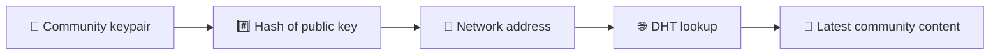
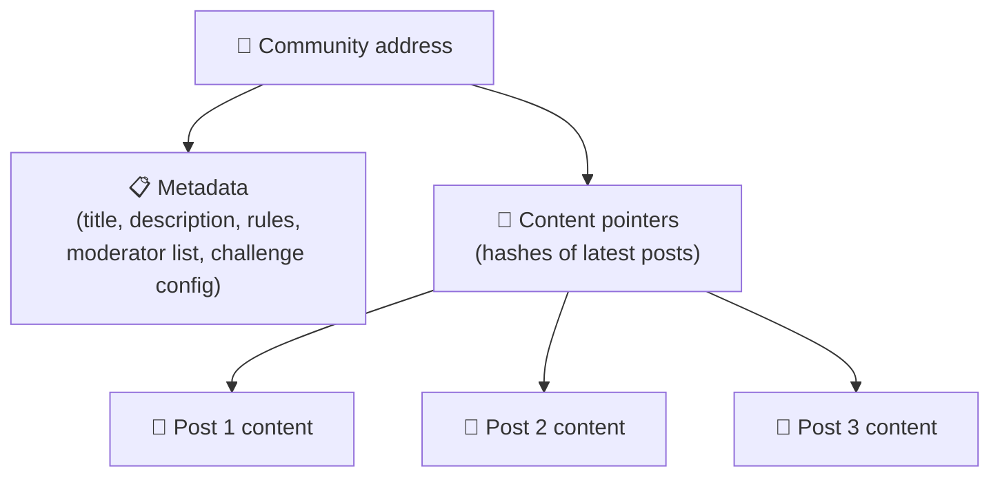
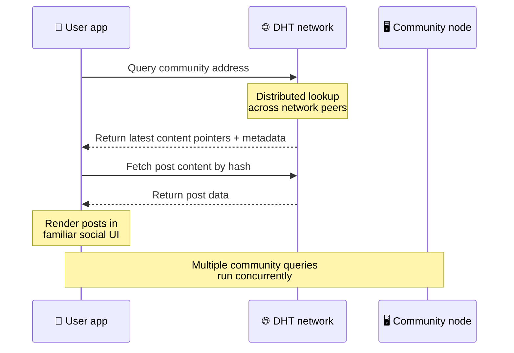
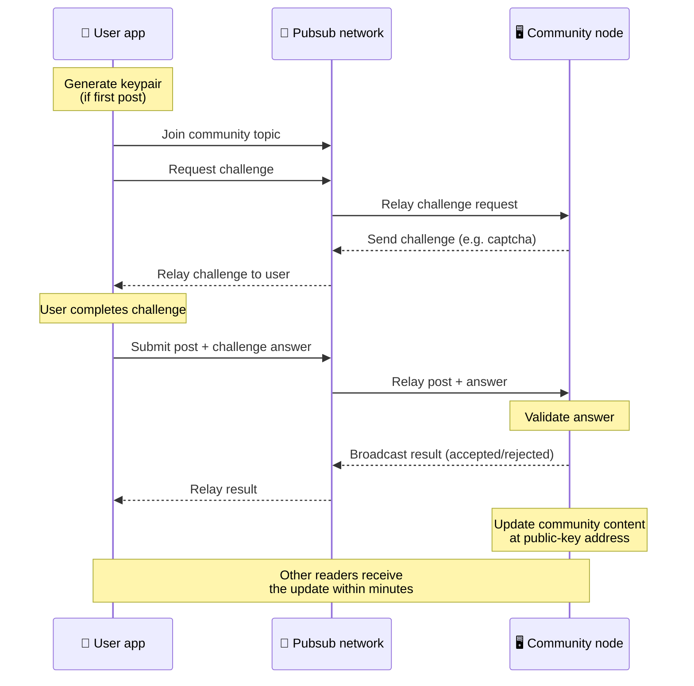
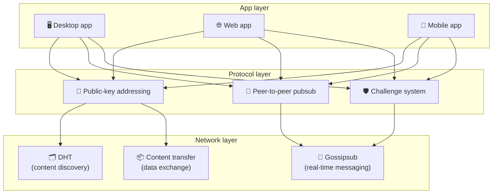

# పీర్-టు-పీర్ ప్రోటోకాల్

Bitsocial బ్లాక్‌చెయిన్, ఫెడరేషన్ సర్వర్ లేదా కేంద్రీకృత బ్యాకెండ్‌ని ఉపయోగించదు. బదులుగా ఇది రెండు ఆలోచనలను మిళితం చేస్తుంది - **పబ్లిక్-కీ-ఆధారిత చిరునామా** మరియు **పీర్-టు-పీర్ పబ్‌సబ్** - వినియోగదారులు ఏదైనా కంపెనీ-నియంత్రిత సేవలో ఖాతాలు లేకుండా చదివేటప్పుడు మరియు పోస్ట్ చేసేటప్పుడు వినియోగదారు హార్డ్‌వేర్ నుండి కమ్యూనిటీని హోస్ట్ చేయడానికి ఎవరినైనా అనుమతించడానికి.

తక్కువ సాంకేతిక నడక కోసం, చదవండి [బిట్సోషల్ ప్రోటోకాల్ యొక్క పూర్తి సామాన్య వివరణ](./layman-protocol-explanation.md).

## రెండు సమస్యలు

వికేంద్రీకృత సామాజిక నెట్‌వర్క్ రెండు ప్రశ్నలకు సమాధానం ఇవ్వాలి:

1. **డేటా** — మీరు సెంట్రల్ డేటాబేస్ లేకుండా ప్రపంచంలోని సామాజిక కంటెంట్‌ను ఎలా నిల్వ చేస్తారు మరియు ఎలా అందిస్తారు?
2. **స్పామ్** — నెట్‌వర్క్‌ను ఉచితంగా ఉపయోగించుకునేటప్పుడు మీరు దుర్వినియోగాన్ని ఎలా నిరోధించగలరు?

Bitsocial బ్లాక్‌చెయిన్‌ను పూర్తిగా దాటవేయడం ద్వారా డేటా సమస్యను పరిష్కరిస్తుంది: సోషల్ మీడియాకు గ్లోబల్ ట్రాన్సాక్షన్ ఆర్డర్ లేదా ప్రతి పాత పోస్ట్ యొక్క శాశ్వత లభ్యత అవసరం లేదు. పీర్-టు-పీర్ నెట్‌వర్క్‌లో ప్రతి కమ్యూనిటీ దాని స్వంత యాంటీ-స్పామ్ ఛాలెంజ్‌ని అమలు చేయడానికి అనుమతించడం ద్వారా ఇది స్పామ్ సమస్యను పరిష్కరిస్తుంది.

ఈ నెట్‌వర్క్ లేయర్ పైన ఉన్న డిస్కవరీ మోడల్ కోసం, [కంటెంట్ ఆవిష్కరణ](./content-discovery.md) చూడండి.

---

## పబ్లిక్-కీ-ఆధారిత చిరునామా

బిట్‌టొరెంట్‌లో, ఫైల్ యొక్క హాష్ దాని చిరునామాగా మారుతుంది (_కంటెంట్-ఆధారిత చిరునామా_). Bitsocial పబ్లిక్ కీలతో సారూప్య ఆలోచనను ఉపయోగిస్తుంది: సంఘం యొక్క పబ్లిక్ కీ యొక్క హాష్ దాని నెట్‌వర్క్ చిరునామాగా మారుతుంది.

నెట్‌వర్క్‌లోని ఏ పీర్ అయినా ఆ చిరునామా కోసం DHT (పంపిణీ చేయబడిన హాష్ పట్టిక) ప్రశ్నను నిర్వహించవచ్చు మరియు సంఘం యొక్క తాజా స్థితిని తిరిగి పొందవచ్చు. కంటెంట్ నవీకరించబడిన ప్రతిసారీ, దాని సంస్కరణ సంఖ్య పెరుగుతుంది. నెట్‌వర్క్ తాజా సంస్కరణను మాత్రమే ఉంచుతుంది - ప్రతి చారిత్రక స్థితిని సంరక్షించాల్సిన అవసరం లేదు, ఇది బ్లాక్‌చెయిన్‌తో పోలిస్తే ఈ విధానాన్ని తేలికగా చేస్తుంది.

### చిరునామాలో ఏమి నిల్వ చేయబడుతుంది

సంఘం చిరునామాలో నేరుగా పూర్తి పోస్ట్ కంటెంట్ లేదు. బదులుగా ఇది కంటెంట్ ఐడెంటిఫైయర్‌ల జాబితాను నిల్వ చేస్తుంది - వాస్తవ డేటాను సూచించే హాష్‌లు. క్లయింట్ అప్పుడు DHT లేదా ట్రాకర్-స్టైల్ లుక్‌అప్‌ల ద్వారా ప్రతి కంటెంట్‌ను పొందుతుంది.

కనీసం ఒక పీర్ వద్ద ఎల్లప్పుడూ డేటా ఉంటుంది: కమ్యూనిటీ ఆపరేటర్ నోడ్. సంఘం జనాదరణ పొందినట్లయితే, అనేక ఇతర సహచరులు కూడా దానిని కలిగి ఉంటారు మరియు లోడ్ స్వయంగా పంపిణీ చేయబడుతుంది, అదే విధంగా జనాదరణ పొందిన టొరెంట్‌లు డౌన్‌లోడ్ చేయడానికి వేగంగా ఉంటాయి.

---

## పీర్-టు-పీర్ పబ్‌సబ్

పబ్‌సబ్ (పబ్లిష్-సబ్‌స్క్రయిబ్) అనేది మెసేజింగ్ ప్యాటర్న్, దీనిలో పీర్‌లు ఒక టాపిక్‌కి సబ్‌స్క్రయిబ్ చేస్తారు మరియు ఆ టాపిక్‌కు ప్రచురించబడిన ప్రతి సందేశాన్ని స్వీకరిస్తారు. Bitsocial పీర్-టు-పీర్ పబ్‌సబ్ నెట్‌వర్క్‌ను ఉపయోగిస్తుంది - ఎవరైనా ప్రచురించవచ్చు, ఎవరైనా సభ్యత్వాన్ని పొందవచ్చు మరియు సెంట్రల్ మెసేజ్ బ్రోకర్ లేరు.

కమ్యూనిటీకి పోస్ట్‌ను ప్రచురించడానికి, ఒక వినియోగదారు సందేశాన్ని ప్రచురించారు, దీని అంశం సంఘం యొక్క పబ్లిక్ కీకి సమానం. కమ్యూనిటీ ఆపరేటర్ యొక్క నోడ్ దానిని ఎంచుకుంటుంది, దానిని ధృవీకరిస్తుంది మరియు — ఇది యాంటీ-స్పామ్ ఛాలెంజ్‌లో ఉత్తీర్ణత సాధిస్తే — తదుపరి కంటెంట్ అప్‌డేట్‌లో చేర్చబడుతుంది.

---

## యాంటీ-స్పామ్: పబ్‌సబ్‌పై సవాళ్లు

ఓపెన్ పబ్‌సబ్ నెట్‌వర్క్ స్పామ్ వరదలకు గురవుతుంది. పబ్లిషర్‌లు తమ కంటెంట్‌ని ఆమోదించే ముందు **ఛాలెంజ్**ని పూర్తి చేయవలసిందిగా బిట్సోషల్ దీనిని పరిష్కరిస్తుంది.

సవాలు వ్యవస్థ అనువైనది: ప్రతి సంఘం ఆపరేటర్ వారి స్వంత విధానాన్ని కాన్ఫిగర్ చేస్తారు. ఎంపికలు ఉన్నాయి:

| ఛాలెంజ్ రకం           | ఇది ఎలా పనిచేస్తుంది                                   |
| --------------------- | ------------------------------------------------------ |
| **క్యాప్చా**          | యాప్‌లో ప్రదర్శించబడిన విజువల్ లేదా ఇంటరాక్టివ్ పజిల్  |
| **రేటు పరిమితి**      | ఒక్కో గుర్తింపు ఒక్కో టైమ్ విండోకు పోస్ట్‌ల పరిమితి    |
| **టోకెన్ గేట్**       | నిర్దిష్ట టోకెన్ యొక్క బ్యాలెన్స్ రుజువు అవసరం         |
| **చెల్లింపు**         | ప్రతి పోస్ట్‌కి చిన్న చెల్లింపు అవసరం                  |
| **అనుమతించిన జాబితా** | ముందుగా ఆమోదించబడిన గుర్తింపులు మాత్రమే పోస్ట్ చేయగలవు |
| **అనుకూల కోడ్**       | కోడ్‌లో వ్యక్తీకరించదగిన ఏదైనా విధానం                  |

నెట్‌వర్క్ లేయర్‌పై సేవా నిరాకరణ దాడులను నిరోధించే పబ్‌సబ్ టాపిక్ నుండి అనేక విఫలమైన సవాలు ప్రయత్నాలను ప్రసారం చేసే సహచరులు బ్లాక్ చేయబడతారు.

---

## జీవితచక్రం: సంఘాన్ని చదవడం

వినియోగదారు యాప్‌ని తెరిచి, సంఘం యొక్క తాజా పోస్ట్‌లను వీక్షించినప్పుడు ఇది జరుగుతుంది.

**దశల వారీగా:**

1. వినియోగదారు యాప్‌ని తెరిచి సామాజిక ఇంటర్‌ఫేస్‌ని చూస్తారు.
2. క్లయింట్ పీర్-టు-పీర్ నెట్‌వర్క్‌లో చేరాడు మరియు వినియోగదారు ప్రతి సంఘం కోసం DHT ప్రశ్నను చేస్తాడు
   అనుసరిస్తుంది. ప్రశ్నలు ఒక్కొక్కటి కొన్ని సెకన్లు తీసుకుంటాయి కానీ ఏకకాలంలో అమలు అవుతాయి.
3. ప్రతి ప్రశ్న సంఘం యొక్క తాజా కంటెంట్ పాయింటర్‌లు మరియు మెటాడేటా (శీర్షిక, వివరణ,
   మోడరేటర్ జాబితా, సవాలు కాన్ఫిగరేషన్).
4. క్లయింట్ ఆ పాయింటర్‌లను ఉపయోగించి అసలు పోస్ట్ కంటెంట్‌ను పొందుతుంది, ఆపై ప్రతిదానిని a లో రెండర్ చేస్తుంది
   తెలిసిన సామాజిక ఇంటర్ఫేస్.

---

## జీవితచక్రం: పోస్ట్‌ను ప్రచురించడం

పోస్ట్‌ని ఆమోదించడానికి ముందు పబ్‌సబ్‌పై సవాలు-ప్రతిస్పందన హ్యాండ్‌షేక్‌ను ప్రచురించడం ఉంటుంది.

**దశల వారీగా:**

1. వినియోగదారుకు ఇంకా కీపెయిర్ లేకుంటే యాప్ వారి కోసం ఒక కీపెయిర్‌ను రూపొందిస్తుంది.
2. వినియోగదారు సంఘం కోసం ఒక పోస్ట్‌ను వ్రాస్తారు.
3. క్లయింట్ ఆ సంఘం కోసం పబ్‌సబ్ టాపిక్‌లో చేరారు (కమ్యూనిటీ యొక్క పబ్లిక్ కీకి కీ చేయబడింది).
4. క్లయింట్ పబ్‌సబ్‌పై సవాలును అభ్యర్థిస్తుంది.
5. కమ్యూనిటీ ఆపరేటర్ యొక్క నోడ్ సవాలును తిరిగి పంపుతుంది (ఉదాహరణకు, క్యాప్చా).
6. వినియోగదారు సవాలును పూర్తి చేస్తారు.
7. క్లయింట్ పబ్‌సబ్ ద్వారా సవాలు సమాధానంతో పాటు పోస్ట్‌ను సమర్పించారు.
8. కమ్యూనిటీ ఆపరేటర్ యొక్క నోడ్ సమాధానాన్ని ధృవీకరిస్తుంది. సరైనది అయితే, పోస్ట్ అంగీకరించబడుతుంది.
9. నోడ్ పబ్‌సబ్ ద్వారా ఫలితాన్ని ప్రసారం చేస్తుంది కాబట్టి నెట్‌వర్క్ పీర్‌లు రిలేయింగ్‌ను కొనసాగించాలని తెలుసుకుంటారు
   ఈ వినియోగదారు నుండి సందేశాలు.
10. నోడ్ సంఘం యొక్క కంటెంట్‌ను దాని పబ్లిక్-కీ చిరునామాలో అప్‌డేట్ చేస్తుంది.
11. కొన్ని నిమిషాల్లో, సంఘంలోని ప్రతి పాఠకుడు నవీకరణను స్వీకరిస్తారు.

---

## ఆర్కిటెక్చర్ అవలోకనం

పూర్తి సిస్టమ్‌లో కలిసి పనిచేసే మూడు పొరలు ఉన్నాయి:

| పొర            | పాత్ర                                                                                                                                     |
| -------------- | ----------------------------------------------------------------------------------------------------------------------------------------- |
| **యాప్**       | వినియోగదారు ఇంటర్‌ఫేస్. బహుళ యాప్‌లు ఉండవచ్చు, ప్రతి ఒక్కటి దాని స్వంత డిజైన్‌తో ఉంటాయి, అన్నీ ఒకే సంఘాలు మరియు గుర్తింపులను పంచుకుంటాయి. |
| **ప్రోటోకాల్** | కమ్యూనిటీలు ఎలా సంబోధించబడతాయి, పోస్ట్‌లు ఎలా ప్రచురించబడతాయి మరియు స్పామ్ ఎలా నిరోధించబడతాయో నిర్వచిస్తుంది.                             |
| **నెట్‌వర్క్** | అంతర్లీన పీర్-టు-పీర్ ఇన్‌ఫ్రాస్ట్రక్చర్: డిస్కవరీ కోసం DHT, నిజ-సమయ సందేశం కోసం గాసిప్‌సబ్ మరియు డేటా మార్పిడి కోసం కంటెంట్ బదిలీ.       |

---

## గోప్యత: IP చిరునామాల నుండి రచయితలను అన్‌లింక్ చేయడం

ఒక వినియోగదారు పోస్ట్‌ను ప్రచురించినప్పుడు, కంటెంట్ పబ్‌సబ్ నెట్‌వర్క్‌లోకి ప్రవేశించే ముందు కమ్యూనిటీ ఆపరేటర్ యొక్క పబ్లిక్ కీ\*\*తో గుప్తీకరించబడుతుంది. దీనర్థం నెట్‌వర్క్ పరిశీలకులు పీర్ *సమ్‌థింగ్*ని ప్రచురించినట్లు చూడగలిగినప్పటికీ, వారు గుర్తించలేరు:

- కంటెంట్ ఏమి చెబుతుంది
- ఏ రచయిత గుర్తింపు దానిని ప్రచురించింది

బిట్‌టొరెంట్ ఏ IPలు టొరెంట్‌ను సీడ్ చేశాయో కనుగొనడాన్ని ఎలా సాధ్యం చేస్తుందో అదే విధంగా ఉంటుంది, కానీ అసలు దానిని ఎవరు సృష్టించలేదు. ఎన్‌క్రిప్షన్ లేయర్ ఆ బేస్‌లైన్ పైన అదనపు గోప్యతా హామీని జోడిస్తుంది.

---

## బ్రౌజర్ పీర్-టు-పీర్

Bitsocial క్లయింట్‌లలో బ్రౌజర్ P2P ఇప్పుడు సాధ్యమవుతుంది. ఒక బ్రౌజర్ యాప్ [హీలియా](https://helia.io/) నోడ్, ఇతర యాప్‌ల వలె అదే Bitsocial ప్రోటోకాల్ క్లయింట్ స్టాక్‌ను ఉపయోగించగలదు మరియు దానిని అందించడానికి కేంద్రీకృత IPFS గేట్‌వేని అడగడానికి బదులుగా పీర్‌ల నుండి కంటెంట్‌ను పొందగలదు. బ్రౌజర్ నేరుగా పబ్‌సబ్‌లో కూడా పాల్గొనగలదు, కాబట్టి పోస్ట్ చేయడానికి సంతోషకరమైన ప్లాట్‌ఫారమ్‌ని అందించే పబ్‌సబ్‌లు అవసరం లేదు.

వెబ్ పంపిణీకి ఇది ముఖ్యమైన మైలురాయి: సాధారణ HTTPS వెబ్‌సైట్ ప్రత్యక్ష P2P సామాజిక క్లయింట్‌గా తెరవబడుతుంది. వినియోగదారులు నెట్‌వర్క్ నుండి చదవడానికి ముందు డెస్క్‌టాప్ యాప్‌ను ఇన్‌స్టాల్ చేయనవసరం లేదు మరియు యాప్ ఆపరేటర్ సెంట్రల్ గేట్‌వేని అమలు చేయవలసిన అవసరం లేదు, ఇది ప్రతి బ్రౌజర్ వినియోగదారుకు సెన్సార్‌షిప్ లేదా మోడరేషన్ చోక్‌పాయింట్ అవుతుంది.

బ్రౌజర్ మార్గం డెస్క్‌టాప్ లేదా సర్వర్ నోడ్ నుండి విభిన్న పరిమితులను కలిగి ఉంది:

- ఒక బ్రౌజర్ నోడ్ సాధారణంగా పబ్లిక్ ఇంటర్నెట్ నుండి ఏకపక్ష ఇన్‌బౌండ్ కనెక్షన్‌లను అంగీకరించదు
- ఇది యాప్ తెరిచినప్పుడు డేటాను లోడ్ చేయగలదు, ధృవీకరించగలదు, కాష్ చేయగలదు మరియు ప్రచురించగలదు
- ఇది సంఘం యొక్క డేటా కోసం దీర్ఘకాల హోస్ట్‌గా పరిగణించబడదు
- పూర్తి కమ్యూనిటీ హోస్టింగ్ ఇప్పటికీ డెస్క్‌టాప్ యాప్, `bitsocial-cli` లేదా మరొకటి ద్వారా ఉత్తమంగా నిర్వహించబడుతుంది
  ఎల్లప్పుడూ ఆన్ నోడ్

HTTP రూటర్‌లు ఇప్పటికీ కంటెంట్ డిస్కవరీకి ముఖ్యమైనవి: అవి కమ్యూనిటీ హాష్ కోసం ప్రొవైడర్ చిరునామాలను అందిస్తాయి. అవి IPFS గేట్‌వేలు కావు, ఎందుకంటే అవి కంటెంట్‌ను అందించవు. కనుగొనబడిన తర్వాత, బ్రౌజర్ క్లయింట్ పీర్‌లకు కనెక్ట్ అవుతుంది మరియు P2P స్టాక్ ద్వారా డేటాను పొందుతుంది.

5chan దీన్ని సాధారణ 5chan.app వెబ్ యాప్‌లో ఆప్ట్-ఇన్ అధునాతన సెట్టింగ్‌ల స్విచ్‌గా బహిర్గతం చేస్తుంది. తాజా `pkc-js` బ్రౌజర్ స్టాక్ హీలియా మరియు కుబో పీర్‌ల మధ్య అప్‌స్ట్రీమ్ libp2p/gossipsub interop వర్క్ అడ్రస్డ్ మెసేజ్ డెలివరీ తర్వాత పబ్లిక్ టెస్టింగ్ కోసం తగినంత స్థిరంగా మారింది. సెట్టింగ్ మరింత వాస్తవ-ప్రపంచ పరీక్షలను పొందుతున్నప్పుడు బ్రౌజర్ P2Pని నియంత్రించడంలో ఉంచుతుంది; ఇది తగినంత ఉత్పత్తి విశ్వాసాన్ని కలిగి ఉంటే, అది డిఫాల్ట్ వెబ్ మార్గంగా మారుతుంది.

## గేట్‌వే ఫాల్‌బ్యాక్

గేట్‌వే-బ్యాక్డ్ బ్రౌజర్ యాక్సెస్ ఇప్పటికీ అనుకూలత మరియు రోల్ అవుట్ ఫాల్‌బ్యాక్‌గా ఉపయోగపడుతుంది. బ్రౌజర్ నేరుగా నెట్‌వర్క్‌లో చేరలేనప్పుడు లేదా యాప్ ఉద్దేశపూర్వకంగా పాత మార్గాన్ని ఎంచుకున్నప్పుడు గేట్‌వే P2P నెట్‌వర్క్ మరియు బ్రౌజర్ క్లయింట్ మధ్య డేటాను ప్రసారం చేయగలదు. ఈ గేట్‌వేలు:

- ఎవరైనా నడపవచ్చు
- వినియోగదారు ఖాతాలు లేదా చెల్లింపులు అవసరం లేదు
- వినియోగదారు గుర్తింపులు లేదా సంఘాలపై కస్టడీని పొందవద్దు
- డేటాను కోల్పోకుండా మార్చుకోవచ్చు

టార్గెట్ ఆర్కిటెక్చర్ అనేది ముందుగా బ్రౌజర్ P2P, గేట్‌వేలు డిఫాల్ట్ అడ్డంకి కాకుండా ఐచ్ఛిక ఫాల్‌బ్యాక్‌గా ఉంటాయి.

---

## బ్లాక్‌చెయిన్ ఎందుకు కాదు?

బ్లాక్‌చెయిన్‌లు డబుల్ ఖర్చు సమస్యను పరిష్కరిస్తాయి: ఎవరైనా ఒకే నాణెం రెండుసార్లు ఖర్చు చేయకుండా నిరోధించడానికి ప్రతి లావాదేవీ యొక్క ఖచ్చితమైన క్రమాన్ని వారు తెలుసుకోవాలి.

సోషల్ మీడియాకు డబుల్ ఖర్చు సమస్య లేదు. A పోస్ట్ B పోస్ట్‌కి ఒక మిల్లీసెకను కంటే ముందు ప్రచురించబడినా పర్వాలేదు మరియు పాత పోస్ట్‌లు ప్రతి నోడ్‌లో శాశ్వతంగా అందుబాటులో ఉండవలసిన అవసరం లేదు.

బ్లాక్‌చెయిన్‌ను దాటవేయడం ద్వారా, Bitsocial నివారిస్తుంది:

- **గ్యాస్ ఫీజు** - పోస్టింగ్ ఉచితం
- **త్రూపుట్ పరిమితులు** — బ్లాక్ పరిమాణం లేదా బ్లాక్ టైమ్ అడ్డంకి లేదు
- **స్టోరేజ్ బ్లోట్** - నోడ్‌లు తమకు అవసరమైన వాటిని మాత్రమే ఉంచుతాయి
- **ఏకాభిప్రాయ ఓవర్‌హెడ్** — మైనర్లు, వాలిడేటర్‌లు లేదా స్టాకింగ్ అవసరం లేదు

మార్పిడి అనేది Bitsocial పాత కంటెంట్ యొక్క శాశ్వత లభ్యతకు హామీ ఇవ్వదు. కానీ సోషల్ మీడియా కోసం, ఇది ఆమోదయోగ్యమైన మార్పిడి: కమ్యూనిటీ ఆపరేటర్ యొక్క నోడ్ డేటాను కలిగి ఉంటుంది, జనాదరణ పొందిన కంటెంట్ చాలా మంది సహచరులకు వ్యాపిస్తుంది మరియు చాలా పాత పోస్ట్‌లు సహజంగా మసకబారుతాయి - ప్రతి సామాజిక ప్లాట్‌ఫారమ్‌లో వారు చేసే విధంగానే.

## ఫెడరేషన్ ఎందుకు కాదు?

ఫెడరేటెడ్ నెట్‌వర్క్‌లు (ఇమెయిల్ లేదా యాక్టివిటీపబ్-ఆధారిత ప్లాట్‌ఫారమ్‌లు వంటివి) కేంద్రీకరణను మెరుగుపరుస్తాయి కానీ ఇప్పటికీ నిర్మాణాత్మక పరిమితులను కలిగి ఉన్నాయి:

- **సర్వర్ డిపెండెన్సీ** - ప్రతి సంఘానికి డొమైన్, TLS మరియు కొనసాగుతున్న సర్వర్ అవసరం
  నిర్వహణ
- **అడ్మిన్ ట్రస్ట్** — సర్వర్ అడ్మిన్ వినియోగదారు ఖాతాలు మరియు కంటెంట్‌పై పూర్తి నియంత్రణను కలిగి ఉంటారు
- **ఫ్రాగ్మెంటేషన్** — సర్వర్‌ల మధ్య కదలడం అంటే అనుచరులు, చరిత్ర లేదా గుర్తింపును కోల్పోవడం
- **ఖర్చు** — ఎవరైనా హోస్టింగ్ కోసం చెల్లించాలి, ఇది ఏకీకరణ వైపు ఒత్తిడిని సృష్టిస్తుంది

Bitsocial యొక్క పీర్-టు-పీర్ విధానం సర్వర్‌ను సమీకరణం నుండి పూర్తిగా తొలగిస్తుంది. కమ్యూనిటీ నోడ్ ల్యాప్‌టాప్, రాస్ప్‌బెర్రీ పై లేదా చౌకైన VPSలో రన్ అవుతుంది. ఆపరేటర్ మోడరేషన్ విధానాన్ని నియంత్రిస్తారు కానీ వినియోగదారు గుర్తింపులను స్వాధీనం చేసుకోలేరు, ఎందుకంటే గుర్తింపులు కీపెయిర్-నియంత్రితమైనవి, సర్వర్-మంజూరు కాదు.

---

## సారాంశం

Bitsocial రెండు ఆదిమాంశాలపై నిర్మించబడింది: కంటెంట్ డిస్కవరీ కోసం పబ్లిక్-కీ-ఆధారిత చిరునామా మరియు నిజ-సమయ కమ్యూనికేషన్ కోసం పీర్-టు-పీర్ పబ్‌సబ్. వారు కలిసి సోషల్ నెట్‌వర్క్‌ని ఉత్పత్తి చేస్తారు:

- సంఘాలు క్రిప్టోగ్రాఫిక్ కీల ద్వారా గుర్తించబడతాయి, డొమైన్ పేర్లు కాదు
- కంటెంట్ ఒకే డేటాబేస్ నుండి అందించబడని టొరెంట్ వంటి పీర్‌లలో వ్యాపిస్తుంది
- స్పామ్ ప్రతిఘటన ప్రతి సంఘానికి స్థానికంగా ఉంటుంది, ప్లాట్‌ఫారమ్ ద్వారా విధించబడదు
- వినియోగదారులు తమ గుర్తింపును కీపెయిర్ల ద్వారా కలిగి ఉంటారు, రద్దు చేయగల ఖాతాల ద్వారా కాదు
- మొత్తం సిస్టమ్ సర్వర్లు, బ్లాక్‌చెయిన్‌లు లేదా ప్లాట్‌ఫారమ్ ఫీజు లేకుండా నడుస్తుంది
