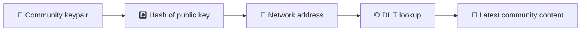
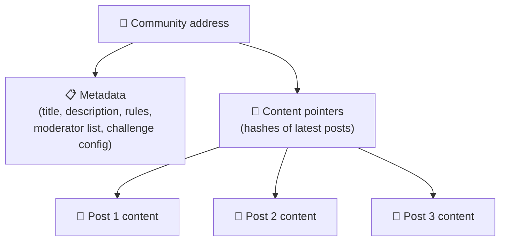
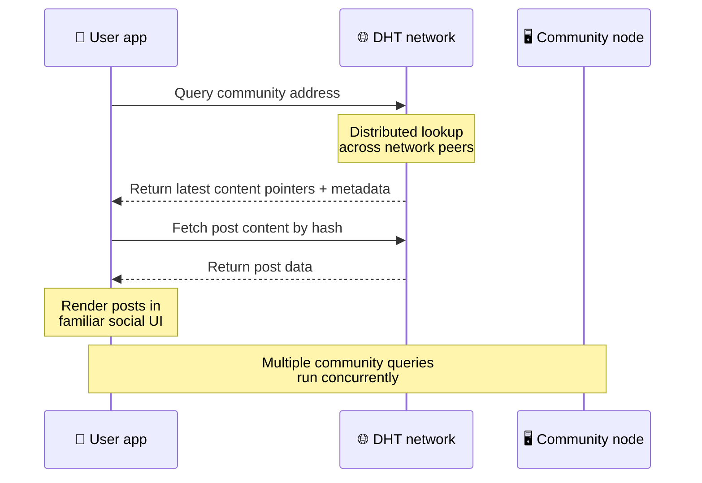
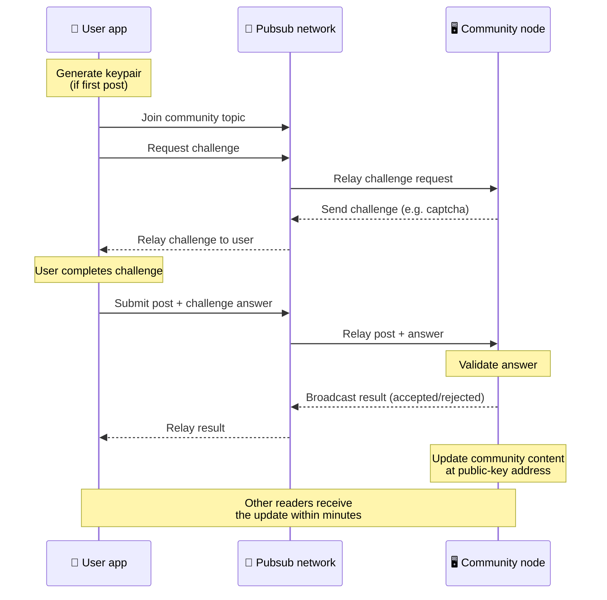
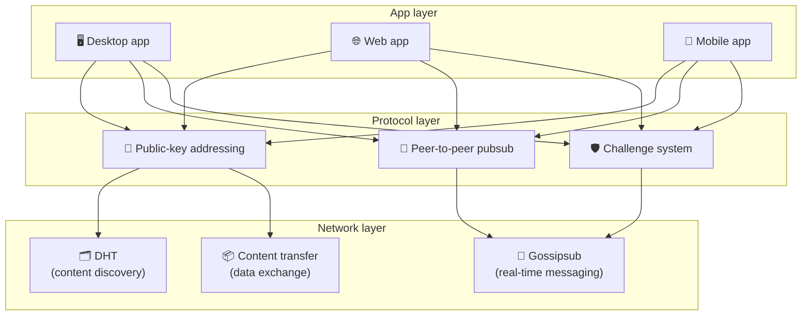

# โปรโตคอลแบบเพียร์ทูเพียร์

Bitsocial ไม่ได้ใช้บล็อกเชน เซิร์ฟเวอร์รวม หรือแบ็กเอนด์แบบรวมศูนย์ แต่จะรวมแนวคิดสองประการเข้าด้วยกัน — **การกำหนดที่อยู่ตามคีย์สาธารณะ** และ **peer-to-peer pubsub** — เพื่อให้ใครก็ตามสามารถโฮสต์ชุมชนจากฮาร์ดแวร์สำหรับผู้บริโภคในขณะที่ผู้ใช้อ่านและโพสต์โดยไม่ต้องมีบัญชีในบริการที่บริษัทควบคุม

หากต้องการคำแนะนำทางเทคนิคน้อยลง โปรดอ่าน [คำอธิบายทั่วไปที่สมบูรณ์ของโปรโตคอล Bitsocial](./layman-protocol-explanation.md).

## ปัญหาทั้งสอง

เครือข่ายโซเชียลแบบกระจายอำนาจต้องตอบคำถามสองข้อ:

1. **ข้อมูล** — คุณจะจัดเก็บและให้บริการเนื้อหาโซเชียลของโลกโดยไม่มีฐานข้อมูลกลางได้อย่างไร
2. **สแปม** — คุณจะป้องกันการละเมิดในขณะที่รักษาเครือข่ายให้ใช้งานได้ฟรีได้อย่างไร

Bitsocial แก้ปัญหาข้อมูลด้วยการข้ามบล็อคเชนโดยสิ้นเชิง: โซเชียลมีเดียไม่จำเป็นต้องมีการสั่งซื้อธุรกรรมทั่วโลกหรือโพสต์เก่าทุกโพสต์มีความพร้อมใช้งานถาวร จะช่วยแก้ปัญหาสแปมโดยปล่อยให้แต่ละชุมชนดำเนินการท้าทายการป้องกันสแปมของตนเองผ่านเครือข่ายเพียร์ทูเพียร์

สำหรับโมเดลการค้นพบที่อยู่เหนือเลเยอร์เครือข่ายนี้ โปรดดู [ เนื้อหาเนื้อหา](./content-discovery.md)

---

## การกำหนดที่อยู่โดยใช้คีย์สาธารณะ

ใน BitTorrent แฮชของไฟล์จะกลายเป็นที่อยู่ (_ที่อยู่ตามเนื้อหา_) Bitsocial ใช้แนวคิดที่คล้ายกันกับกุญแจสาธารณะ: แฮชของกุญแจสาธารณะของชุมชนจะกลายเป็นที่อยู่เครือข่าย

เพียร์บนเครือข่ายสามารถดำเนินการค้นหา DHT (ตารางแฮชแบบกระจาย) สำหรับที่อยู่นั้นและดึงข้อมูลสถานะล่าสุดของชุมชน แต่ละครั้งที่มีการอัปเดตเนื้อหา หมายเลขเวอร์ชันจะเพิ่มขึ้น เครือข่ายจะเก็บเฉพาะเวอร์ชันล่าสุดเท่านั้น — ไม่จำเป็นต้องรักษาทุกสถานะทางประวัติศาสตร์ ซึ่งทำให้แนวทางนี้มีน้ำหนักเบาเมื่อเทียบกับบล็อกเชน

### สิ่งที่ได้รับการจัดเก็บไว้ที่ที่อยู่

ที่อยู่ชุมชนไม่มีเนื้อหาโพสต์แบบเต็มโดยตรง แต่จะเก็บรายการตัวระบุเนื้อหาแทน — แฮชที่ชี้ไปยังข้อมูลจริง จากนั้นไคลเอ็นต์จะดึงเนื้อหาแต่ละส่วนผ่าน DHT หรือการค้นหาแบบตัวติดตาม

อย่างน้อยหนึ่งเพียร์จะมีข้อมูลอยู่เสมอ: โหนดของผู้ดำเนินการชุมชน หากชุมชนได้รับความนิยม เพื่อนคนอื่นๆ จำนวนมากก็จะมีชุมชนนี้เช่นกัน และโหลดจะกระจายไปเอง เช่นเดียวกับการดาวน์โหลดทอร์เรนต์ยอดนิยมที่เร็วกว่า

---

## ผับย่อยแบบเพียร์ทูเพียร์

Pubsub (เผยแพร่-สมัครสมาชิก) เป็นรูปแบบการส่งข้อความที่เพื่อนสมัครรับหัวข้อและรับทุกข้อความที่เผยแพร่ในหัวข้อนั้น Bitsocial ใช้เครือข่าย pubsub แบบเพียร์ทูเพียร์ — ใครๆ ก็สามารถเผยแพร่ได้ ใครๆ ก็สามารถสมัครสมาชิกได้ และไม่มีตัวกลางส่งข้อความส่วนกลาง

หากต้องการเผยแพร่โพสต์ไปยังชุมชน ผู้ใช้จะเผยแพร่ข้อความที่มีหัวข้อเท่ากับพับลิกคีย์ของชุมชน โหนดของผู้ดำเนินการชุมชนจะรับมัน ตรวจสอบความถูกต้อง และหากผ่านการท้าทายการป้องกันสแปม จะรวมไว้ในการอัปเดตเนื้อหาครั้งถัดไป

---

## ป้องกันสแปม: ความท้าทายเหนือ pubsub

เครือข่าย pubsub แบบเปิดเสี่ยงต่อการถูกสแปมท่วมท้น Bitsocial แก้ปัญหานี้โดยกำหนดให้ผู้เผยแพร่โฆษณาต้องทำ **ความท้าทาย** ก่อนจึงจะยอมรับเนื้อหาของตน

ระบบท้าทายมีความยืดหยุ่น: ผู้ดำเนินการชุมชนแต่ละรายกำหนดนโยบายของตนเอง ตัวเลือกได้แก่:

| ประเภทความท้าทาย    | มันทำงานอย่างไร                                             |
| ------------------- | ----------------------------------------------------------- |
| **แคปช่า**          | ปริศนาภาพหรือโต้ตอบที่นำเสนอในแอป                           |
| **จำกัดอัตรา**      | จำกัดการโพสต์ต่อกรอบเวลาต่อข้อมูลประจำตัว                   |
| **ประตูโทเค็น**     | ต้องการหลักฐานยืนยันยอดคงเหลือของโทเค็นเฉพาะ                |
| **การชำระเงิน**     | ต้องเสียเงินเล็กน้อยต่อการโพสต์                             |
| **รายการที่อนุญาต** | เฉพาะตัวตนที่ได้รับการอนุมัติล่วงหน้าเท่านั้นที่สามารถโพสต์ |
| **รหัสที่กำหนดเอง** | นโยบายใด ๆ ที่แสดงในรหัส                                    |

เพียร์ที่ส่งต่อความพยายามท้าทายที่ล้มเหลวมากเกินไปจะถูกบล็อกจากหัวข้อ pubsub ซึ่งจะป้องกันการโจมตีแบบปฏิเสธการให้บริการบนเลเยอร์เครือข่าย

---

## วงจรชีวิต: การอ่านชุมชน

นี่คือสิ่งที่เกิดขึ้นเมื่อผู้ใช้เปิดแอปและดูโพสต์ล่าสุดของชุมชน

**ทีละขั้นตอน:**

1. ผู้ใช้เปิดแอปและเห็นอินเทอร์เฟซโซเชียล
2. ไคลเอนต์เข้าร่วมเครือข่ายเพียร์ทูเพียร์และสร้างแบบสอบถาม DHT สำหรับแต่ละชุมชนที่ผู้ใช้
   ดังต่อไปนี้ การค้นหาแต่ละครั้งใช้เวลาไม่กี่วินาทีแต่ทำงานพร้อมกัน
3. แบบสอบถามแต่ละรายการจะส่งกลับตัวชี้เนื้อหาและข้อมูลเมตาล่าสุดของชุมชน (ชื่อ คำอธิบาย
   รายชื่อผู้ดูแล การกำหนดค่าการท้าทาย)
4. ลูกค้าดึงเนื้อหาโพสต์จริงโดยใช้พอยน์เตอร์เหล่านั้น จากนั้นเรนเดอร์ทุกอย่างในรูปแบบ
   อินเทอร์เฟซโซเชียลที่คุ้นเคย

---

## วงจรชีวิต: การเผยแพร่โพสต์

การเผยแพร่เกี่ยวข้องกับการจับมือกันเพื่อตอบสนองต่อความท้าทายบน pubsub ก่อนที่โพสต์จะได้รับการยอมรับ

**ทีละขั้นตอน:**

1. แอปจะสร้างคู่กุญแจสำหรับผู้ใช้หากยังไม่มี
2. ผู้ใช้เขียนโพสต์สำหรับชุมชน
3. ลูกค้าเข้าร่วมหัวข้อ pubsub สำหรับชุมชนนั้น (คีย์ไปยังคีย์สาธารณะของชุมชน)
4. ลูกค้าร้องขอการท้าทายเรื่องผับซับ
5. โหนดของผู้ดำเนินการชุมชนส่งการท้าทายกลับมา (เช่น captcha)
6. ผู้ใช้ทำภารกิจท้าทายให้สำเร็จ
7. ลูกค้าส่งโพสต์พร้อมกับคำตอบท้าทายผ่านทาง pubsub
8. โหนดของผู้ดำเนินการชุมชนตรวจสอบคำตอบ หากถูกต้องก็ยอมรับการโพสต์
9. โหนดจะถ่ายทอดผลลัพธ์ผ่าน pubsub เพื่อให้เพื่อนเครือข่ายรู้ว่าต้องส่งต่อต่อไป
   ข้อความจากผู้ใช้รายนี้
10. โหนดอัพเดตเนื้อหาของชุมชนตามที่อยู่คีย์สาธารณะ
11. ภายในไม่กี่นาที ผู้อ่านชุมชนทุกคนจะได้รับการอัปเดต

---

## ภาพรวมสถาปัตยกรรม

ระบบทั้งหมดมีสามชั้นที่ทำงานร่วมกัน:

| เลเยอร์       | บทบาท                                                                                                                                              |
| ------------- | -------------------------------------------------------------------------------------------------------------------------------------------------- |
| **แอป**       | ส่วนติดต่อผู้ใช้ สามารถมีได้หลายแอป แต่ละแอปมีการออกแบบของตัวเอง โดยทั้งหมดใช้ชุมชนและอัตลักษณ์เดียวกัน                                            |
| **โปรโตคอล**  | กำหนดวิธีจัดการกับชุมชน วิธีเผยแพร่โพสต์ และวิธีป้องกันสแปม                                                                                        |
| **เครือข่าย** | โครงสร้างพื้นฐานแบบเพียร์ทูเพียร์พื้นฐาน: DHT สำหรับการค้นพบ การนินทาสำหรับการส่งข้อความแบบเรียลไทม์ และการถ่ายโอนเนื้อหาสำหรับการแลกเปลี่ยนข้อมูล |

---

## ความเป็นส่วนตัว: การยกเลิกการเชื่อมโยงผู้เขียนจากที่อยู่ IP

เมื่อผู้ใช้เผยแพร่โพสต์ เนื้อหาจะถูก **เข้ารหัสด้วยรหัสสาธารณะของผู้ให้บริการชุมชน** ก่อนที่จะเข้าสู่เครือข่าย pubsub ซึ่งหมายความว่าในขณะที่ผู้สังเกตการณ์เครือข่ายเห็นว่าเพียร์เผยแพร่ _something_ แต่พวกเขาไม่สามารถระบุได้:

- เนื้อหาพูดถึงอะไร
- ตัวตนของผู้เขียนคนใดที่เผยแพร่มัน

สิ่งนี้คล้ายกับวิธีที่ BitTorrent ทำให้สามารถค้นหาได้ว่า IP ใดที่สร้างทอร์เรนต์ แต่ไม่ใช่ใครเป็นผู้สร้างมันขึ้นมา เลเยอร์การเข้ารหัสจะเพิ่มการรับประกันความเป็นส่วนตัวเพิ่มเติมนอกเหนือจากพื้นฐานนั้น

---

## เบราว์เซอร์แบบเพียร์ทูเพียร์

ขณะนี้เบราว์เซอร์ P2P สามารถทำได้ในไคลเอนต์ Bitsocial แอปเบราว์เซอร์สามารถเรียกใช้โหนด [เฮเลีย](https://helia.io/) ใช้สแต็กไคลเอ็นต์โปรโตคอล Bitsocial เดียวกันกับแอปอื่นๆ และดึงเนื้อหาจากเพียร์แทนที่จะขอให้เกตเวย์ IPFS แบบรวมศูนย์ให้บริการ เบราว์เซอร์ยังสามารถเข้าร่วมใน pubsub ได้โดยตรง ดังนั้นการโพสต์จึงไม่จำเป็นต้องมีผู้ให้บริการ pubsub ที่เป็นเจ้าของแพลตฟอร์มในเส้นทางที่มีความสุข

นี่คือเหตุการณ์สำคัญสำหรับการเผยแพร่เว็บ: เว็บไซต์ HTTPS ปกติสามารถเปิดเป็นไคลเอนต์โซเชียล P2P แบบสดได้ ผู้ใช้ไม่จำเป็นต้องติดตั้งแอปเดสก์ท็อปก่อนจึงจะสามารถอ่านจากเครือข่ายได้ และผู้ดำเนินการแอปไม่จำเป็นต้องเรียกใช้เกตเวย์กลางที่กลายเป็นจุดควบคุมการเซ็นเซอร์หรือการกลั่นกรองสำหรับผู้ใช้เบราว์เซอร์ทุกคน

เส้นทางเบราว์เซอร์มีขีดจำกัดที่แตกต่างจากเดสก์ท็อปหรือโหนดเซิร์ฟเวอร์:

- โหนดเบราว์เซอร์มักจะไม่สามารถยอมรับการเชื่อมต่อขาเข้าโดยพลการจากอินเทอร์เน็ตสาธารณะ
- มันสามารถโหลด ตรวจสอบ แคช และเผยแพร่ข้อมูลในขณะที่แอปเปิดอยู่
- ไม่ควรถือเป็นโฮสต์ที่มีอายุการใช้งานยาวนานสำหรับข้อมูลของชุมชน
- การโฮสต์ชุมชนเต็มรูปแบบยังคงได้รับการจัดการที่ดีที่สุดโดยแอปเดสก์ท็อป `bitsocial-cli` หรืออื่น ๆ
  โหนดเปิดตลอดเวลา

เราเตอร์ HTTP ยังคงมีความสำคัญต่อการค้นพบเนื้อหา โดยจะส่งคืนที่อยู่ของผู้ให้บริการสำหรับแฮชชุมชน ไม่ใช่เกตเวย์ IPFS เนื่องจากไม่ได้ให้บริการเนื้อหาในตัวเอง หลังจากการค้นพบ ไคลเอนต์เบราว์เซอร์จะเชื่อมต่อกับเพียร์และดึงข้อมูลผ่านสแต็ก P2P

5chan เปิดเผยสิ่งนี้เป็นสวิตช์การตั้งค่าขั้นสูงแบบเลือกใช้ในเว็บแอป 5chan.app ปกติ สแต็กเบราว์เซอร์ `pkc-js` ล่าสุดมีเสถียรภาพเพียงพอสำหรับการทดสอบสาธารณะ หลังจากงานการทำงานร่วมกันอัปสตรีม libp2p/gossipsub ระบุการส่งข้อความระหว่างเพื่อนร่วมงาน Helia และ Kubo การตั้งค่านี้ทำให้เบราว์เซอร์ควบคุม P2P ในขณะที่ได้รับการทดสอบในโลกแห่งความเป็นจริงมากขึ้น เมื่อมีความมั่นใจในการผลิตเพียงพอ ก็จะกลายเป็นเส้นทางเว็บเริ่มต้นได้

## ทางเลือกเกตเวย์

การเข้าถึงเบราว์เซอร์ที่สนับสนุนเกตเวย์ยังคงมีประโยชน์ในฐานะความเข้ากันได้และทางเลือกในการเปิดตัว เกตเวย์สามารถถ่ายทอดข้อมูลระหว่างเครือข่าย P2P และไคลเอนต์เบราว์เซอร์เมื่อเบราว์เซอร์ไม่สามารถเข้าร่วมเครือข่ายได้โดยตรง หรือเมื่อแอปจงใจเลือกเส้นทางที่เก่ากว่า เกตเวย์เหล่านี้:

- ใครๆ ก็สามารถดำเนินการได้
- ไม่จำเป็นต้องมีบัญชีผู้ใช้หรือการชำระเงิน
- ไม่ได้รับการดูแลเหนือตัวตนของผู้ใช้หรือชุมชน
- สามารถสลับออกได้โดยไม่สูญเสียข้อมูล

สถาปัตยกรรมเป้าหมายคือเบราว์เซอร์ P2P ก่อน โดยมีเกตเวย์เป็นตัวเลือกสำรอง แทนที่จะเป็นคอขวดเริ่มต้น

---

## ทำไมไม่บล็อกเชน?

Blockchains แก้ปัญหาการใช้จ่ายซ้ำซ้อน: พวกเขาจำเป็นต้องทราบลำดับที่แน่นอนของทุกธุรกรรมเพื่อป้องกันไม่ให้ใครบางคนใช้เหรียญเดียวกันสองครั้ง

โซเชียลมีเดียไม่มีปัญหาการใช้จ่ายซ้ำซ้อน ไม่สำคัญว่าโพสต์ A จะถูกเผยแพร่หนึ่งมิลลิวินาทีก่อนโพสต์ B หรือไม่ และโพสต์เก่าไม่จำเป็นต้องพร้อมใช้งานอย่างถาวรในทุกโหนด

ด้วยการข้ามบล็อกเชน Bitsocial จะหลีกเลี่ยง:

- **ค่าน้ำมัน** — ลงประกาศฟรี
- **ขีดจำกัดปริมาณงาน** — ไม่มีขนาดบล็อกหรือปัญหาคอขวดของเวลาบล็อก
- **พื้นที่เก็บข้อมูลขยายตัว** — โหนดจะเก็บเฉพาะสิ่งที่ต้องการเท่านั้น
- **ค่าใช้จ่ายที่เป็นเอกฉันท์** — ไม่ต้องมีนักขุด ผู้ตรวจสอบ หรือการวางเดิมพัน

ข้อดีก็คือ Bitsocial ไม่รับประกันความพร้อมใช้งานของเนื้อหาเก่าอย่างถาวร แต่สำหรับโซเชียลมีเดีย นั่นเป็นการแลกเปลี่ยนที่ยอมรับได้: โหนดของผู้ให้บริการชุมชนเก็บข้อมูล เนื้อหายอดนิยมแพร่กระจายไปยังเพื่อน ๆ มากมาย และโพสต์เก่า ๆ จะหายไปอย่างเป็นธรรมชาติ เช่นเดียวกับที่ทำบนทุกแพลตฟอร์มโซเชียล

## ทำไมไม่สหพันธ์?

เครือข่ายแบบรวมศูนย์ (เช่น อีเมลหรือแพลตฟอร์มที่ใช้ ActivityPub) ปรับปรุงแบบรวมศูนย์ แต่ยังคงมีข้อจำกัดทางโครงสร้าง:

- **การพึ่งพาเซิร์ฟเวอร์** — แต่ละชุมชนต้องการเซิร์ฟเวอร์ที่มีโดเมน, TLS และต่อเนื่อง
  การซ่อมบำรุง
- **ความไว้วางใจของผู้ดูแลระบบ** — ผู้ดูแลระบบเซิร์ฟเวอร์สามารถควบคุมบัญชีผู้ใช้และเนื้อหาได้อย่างเต็มที่
- **การแยกส่วน** — การย้ายระหว่างเซิร์ฟเวอร์มักจะหมายถึงการสูญเสียผู้ติดตาม ประวัติ หรือตัวตน
- **ค่าใช้จ่าย** — ต้องมีบางคนจ่ายค่าโฮสติ้ง ซึ่งสร้างแรงกดดันต่อการควบรวมกิจการ

วิธีการแบบเพียร์ทูเพียร์ของ Bitsocial จะลบเซิร์ฟเวอร์ออกจากสมการโดยสิ้นเชิง โหนดชุมชนสามารถทำงานบนแล็ปท็อป, Raspberry Pi หรือ VPS ราคาถูก ผู้ปฏิบัติงานควบคุมนโยบายการกลั่นกรอง แต่ไม่สามารถยึดข้อมูลระบุตัวตนของผู้ใช้ได้ เนื่องจากข้อมูลระบุตัวตนควบคุมด้วยคีย์แพร์ ไม่ได้รับสิทธิ์จากเซิร์ฟเวอร์

---

## สรุป

Bitsocial สร้างขึ้นจากสองสิ่งพื้นฐาน: การกำหนดที่อยู่โดยใช้คีย์สาธารณะสำหรับการค้นพบเนื้อหา และ peer-to-peer pubsub สำหรับการสื่อสารแบบเรียลไทม์ พวกเขาช่วยกันสร้างเครือข่ายโซเชียลโดยที่:

- ชุมชนจะถูกระบุด้วยคีย์เข้ารหัส ไม่ใช่ชื่อโดเมน
- เนื้อหาแพร่กระจายไปทั่วเพียร์เหมือนกับทอร์เรนต์ ซึ่งไม่ได้ให้บริการจากฐานข้อมูลเดียว
- การต่อต้านสแปมนั้นเกิดขึ้นเฉพาะในแต่ละชุมชน ไม่ได้กำหนดโดยแพลตฟอร์ม
- ผู้ใช้เป็นเจ้าของข้อมูลประจำตัวของตนผ่านคู่กุญแจ ไม่ใช่ผ่านบัญชีที่เพิกถอนได้
- ระบบทั้งหมดทำงานโดยไม่มีเซิร์ฟเวอร์ บล็อกเชน หรือค่าธรรมเนียมแพลตฟอร์ม
