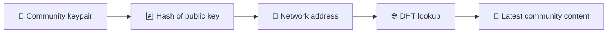
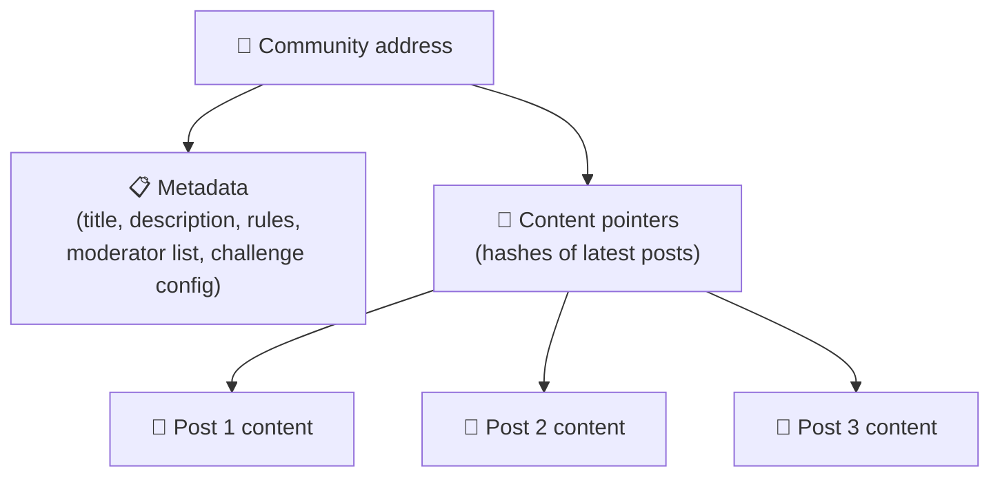
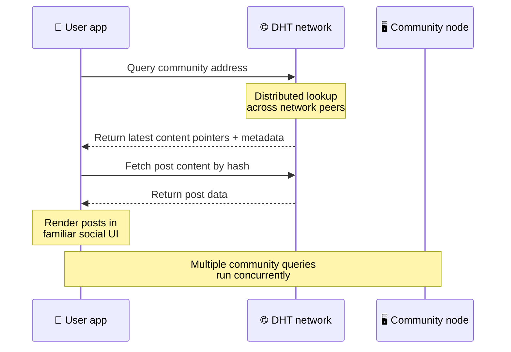
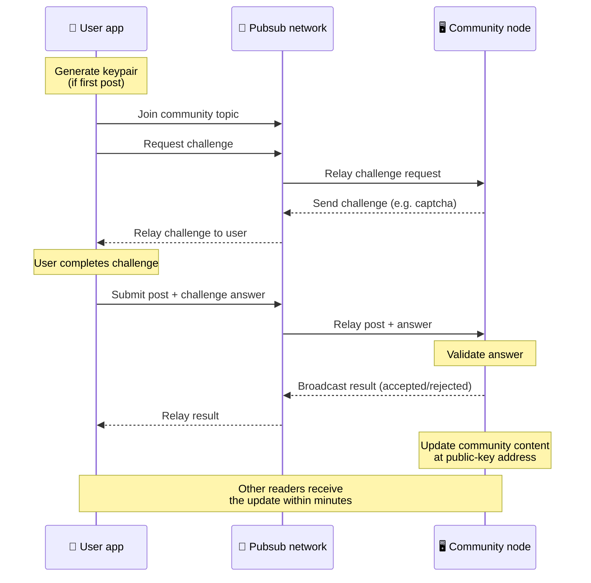
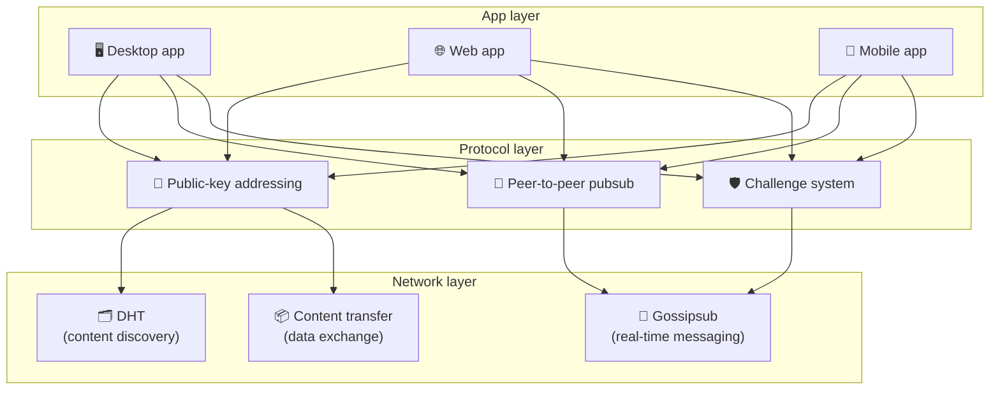

# Eşler Arası Protokol

Bitsocial bir blok zinciri, bir federasyon sunucusu veya merkezi bir arka uç kullanmaz. Bunun yerine, **genel anahtar tabanlı adresleme** ve **eşler arası pubsub** olmak üzere iki fikri birleştirerek, kullanıcıların şirket tarafından kontrol edilen herhangi bir hizmette hesap olmadan okuma ve paylaşım yaparken herkesin tüketici donanımından bir topluluk barındırmasına olanak tanır.

Daha az teknik bir açıklama için okuyun [Bitsocial protokolünün tam bir meslekten olmayan açıklaması](./layman-protocol-explanation.md).

## İki sorun

Merkezi olmayan bir sosyal ağın iki soruyu yanıtlaması gerekir:

1. **Veri** — Dünyanın sosyal içeriğini merkezi bir veritabanı olmadan nasıl saklıyor ve sunuyorsunuz?
2. **Spam** — Ağı ücretsiz olarak kullanılabilir halde tutarken kötüye kullanımı nasıl önlersiniz?

Bitsocial, veri sorununu blok zincirini tamamen atlayarak çözüyor: sosyal medyanın küresel işlem sıralamasına veya her eski gönderinin kalıcı olarak bulunmasına ihtiyacı yok. Her topluluğun eşler arası ağ üzerinden kendi anti-spam mücadelesini yürütmesine izin vererek spam sorununu çözer.

Bu ağ katmanının üzerindeki keşif modeli için bkz. [İçerik Keşfi](./content-discovery.md).

---

## Genel anahtar tabanlı adresleme

BitTorrent'te bir dosyanın karması, dosyanın adresi haline gelir (_içerik tabanlı adresleme_). Bitsocial, genel anahtarlarla benzer bir fikir kullanır: bir topluluğun genel anahtarının karması, onun ağ adresi haline gelir.

Ağdaki herhangi bir eş, bu adres için bir DHT (dağıtılmış karma tablo) sorgusu gerçekleştirebilir ve topluluğun en son durumunu alabilir. İçerik her güncellendiğinde sürüm numarası artar. Ağ yalnızca en son sürümü tutar; her geçmiş durumu korumaya gerek yoktur, bu da bu yaklaşımı blockchain'e kıyasla daha hafif kılar.

### Adreste neler saklanır?

Topluluk adresi doğrudan gönderi içeriğinin tamamını içermiyor. Bunun yerine içerik tanımlayıcıların (gerçek verilere işaret eden karmaların) bir listesini saklar. Müşteri daha sonra her bir içerik parçasını DHT veya izleyici tarzı aramalar yoluyla getirir.

En az bir eş her zaman verilere sahiptir: topluluk operatörünün düğümü. Topluluk popülerse, diğer birçok akran da buna sahip olacak ve yük kendi kendine dağıtılacak, aynı şekilde popüler torrentlerin indirilmesi de daha hızlı olacaktır.

---

## Eşler arası pubsub

Pubsub (yayınla-abone ol), eşlerin bir konuya abone olduğu ve o konuya yayınlanan her mesajı aldığı bir mesajlaşma modelidir. Bitsocial, eşler arası bir pubsub ağı kullanıyor; herkes yayın yapabilir, herkes abone olabilir ve merkezi bir mesaj komisyoncusu yoktur.

Bir topluluğa gönderi yayınlamak için kullanıcı, konusu topluluğun genel anahtarına eşit olan bir mesaj yayınlar. Topluluk operatörünün düğümü onu alır, doğrular ve eğer spam önleme testini geçerse bir sonraki içerik güncellemesine dahil eder.

---

## Spam önleme: pubsub'la ilgili zorluklar

Açık bir pubsub ağı spam saldırılarına karşı savunmasızdır. Bitsocial, yayıncıların içerikleri kabul edilmeden önce bir **meydan okumayı** tamamlamalarını zorunlu kılarak bu sorunu çözüyor.

Mücadele sistemi esnektir: her topluluk operatörü kendi politikasını yapılandırır. Seçenekler şunları içerir:

| Mücadele türü               | Nasıl çalışır                                            |
| --------------------------- | -------------------------------------------------------- |
| **Captcha**                 | Uygulamada sunulan görsel veya etkileşimli bulmaca       |
| **Hız sınırlaması**         | Kimliğe göre zaman aralığı başına gönderileri sınırlayın |
| **Jeton kapısı**            | Belirli bir tokenin bakiyesinin kanıtını iste            |
| **Ödeme**                   | Gönderi başına küçük bir ödeme talep edin                |
| **İzin verilenler listesi** | Yalnızca önceden onaylanmış kimlikler yayınlayabilir     |
| **Özel kod**                | Kodla ifade edilebilen herhangi bir politika             |

Çok fazla başarısız sorgulama girişimi ileten eşlerin pubsub konusuna erişimi engellenir, bu da ağ katmanında hizmet reddi saldırılarını önler.

---

## Yaşam döngüsü: bir topluluğu okumak

Bir kullanıcı uygulamayı açıp bir topluluğun en son gönderilerini görüntülediğinde olan şey budur.

**Adım adım:**

1. Kullanıcı uygulamayı açar ve bir sosyal arayüz görür.
2. İstemci eşler arası ağa katılır ve kullanıcı olan her topluluk için bir DHT sorgusu yapar
   takip ediyor. Sorguların her biri birkaç saniye sürer ancak eş zamanlı olarak yürütülür.
3. Her sorgu, topluluğun en son içerik işaretçilerini ve meta verilerini (başlık, açıklama,
   moderatör listesi, sorgulama yapılandırması).
4. İstemci bu işaretçileri kullanarak asıl gönderi içeriğini getirir ve ardından her şeyi bir
   tanıdık sosyal arayüz.

---

## Yaşam Döngüsü: bir gönderi yayınlamak

Yayınlama, gönderi kabul edilmeden önce pubsub üzerinden bir meydan okuma-cevap el sıkışmasını içerir.

**Adım adım:**

1. Uygulama, henüz bir anahtar çifti yoksa kullanıcı için bir anahtar çifti oluşturur.
2. Kullanıcı bir topluluk için bir gönderi yazar.
3. Müşteri, o topluluğun pubsub konusuna katılır (topluluğun ortak anahtarına anahtarlanır).
4. Müşteri pubsub üzerinden bir meydan okuma talep ediyor.
5. Topluluk operatörünün düğümü bir sorgulamayı (örneğin bir captcha) geri gönderir.
6. Kullanıcı mücadeleyi tamamlar.
7. Müşteri, gönderiyi pubsub üzerinden meydan okuma yanıtıyla birlikte gönderir.
8. Topluluk operatörünün düğümü cevabı doğrular. Doğruysa gönderi kabul edilir.
9. Düğüm, sonucu pubsub üzerinden yayınlar, böylece ağ eşleri aktarmaya devam etmeleri gerektiğini bilir
   bu kullanıcıdan gelen mesajlar.
10. Düğüm, topluluğun içeriğini genel anahtar adresinde günceller.
11. Birkaç dakika içinde topluluğun her okuyucusu güncellemeyi alır.

---

## Mimariye genel bakış

Sistemin tamamı birlikte çalışan üç katmana sahiptir:

| Katman       | Rol                                                                                                                                       |
| ------------ | ----------------------------------------------------------------------------------------------------------------------------------------- |
| **Uygulama** | Kullanıcı arayüzü. Her biri kendi tasarımına sahip, hepsi aynı toplulukları ve kimlikleri paylaşan birden fazla uygulama mevcut olabilir. |
| **Protokol** | Topluluklara nasıl hitap edileceğini, gönderilerin nasıl yayınlanacağını ve spam'in nasıl önleneceğini tanımlar.                          |
| **Ağ**       | Temel eşler arası altyapı: Keşif için DHT, gerçek zamanlı mesajlaşma için gossipsub ve veri alışverişi için içerik aktarımı.              |

---

## Gizlilik: yazarların IP adresleriyle olan bağlantısını kaldırma

Bir kullanıcı bir gönderi yayınladığında içerik, pubsub ağına girmeden önce **topluluk operatörünün genel anahtarıyla şifrelenir**. Bu, ağ gözlemcilerinin bir eşin _bir şey_ yayınladığını görebilmesine rağmen şunları belirleyemeyeceği anlamına gelir:

- içerik ne diyor
- hangi yazar kimliğiyle yayınladı

Bu, BitTorrent'in torrenti hangi IP'lerin tohumladığını ancak orijinal olarak kimin oluşturduğunu keşfetmeyi mümkün kılmasına benzer. Şifreleme katmanı, bu temel çizginin üstüne ek bir gizlilik garantisi ekler.

---

## Tarayıcı eşler arası

Tarayıcı P2P artık Bitsocial istemcilerinde mümkün. Bir tarayıcı uygulaması bir [Helia](https://helia.io/) düğümünü çalıştırabilir, diğer uygulamalarla aynı Bitsocial protokol istemci yığınını kullanabilir ve merkezi bir IPFS ağ geçidinin ona hizmet vermesini istemek yerine eşlerden içerik alabilir. Tarayıcı ayrıca pubsub'a doğrudan katılabilir, bu nedenle gönderi yayınlamanın mutlu yolda platforma ait bir pubsub sağlayıcısına ihtiyacı yoktur.

Bu, web dağıtımı için önemli bir dönüm noktasıdır: normal bir HTTPS web sitesi, canlı bir P2P sosyal istemcisine açılabilir. Kullanıcıların ağdan okuyabilmeleri için bir masaüstü uygulaması yüklemelerine gerek yoktur ve uygulama operatörünün, her tarayıcı kullanıcısı için sansür veya denetleme geçiş noktası haline gelen merkezi bir ağ geçidini çalıştırmasına gerek yoktur.

Tarayıcı yolunun bir masaüstü veya sunucu düğümünden farklı sınırları vardır:

- bir tarayıcı düğümü genellikle genel internetten gelen rastgele gelen bağlantıları kabul edemez
- uygulama açıkken verileri yükleyebilir, doğrulayabilir, önbelleğe alabilir ve yayınlayabilir
- bir topluluğun verilerinin uzun ömürlü ana bilgisayarı olarak görülmemelidir
- Tam topluluk barındırma hâlâ en iyi şekilde bir masaüstü uygulaması, `bitsocial-cli` veya başka bir uygulama tarafından gerçekleştirilir.
  her zaman açık düğüm

HTTP yönlendiricileri içerik keşfi için hala önemlidir: topluluk karması için sağlayıcı adreslerini döndürürler. İçeriğin kendisini sunmadıkları için IPFS ağ geçitleri değildirler. Keşiften sonra, tarayıcı istemcisi eşlere bağlanır ve verileri P2P yığını aracılığıyla getirir.

5chan, bunu normal 5chan.app web uygulamasında isteğe bağlı bir Gelişmiş Ayarlar anahtarı olarak gösterir. En yeni `pkc-js` tarayıcı yığını, Helia ve Kubo eşleri arasında mesaj teslimine yönelik yukarı akış libp2p/gossipsub birlikte çalışma çalışmasının ardından genel testler için yeterince kararlı hale geldi. Bu ayar, daha fazla gerçek dünya testi alırken tarayıcının P2P'sini kontrol altında tutar; Yeterli üretim güvenine sahip olduğunda varsayılan web yolu haline gelebilir.

## Ağ geçidi yedeği

Ağ geçidi destekli tarayıcı erişimi, uyumluluk ve kullanıma sunma geri dönüşü olarak hâlâ kullanışlıdır. Bir ağ geçidi, bir tarayıcı ağa doğrudan katılamadığında veya uygulama kasıtlı olarak eski yolu seçtiğinde, P2P ağı ile tarayıcı istemcisi arasında veri aktarabilir. Bu ağ geçitleri:

- herkes tarafından çalıştırılabilir
- kullanıcı hesabı veya ödeme gerektirmez
- kullanıcı kimlikleri veya toplulukları üzerinde denetim sahibi olmayın
- veri kaybı olmadan değiştirilebilir

Hedef mimari, varsayılan darboğaz yerine isteğe bağlı bir geri dönüş olarak ağ geçitleriyle birlikte öncelikle tarayıcı P2P'sidir.

---

## Neden bir blockchain olmasın?

Blok zincirleri çift harcama sorununu çözüyor: Birisinin aynı parayı iki kez harcamasını önlemek için her işlemin tam sırasını bilmeleri gerekiyor.

Sosyal medyada çift harcama sorunu yoktur. A gönderisinin B gönderisinden bir milisaniye önce yayınlanmış olması önemli değildir ve eski gönderilerin her düğümde kalıcı olarak mevcut olması gerekmez.

Bitsocial, blockchain'i atlayarak şunları önler:

- **gaz ücretleri** — gönderim ücretsizdir
- **işleme sınırları** — blok boyutu veya blok süresi darboğazı yok
- **depolama şişkinliği** — düğümler yalnızca ihtiyaç duydukları şeyleri tutar
- **fikir birliği yükü** — madencilere, doğrulayıcılara veya stake etmeye gerek yok

Buradaki değiş tokuş, Bitsocial'ın eski içeriğin kalıcı olarak kullanılabilirliğini garanti etmemesidir. Ancak sosyal medya için bu kabul edilebilir bir ödünleşimdir: topluluk operatörünün düğümü verileri tutar, popüler içerik birçok akrana yayılır ve çok eski gönderiler doğal olarak kaybolur; tıpkı her sosyal platformda olduğu gibi.

## Neden federasyon olmasın?

Birleşik ağlar (e-posta veya ActivityPub tabanlı platformlar gibi) merkezileştirme açısından iyileşir ancak hâlâ yapısal sınırlamalara sahiptir:

- **Sunucu bağımlılığı** — her topluluğun alan adı, TLS ve devam eden bir sunucuya ihtiyacı vardır
  Bakım
- **Yönetici güveni** — Sunucu yöneticisi, kullanıcı hesapları ve içeriği üzerinde tam kontrole sahiptir
- **Parçalanma** — sunucular arasında geçiş yapmak çoğu zaman takipçileri, geçmişi veya kimliği kaybetmek anlamına gelir
- **Maliyet** — Birisinin barındırma için ödeme yapması gerekiyor ve bu da birleştirme yönünde baskı yaratıyor

Bitsocial'ın eşler arası yaklaşımı, sunucuyu denklemin tamamen dışında bırakıyor. Bir topluluk düğümü bir dizüstü bilgisayarda, Raspberry Pi'de veya ucuz bir VPS'de çalışabilir. Operatör, denetleme politikasını kontrol eder ancak kullanıcı kimliklerini ele geçiremez, çünkü kimlikler sunucu tarafından verilmek yerine anahtar çifti tarafından kontrol edilir.

---

## Özet

Bitsocial iki temel temel üzerine inşa edilmiştir: içerik keşfi için genel anahtar tabanlı adresleme ve gerçek zamanlı iletişim için eşler arası pubsub. Birlikte aşağıdakileri içeren bir sosyal ağ oluştururlar:

- topluluklar alan adlarıyla değil, kriptografik anahtarlarla tanımlanır
- içerik, tek bir veritabanından sunulmayan bir torrent gibi eşler arasında yayılır
- Spam direnci her topluluğa özgüdür, bir platform tarafından dayatılmaz
- kullanıcılar kimliklerine geri alınabilir hesaplar aracılığıyla değil, anahtar çiftleri aracılığıyla sahip olurlar
- tüm sistem sunucular, blok zincirler veya platform ücretleri olmadan çalışır
