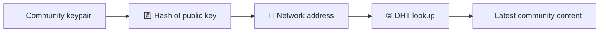
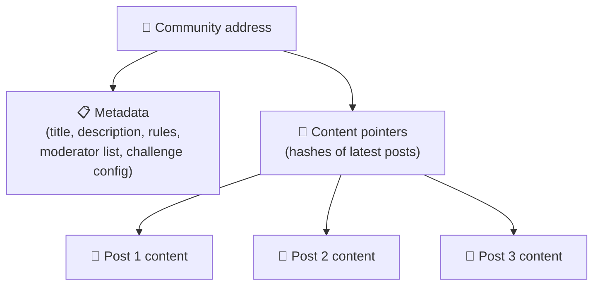
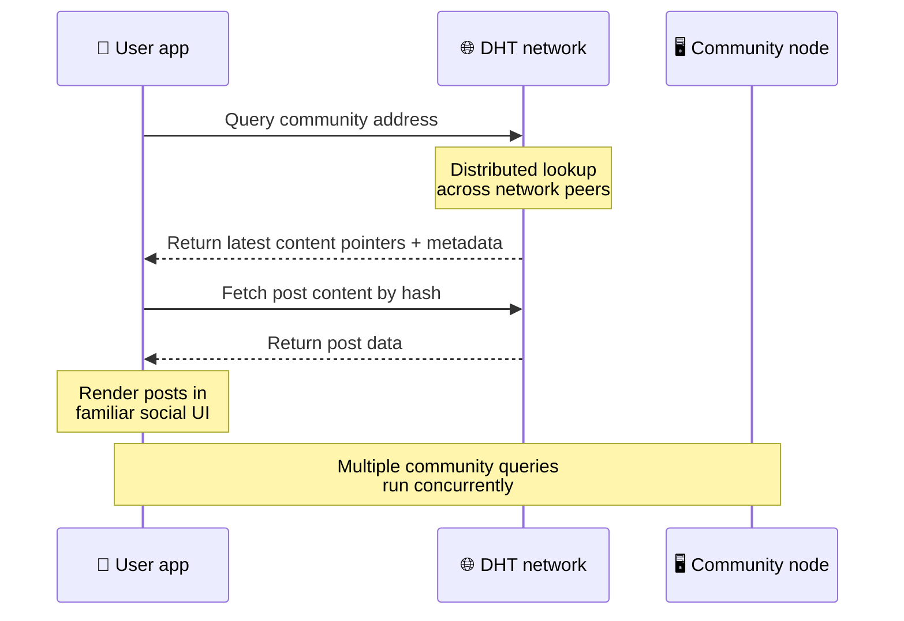
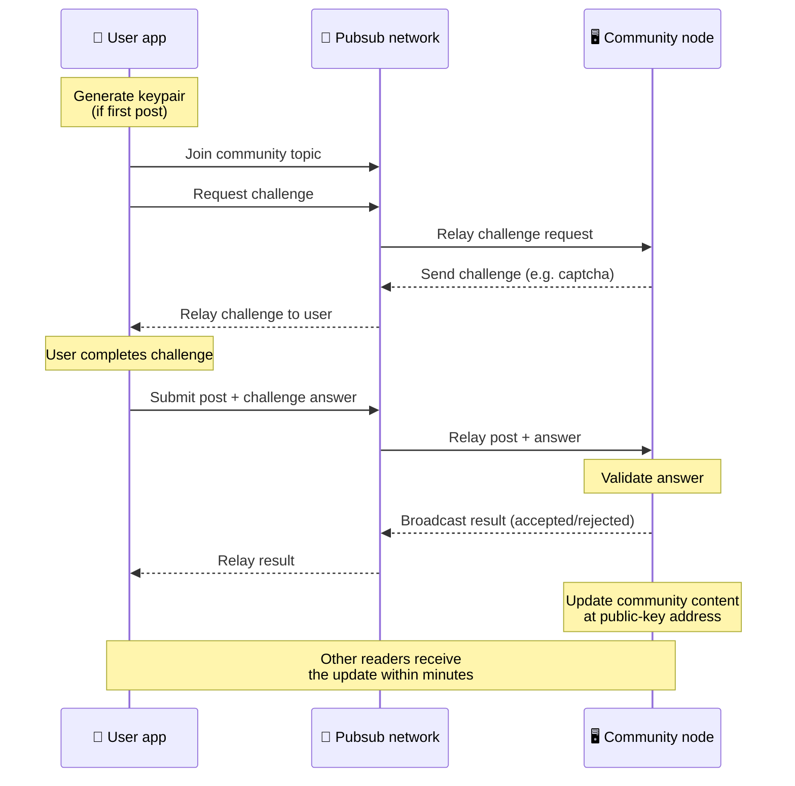
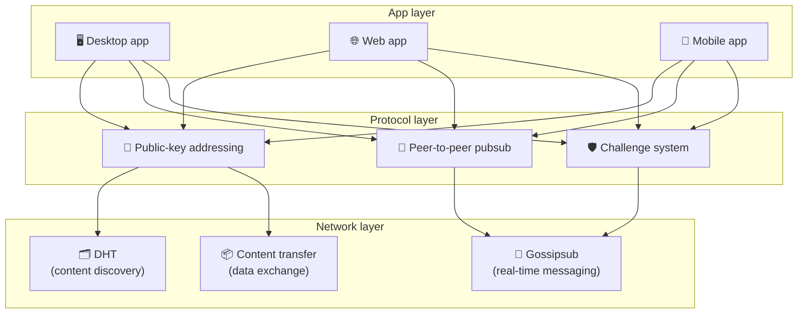

# Одноранговий протокол

Bitsocial не використовує блокчейн, сервер об’єднання чи централізований бекенд. Натомість він поєднує дві ідеї — **адресацію на основі відкритого ключа** та **одноранговий pubsub** — щоб дозволити будь-кому розміщувати спільноту на споживчому обладнанні, а користувачі читати та публікувати без облікових записів у будь-якій службі, контрольованій компанією.

Для менш технічної інструкції прочитайте [Повне непрофесіональне пояснення протоколу Bitsocial](./layman-protocol-explanation.md).

## Дві проблеми

Децентралізована соціальна мережа має відповісти на два запитання:

1. **Дані** — як ви зберігаєте та обслуговуєте світовий соціальний вміст без центральної бази даних?
2. **Спам** — як запобігти зловживанням, залишаючи мережу вільною для використання?

Bitsocial вирішує проблему даних, повністю пропускаючи блокчейн: соціальні мережі не потребують глобального впорядкування транзакцій або постійної доступності кожної старої публікації. Він вирішує проблему спаму, дозволяючи кожній спільноті запускати власну боротьбу зі спамом у одноранговій мережі.

Модель виявлення над цим мережевим рівнем див. у [Відкриття вмісту](./content-discovery.md).

---

## Адресація на основі відкритого ключа

У BitTorrent хеш файлу стає його адресою (_адресація на основі вмісту_). Bitsocial використовує подібну ідею з відкритими ключами: хеш відкритого ключа спільноти стає її мережевою адресою.

Будь-який партнер у мережі може виконувати запит DHT (розподілена хеш-таблиця) для цієї адреси та отримувати останній стан спільноти. Кожного разу, коли вміст оновлюється, номер його версії збільшується. Мережа зберігає лише останню версію — немає необхідності зберігати кожен історичний стан, що робить цей підхід легким порівняно з блокчейном.

### Що зберігається за адресою

Адреса спільноти не містить безпосередньо повного вмісту публікації. Натомість він зберігає список ідентифікаторів вмісту — хешів, які вказують на фактичні дані. Потім клієнт отримує кожну частину вмісту через DHT або пошук у стилі трекера.

Принаймні один вузол завжди має дані: вузол оператора спільноти. Якщо спільнота популярна, багато інших однолітків також матимуть її, і навантаження розподіляється саме собою, так само, як популярні торренти швидше завантажуються.

---

## Одноранговий pubsub

Pubsub (publish-subscribe) — це шаблон обміну повідомленнями, за якого однорангові користувачі підписуються на тему й отримують кожне повідомлення, опубліковане в цій темі. Bitsocial використовує однорангову мережу pubsub — будь-хто може публікувати, кожен може підписатися, і немає центрального брокера повідомлень.

Щоб опублікувати допис у спільноті, користувач публікує повідомлення, тема якого відповідає відкритому ключу спільноти. Вузол оператора спільноти підбирає його, перевіряє та — якщо він проходить перевірку захисту від спаму — включає його в наступне оновлення вмісту.

---

## Антиспам: виклики через pubsub

Відкрита мережа pubsub вразлива до потоків спаму. Bitsocial вирішує цю проблему, вимагаючи від видавців виконати **завдання**, перш ніж їхній вміст буде прийнято.

Система викликів є гнучкою: кожен оператор спільноти налаштовує власну політику. Опції включають:

| Тип виклику             | Як це працює                                                     |
| ----------------------- | ---------------------------------------------------------------- |
| **Captcha**             | Візуальна або інтерактивна головоломка, представлена ​​в додатку |
| **Обмеження швидкості** | Обмеження дописів у часовому вікні для особи                     |
| **Ворота маркерів**     | Вимагати підтвердження балансу певного токена                    |
| **Оплата**              | Потрібна невелика оплата за пост                                 |
| **Білий список**        | Лише попередньо затверджені особи можуть публікувати             |
| **Користувацький код**  | Будь-яка політика, виражена в коді                               |

Однорангові вузли, які передають занадто багато невдалих спроб виклику, блокуються в темі pubsub, що запобігає атакам відмови в обслуговуванні на мережевому рівні.

---

## Життєвий цикл: читання спільноти

Ось що відбувається, коли користувач відкриває програму та переглядає останні дописи спільноти.

**Крок за кроком:**

1. Користувач відкриває додаток і бачить соціальний інтерфейс.
2. Клієнт приєднується до однорангової мережі та робить запит DHT для кожної спільноти користувача
   випливає. Запити займають кілька секунд кожен, але виконуються одночасно.
3. Кожен запит повертає останні покажчики вмісту спільноти та метадані (назва, опис,
   список модераторів, конфігурація виклику).
4. Клієнт отримує фактичний вміст публікації за допомогою цих покажчиків, а потім відображає все в a
   знайомий соціальний інтерфейс.

---

## Життєвий цикл: публікація публікації

Публікація передбачає рукостискання виклик-відповідь через pubsub перед тим, як публікація буде прийнята.

**Крок за кроком:**

1. Додаток генерує пару ключів для користувача, якщо він її ще не має.
2. Користувач пише пост для спільноти.
3. Клієнт приєднується до теми pubsub для цієї спільноти (прив’язаний до відкритого ключа спільноти).
4. Клієнт запитує виклик через pubsub.
5. Вузол оператора спільноти надсилає виклик (наприклад, captcha).
6. Користувач виконує завдання.
7. Клієнт надсилає публікацію разом із відповіддю на виклик через pubsub.
8. Вузол оператора спільноти перевіряє відповідь. Якщо вірно, пост прийнято.
9. Вузол транслює результат через pubsub, щоб однорангові мережі знали, що потрібно продовжувати ретрансляцію
   повідомлень від цього користувача.
10. Вузол оновлює вміст спільноти за адресою відкритого ключа.
11. Протягом кількох хвилин кожен читач спільноти отримує оновлення.

---

## Огляд архітектури

Повна система складається з трьох рівнів, які працюють разом:

| Шар          | Роль                                                                                                                                             |
| ------------ | ------------------------------------------------------------------------------------------------------------------------------------------------ |
| **Додаток**  | Інтерфейс користувача. Може існувати кілька програм, кожна з яких має власний дизайн, усі спільноти та ідентичність.                             |
| **Протокол** | Визначає, як звертаються до спільнот, як публікуються дописи та як запобігається спаму.                                                          |
| **Мережа**   | Базова однорангова інфраструктура: DHT для виявлення, gossipsub для обміну повідомленнями в реальному часі та передача вмісту для обміну даними. |

---

## Конфіденційність: від’єднання авторів від IP-адрес

Коли користувач публікує допис, вміст **шифрується відкритим ключем оператора спільноти** перед тим, як він потрапляє в мережу pubsub. Це означає, що хоча мережеві спостерігачі можуть бачити, що одноранговий опублікував _щось_, вони не можуть визначити:

- що говорить зміст
- який автор це опублікував

Це схоже на те, як BitTorrent дозволяє виявити, які IP-адреси завантажують торрент, але не хто його створив. Рівень шифрування додає додаткову гарантію конфіденційності на додаток до базової лінії.

---

## Одноранговий браузер

Браузер P2P тепер можливий у клієнтах Bitsocial. Програма браузера може запускати вузол [Гелія](https://helia.io/)), використовувати той самий клієнтський стек протоколу Bitsocial, що й інші програми, і отримувати вміст від однорангових пристроїв замість того, щоб запитувати централізований шлюз IPFS для його обслуговування. Браузер також може безпосередньо брати участь у pubsub, тому для публікації не потрібен постачальник pubsub, що належить платформі.

Це важлива віха для веб-розповсюдження: звичайний веб-сайт HTTPS може відкриватися в реальному соціальному клієнті P2P. Користувачам не потрібно встановлювати настільну програму, перш ніж вони зможуть читати з мережі, а оператору програми не потрібно запускати центральний шлюз, який стає перешкодою для цензури чи модерації для кожного користувача браузера.

Шлях браузера має обмеження, ніж на робочому столі чи сервері:

- вузол браузера зазвичай не може приймати довільні вхідні з'єднання з загальнодоступного Інтернету
- він може завантажувати, перевіряти, кешувати та публікувати дані, коли додаток відкрито
- його не слід розглядати як довгостроковий хост для даних спільноти
- повний хостинг спільноти як і раніше найкраще обробляється за допомогою настільної програми, `bitsocial-cli` або іншої
  завжди включений вузол

HTTP-маршрутизатори все ще важливі для виявлення вмісту: вони повертають адреси постачальників для хешу спільноти. Вони не є шлюзами IPFS, оскільки не обслуговують сам вміст. Після виявлення клієнт браузера підключається до однорангових пристроїв і отримує дані через стек P2P.

5chan розкриває це як перемикач розширених налаштувань у звичайній веб-програмі 5chan.app. Останній стек браузера `pkc-js` став достатньо стабільним для публічного тестування після роботи над взаємодією libp2p/gossipsub, спрямованої на доставку повідомлень між Helia та Kubo. Завдяки цьому параметру веб-переглядач P2P контролюється, а він отримує більше тестів у реальному світі; як тільки він матиме достатню впевненість у виробництві, він може стати веб-шляхом за замовчуванням.

## Резервний шлюз

Доступ до веб-переглядача за допомогою шлюзу все ще корисний як резервний варіант сумісності та розгортання. Шлюз може передавати дані між мережею P2P і клієнтом браузера, якщо браузер не може приєднатися до мережі безпосередньо або коли програма навмисно вибирає старіший шлях. Ці шлюзи:

- може керувати будь-хто
- не вимагають облікових записів користувачів або платежів
- не отримувати опіку над користувачами або спільнотами
- можна замінити без втрати даних

Цільовою архітектурою є насамперед браузер P2P зі шлюзами як додатковим запасним варіантом, а не вузьким місцем за замовчуванням.

---

## Чому не блокчейн?

Блокчейни вирішують проблему подвійних витрат: їм потрібно знати точний порядок кожної транзакції, щоб хтось не міг витратити ту саму монету двічі.

У соціальних мережах немає проблеми подвійних витрат. Немає значення, чи публікація A була опублікована за одну мілісекунду до публікації B, і старі публікації не повинні бути постійно доступними на кожному вузлі.

Пропускаючи блокчейн, Bitsocial уникає:

- **плата за газ** — розміщення безкоштовне
- **обмеження пропускної здатності** — відсутність розміру блоку або обмеження часу блокування
- **збільшення пам’яті** — вузли зберігають лише те, що їм потрібно
- **накладні витрати на консенсус** — не потрібні майнери, валідатори чи стейкинг

Компроміс полягає в тому, що Bitsocial не гарантує постійної доступності старого вмісту. Але для соціальних медіа це прийнятний компроміс: вузол оператора спільноти зберігає дані, популярний вміст поширюється серед багатьох аналогів, а дуже старі публікації природним чином зникають — так само, як це відбувається на кожній соціальній платформі.

## Чому не федерація?

Об’єднані мережі (наприклад, електронна пошта або платформи на основі ActivityPub) покращують централізацію, але все ще мають структурні обмеження:

- **Залежність від сервера** — кожній спільноті потрібен сервер із доменом, TLS і поточним
  обслуговування
- **Довіра адміністратора** — адміністратор сервера має повний контроль над обліковими записами та вмістом користувачів
- **Фрагментація** — переміщення між серверами часто означає втрату підписників, історію чи ідентифікацію
- **Вартість** — хтось має заплатити за хостинг, що створює тиск на консолідацію

Одноранговий підхід Bitsocial повністю виключає сервер із рівняння. Вузол спільноти може працювати на ноутбуці, Raspberry Pi або дешевому VPS. Оператор контролює політику модерації, але не може захоплювати ідентифікаційні дані користувачів, оскільки ідентифікаційні дані контролюються парою ключів, а не надаються сервером.

---

## Резюме

Bitsocial побудований на двох примітивах: адресація на основі відкритого ключа для виявлення вмісту та одноранговий pubsub для спілкування в реальному часі. Разом вони створюють соціальну мережу, де:

- спільноти ідентифікуються криптографічними ключами, а не доменними іменами
- вміст поширюється між одноранговими вузлами як торрент, а не з однієї бази даних
- Стійкість до спаму є локальною для кожної спільноти, а не нав’язаною платформою
- користувачі володіють своєю ідентифікацією через пари ключів, а не через облікові записи, які можна відкликати
- вся система працює без плати за сервери, блокчейни чи платформу
