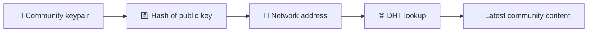
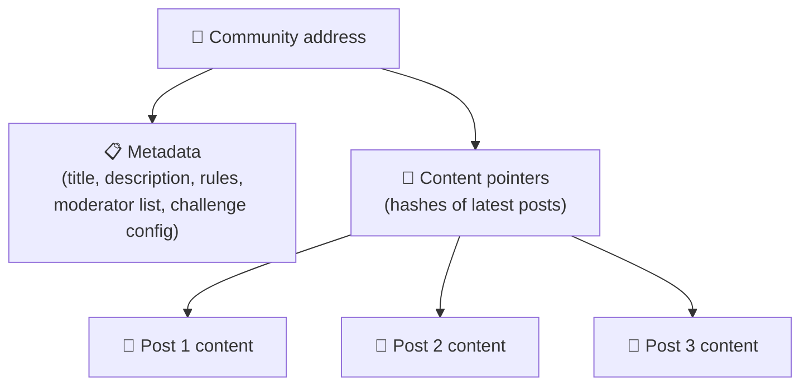
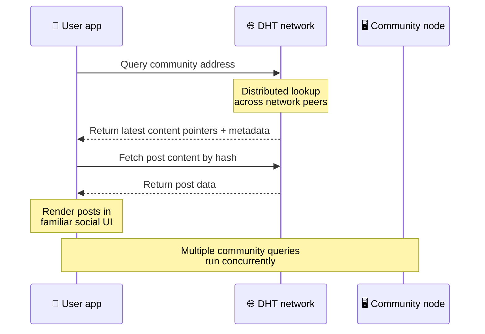
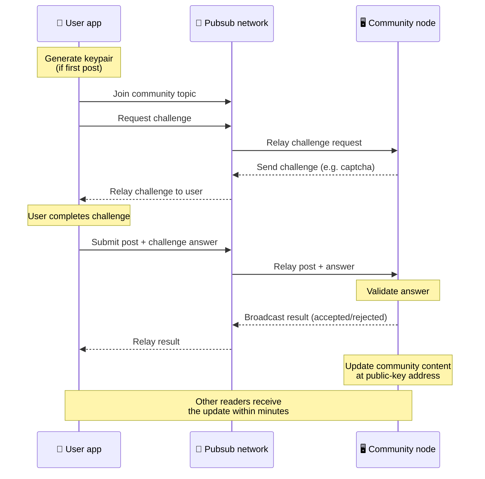
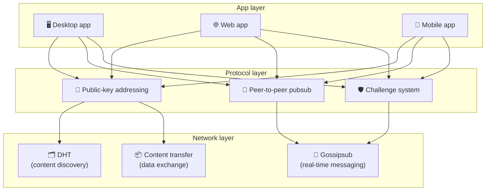

# پیر ٹو پیر پروٹوکول

بٹسوشل بلاکچین، فیڈریشن سرور، یا مرکزی پس منظر کا استعمال نہیں کرتا ہے۔ اس کے بجائے یہ دو آئیڈیاز کو یکجا کرتا ہے — **عوامی کلید پر مبنی ایڈریسنگ** اور **پیئر ٹو پیئر پبسب** — تاکہ کسی کو بھی صارفین کے ہارڈ ویئر سے کمیونٹی کی میزبانی کرنے دیا جائے جب کہ صارفین کمپنی کے زیر کنٹرول سروس پر اکاؤنٹس کے بغیر پڑھتے اور پوسٹ کرتے ہیں۔

کم تکنیکی واک تھرو کے لیے، پڑھیں [بٹسوشل پروٹوکول کی عام آدمی کی مکمل وضاحت](./layman-protocol-explanation.md).

## دو مسائل

ایک وکندریقرت سوشل نیٹ ورک کو دو سوالوں کے جواب دینے ہوتے ہیں:

1. **ڈیٹا** — آپ مرکزی ڈیٹا بیس کے بغیر دنیا کے سماجی مواد کو کیسے ذخیرہ اور پیش کرتے ہیں؟
2. **سپیم** — آپ نیٹ ورک کو استعمال کے لیے آزاد رکھتے ہوئے غلط استعمال کو کیسے روکتے ہیں؟

Bitsocial بلاک چین کو مکمل طور پر چھوڑ کر ڈیٹا کے مسئلے کو حل کرتا ہے: سوشل میڈیا کو عالمی لین دین کی ترتیب یا ہر پرانی پوسٹ کی مستقل دستیابی کی ضرورت نہیں ہے۔ یہ ہر کمیونٹی کو پیئر ٹو پیئر نیٹ ورک پر اپنا اینٹی سپیم چیلنج چلانے کی اجازت دے کر اسپام کا مسئلہ حل کرتا ہے۔

اس نیٹ ورک پرت کے اوپر دریافت کرنے والے ماڈل کے لیے، دیکھیں [مواد کی مدد](./content-discovery.md)۔

---

## عوامی کلید پر مبنی خطاب

BitTorrent میں، فائل کا ہیش اس کا ایڈریس بن جاتا ہے (_ مواد پر مبنی ایڈریسنگ_)۔ بٹسوشل عوامی کلیدوں کے ساتھ اسی طرح کا خیال استعمال کرتا ہے: کمیونٹی کی عوامی کلید کا ہیش اس کا نیٹ ورک ایڈریس بن جاتا ہے۔

نیٹ ورک پر کوئی بھی ہم مرتبہ اس ایڈریس کے لیے DHT (تقسیم شدہ ہیش ٹیبل) استفسار کر سکتا ہے اور کمیونٹی کی تازہ ترین حالت کو بازیافت کر سکتا ہے۔ ہر بار مواد کو اپ ڈیٹ کیا جاتا ہے، اس کے ورژن نمبر میں اضافہ ہوتا ہے. نیٹ ورک صرف تازہ ترین ورژن رکھتا ہے - ہر تاریخی حالت کو محفوظ رکھنے کی ضرورت نہیں ہے، یہی وجہ ہے کہ بلاکچین کے مقابلے میں اس نقطہ نظر کو ہلکا پھلکا بناتا ہے۔

### ایڈریس پر کیا ذخیرہ کیا جاتا ہے

کمیونٹی ایڈریس براہ راست مکمل پوسٹ مواد پر مشتمل نہیں ہے. اس کے بجائے یہ مواد کے شناخت کنندگان کی ایک فہرست ذخیرہ کرتا ہے — ہیشز جو اصل ڈیٹا کی طرف اشارہ کرتی ہیں۔ کلائنٹ پھر مواد کے ہر ٹکڑے کو DHT یا ٹریکر طرز کے تلاش کے ذریعے حاصل کرتا ہے۔

کم از کم ایک ہم مرتبہ کے پاس ہمیشہ ڈیٹا ہوتا ہے: کمیونٹی آپریٹر کا نوڈ۔ اگر کمیونٹی مقبول ہے، تو بہت سے دوسرے ساتھیوں کے پاس بھی یہ ہوگا اور بوجھ خود ہی تقسیم ہو جائے گا، اسی طرح مقبول ٹورینٹ ڈاؤن لوڈ کرنے میں تیز تر ہوتے ہیں۔

---

## پیئر ٹو پیئر پبسب

پبسب (پبلش-سبسکرائب) ایک پیغام رسانی کا نمونہ ہے جہاں ساتھی کسی موضوع کو سبسکرائب کرتے ہیں اور اس موضوع پر شائع ہونے والے ہر پیغام کو وصول کرتے ہیں۔ بٹسوشل ایک پیر ٹو پیئر پبسب نیٹ ورک کا استعمال کرتا ہے — کوئی بھی شائع کر سکتا ہے، کوئی بھی سبسکرائب کر سکتا ہے، اور کوئی مرکزی پیغام بروکر نہیں ہے۔

کمیونٹی میں پوسٹ شائع کرنے کے لیے، صارف ایک پیغام شائع کرتا ہے جس کا موضوع کمیونٹی کی عوامی کلید کے برابر ہوتا ہے۔ کمیونٹی آپریٹر کا نوڈ اسے اٹھاتا ہے، اس کی توثیق کرتا ہے، اور — اگر یہ اینٹی سپیم چیلنج پاس کرتا ہے — تو اسے اگلے مواد کی تازہ کاری میں شامل کرتا ہے۔

---

## اینٹی سپیم: پبسب پر چیلنجز

ایک کھلا پبسب نیٹ ورک سپیم کے سیلاب کا خطرہ ہے۔ بٹسوشل پبلشرز کو ان کے مواد کو قبول کرنے سے پہلے ایک **چیلنج** مکمل کرنے کی ضرورت کے ذریعے حل کرتا ہے۔

چیلنج کا نظام لچکدار ہے: ہر کمیونٹی آپریٹر اپنی پالیسی ترتیب دیتا ہے۔ اختیارات میں شامل ہیں:

| چیلنج کی قسم      | یہ کیسے کام کرتا ہے                              |
| ----------------- | ------------------------------------------------ |
| **کیپچا**         | ایپ میں پیش کردہ بصری یا انٹرایکٹو پہیلی         |
| **شرح محدود**     | محدود پوسٹس فی ٹائم ونڈو فی شناخت                |
| **ٹوکن گیٹ**      | مخصوص ٹوکن کے بیلنس کا ثبوت درکار ہے             |
| **ادائیگی**       | فی پوسٹ ایک چھوٹی سی ادائیگی کی ضرورت ہے         |
| **Allowlist**     | صرف پہلے سے منظور شدہ شناخت ہی پوسٹ کر سکتے ہیں۔ |
| **حسب ضرورت کوڈ** | کوڈ میں ظاہر ہونے والی کوئی بھی پالیسی           |

وہ ساتھی جو چیلنج کی بہت سی ناکام کوششوں کو ریلے کرتے ہیں وہ پبسب ٹاپک سے بلاک ہو جاتے ہیں، جو نیٹ ورک پرت پر سروس سے انکار کے حملوں کو روکتا ہے۔

---

## لائف سائیکل: کمیونٹی پڑھنا

ایسا اس وقت ہوتا ہے جب کوئی صارف ایپ کھولتا ہے اور کمیونٹی کی تازہ ترین پوسٹس دیکھتا ہے۔

** قدم بہ قدم:**

1. صارف ایپ کو کھولتا ہے اور ایک سماجی انٹرفیس دیکھتا ہے۔
2. کلائنٹ پیئر ٹو پیئر نیٹ ورک میں شامل ہوتا ہے اور ہر کمیونٹی کے صارف کے لیے DHT استفسار کرتا ہے۔
   پیروی کرتا ہے سوالات ہر ایک میں چند سیکنڈ لگتے ہیں لیکن ساتھ ساتھ چلتے ہیں۔
3. ہر سوال کمیونٹی کے تازہ ترین مواد پوائنٹرز اور میٹا ڈیٹا (عنوان، تفصیل،
   ماڈریٹر لسٹ، چیلنج کنفیگریشن)۔
4. کلائنٹ ان پوائنٹرز کا استعمال کرتے ہوئے اصل پوسٹ کا مواد حاصل کرتا ہے، پھر ہر چیز کو a میں پیش کرتا ہے۔
   واقف سماجی انٹرفیس.

---

## لائف سائیکل: ایک پوسٹ شائع کرنا

اشاعت میں پوسٹ کو قبول کرنے سے پہلے پبسب پر چیلنج جوابی مصافحہ شامل ہوتا ہے۔

** قدم بہ قدم:**

1. ایپ صارف کے لیے کلیدی جوڑا تیار کرتی ہے اگر ان کے پاس ابھی تک نہیں ہے۔
2. صارف کمیونٹی کے لیے ایک پوسٹ لکھتا ہے۔
3. کلائنٹ اس کمیونٹی کے لیے پبسب ٹاپک میں شامل ہو جاتا ہے (کمیونٹی کی پبلک کلید سے جڑا ہوا)۔
4. کلائنٹ پبسب پر چیلنج کی درخواست کرتا ہے۔
5. کمیونٹی آپریٹر کا نوڈ ایک چیلنج واپس بھیجتا ہے (مثال کے طور پر، کیپچا)۔
6. صارف چیلنج کو مکمل کرتا ہے۔
7. کلائنٹ pubsub پر چیلنج کے جواب کے ساتھ پوسٹ جمع کرتا ہے۔
8. کمیونٹی آپریٹر کا نوڈ جواب کی توثیق کرتا ہے۔ اگر درست ہو تو پوسٹ قبول کی جاتی ہے۔
9. نوڈ نتیجہ کو پبسب پر نشر کرتا ہے تاکہ نیٹ ورک کے ساتھی ریلے جاری رکھنا جانتے ہوں۔
   اس صارف کے پیغامات۔
10. نوڈ کمیونٹی کے مواد کو اس کے عوامی کلیدی ایڈریس پر اپ ڈیٹ کرتا ہے۔
11. چند منٹوں میں کمیونٹی کے ہر قاری کو اپ ڈیٹ موصول ہو جاتا ہے۔

---

## فن تعمیر کا جائزہ

پورے نظام میں تین پرتیں ہیں جو ایک ساتھ کام کرتی ہیں:

| پرت          | کردار                                                                                                                              |
| ------------ | ---------------------------------------------------------------------------------------------------------------------------------- |
| **ایپ**      | یوزر انٹرفیس۔ متعدد ایپس موجود ہو سکتی ہیں، ہر ایک اپنے ڈیزائن کے ساتھ، سبھی ایک جیسی کمیونٹیز اور شناختوں کا اشتراک کر رہی ہیں۔   |
| **پروٹوکول** | اس بات کی وضاحت کرتا ہے کہ کمیونٹیز کو کیسے ایڈریس کیا جاتا ہے، پوسٹس کیسے شائع کی جاتی ہیں، اور اسپام کو کیسے روکا جاتا ہے۔       |
| **نیٹ ورک**  | بنیادی پیئر ٹو پیئر انفراسٹرکچر: دریافت کے لیے ڈی ایچ ٹی، ریئل ٹائم میسجنگ کے لیے گپ شپ، اور ڈیٹا کے تبادلے کے لیے مواد کی منتقلی۔ |

---

## رازداری: IP پتوں سے مصنفین کا لنک ختم کرنا

جب کوئی صارف کوئی پوسٹ شائع کرتا ہے، تو مواد کو پبسب نیٹ ورک میں داخل ہونے سے پہلے **کمیونٹی آپریٹر کی عوامی کلید کے ساتھ انکرپٹ کیا جاتا ہے**۔ اس کا مطلب یہ ہے کہ جب نیٹ ورک کے مبصرین دیکھ سکتے ہیں کہ ایک ہم مرتبہ نے _something_ شائع کیا ہے، وہ اس بات کا تعین نہیں کر سکتے ہیں:

- مواد کیا کہتا ہے
- جس مصنف کی شناخت نے اسے شائع کیا۔

یہ اس سے ملتا جلتا ہے جس طرح BitTorrent یہ دریافت کرنا ممکن بناتا ہے کہ کون سے IPs ٹورینٹ کو بیجتے ہیں لیکن یہ نہیں کہ اسے اصل میں کس نے بنایا ہے۔ خفیہ کاری کی تہہ اس بیس لائن کے اوپر ایک اضافی رازداری کی ضمانت کا اضافہ کرتی ہے۔

---

## براؤزر پیئر ٹو پیئر

براؤزر P2P اب بٹسوشل کلائنٹس میں ممکن ہے۔ ایک براؤزر ایپ ایک [ہیلیا](https://helia.io/) نوڈ) چلا سکتی ہے، اسی بٹسوشل پروٹوکول کلائنٹ اسٹیک کو دوسری ایپس کی طرح استعمال کر سکتی ہے، اور اسے پیش کرنے کے لیے مرکزی آئی پی ایف ایس گیٹ وے سے پوچھنے کے بجائے ساتھیوں سے مواد حاصل کر سکتی ہے۔ براؤزر براہ راست پبسب میں بھی حصہ لے سکتا ہے، اس لیے پوسٹ کرنے کے لیے خوش پاتھ میں پلیٹ فارم کی ملکیت والے پبس فراہم کرنے کی ضرورت نہیں ہے۔

یہ ویب ڈسٹری بیوشن کے لیے اہم سنگ میل ہے: ایک عام HTTPS ویب سائٹ لائیو P2P سوشل کلائنٹ میں کھل سکتی ہے۔ صارفین کو نیٹ ورک سے پڑھنے سے پہلے ڈیسک ٹاپ ایپ کو انسٹال کرنے کی ضرورت نہیں ہے، اور ایپ آپریٹر کو مرکزی گیٹ وے چلانے کی ضرورت نہیں ہے جو ہر براؤزر صارف کے لیے سنسرشپ یا اعتدال پسندی کا چوکی بن جائے۔

براؤزر کے راستے میں ڈیسک ٹاپ یا سرور نوڈ سے مختلف حدود ہیں:

- براؤزر نوڈ عام طور پر عوامی انٹرنیٹ سے صوابدیدی ان باؤنڈ کنکشن کو قبول نہیں کر سکتا
- یہ ایپ کے کھلے ہونے کے دوران ڈیٹا کو لوڈ، تصدیق، کیش اور شائع کر سکتا ہے۔
- اسے کمیونٹی کے ڈیٹا کے لیے دیرپا میزبان کے طور پر نہیں سمجھا جانا چاہیے۔
- مکمل کمیونٹی ہوسٹنگ کو اب بھی ڈیسک ٹاپ ایپ، `bitsocial-cli`، یا کسی اور کے ذریعے ہینڈل کیا جاتا ہے۔
  ہمیشہ آن نوڈ

HTTP راؤٹرز اب بھی مواد کی دریافت کے لیے اہم ہیں: وہ کمیونٹی ہیش کے لیے فراہم کنندہ کے پتے واپس کرتے ہیں۔ وہ IPFS گیٹ وے نہیں ہیں، کیونکہ وہ خود مواد کی خدمت نہیں کرتے ہیں۔ دریافت کے بعد، براؤزر کلائنٹ ہم عمروں سے جڑتا ہے اور P2P اسٹیک کے ذریعے ڈیٹا حاصل کرتا ہے۔

5chan اسے عام 5chan.app ویب ایپ میں آپٹ ان ایڈوانسڈ سیٹنگز سوئچ کے طور پر ظاہر کرتا ہے۔ تازہ ترین `pkc-js` براؤزر اسٹیک عوامی جانچ کے لیے کافی مستحکم ہو گیا ہے upstream libp2p/gossipsub انٹراپ ورک ہیلیا اور کوبو ساتھیوں کے درمیان پیغام کی ترسیل کے بعد۔ یہ ترتیب براؤزر P2P کو کنٹرول رکھتی ہے جب کہ اسے زیادہ حقیقی دنیا کی جانچ ملتی ہے۔ ایک بار جب اس میں پیداوار کا کافی اعتماد ہو جائے تو یہ پہلے سے طے شدہ ویب پاتھ بن سکتا ہے۔

## گیٹ وے فال بیک

گیٹ وے کی حمایت یافتہ براؤزر تک رسائی اب بھی مطابقت اور رول آؤٹ فال بیک کے طور پر مفید ہے۔ ایک گیٹ وے P2P نیٹ ورک اور براؤزر کلائنٹ کے درمیان ڈیٹا کو ریلے کر سکتا ہے جب براؤزر براہ راست نیٹ ورک میں شامل نہیں ہو سکتا یا جب ایپ جان بوجھ کر پرانے راستے کا انتخاب کرتی ہے۔ یہ گیٹ ویز:

- کوئی بھی چلا سکتا ہے۔
- صارف کے اکاؤنٹس یا ادائیگیوں کی ضرورت نہیں ہے۔
- صارف کی شناختوں یا برادریوں کی تحویل حاصل نہ کریں۔
- ڈیٹا کو کھونے کے بغیر تبدیل کیا جا سکتا ہے

ٹارگٹ فن تعمیر پہلے براؤزر P2P ہے، جس میں گیٹ ویز پہلے سے طے شدہ رکاوٹ کے بجائے اختیاری فال بیک کے طور پر ہیں۔

---

## بلاکچین کیوں نہیں؟

بلاک چینز ڈبل خرچ کے مسئلے کو حل کرتی ہیں: کسی کو ایک ہی سکے کو دو بار خرچ کرنے سے روکنے کے لیے انہیں ہر لین دین کی درست ترتیب جاننے کی ضرورت ہوتی ہے۔

سوشل میڈیا کو دوگنا خرچ کرنے کا مسئلہ نہیں ہے۔ اس سے کوئی فرق نہیں پڑتا کہ پوسٹ A پوسٹ B سے ایک ملی سیکنڈ پہلے شائع ہوئی تھی، اور پرانی پوسٹس کو ہر نوڈ پر مستقل طور پر دستیاب ہونے کی ضرورت نہیں ہے۔

بلاکچین کو چھوڑ کر، بٹسوشل گریز کرتا ہے:

- **گیس فیس** — پوسٹنگ مفت ہے۔
- **تھرو پٹ کی حدیں** — کوئی بلاک سائز یا بلاک ٹائم رکاوٹ نہیں۔
- **سٹوریج بلوٹ** — نوڈس صرف وہی رکھتے ہیں جس کی انہیں ضرورت ہوتی ہے۔
- **اتفاقِ اوور ہیڈ** — کوئی کان کن، توثیق کرنے والے، یا اسٹیکنگ کی ضرورت نہیں ہے۔

تجارت یہ ہے کہ بٹسوشل پرانے مواد کی مستقل دستیابی کی ضمانت نہیں دیتا ہے۔ لیکن سوشل میڈیا کے لیے، یہ ایک قابل قبول تجارت ہے: کمیونٹی آپریٹر کا نوڈ ڈیٹا رکھتا ہے، مقبول مواد بہت سے ہم عصروں میں پھیل جاتا ہے، اور بہت پرانی پوسٹس قدرتی طور پر ختم ہو جاتی ہیں — جس طرح وہ ہر سوشل پلیٹ فارم پر کرتے ہیں۔

## وفاق کیوں نہیں؟

فیڈریٹڈ نیٹ ورکس (جیسے ای میل یا ایکٹیویٹی پب پر مبنی پلیٹ فارمز) سنٹرلائزیشن میں بہتری لاتے ہیں لیکن پھر بھی ساختی حدود ہیں:

- **سرور پر انحصار** — ہر کمیونٹی کو ڈومین، TLS اور جاری رکھنے والے سرور کی ضرورت ہوتی ہے۔
  دیکھ بھال
- **ایڈمن پر اعتماد** — سرور ایڈمن کا صارف کے اکاؤنٹس اور مواد پر مکمل کنٹرول ہے۔
- **فراگمنٹیشن** — سرورز کے درمیان منتقل ہونے کا مطلب اکثر پیروکاروں، تاریخ یا شناخت کو کھونا ہوتا ہے۔
- **لاگت** — کسی کو میزبانی کے لیے ادائیگی کرنی پڑتی ہے، جس سے استحکام کی طرف دباؤ پیدا ہوتا ہے۔

بٹسوشل کا ہم مرتبہ سے ہم مرتبہ نقطہ نظر سرور کو مساوات سے مکمل طور پر ہٹا دیتا ہے۔ ایک کمیونٹی نوڈ ایک لیپ ٹاپ، ایک Raspberry Pi، یا ایک سستے VPS پر چل سکتا ہے۔ آپریٹر اعتدال کی پالیسی کو کنٹرول کرتا ہے لیکن صارف کی شناخت کو ضبط نہیں کر سکتا، کیونکہ شناختیں کلیدی جوڑے کے ذریعے کنٹرول ہوتی ہیں، سرور کی طرف سے دی گئی نہیں۔

---

## خلاصہ

بٹسوشل کو دو بنیادی چیزوں پر بنایا گیا ہے: مواد کی دریافت کے لیے عوامی کلید پر مبنی ایڈریسنگ، اور ریئل ٹائم کمیونیکیشن کے لیے پیئر ٹو پیئر پبسب۔ وہ مل کر ایک سوشل نیٹ ورک تیار کرتے ہیں جہاں:

- کمیونٹیز کی شناخت کرپٹوگرافک کیز سے ہوتی ہے، ڈومین ناموں سے نہیں۔
- مواد ایک ٹورینٹ کی طرح ساتھیوں میں پھیلتا ہے، کسی ایک ڈیٹا بیس سے پیش نہیں کیا جاتا
- سپام مزاحمت ہر کمیونٹی کے لیے مقامی ہے، کسی پلیٹ فارم کے ذریعے مسلط نہیں کی گئی ہے۔
- صارفین اپنی شناخت کلیدی جوڑوں کے ذریعے رکھتے ہیں، نہ کہ قابل تنسیخ اکاؤنٹس کے ذریعے
- پورا نظام سرورز، بلاکچینز، یا پلیٹ فارم فیس کے بغیر چلتا ہے۔
