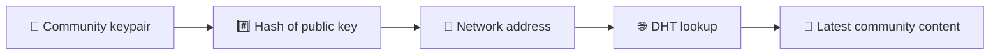
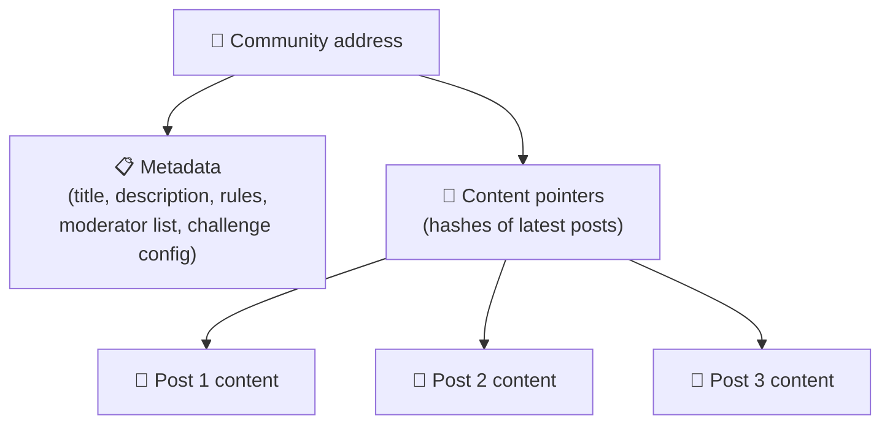
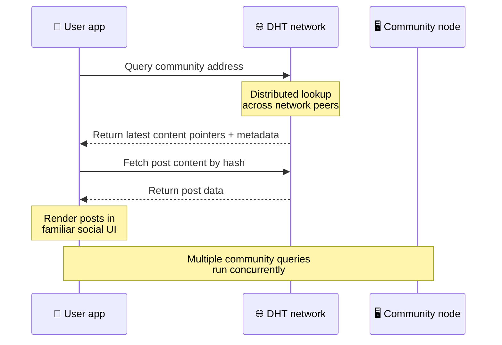
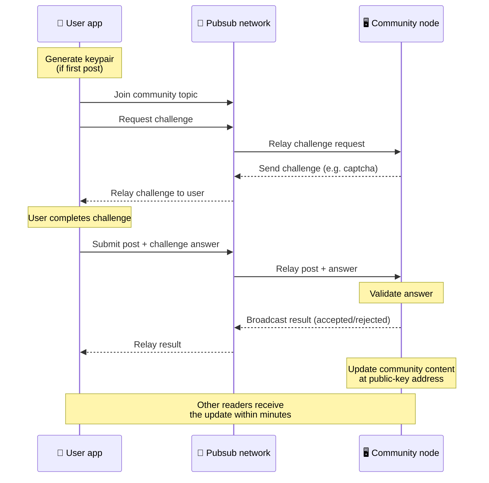
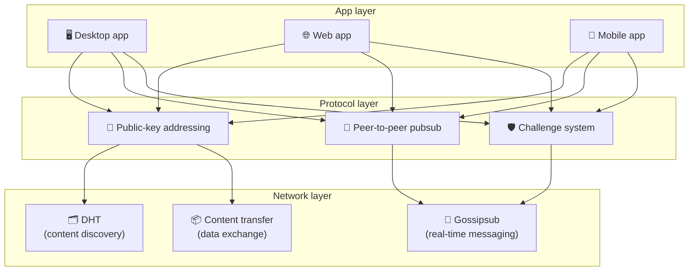

# Giao thức ngang hàng

Bitsocial không sử dụng blockchain, máy chủ liên kết hoặc chương trình phụ trợ tập trung. Thay vào đó, nó kết hợp hai ý tưởng — **địa chỉ dựa trên khóa công khai** và **pubsub ngang hàng** — để cho phép mọi người lưu trữ một cộng đồng từ phần cứng tiêu dùng trong khi người dùng đọc và đăng bài mà không cần tài khoản trên bất kỳ dịch vụ nào do công ty kiểm soát.

Để có hướng dẫn ít kỹ thuật hơn, hãy đọc [Giải thích đầy đủ về giao thức Bitsocial](./layman-protocol-explanation.md).

## Hai vấn đề

Một mạng xã hội phi tập trung phải trả lời hai câu hỏi:

1. **Dữ liệu** — làm cách nào bạn lưu trữ và phân phối nội dung xã hội của thế giới mà không có cơ sở dữ liệu trung tâm?
2. **Spam** — làm cách nào để ngăn chặn hành vi lạm dụng trong khi vẫn đảm bảo mạng được sử dụng miễn phí?

Bitsocial giải quyết vấn đề dữ liệu bằng cách bỏ qua hoàn toàn blockchain: phương tiện truyền thông xã hội không cần đặt hàng giao dịch toàn cầu hoặc tính khả dụng vĩnh viễn của mỗi bài đăng cũ. Nó giải quyết vấn đề thư rác bằng cách cho phép mỗi cộng đồng thực hiện thử thách chống thư rác riêng trên mạng ngang hàng.

Để biết mô hình khám phá phía trên lớp mạng này, hãy xem [Khám phá nội dung](./content-discovery.md).

---

## Địa chỉ dựa trên khóa công khai

Trong BitTorrent, hàm băm của tệp sẽ trở thành địa chỉ của tệp đó (_địa chỉ dựa trên nội dung_). Bitsocial sử dụng ý tưởng tương tự với khóa chung: hàm băm của khóa chung của cộng đồng sẽ trở thành địa chỉ mạng của cộng đồng đó.

Bất kỳ thiết bị ngang hàng nào trên mạng đều có thể thực hiện truy vấn DHT (bảng băm phân tán) cho địa chỉ đó và truy xuất trạng thái mới nhất của cộng đồng. Mỗi lần nội dung được cập nhật, số phiên bản của nó sẽ tăng lên. Mạng chỉ giữ phiên bản mới nhất - không cần phải lưu giữ mọi trạng thái lịch sử, đó là điều làm cho phương pháp này nhẹ hơn so với blockchain.

### Những gì được lưu trữ tại địa chỉ

Địa chỉ cộng đồng không chứa nội dung bài đăng đầy đủ trực tiếp. Thay vào đó, nó lưu trữ một danh sách các mã định danh nội dung - các hàm băm trỏ đến dữ liệu thực tế. Sau đó, khách hàng sẽ tìm nạp từng phần nội dung thông qua DHT hoặc tra cứu theo kiểu theo dõi.

Ít nhất một thiết bị ngang hàng luôn có dữ liệu: nút của nhà điều hành cộng đồng. Nếu cộng đồng phổ biến thì nhiều đồng nghiệp khác cũng sẽ có cộng đồng đó và tải sẽ tự phân phối, giống như cách tải xuống các torrent phổ biến sẽ nhanh hơn.

---

## Pubsub ngang hàng

Pubsub (xuất bản-đăng ký) là một mẫu nhắn tin trong đó các đồng nghiệp đăng ký một chủ đề và nhận mọi tin nhắn được xuất bản về chủ đề đó. Bitsocial sử dụng mạng pubsub ngang hàng - bất kỳ ai cũng có thể xuất bản, bất kỳ ai cũng có thể đăng ký và không có nhà môi giới tin nhắn trung tâm.

Để xuất bản một bài đăng lên cộng đồng, người dùng xuất bản một tin nhắn có chủ đề bằng khóa chung của cộng đồng. Nút của nhà điều hành cộng đồng sẽ chọn nó, xác thực nó và — nếu nó vượt qua thử thách chống thư rác — sẽ đưa nó vào bản cập nhật nội dung tiếp theo.

---

## Chống thư rác: thách thức đối với pubsub

Mạng pubsub mở dễ bị tấn công bởi lũ thư rác. Bitsocial giải quyết vấn đề này bằng cách yêu cầu nhà xuất bản hoàn thành **thử thách** trước khi nội dung của họ được chấp nhận.

Hệ thống thử thách rất linh hoạt: mỗi nhà điều hành cộng đồng định cấu hình chính sách của riêng họ. Các tùy chọn bao gồm:

| Loại thử thách         | Nó hoạt động như thế nào                                      |
| ---------------------- | ------------------------------------------------------------- |
| **Hình ảnh xác thực**  | Câu đố trực quan hoặc tương tác được trình bày trong ứng dụng |
| **Giới hạn tỷ lệ**     | Giới hạn bài đăng trên mỗi khoảng thời gian cho mỗi danh tính |
| **Cổng mã thông báo**  | Yêu cầu bằng chứng về số dư của một mã thông báo cụ thể       |
| **Thanh toán**         | Yêu cầu một khoản thanh toán nhỏ cho mỗi bài viết             |
| **Danh sách cho phép** | Chỉ những danh tính được phê duyệt trước mới có thể đăng      |
| **Mã tùy chỉnh**       | Bất kỳ chính sách nào có thể thể hiện bằng mã                 |

Các thiết bị ngang hàng chuyển tiếp quá nhiều lần thử thách không thành công sẽ bị chặn khỏi chủ đề pubsub, điều này ngăn chặn các cuộc tấn công từ chối dịch vụ trên lớp mạng.

---

## Vòng đời: đọc cộng đồng

Đây là điều xảy ra khi người dùng mở ứng dụng và xem các bài đăng mới nhất của cộng đồng.

**Từng bước:**

1. Người dùng mở ứng dụng và nhìn thấy giao diện xã hội.
2. Máy khách tham gia mạng ngang hàng và thực hiện truy vấn DHT cho từng cộng đồng mà người dùng
   theo sau. Mỗi truy vấn mất vài giây nhưng chạy đồng thời.
3. Mỗi truy vấn trả về con trỏ nội dung và siêu dữ liệu mới nhất của cộng đồng (tiêu đề, mô tả,
   danh sách người điều hành, cấu hình thử thách).
4. Máy khách tìm nạp nội dung bài đăng thực tế bằng cách sử dụng các con trỏ đó, sau đó hiển thị mọi thứ trong một
   giao diện xã hội quen thuộc.

---

## Vòng đời: xuất bản một bài viết

Việc xuất bản bao gồm một cái bắt tay phản hồi-thách thức qua pubsub trước khi bài đăng được chấp nhận.

**Từng bước:**

1. Ứng dụng sẽ tạo một cặp khóa cho người dùng nếu họ chưa có.
2. Người dùng viết một bài đăng cho một cộng đồng.
3. Khách hàng tham gia chủ đề pubsub cho cộng đồng đó (được khóa bằng khóa chung của cộng đồng).
4. Khách hàng yêu cầu một thử thách qua pubsub.
5. Nút của nhà điều hành cộng đồng sẽ gửi lại một thử thách (ví dụ: hình ảnh xác thực).
6. Người dùng hoàn thành thử thách.
7. Khách hàng gửi bài đăng cùng với câu trả lời thử thách qua pubsub.
8. Nút của nhà điều hành cộng đồng xác nhận câu trả lời. Nếu đúng thì bài viết được chấp nhận.
9. Nút phát kết quả qua pubsub để các mạng ngang hàng biết tiếp tục chuyển tiếp
   tin nhắn từ người dùng này.
10. Nút cập nhật nội dung của cộng đồng tại địa chỉ khóa công khai của nó.
11. Trong vòng vài phút, mọi độc giả trong cộng đồng đều nhận được bản cập nhật.

---

## Tổng quan về kiến ​​trúc

Toàn bộ hệ thống có ba lớp hoạt động cùng nhau:

| Lớp           | Vai trò                                                                                                                           |
| ------------- | --------------------------------------------------------------------------------------------------------------------------------- |
| **Ứng dụng**  | Giao diện người dùng. Nhiều ứng dụng có thể tồn tại, mỗi ứng dụng có thiết kế riêng, tất cả đều có chung cộng đồng và danh tính.  |
| **Giao thức** | Xác định cách giải quyết các cộng đồng, cách xuất bản bài đăng và cách ngăn chặn thư rác.                                         |
| **Mạng**      | Cơ sở hạ tầng ngang hàng cơ bản: DHT để khám phá, tin đồn để nhắn tin theo thời gian thực và truyền nội dung để trao đổi dữ liệu. |

---

## Quyền riêng tư: hủy liên kết tác giả khỏi địa chỉ IP

Khi người dùng xuất bản một bài đăng, nội dung sẽ được **mã hóa bằng khóa chung của nhà điều hành cộng đồng** trước khi nó vào mạng pubsub. Điều này có nghĩa là mặc dù người quan sát mạng có thể thấy rằng một mạng ngang hàng đã xuất bản _thứ gì đó_, nhưng họ không thể xác định:

- nội dung nói gì
- danh tính tác giả nào đã xuất bản nó

Điều này tương tự như cách BitTorrent giúp bạn có thể khám phá IP nào tạo torrent chứ không phải ai là người tạo ra nó. Lớp mã hóa bổ sung thêm một đảm bảo quyền riêng tư bổ sung trên đường cơ sở đó.

---

## Trình duyệt ngang hàng

Trình duyệt P2P hiện có sẵn trong ứng dụng khách Bitsocial. Một ứng dụng trình duyệt có thể chạy [nút Helia](https://helia.io/), sử dụng cùng ngăn xếp ứng dụng khách giao thức Bitsocial như các ứng dụng khác và tìm nạp nội dung từ các ứng dụng ngang hàng thay vì yêu cầu cổng IPFS tập trung phân phát nội dung đó. Trình duyệt cũng có thể tham gia trực tiếp vào pubsub, vì vậy việc đăng bài không cần nhà cung cấp pubsub thuộc sở hữu nền tảng trong đường dẫn vui vẻ.

Đây là cột mốc quan trọng cho việc phân phối web: một trang web HTTPS bình thường có thể mở ra một ứng dụng xã hội P2P trực tiếp. Người dùng không cần cài đặt ứng dụng dành cho máy tính để bàn trước khi có thể đọc từ mạng và nhà điều hành ứng dụng không cần chạy một cổng trung tâm trở thành điểm kiểm duyệt hoặc kiểm duyệt cho mọi người dùng trình duyệt.

Đường dẫn trình duyệt có các giới hạn khác với nút máy tính để bàn hoặc máy chủ:

- một nút trình duyệt thường không thể chấp nhận các kết nối gửi đến tùy ý từ internet công cộng
- nó có thể tải, xác thực, lưu vào bộ nhớ đệm và xuất bản dữ liệu khi ứng dụng đang mở
- nó không nên được coi là nơi lưu trữ lâu dài cho dữ liệu của cộng đồng
- lưu trữ cộng đồng đầy đủ vẫn được xử lý tốt nhất bởi ứng dụng dành cho máy tính để bàn, `bitsocial-cli` hoặc ứng dụng khác
  nút luôn bật

Bộ định tuyến HTTP vẫn đóng vai trò quan trọng đối với việc khám phá nội dung: chúng trả về địa chỉ của nhà cung cấp cho hàm băm cộng đồng. Chúng không phải là cổng IPFS vì chúng không phục vụ nội dung. Sau khi khám phá, trình duyệt khách sẽ kết nối với các máy ngang hàng và tìm nạp dữ liệu thông qua ngăn xếp P2P.

5chan hiển thị điều này dưới dạng công tắc Cài đặt nâng cao chọn tham gia trong ứng dụng web 5chan.app thông thường. Ngăn xếp trình duyệt `pkc-js` mới nhất đã trở nên đủ ổn định để thử nghiệm công khai sau khi hoạt động tương tác libp2p/gossipsub ngược dòng xử lý việc gửi tin nhắn giữa các đồng nghiệp Helia và Kubo. Cài đặt này giữ cho trình duyệt P2P được kiểm soát trong khi nó được thử nghiệm trong thế giới thực nhiều hơn; một khi nó có đủ độ tin cậy trong sản xuất, nó có thể trở thành đường dẫn web mặc định.

## Dự phòng cổng

Quyền truy cập trình duyệt được hỗ trợ bằng cổng vẫn hữu ích như một phương án dự phòng về khả năng tương thích và triển khai. Cổng có thể chuyển tiếp dữ liệu giữa mạng P2P và ứng dụng khách trình duyệt khi trình duyệt không thể tham gia trực tiếp vào mạng hoặc khi ứng dụng cố tình chọn đường dẫn cũ hơn. Những cổng này:

- có thể được điều hành bởi bất cứ ai
- không yêu cầu tài khoản người dùng hoặc thanh toán
- không giành được quyền giám hộ đối với danh tính hoặc cộng đồng người dùng
- có thể hoán đổi mà không mất dữ liệu

Kiến trúc mục tiêu trước tiên là trình duyệt P2P, với các cổng là một dự phòng tùy chọn thay vì nút thắt cổ chai mặc định.

---

## Tại sao không phải là blockchain?

Blockchain giải quyết vấn đề chi tiêu gấp đôi: họ cần biết chính xác thứ tự của mọi giao dịch để ngăn ai đó chi tiêu cùng một đồng xu hai lần.

Phương tiện truyền thông xã hội không có vấn đề chi tiêu gấp đôi. Sẽ không có vấn đề gì nếu bài đăng A được xuất bản một phần nghìn giây trước bài đăng B và các bài đăng cũ không cần phải có sẵn vĩnh viễn trên mỗi nút.

Bằng cách bỏ qua blockchain, Bitsocial tránh được:

- **phí gas** — đăng bài miễn phí
- **giới hạn thông lượng** — không có kích thước khối hoặc tắc nghẽn thời gian khối
- **sung dung lượng lưu trữ** — các nút chỉ giữ những gì chúng cần
- **chi phí đồng thuận** — không cần người khai thác, người xác nhận hoặc đặt cược

Sự đánh đổi là Bitsocial không đảm bảo tính sẵn có vĩnh viễn của nội dung cũ. Nhưng đối với mạng xã hội, đó là một sự cân bằng có thể chấp nhận được: nút của nhà điều hành cộng đồng giữ dữ liệu, nội dung phổ biến lan truyền trên nhiều mạng ngang hàng và các bài đăng rất cũ tự nhiên mờ đi - giống như cách chúng làm trên mọi nền tảng xã hội.

## Tại sao không liên đoàn?

Các mạng liên kết (như email hoặc nền tảng dựa trên ActPub) cải thiện khả năng tập trung hóa nhưng vẫn có những hạn chế về cấu trúc:

- **Phụ thuộc máy chủ** — mỗi cộng đồng cần một máy chủ có miền, TLS và hoạt động liên tục
  BẢO TRÌ
- **Sự tin cậy của quản trị viên** — quản trị viên máy chủ có toàn quyền kiểm soát tài khoản và nội dung người dùng
- **Phân mảnh** — di chuyển giữa các máy chủ thường đồng nghĩa với việc mất người theo dõi, lịch sử hoặc danh tính
- **Chi phí** — ai đó phải trả tiền cho việc lưu trữ, điều này tạo ra áp lực cho việc hợp nhất

Cách tiếp cận ngang hàng của Bitsocial loại bỏ hoàn toàn máy chủ khỏi phương trình. Nút cộng đồng có thể chạy trên máy tính xách tay, Raspberry Pi hoặc VPS giá rẻ. Nhà điều hành kiểm soát chính sách kiểm duyệt nhưng không thể nắm bắt danh tính người dùng vì danh tính được kiểm soát bởi cặp khóa chứ không phải do máy chủ cấp.

---

## Bản tóm tắt

Bitsocial được xây dựng trên hai nguyên tắc cơ bản: đánh địa chỉ dựa trên khóa công khai để khám phá nội dung và pubsub ngang hàng để liên lạc theo thời gian thực. Họ cùng nhau tạo ra một mạng xã hội nơi:

- cộng đồng được xác định bằng khóa mật mã, không phải tên miền
- nội dung lan truyền khắp các thiết bị ngang hàng như một torrent, không được cung cấp từ một cơ sở dữ liệu duy nhất
- Khả năng chống thư rác là cục bộ của mỗi cộng đồng, không bị áp đặt bởi một nền tảng
- người dùng sở hữu danh tính của họ thông qua cặp khóa chứ không phải thông qua tài khoản có thể thu hồi
- toàn bộ hệ thống chạy mà không cần máy chủ, chuỗi khối hoặc phí nền tảng
