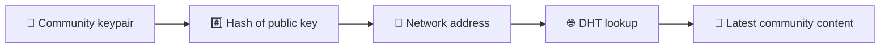
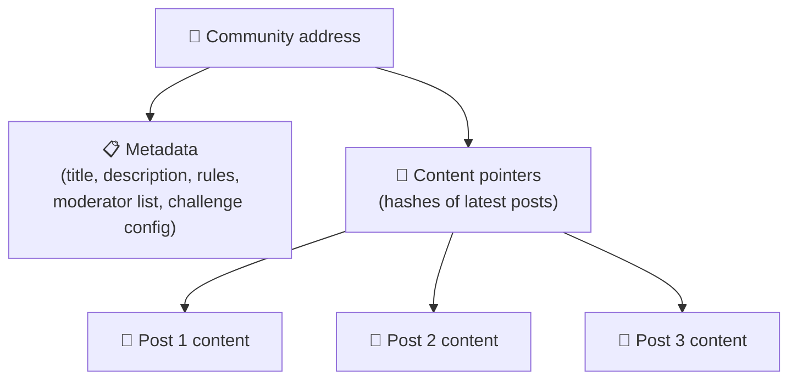
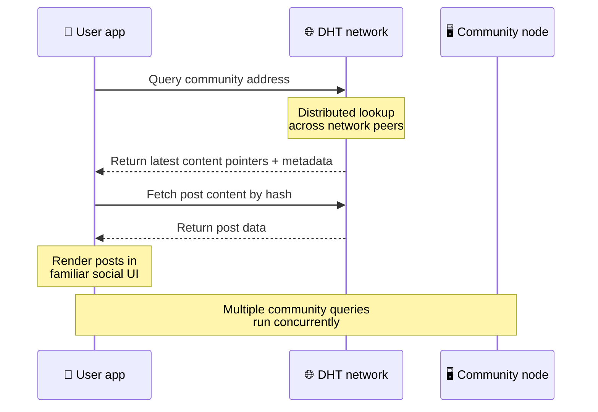
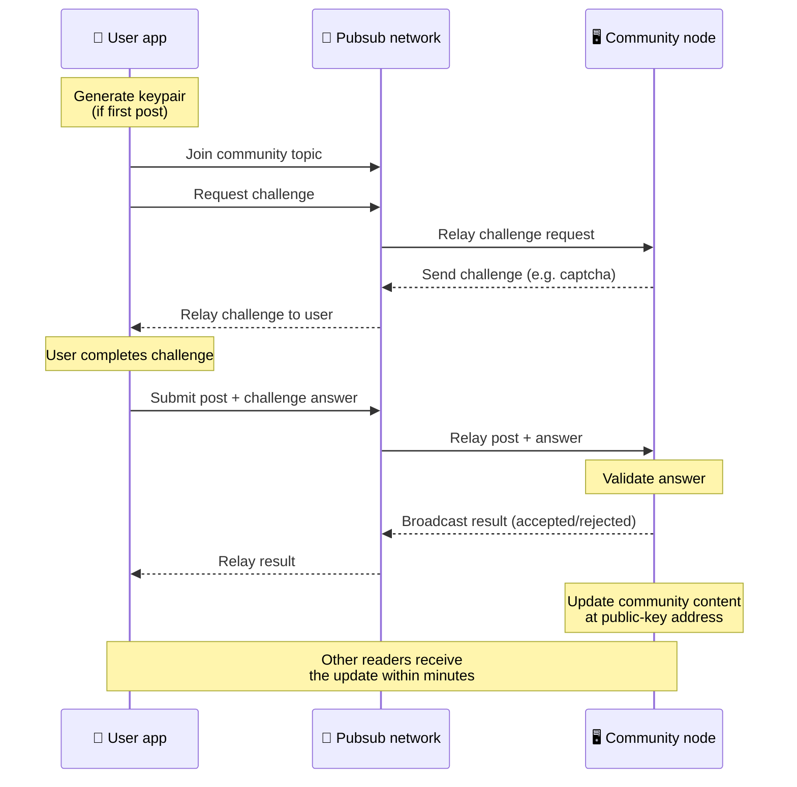
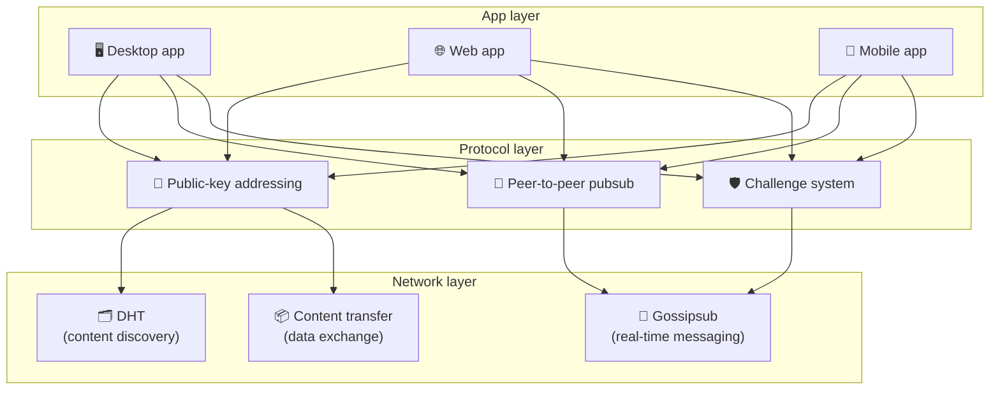

# 点对点协议

Bitsocial 不使用区块链、联合服务器或集中式后端。相反，它结合了两种想法——**基于公钥的寻址**和**点对点发布订阅**——让任何人都可以通过消费者硬件托管社区，而用户无需在任何公司控制的服务上进行帐户阅读和发帖。

对于技术含量较低的演练，请阅读 [Bitsocial 协议的完整外行解释](./layman-protocol-explanation.md).

## 两个问题

去中心化的社交网络必须回答两个问题：

1. **数据** — 在没有中央数据库的情况下，如何存储和提供全球社交内容？
2. **垃圾邮件** — 如何防止滥用，同时保持网络免费使用？

Bitsocial 通过完全跳过区块链来解决数据问题：社交媒体不需要全局交易排序或每个旧帖子的永久可用性。它通过让每个社区在对等网络上运行自己的反垃圾邮件挑战来解决垃圾邮件问题。

有关此网络层之上的发现模型，请参阅[内容发现](./content-discovery.md)。

---

## 基于公钥的寻址

在 BitTorrent 中，文件的哈希值成为其地址（_基于内容的寻址_）。 Bitsocial 对公钥使用类似的想法：社区公钥的哈希值成为其网络地址。

网络上的任何对等点都可以对该地址执行 DHT（分布式哈希表）查询并检索社区的最新状态。每次内容更新时，其版本号都会增加。网络仅保留最新版本 - 无需保留每个历史状态，这使得这种方法与区块链相比变得轻量级。

### 该地址存储了什么

社区地址不直接包含完整的帖子内容。相反，它存储内容标识符列表 - 指向实际数据的哈希值。然后，客户端通过 DHT 或跟踪器式查找来获取每段内容。

至少有一个对等点始终拥有数据：社区运营商的节点。如果社区很受欢迎，许多其他同行也会拥有它，并且负载会自行分配，就像流行的种子下载速度更快一样。

---

## 点对点发布/订阅

Pubsub（发布-订阅）是一种消息传递模式，其中对等点订阅某个主题并接收发布到该主题的每条消息。 Bitsocial 使用点对点的 pubsub 网络——任何人都可以发布，任何人都可以订阅，并且没有中央消息代理。

要向社区发布帖子，用户需要发布主题等于社区公钥的消息。社区运营商的节点接收它，验证它，如果它通过了反垃圾邮件挑战，则将其包含在下一个内容更新中。

---

## 反垃圾邮件：对 pubsub 的挑战

开放的 pubsub 网络很容易受到垃圾邮件泛滥的影响。 Bitsocial 通过要求出版商在其内容被接受之前完成**挑战**来解决这个问题。

挑战系统灵活：每个社区运营者配置自己的策略。选项包括：

| 挑战类型       | 它是如何运作的                   |
| -------------- | -------------------------------- |
| **验证码**     | 应用程序中呈现的视觉或交互式谜题 |
| **速率限制**   | 限制每个身份每个时间窗口的帖子   |
| **令牌门**     | 需要特定代币的余额证明           |
| **付款**       | 每个帖子需要支付少量费用         |
| **白名单**     | 只有预先批准的身份才能发帖       |
| **自定义代码** | 任何可以用代码表达的策略         |

中继过多失败挑战尝试的节点会被 pubsub 主题阻止，从而防止网络层上的拒绝服务攻击。

---

## 生命周期：阅读社区

这是当用户打开应用程序并查看社区的最新帖子时发生的情况。

**步步：**

1. 用户打开应用程序并看到社交界面。
2. 客户端加入点对点网络并对用户的每个社区进行DHT查询
   接下来。每个查询需要几秒钟的时间，但同时运行。
3. 每个查询都会返回社区的最新内容指针和元数据（标题、描述、
   主持人列表、挑战配置）。
4. 客户端使用这些指针获取实际的帖子内容，然后将所有内容呈现在
   熟悉的社交界面。

---

## 生命周期：发布帖子

发布涉及在帖子被接受之前通过 pubsub 进行质询-响应握手。

**步步：**

1. 如果用户还没有密钥对，应用程序会为用户生成密钥对。
2. 用户为社区撰写帖子。
3. 客户端加入该社区的 pubsub 主题（以社区的公钥为密钥）。
4. 客户端请求对 pubsub 提出质疑。
5. 社区运营商的节点发回质询（例如验证码）。
6. 用户完成挑战。
7. 客户端通过 pubsub 提交帖子以及挑战答案。
8. 社区运营者的节点验证答案。如果正确，该帖子将被接受。
9. 节点通过 pubsub 广播结果，以便网络对等方知道继续中继
   来自该用户的消息。
10. 节点在其公钥地址更新社区的内容。
11. 几分钟之内，社区的每个读者都会收到更新。

---

## 架构概览

完整的系统具有三个协同工作的层：

| 层           | 角色                                                                                            |
| ------------ | ----------------------------------------------------------------------------------------------- |
| **应用程序** | 用户界面。可以存在多个应用程序，每个应用程序都有自己的设计，并且共享相同的社区和身份。          |
| **协议**     | 定义如何处理社区、如何发布帖子以及如何防止垃圾邮件。                                            |
| **网络**     | 底层的点对点基础设施：用于发现的 DHT、用于实时消息传递的 gossipsub 以及用于数据交换的内容传输。 |

---

## 隐私：取消作者与 IP 地址的链接

当用户发布帖子时，内容在进入 pubsub 网络之前会**使用社区运营商的公钥进行加密**。这意味着虽然网络观察者可以看到对等方发布了*某些内容*，但他们无法确定：

- 内容说了什么
- 哪个作者身份发表的

这类似于 BitTorrent 如何发现哪些 IP 播种了 torrent，但不知道是谁最初创建了它。加密层在此基线之上添加了额外的隐私保证。

---

## 浏览器点对点

Bitsocial 客户端现在可以使用浏览器 P2P。浏览器应用程序可以运行 [海利亚](https://helia.io/) 节点，使用与其他应用程序相同的 Bitsocial 协议客户端堆栈，并从对等点获取内容，而不是要求集中式 IPFS 网关为其提供服务。浏览器还可以直接参与 pubsub，因此在快乐路径中发布不需要平台拥有的 pubsub 提供商。

这是网络分发的重要里程碑：普通的 HTTPS 网站可以打开实时 P2P 社交客户端。用户无需安装桌面应用程序即可从网络读取数据，应用程序运营商也无需运行成为每个浏览器用户的审查或审核瓶颈的中央网关。

浏览器路径与桌面或服务器节点有不同的限制：

- 浏览器节点通常无法接受来自公共互联网的任意入站连接
- 它可以在应用程序打开时加载、验证、缓存和发布数据
- 它不应该被视为社区数据的长期主机
- 完整的社区托管仍然最好由桌面应用程序、`bitsocial-cli` 或其他应用程序处理
  永远在线的节点

HTTP 路由器对于内容发现仍然很重要：它们返回社区哈希的提供者地址。它们不是 IPFS 网关，因为它们本身不提供内容服务。发现后，浏览器客户端连接到对等点并通过 P2P 堆栈获取数据。

5chan 将其公开为普通 5chan.app Web 应用程序中的可选高级设置开关。在上游 libp2p/gossipsub 互操作工作解决了 Helia 和 Kubo 对等点之间的消息传递之后，最新的 `pkc-js` 浏览器堆栈已经变得足够稳定，可以进行公共测试。该设置保持浏览器 P2P 控制，同时获得更多真实世界的测试；一旦有足够的生产信心，它就可以成为默认的网络路径。

## 网关回退

支持网关的浏览器访问作为兼容性和部署后备措施仍然很有用。当浏览器无法直接加入网络或应用程序故意选择旧路径时，网关可以在 P2P 网络和浏览器客户端之间中继数据。这些网关：

- 任何人都可以运行
- 不需要用户帐户或付款
- 不获得对用户身份或社区的监护权
- 可以更换而不丢失数据

目标架构首先是浏览器 P2P，网关作为可选的后备方案，而不是默认的瓶颈。

---

## 为什么不是区块链呢？

区块链解决了双重支出问题：它们需要知道每笔交易的确切顺序，以防止有人两次使用同一个硬币。

社交媒体不存在双重支出问题。帖子 A 是否比帖子 B 早一毫秒发布并不重要，并且旧帖子不需要在每个节点上永久可用。

通过跳过区块链，Bitsocial 避免了：

- **汽油费** — 发帖免费
- **吞吐量限制** — 无区块大小或区块时间瓶颈
- **存储膨胀**——节点只保留它们需要的内容
- **共识开销** — 无需矿工、验证者或质押

代价是 Bitsocial 不保证旧内容的永久可用性。但对于社交媒体来说，这是一个可以接受的权衡：社区运营商的节点保存数据，流行的内容在许多同行中传播，非常旧的帖子自然会消失——就像他们在每个社交平台上所​​做的那样。

## 为什么不联合呢？

联合网络（如电子邮件或基于 ActivityPub 的平台）改进了集中化，但仍然存在结构性限制：

- **服务器依赖性** — 每个社区都需要一个具有域、TLS 和持续运行的服务器
  维护
- **管理员信任** — 服务器管理员可以完全控制用户帐户和内容
- **碎片化** - 在服务器之间移动通常意味着失去关注者、历史记录或身份
- **成本**——有人必须支付托管费用，这给整合带来了压力

Bitsocial 的点对点方法完全将服务器从等式中删除。社区节点可以在笔记本电脑、Raspberry Pi 或廉价的 VPS 上运行。运营商控制审核策略，但无法获取用户身份，因为身份是密钥对控制的，而不是服务器授予的。

---

## 概括

Bitsocial 建立在两个基元之上：用于内容发现的基于公钥的寻址，以及用于实时通信的点对点 pubsub。他们共同创建了一个社交网络，其中：

- 社区是通过加密密钥而不是域名来标识的
- 内容像洪流一样在同行之间传播，而不是从单个数据库提供
- 垃圾邮件抵制是每个社区本地的，而不是由平台强加的
- 用户通过密钥对而不是通过可撤销帐户拥有自己的身份
- 整个系统运行无需服务器、区块链或平台费用
