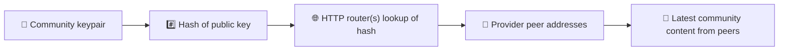
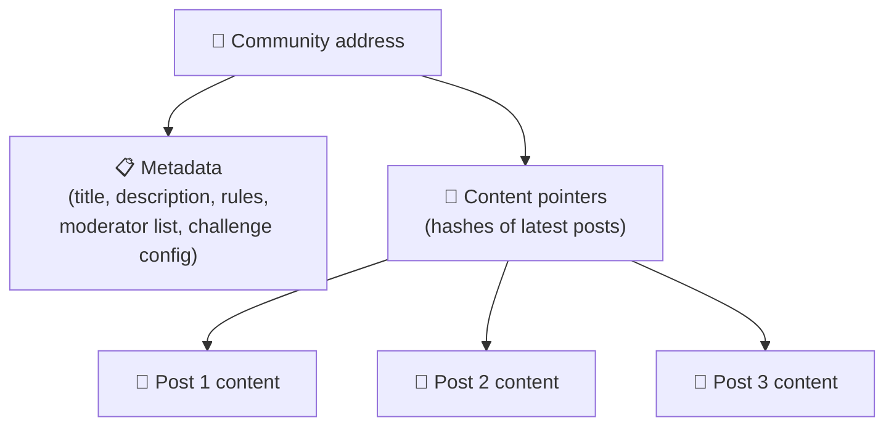
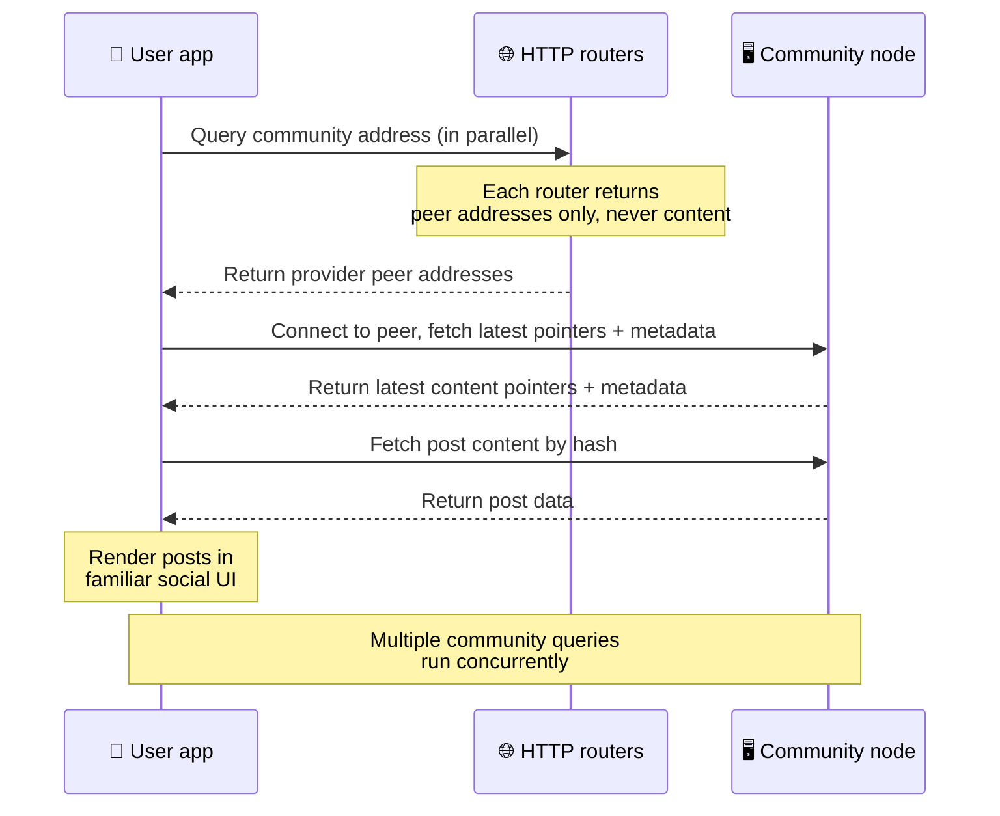
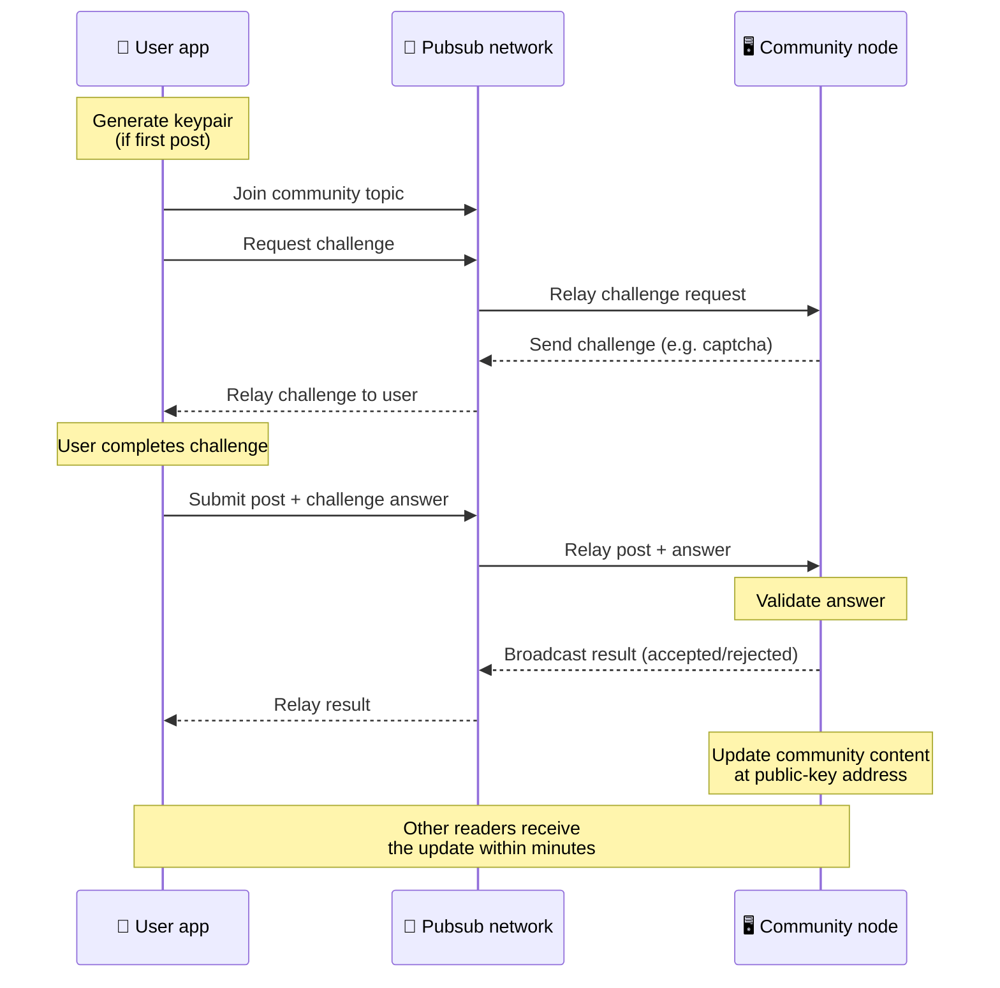
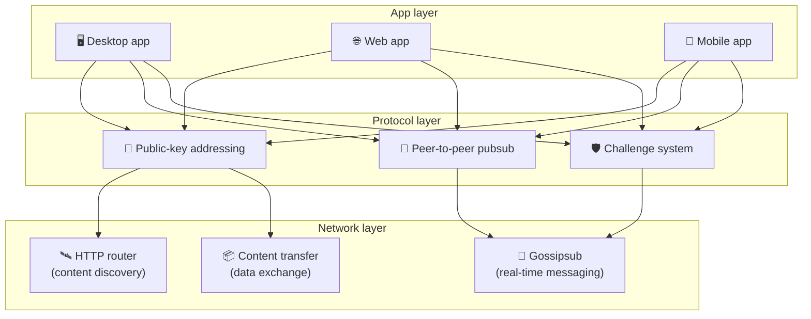

# Peer-to-Peer Protocol

Bitsocial does not use a blockchain, a federation server, or a centralized backend. Instead it
uses the IPFS/libp2p stack to combine two ideas: **public-key-based addressing** and
**peer-to-peer pubsub**. Together they let anyone host a community from consumer hardware while
users read and post without accounts on any company-controlled service.

For a less technical walkthrough, read
[A complete layman explanation of the Bitsocial protocol](./layman-protocol-explanation.md).

## Does Bitsocial use IPFS?

Yes. Bitsocial nodes use IPFS/libp2p primitives for the peer-to-peer layer: public-key-addressed
community records, content transfer between peers, and gossipsub pubsub for real-time messages.
When these docs say "pubsub," they mean IPFS/libp2p pubsub, not a separate centralized message
broker.

The protocol currently describes discovery through HTTP routers because Bitsocial clients query
router endpoints for provider peer addresses instead of relying on a browser-hostile DHT for every
lookup. Routers only return peers; content transfer and pubsub traffic still move through the
peer-to-peer network.

## The two problems

A decentralized social network has to answer two questions:

1. **Data** — how do you store and serve the world's social content without a central database?
2. **Spam** — how do you prevent abuse while keeping the network free to use?

Bitsocial solves the data problem by skipping the blockchain entirely: social media does not need
global transaction ordering or permanent availability of every old post. It solves the spam problem
by letting each community run its own anti-spam challenge over the peer-to-peer network.

For the discovery model above this network layer, see [Content Discovery](./content-discovery.md).

---

## Public-key-based addressing

In BitTorrent, a file's hash becomes its address (_content-based addressing_). Bitsocial uses a
similar idea with public keys: the hash of a community's public key becomes its network address.

Any peer on the network can query an **HTTP router** for that address: the router replies with a
list of peer network addresses currently providing the hash of the community, and the client
connects to those peers directly to fetch the community's latest state. Each time the content is
updated, its version number increases. The network only keeps the latest version — there is no need
to preserve every historical state, which is what makes this approach lightweight compared to a
blockchain.

> **What an HTTP router actually holds.** An HTTP router is a thin index. For each content address
> it knows, it stores only the network addresses of peers that announced themselves as providers
> (IP/port pairs, libp2p multiaddrs, that sort of thing). It does **not** store the community's
> content, its metadata, post text, member list, or even the human-readable label of what is at
> that address; it just answers "which peers claim to have this hash?". This makes routers cheap to
> run, easy to swap, and not liable for what users publish, similar to a BitTorrent tracker but
> without torrent metadata: a tracker maps infohashes to peers, while an HTTP router only maps a
> content address to provider peer addresses.
>
> For redundancy, the client queries **several HTTP routers in parallel** and merges the provider
> lists it gets back. Anyone can run a router, and replacing or adding routers is a config change
> with no data migration.
>
> Bitsocial uses HTTP routers instead of a DHT because running a DHT at the scale needed for
> content discovery is expensive, especially for mobile. A DHT also does not work in the browser,
> since browsers cannot join a libp2p DHT directly. An HTTP router runs cheaply on commodity HTTP
> infrastructure and works equally well from a phone or a browser.

### What gets stored at the address

The community address does not contain full post content directly. Instead it stores a list of
content identifiers — hashes that point to the actual data. The client then fetches each piece of
content directly from the peers returned by the HTTP routers. The routers themselves never see or
store the content.

At least one peer always has the data: the community operator's node. If the community is popular,
many other peers will have it too and the load distributes itself, the same way popular torrents are
faster to download.

---

## Peer-to-peer pubsub

Pubsub (publish-subscribe) is a messaging pattern where peers subscribe to a topic and receive
every message published to that topic. Bitsocial uses a peer-to-peer pubsub network — anyone can
publish, anyone can subscribe, and there is no central message broker.

To publish a post to a community, a user publishes a message whose topic equals the community's
public key. The community operator's node picks it up, validates it, and — if it passes the
anti-spam challenge — includes it in the next content update.

---

## Anti-spam: challenges over pubsub

An open pubsub network is vulnerable to spam floods. Bitsocial solves this by requiring publishers
to complete a **challenge** before their content is accepted.

The challenge system is flexible: each community operator configures their own policy. Options
include:

| Challenge type    | How it works                                      |
| ----------------- | ------------------------------------------------- |
| **Captcha**       | Visual or interactive puzzle presented in the app |
| **Rate limiting** | Limit posts per time window per identity          |
| **Token gate**    | Require proof of balance of a specific token      |
| **Payment**       | Require a small payment per post                  |
| **Allowlist**     | Only pre-approved identities can post             |
| **Custom code**   | Any policy expressible in code                    |

Peers that relay too many failed challenge attempts get blocked from the pubsub topic, which
prevents denial-of-service attacks on the network layer.

---

## Lifecycle: reading a community

This is what happens when a user opens the app and views a community's latest posts.

**Step by step:**

1. The user opens the app and sees a social interface.
2. The client queries several HTTP routers in parallel for each community the user follows; each
   router returns peer addresses only, never content. Query latency depends on network conditions
   and router load; under typical low-latency conditions, queries often return within about one
   second and run concurrently.
3. Once the client has peer addresses, it connects to those peers and fetches the community's
   latest content pointers and metadata (title, description, moderator list, challenge
   configuration).
4. The client fetches the actual post content using those pointers, then renders everything in a
   familiar social interface.

---

## Lifecycle: publishing a post

Publishing involves a challenge-response handshake over pubsub before the post is accepted.

**Step by step:**

1. The app generates a keypair for the user if they don't have one yet.
2. The user writes a post for a community.
3. The client joins the pubsub topic for that community (keyed to the community's public key).
4. The client requests a challenge over pubsub.
5. The community operator's node sends back a challenge (for example, a captcha).
6. The user completes the challenge.
7. The client submits the post along with the challenge answer over pubsub.
8. The community operator's node validates the answer. If correct, the post is accepted.
9. The node broadcasts the result over pubsub so network peers know to continue relaying
   messages from this user.
10. The node updates the community's content at its public-key address.
11. Within a few minutes, every reader of the community receives the update.

---

## Architecture overview

The full system has three layers that work together:

| Layer        | Role                                                                                                                                               |
| ------------ | -------------------------------------------------------------------------------------------------------------------------------------------------- |
| **App**      | User interface. Multiple apps can exist, each with its own design, all sharing the same communities and identities.                                |
| **Protocol** | Defines how communities are addressed, how posts are published, and how spam is prevented.                                                         |
| **Network**  | The underlying peer-to-peer infrastructure: HTTP routers for discovery, gossipsub for real-time messaging, and content transfer for data exchange. |

---

## Privacy: unlinking authors from IP addresses

When a user publishes a post, the content is **encrypted with the community operator's public key**
before it enters the pubsub network. This means that while network observers can see that a peer
published _something_, they cannot determine:

- what the content says
- which author identity published it

This is similar to how BitTorrent makes it possible to discover which IPs seed a torrent but not who
originally created it. The encryption layer adds an additional privacy guarantee on top of that
baseline.

---

## Browser peer-to-peer

Browser P2P is now possible in Bitsocial clients. A browser app can run a
[Helia](https://helia.io/) node, use the same Bitsocial protocol client stack as other apps, and
fetch content from peers instead of asking a centralized IPFS gateway to serve it. The browser can
also participate in pubsub directly, so posting does not need a platform-owned pubsub provider in
the happy path.

This is the important milestone for web distribution: a normal HTTPS website can open into a live
P2P social client. Users do not need to install a desktop app before they can read from the network,
and the app operator does not need to run a central gateway that becomes the censorship or
moderation chokepoint for every browser user.

The browser path has different limits from a desktop or server node:

- a browser node usually cannot accept arbitrary inbound connections from the public internet
- it can load, validate, cache, and publish data while the app is open
- it should not be treated as the long-lived host for a community's data
- full community hosting is still best handled by a desktop app, `bitsocial-cli`, or another
  always-on node

HTTP routers still matter for content discovery: they return provider addresses for a community
hash. They are not IPFS gateways, because they do not serve the content itself. After discovery, the
browser client connects to peers and fetches the data through the P2P stack.

5chan exposes this as an opt-in Advanced Settings switch in the normal 5chan.app web app. The latest
`pkc-js` browser stack has become stable enough for public testing after upstream libp2p/gossipsub
interop work addressed message delivery between Helia and Kubo peers. The setting keeps browser P2P
controlled while it gets more real-world testing; once it has enough production confidence, it can
become the default web path.

## Gateway fallback

Gateway-backed browser access is still useful as a compatibility and rollout fallback. A gateway can
relay data between the P2P network and a browser client when a browser cannot join the network
directly or when the app intentionally chooses the older path. These gateways:

- can be run by anyone
- do not require user accounts or payments
- do not gain custody over user identities or communities
- can be swapped out without losing data

The target architecture is browser P2P first, with gateways as an optional fallback rather than the
default bottleneck.

---

## Why not a blockchain?

Blockchains solve the double-spend problem: they need to know the exact order of every transaction
to prevent someone from spending the same coin twice.

Social media does not have a double-spend problem. It does not matter if post A was published one
millisecond before post B, and old posts do not need to be permanently available on every node.

By skipping the blockchain, Bitsocial avoids:

- **gas fees** — posting is free
- **throughput limits** — no block size or block time bottleneck
- **storage bloat** — nodes only keep what they need
- **consensus overhead** — no miners, validators, or staking required

The tradeoff is that Bitsocial does not guarantee permanent availability of old content. But for
social media, that is an acceptable tradeoff: the community operator's node holds the data, popular
content spreads across many peers, and very old posts naturally fade — the same way they do on every
social platform.

## Why not federation?

Federated networks (like email or ActivityPub-based platforms) improve on centralization but still
have structural limitations:

- **Server dependency** — each community needs a server with a domain, TLS, and ongoing
  maintenance
- **Admin trust** — the server admin has full control over user accounts and content
- **Fragmentation** — moving between servers often means losing followers, history, or identity
- **Cost** — someone has to pay for hosting, which creates pressure toward consolidation

Bitsocial's peer-to-peer approach removes the server from the equation entirely. A community node
can run on a laptop, a Raspberry Pi, or a cheap VPS. The operator controls moderation policy but
cannot seize user identities, because identities are keypair-controlled, not server-granted.

## What about Nostr?

Nostr does not fit cleanly into either bucket. It is not ActivityPub-style federation, because users
are not issued accounts by instances and identity is not tied to one server. It is not blockchain
social media either, because there is no chain, consensus, gas, or global transaction order.

Nostr is better described as **relay-based social media**. In the base protocol
([NIP-01](https://github.com/nostr-protocol/nips/blob/master/01.md)), users hold keypairs, sign
events, and publish those events to WebSocket relays. Clients subscribe to relays with filters,
fetch matching events, and verify signatures locally. Users can also publish relay-list metadata
([NIP-65](https://github.com/nostr-protocol/nips/blob/master/65.md)) that tells clients which
relays they normally write to and which relays they prefer for reading mentions.

That puts Nostr closer to Bitsocial than federated or blockchain systems in one important way:
identity is cryptographic and portable. The main difference is the data layer. In Nostr, relays are
the normal storage and delivery layer. In Bitsocial, HTTP routers only help clients find peers. The
routers do not store posts, profiles, community metadata, or moderation state; they return provider
peer addresses, then clients fetch content from peers.

Communities show the same split. Nostr has optional patterns for
[relay-based groups](https://github.com/nostr-protocol/nips/blob/master/29.md) and
[moderator-approved communities](https://github.com/nostr-protocol/nips/blob/master/72.md), but
they still depend on relay policy, relay-hosted group state, or client choices about which
approvals to honor. Bitsocial treats communities as first-class cryptographic objects whose
operator node validates posts, runs the community's challenge policy, and publishes the latest
accepted state into the peer-to-peer network.

| Question            | Nostr                                                                              | Bitsocial                                                         |
| ------------------- | ---------------------------------------------------------------------------------- | ----------------------------------------------------------------- |
| Category            | Relay-based protocol                                                               | Peer-to-peer community network                                    |
| Identity            | User public key                                                                    | User and community keypairs                                       |
| Data path           | Signed events published to relays                                                  | Public-key address resolves to peers; content fetched from peers  |
| Who keeps it online | Relays chosen by users and clients                                                 | Community owner node plus helper seeders                          |
| Communities         | Optional relay-based groups or moderator-approved communities                      | First-class community objects with operator-controlled moderation |
| Anti-spam           | Relay policy, auth, payment, proof-of-work, client filters, or moderator approvals | Community-defined challenge logic before inclusion                |
| Main tradeoff       | Portable identity, but relay-dependent availability and policy                     | Less relay dependence, but old content is not guaranteed forever  |

---

## Summary

Bitsocial is built on two primitives: public-key-based addressing for content discovery, and
peer-to-peer pubsub for real-time communication. Together they produce a social network where:

- communities are identified by cryptographic keys, not domain names
- content spreads across peers like a torrent, not served from a single database
- spam resistance is local to each community, not imposed by a platform
- users own their identities through keypairs, not through revocable accounts
- the whole system runs without servers, blockchains, or platform fees
